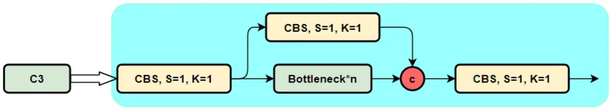
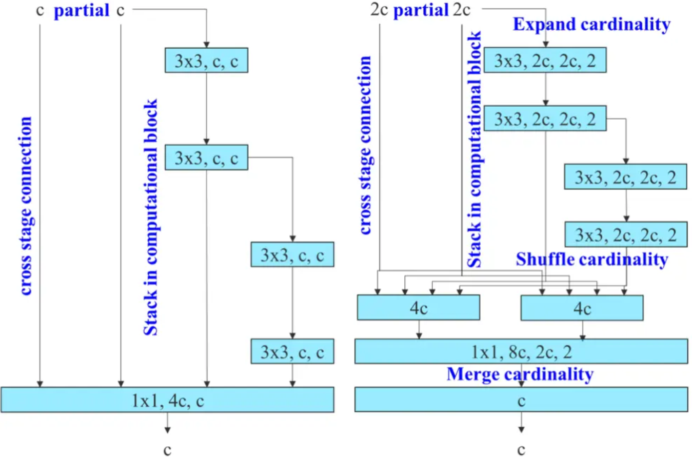
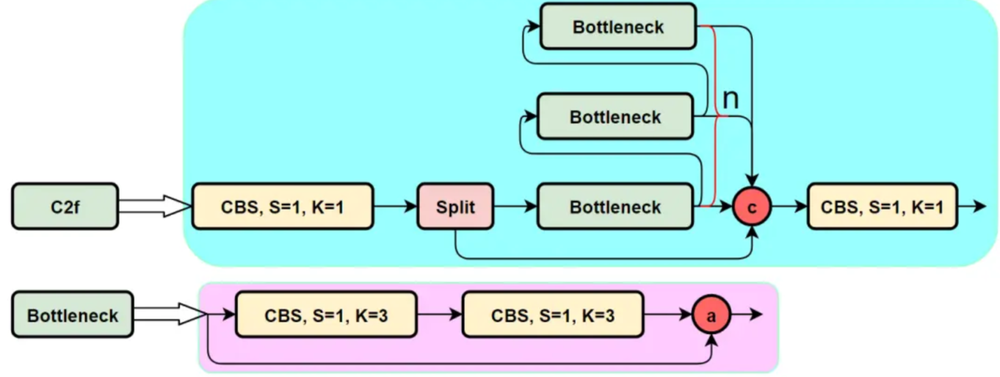

### **1、C2f模块是什么？与C3有什么区别？**

我们不着急，先看一下C3模块的结构图，然后再对比与C2f的具体的区别。针对C3模块，其主要是借助CSPNet提取分流的思想，同时结合残差结构的思想，设计了所谓的C3 Block，这里的CSP主分支梯度模块为BottleNeck模块，也就是所谓的残差模块。同时堆叠的个数由参数n来进行控制，也就是说不同规模的模型，n的值是有变化的。

其实这里的梯度流主分支，可以是任何之前你学习过的模块，比如，美团提出的YOLOv6中就是用来重参模块RepVGGBlock来替换BottleNeck Block来作为主要的梯度流分支，而百度提出的PP-YOLOE则是使用了RepResNet-Block来替换BottleNeck Block来作为主要的梯度流分支。而YOLOv7则是使用了ELAN Block来替换BottleNeck Block来作为主要的梯度流分支。

```python
class C3(nn.Module):
    # CSP Bottleneck with 3 convolutions
    def __init__(self, c1, c2, n=1, shortcut=True, g=1, e=0.5):  # ch_in, ch_out, number, shortcut, groups, expansion
        super().__init__()
        c_ = int(c2 * e)  # hidden channels
        self.cv1 = Conv(c1, c_, 1, 1)
        self.cv2 = Conv(c1, c_, 1, 1)
        self.cv3 = Conv(2 * c_, c2, 1)  # optional act=FReLU(c2)
        self.m = nn.Sequential(*(Bottleneck(c_, c_, shortcut, g, e=1.0) for _ in range(n)))

    def forward(self, x):
        return self.cv3(torch.cat((self.m(self.cv1(x)), self.cv2(x)), 1))
```

下面就简单说一下C2f模块，通过C3模块的代码以及结构图可以看到，C3模块和名字思路一致，在模块中使用了3个卷积模块（Conv+BN+SiLU），以及n个BottleNeck。

通过C3代码可以看出，对于cv1卷积和cv2卷积的通道数是一致的，而cv3的输入通道数是前者的2倍，因为cv3的输入是由主梯度流分支（BottleNeck分支）依旧次梯度流分支（CBS，cv2分支）cat得到的，因此是2倍的通道数，而输出则是一样的。

不妨我们再看一下YOLOv7中的模块：



YOLOv7通过并行更多的梯度流分支，放ELAN模块可以获得更丰富的梯度信息，进而或者更高的精度和更合理的延迟。

C2f模块的结构图如下：

我们可以很容易的看出，C2f模块就是参考了C3模块以及ELAN的思想进行的设计，让YOLOv8可以在保证轻量化的同时获得更加丰富的梯度流信息。



C2fduiiyngde1pyth12 shiixanruixa1

```python
class C2f(nn.Module):
    # CSP Bottleneck with 2 convolutions
    def __init__(self, c1, c2, n=1, shortcut=False, g=1, e=0.5):  # ch_in, ch_out, number, shortcut, groups, expansion
        super().__init__()
        self.c = int(c2 * e)  # hidden channels
        self.cv1 = Conv(c1, 2 * self.c, 1, 1)
        self.cv2 = Conv((2 + n) * self.c, c2, 1)  # optional act=FReLU(c2)
        self.m = nn.ModuleList(Bottleneck(self.c, self.c, shortcut, g, k=((3, 3), (3, 3)), e=1.0) for _ in range(n))

    def forward(self, x):
        y = list(self.cv1(x).split((self.c, self.c), 1))
        y.extend(m(y[-1]) for m in self.m)
        return self.cv2(torch.cat(y, 1))

```

