# R-CNN系列发展史

按照时间顺序，目标检测的发展历史如下：

**R-CNN** -> **SPP-Net** -> **Fast R-CNN** -> **Faster R-CNN** -> **YOLO** -> **SSD** -> **R-FCN**

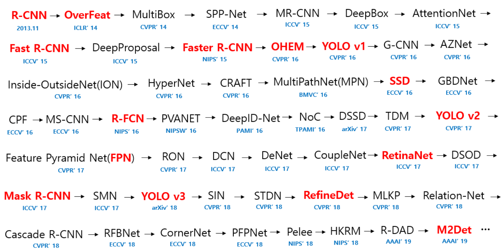

在YOLO问世之前，目标检测方法都是基于区域卷积神经网络R-CNN，基本思路都是

1. 提取物体区域 (Region Proposal) 
2. 对区域进行分类识别 (Classification) 

下面根据时间顺序简要地介绍一下R-CNN系列的目标检测方法。

# 1 R-CNN (Regions with CNN)

## 1.1 简介

RCNN是一种物体检测算法，它可以对一张图片中的物体进行定位和识别。RCNN的主要思想是：先对输入图片进行区域提取，然后对每个区域进行特征提取和分类。

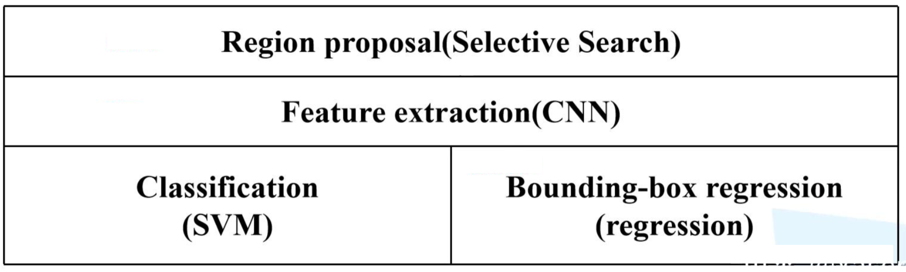

算法步骤如下：

1. 用**选择性搜索 (Selective Search)** 从图片中提取出2000个左右的**候选区域 (Region Proposal)**。
2. 将每个候选区域缩放 (Warp) 到相同的 $227 \times 227$ 大小 (由于R-CNN的特征提取网络是CNN，其输入要求图片尺寸相同) ，并输入到特征提取CNN网络，提取固定尺寸 $2000 \times 4096$ 的特征向量。
3. 将CNN的输出作为特征，并将此特征输入到**SVM进行分类 (NC + 1个背景SVM) **。每一个SVM包含4096个参数，所以可以看成两个矩阵相乘，即 $W_{1(2000 \times 4096)} \times W_{2(4096 \times 21)} =  W_{3(2000\times 21)}$，这样就得到了每一个属于某一个类别的概率向量。使用非极大值抑制（NMS）方法来去除冗余候选框，对于**每一个类别中IoU大于给定阈值**的候选区域。这样就得到了**每一个类别得分最高的一些候选区域**。
4. 同对于属于某个类别的候选区域，使用Bounding Box Regression可以显著减小定位误差，更加精细地调整候选区域的位置。(对于每个类别，都有一个回归器 ) 


# 1.2 网络结构

## 1.2.1 特征提取CNN

R-CNN直接使用了AlexNet作为特征提取网络。


# 1.3 总结

在论文中，作者认为 R-CNN 较之前的算法，能够取得30%的改进是主要是基于以下两点：

1. 使用了CNN来提取候选区域的特征。
2. 使用迁移学习。因为目标检测领域的数据相比图像分类任务要少很多，所以使用在图像分类上训练好的模型，经过 Fine-Tune 可以很好的运用在目标检测上。

R-CNN的不足之处：

- 速度慢，因为首先需要Selective Search算法生成2K个候选区域分别提取特征，而又由于候选区域的重叠问题，所以这中间有着大量的重复计算（这也是后面的R-CNN系列的改进方向）。
- 训练步骤繁琐，需要先预训练CNN，然后微调CNN，再训练20个SVM，20个回归器，期间还要涉及用NMS去除候选冗余框。

# 1.4 附录

## 1.4.1 Precision-Recall Curve的绘制方法

按照检测出的**某个类的**矩形框的置信度从高到低进行排序，然后计算累积的 TP 和 FP 数量并计算出 Precision 与 Recall (注意此处计算的是 TP/All Ground-Truths)，如下表：


以R为横坐标，P为纵坐标将点绘制在坐标系中，


绘制完成后，接着绘制插值 Precision 与 AUC (Area Under Curve, 曲线下面积) , 


计算上面右图的面就可以得到 AP：
$$
AP = A1+A2 \\

A1 = (0.143 - 0 ) × 1 = 0.143 \\

A2 = (0.429 - 0.143) × 0.375 = 0.107 \\

AP = 0.143 + 0.107 = 0.250 = 25\%
$$
上面我们求得的是此类别的 AP 为0.25，若还还有其他类别，比如狗的为 0.36 、飞机的为 0.54、车的为0.52，那么mAP 就是这些类别的平均值，即：
$$
mAP = \frac{0.25+0.36+0.54+0.52}{4} = 0.4175 = 41.75\% \\
$$


**R-CNN问题所在：**

1. R-CNN训练和预测的时间都很长，其中一个问题在于每个候选区域都要通过一次CNN，而这些候选区域有大量的重叠部分，所以在改进上**可以只让原图通过一次CNN**，然后利用特征图的信息提取候选区域
2. 缩放操作导致图片失真
3. SVM和bbox回归阶段需要将特征存储到磁盘，很费时间空间，同时降低了速度

## 1.4.2 难分样本挖掘 (Hard Negative Mining)

在训练过程中，作者使用到了难分样本挖掘，介绍如下。

对于在进行目标检测的过程中产生的候选区域，将与Ground-Truth Box 的 IoU 大于 **0.5**（论文中设置的即使此值） 的当做正样本（Positive Sample），小于此值的当做负样本（Negative Sample），然后把这些产生的样本送入分类器进行训练。问题在于，负样本的数量远远多余正样本的数量（因为图片中的物体数量是有限的），这样在训练过程中就会产生很多 False Positive，这样就变成了训练了一个判断假正例的分类器，这显然不是作者需要的。解决方法是，把 False Positive 中得分较高的样本，重新放入网络中训练，从而加强网络对于 False Positive 的判断能力。

# 2 SPP-Net 

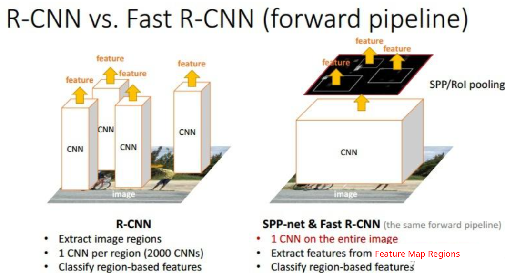

## 2.1 改进点

SPPNet针对R-CNN的两处不足做了如下改进：

- 将Selective Search的Region Proposal不放入CNN进行特征提取，而是**直接把原图片放入CNN进行特征提取，然后根据Region Proposal的位置在Conv5的Feature Map做一个特征映射，再截取出每一个Region Proposal所映射的Feature Map**。这样就避免了重复性用CNN对每个Region Proposal单独提取特征，节省了大量时间。
- SPPNet在原来CNN的Conv5层之后加入**Spatial Pyramid Pooling Layer（空间金字塔池化层）**替换掉原来的Pooling5 layer，由于SPP Layer可以接受不同尺寸的Feature Maps并输出相同尺寸的Feature Maps，因此避免了resize而导致的图片形变问题。

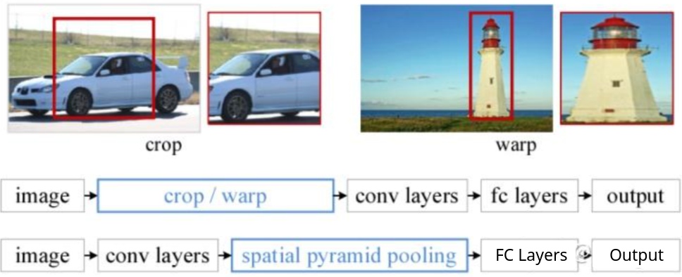

## 2.2 网络结构

SPP-Net主要是在R-CNN的基础上进行改进的，它仍然延续R-CNN的多阶段的处理过程 (如上图所示)：

1. Extract Region Proposal，使用Selective Search的方法提取2000个候选区域。
2. Compute CNN features，使用CNN对输入图片进行特征提取并将步骤1提取的候选区域映射到conv5的Feature Map，使用SPP Layer统一Feature的输出送入全连接层。
3. Classify Regions，将提取到的Feature输入到SVM中进行分类。
4. Non-Maximum Suppression，用于去除掉重复的box。
5. Bounding Box Regression，位置精修，使用回归器精细修正候选框的位置。

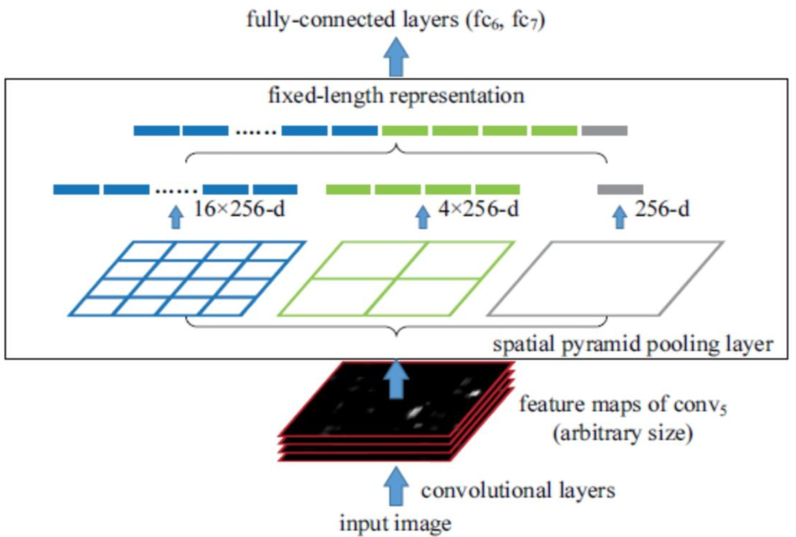

## 2.3 细节讲解

### 2.3.1 **空间金字塔池化 (Spatial Pyramid Pooling)**

若CNN模型最后几层包含全连接层，则意味着我必须resize输入尺寸，常见的两种resize方法crop和warp会导致图像信息丢失和图像形变。SPP Layer解决了这个问题，SPP Layer接受不同size的输入并输出相同size的Feature Map，我们在conv5层和全链接层之间加入SPP Layer，即替换掉原来的pooling5层，那对于不同size的Region Proposal的Feature Map就不需要再进行resize，直接可以将SPP Layer的输出送入全连接网络。

### 2.3.2 **SPP Layer输入**

不同size的Region Proposal映射的Feature Maps。

注意：对于同一卷积网络，当输入图片尺寸变化时，得到Feature Map的通道数是不变的（通道数由卷积核确定，而不是输入图片尺寸确定），长和宽会发生变化。

### 2.3.3 **SPP Layer的具体操作**

假设Feature Maps尺寸为 W ∗ H ∗ C，对于每个通道的Feature Map进行多次Max Pooling操作将Max Pooling的结果以向量形式组合在一起。多个通道的向量最终拼接在一起。

SPP Layer输入尺寸为 W ∗ H ∗ 256，进行三次Max Pooling操作，结果分别是 1 ∗ 1, 2 ∗ 2, 4 ∗ 4。将三次Max Pooling的结果拼接在一起，最终向量长度就是 1 ∗ 1 ∗ 256 + 2 ∗ 2 ∗ 256 + 4 ∗ 4 ∗ 256 = 21 ∗ 256  。至此就实现了无论输入尺寸为多少，SPP Layer输出都是21 ∗ 256的特征向量。

注意：对于不同尺寸的Feature Map，Max Pooling操作时的window size和stride是不同的。假设输入Feature Map的尺寸为 a ∗ a ，Max Pooling结果的尺寸为 n ∗ n ，则 $size = a \div n, \ stride = a \div n$。

### 2.3.4 特征映射

在SPPNet中，一整张图输入CNN网络中，然后经过5个卷积层得到整张图片的conv5的Feature Maps，然后我们需要从这整个Feature Maps上截取出每个Region Proposal对应的feature，如下图所示


具体映方法如下：[[知乎]原始图片中的ROI如何映射到到Feature Map](https://zhuanlan.zhihu.com/p/24780433)

## 2.4 总结

**不足之处** :

1. 整个过程还是multi-stage pipeline，还是需要额外保存Feature Map以供输入SVM进行分类，因此空间的消耗很大。
2. 在fine-tune的时候SPPNet不像R-CNN一样，SPPNet不会更新SPP Layer之前的conv layers，限制了准确性。

# 3 Fast R-CNN

## 3.1 简介

在R-CNN的基础上采纳了SPP-Net的方法，对R-CNN进行了改进，解决特征重复计算的问题，使得性能进一步提高 (既提高了处理速度，又提高了准确率 ) 。


Fast R-CNN网络将整个图像和一组候选框作为输入。网络首先使用卷积层和最大池化层来处理整个图像，以产生卷积特征图。然后，对于每个候选框，RoI池化层从特征图中提取固定长度的特征向量。每个特征向量被送入一系列全连接层中，其最终分支成两个同级输出层 ：一个输出$K$个类别加上1个背景类别的Softmax概率估计，另一个为$K$个类别的每一个类别输出四个实数值。每组4个值表示$K$个类别的一个类别的检测框位置的修正。

## 3.2 细节详解

### 3.2.1 RoI池化层

这里唯一需要解释的就是RoI Pooling Layer。如果特征图(Feature map)上的RoI大小是 h ∗ w (这里忽略了通道数)，将这个特征图划分为 $\frac{h}{H} ∗ \frac{w}{W}$ 个网格，每个网格大小为H ∗ W，对每个网格做Max Pooling，这样得到pooling以后的大小就是H ∗ W（在文章中，VGG16网络使用H=W=7的参数，上图中绘制的是6x6的）。无论原始的RoI多大，最后都转化为7 ∗ 7大小的特征图。本文将RoI池化为7 ∗ 7的输出，其实这一层就是SPP的特例，SPP金字塔只有一层就是这样的。

### 3.2.2 损失函数

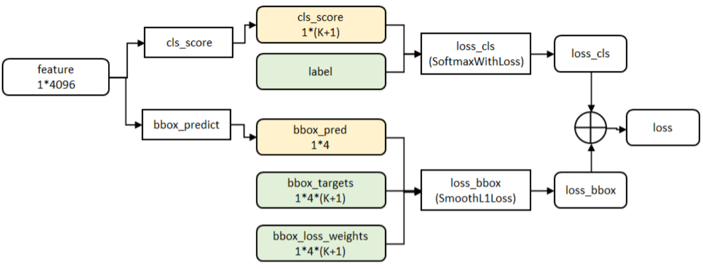

一个Fast RCNN网络有两个输出层，第一个输出为K+1个类别的离散概率分布，而第二个输出为bbox回归的偏置，每一个正在训练的ROI均利用一个ground truth类别u与ground truth框v，采用多任务损失进行分类与边框回归：

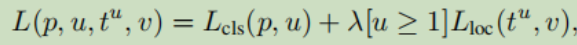

第一部分是类别的log损失

第二部分是位置损失的回归损失，V为ground truth， t为预测值，方括号是一个指示函数，满足条件为1，否则为0，按照惯例，u=0为背景类，此时忽略回归损失，对于检测框的回归采用了smooth-L1损失，没有使用L2损失。

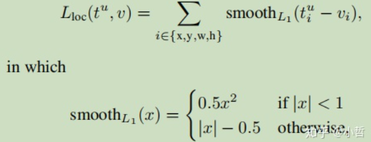

这个损失函数相比于L2损失对于对于异常值更加鲁棒

### 3.2.3 通过ROIpooling层的反向传播

为了清楚起见，假设每个小批量($N = 1$)只有一个图像，扩展到$N > 1$是显而易见的，因为前向传播独立地处理所有图像。

令 $x_i \in \mathbb{R}$ 是到RoI池化层的第 $i$ 个激活输入，并且令 $y_{rj}$ 是来自第 $r$ 个RoI层的第 $j$ 个输出。RoI池化层计算$y_{rj} = x_{i \ast(r, j)}$，其中 $x_{i \ast(r, j)} = argmax_{i’ \in \mathcal{R}(r, j)}x_{i’}$。$\mathcal{R}(r, j)$是输出单元 $y_{rj}$ 最大池化的子窗口中的输入的索引集合。单个 $x_i$ 可以被分配给几个不同的输出 $y_{rj}$。

RoI池化层反向传播函数通过遵循argmax switches来计算关于每个输入变量 $x_i$ 的损失函数的偏导数：

换句话说，对于每个小批量RoI $r$和对于每个池化输出单元 $y_{rj}$，如果 $i$ 是 $y_{rj}$ 通过最大池化选择的argmax，则将这个偏导数 $\frac{\partial L}{\partial y_{rj}}$ 积累下来。在反向传播中，偏导数 $\frac{\partial L}{\partial y_{rj}}$ 已经由RoI池化层顶部的层的反向传播函数计算。

# 4 Faster R-CNN

## 4.1 简介

经过R-CNN和Fast RCNN的积淀，Ross B. Girshick在2016年提出了新的Faster RCNN，在结构上，Faster R-CNN已经将特征抽取(feature extraction)，proposal提取，bounding box regression(rect refine)，classification都**整合在了一个网络中**，使得综合性能有较大提高，在检测速度方面尤为明显。

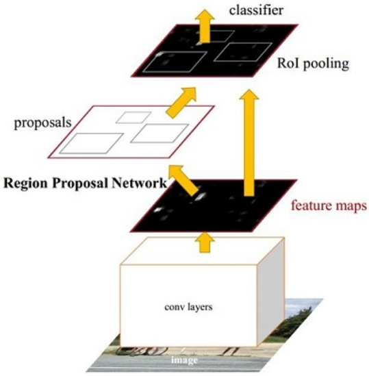

如上图Faster RCNN其实可以分为4个主要内容：

1. Conv layers。作为一种CNN网络目标检测方法，Faster RCNN首先使用一组基础的conv+relu+pooling层提取image的Feature Maps。该Feature Maps被共享用于后续RPN层和全连接层。
2. Region Proposal Networks。RPN网络用于生成Region Proposals。该层通过softmax判断anchors属于positive或者negative，再利用bounding box regression修正anchors获得精确的proposals。
3. Roi Pooling。该层收集输入的Feature Maps和proposals，综合这些信息后提取proposal Feature Maps，送入后续全连接层判定目标类别。
4. Classification。利用proposal Feature Maps计算proposal的类别，同时再次bounding box regression获得检测框最终的精确位置。

下图展示了python版本中的VGG16模型中的faster_rcnn_test.pt的网络结构，可以清晰的看到该网络对于一副任意大小PxQ的图像：

- 首先缩放至固定大小MxN，然后将MxN图像送入网络；
- 而Conv layers中包含了13个conv层+13个relu层+4个pooling层；
- RPN网络首先经过3x3卷积，再分别生成positive anchors和对应bounding box regression偏移量，然后计算出proposals；
- 而Roi Pooling层则利用proposals从Feature Maps中提取proposal feature送入后续全连接和softmax网络作classification（即分类proposal到底是什么object）。

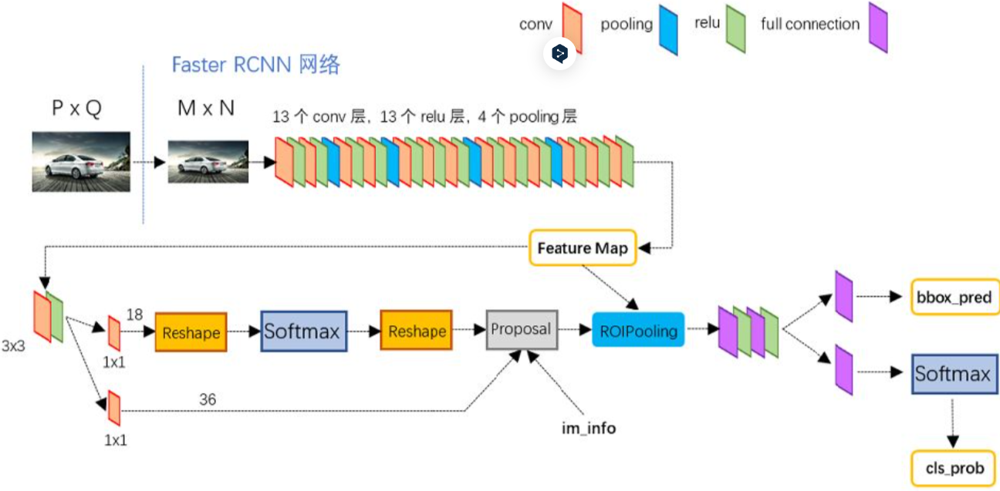

## 4.2 细节详解

### 4.2.1 Region Proposal Networks (RPN)

经典的检测方法生成检测框都非常耗时，如OpenCV adaboost使用滑动窗口+图像金字塔生成检测框；或如R-CNN使用SS(Selective Search)方法生成检测框。而Faster RCNN则抛弃了传统的滑动窗口和SS方法，直接**使用RPN生成检测框**，这也是Faster R-CNN的巨大优势，能极大提升检测框的生成速度。

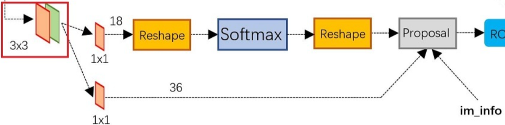

上图4展示了RPN网络的具体结构。可以看到RPN网络实际分为2条线，上面一条通过softmax分类anchors获得positive和negative分类，下面一条用于计算对于anchors的bounding box regression偏移量，以获得精确的proposal。而最后的Proposal层则负责综合positive anchors和对应bounding box regression偏移量获取proposals，同时剔除太小和超出边界的proposals。其实整个网络到了Proposal Layer这里，就完成了相当于目标定位的功能。

### 4.2.2 Anchors

提到RPN网络，就不能不说anchors。所谓anchors，实际上就是一组由 `rpn/generate_anchors.py` 生成的矩形。直接运行作者demo中的 `generate_anchors.py` 可以得到以下输出：

```python
[[ -84.  -40.   99.   55.]
 [-176.  -88.  191.  103.]
 [-360. -184.  375.  199.]
 [ -56.  -56.   71.   71.]
 [-120. -120.  135.  135.]
 [-248. -248.  263.  263.]
 [ -36.  -80.   51.   95.]
 [ -80. -168.   95.  183.]
 [-168. -344.  183.  359.]]
```

其中每行的4个值 $(x_1,\  y_1,\ x_2,\ y_2)$ 表矩形左上和右下角点坐标。9个矩形共有3种形状，长宽比为大约为 width : height ∈ {1 : 1, 1 : 2, 2 : 1} 三种，如下图。实际上通过anchors就引入了检测中常用到的多尺度方法。

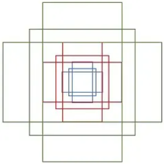

注：关于上面的anchors size，其实是根据检测图像设置的。在python demo中，会把任意大小的输入图像reshape成800x600（即图2中的M=800，N=600）。再回头来看anchors的大小，anchors中长宽1:2中最大为352x704，长宽2:1中最大736x384，基本是覆盖了800x600的各个尺度和形状。

那么这9个anchors是做什么的呢？借用Faster RCNN论文中的原图，如图7，遍历Conv layers计算获得的feature maps，为每一个点都配备这9种anchors作为初始的检测框。这样做获得检测框很不准确，不过，后面还有2次bounding box regression可以修正检测框位置。

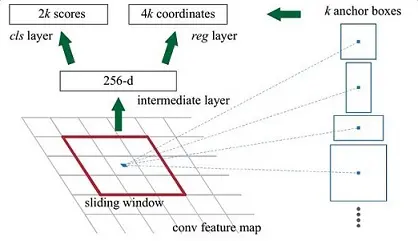


