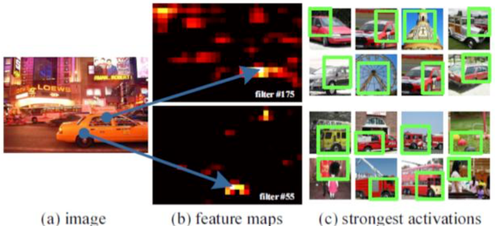
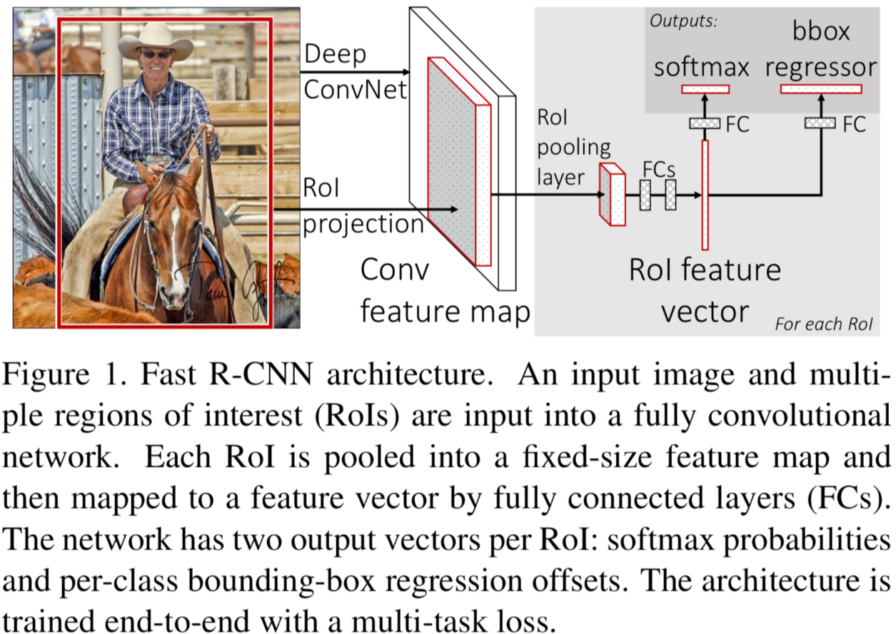

# 1 R-CNN系列发展史

按照时间顺序，目标检测的发展历史如下：

**R-CNN** -> **SPP-Net** -> **Fast R-CNN** -> **Faster R-CNN** -> **YOLO** -> **SSD** -> **R-FCN**

在YOLO问世之前，目标检测方法都是基于区域卷积神经网络R-CNN，基本思路都是

1. 提取物体区域 (Region Proposal) 
2. 对区域进行分类识别 (Classification) 

下面根据时间顺序简要地介绍一下R-CNN系列的目标检测方法。

## 1.1 R-CNN (Regions with CNN)

### 1.1.1 简介

RCNN是一种物体检测算法，它可以对一张图片中的物体进行定位和识别。RCNN的主要思想是：先对输入图片进行区域提取，然后对每个区域进行特征提取和分类。

算法步骤如下：

1. 用**选择性搜索 (Selective Search)** 从图片中提取出2000个左右的**候选区域 (Region Proposal)**。
2. 将每个候选区域缩放 (Warp) 到相同的 $227 \times 227$ 大小 (由于R-CNN的特征提取网络是CNN，其输入要求图片尺寸相同) ，并输入到特征提取CNN网络，提取固定尺寸 $2000 \times 4096$ 的特征向量。
3. 将CNN的输出作为特征，并将此特征输入到**SVM进行分类 (NC + 1个背景SVM) **。每一个SVM包含4096个参数，所以可以看成两个矩阵相乘，即 $W_{1(2000 \times 4096)} \times W_{2(4096 \times 21)} =  W_{3(2000\times 21)}$，这样就得到了每一个属于某一个类别的概率向量。使用非极大值抑制（NMS）方法来去除冗余候选框，对于**每一个类别中IoU大于给定阈值**的候选区域。这样就得到了**每一个类别得分最高的一些候选区域**。
4. 同对于属于某个类别的候选区域，使用Bounding Box Regression可以显著减小定位误差，更加精细地调整候选区域的位置。(对于每个类别，都有一个回归器 ) 

### 1.1.2 网络结构

#### 特征提取CNN

R-CNN直接使用了AlexNet作为特征提取网络。

### 1.1.3 总结

在论文中，作者认为 R-CNN 较之前的算法，能够取得30%的改进是主要是基于以下两点：

1. 使用了CNN来提取候选区域的特征。
2. 使用迁移学习。因为目标检测领域的数据相比图像分类任务要少很多，所以使用在图像分类上训练好的模型，经过 Fine-Tune 可以很好的运用在目标检测上。

R-CNN的不足之处：

- 速度慢，因为首先需要Selective Search算法生成2K个候选区域分别提取特征，而又由于候选区域的重叠问题，所以这中间有着大量的重复计算（这也是后面的R-CNN系列的改进方向）。
- 训练步骤繁琐，需要先预训练CNN，然后微调CNN，再训练20个SVM，20个回归器，期间还要涉及用NMS去除候选冗余框。

### 1.1.4 附录

#### Precision-Recall Curve的绘制方法

按照检测出的**某个类的**矩形框的置信度从高到低进行排序，然后计算累积的 TP 和 FP 数量并计算出 Precision 与 Recall (注意此处计算的是 TP/All Ground-Truths)，如下表：

以R为横坐标，P为纵坐标将点绘制在坐标系中，

绘制完成后，接着绘制插值 Precision 与 AUC (Area Under Curve, 曲线下面积) , 

计算上面右图的面就可以得到 AP：
$$
AP = A1+A2 \\

A1 = (0.143 - 0 ) × 1 = 0.143 \\

A2 = (0.429 - 0.143) × 0.375 = 0.107 \\

AP = 0.143 + 0.107 = 0.250 = 25\%
$$
上面我们求得的是此类别的 AP 为0.25，若还还有其他类别，比如狗的为 0.36 、飞机的为 0.54、车的为0.52，那么mAP 就是这些类别的平均值，即：
$$
mAP = \frac{0.25+0.36+0.54+0.52}{4} = 0.4175 = 41.75\% \\
$$

**R-CNN问题所在：**

1. R-CNN训练和预测的时间都很长，其中一个问题在于每个候选区域都要通过一次CNN，而这些候选区域有大量的重叠部分，所以在改进上**可以只让原图通过一次CNN**，然后利用特征图的信息提取候选区域
2. 缩放操作导致图片失真
3. SVM和bbox回归阶段需要将特征存储到磁盘，很费时间空间，同时降低了速度

#### 难分样本挖掘 (Hard Negative Mining)

在训练过程中，作者使用到了难分样本挖掘，介绍如下。

对于在进行目标检测的过程中产生的候选区域，将与Ground-Truth Box 的 IoU 大于 **0.5**（论文中设置的即使此值） 的当做正样本（Positive Sample），小于此值的当做负样本（Negative Sample），然后把这些产生的样本送入分类器进行训练。问题在于，负样本的数量远远多余正样本的数量（因为图片中的物体数量是有限的），这样在训练过程中就会产生很多 False Positive，这样就变成了训练了一个判断假正例的分类器，这显然不是作者需要的。解决方法是，把 False Positive 中得分较高的样本，重新放入网络中训练，从而加强网络对于 False Positive 的判断能力。

## 1.2 SPP-Net 

### 1.2.1 创新点

SPPNet针对R-CNN的两处不足做了如下改进：

- 将Selective Search的Region Proposal不放入CNN进行特征提取，而是**直接把原图片放入CNN进行特征提取，然后根据Region Proposal的位置在Conv5的Feature Map做一个特征映射，再截取出每一个Region Proposal所映射的Feature Map**。这样就避免了重复性用CNN对每个Region Proposal单独提取特征，节省了大量时间。
- SPPNet在原来CNN的Conv5层之后加入**Spatial Pyramid Pooling Layer（空间金字塔池化层）**替换掉原来的Pooling5 layer，由于SPP layer可以接受不同size的feature maps并输出相同size的feature maps，因此避免了resize而导致的图片形变问题。

对于每一张输入图片，尺寸是不相同的，如果只通过一次CNN，最后一层卷积层输出的特征长度会不相同，而全连接层需要的特征应当是相同长度的，所以SPP-Net在全连接层之前引入了空间金字塔池化 (Spatial Pyramid Pooling，SPP ) ，SPP层可以使输出的特征长度相同。

- 对卷积层可视化发现，输入图片在某个位置上的特征表达在特征图上也是相同的位置
- 基于此，在某个ROI上的特征提取只需要在特征图的相应位置就可以了

**算法流程如下：**

1. **不对图片进行缩放**，直接输入CNN，得到最后一层卷积层输出的高维特征图feature map
2. SPP层将特征图划分为多个大小不同的patch，每个patch内部进行最大池化操作，将其压缩为一个固定长度的向量表示
3. 不同大小的patch可以保证SPP层对于不同大小的输入图像都具有相同的输出大小。具体来说，SPP层将输入图像分别划分为不同大小的网格，然后对每个网格内的特征图进行最大池化操作，得到一个**固定长度**的向量表示
4. SPP层输出的所有向量拼接在一起，形成一个固定长度的特征向量
5. 将特征输入到后面的全连接层、SVM、bbox回归

## 1.3 Fast R-CNN

在R-CNN的基础上采纳了SPP-Net的方法，对R-CNN进行了改进，解决特征重复计算的问题，使得性能进一步提高 (既提高了处理速度，又提高了准确率 ) 。

q