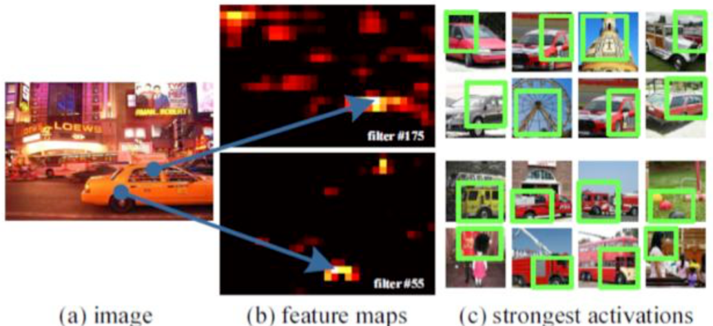
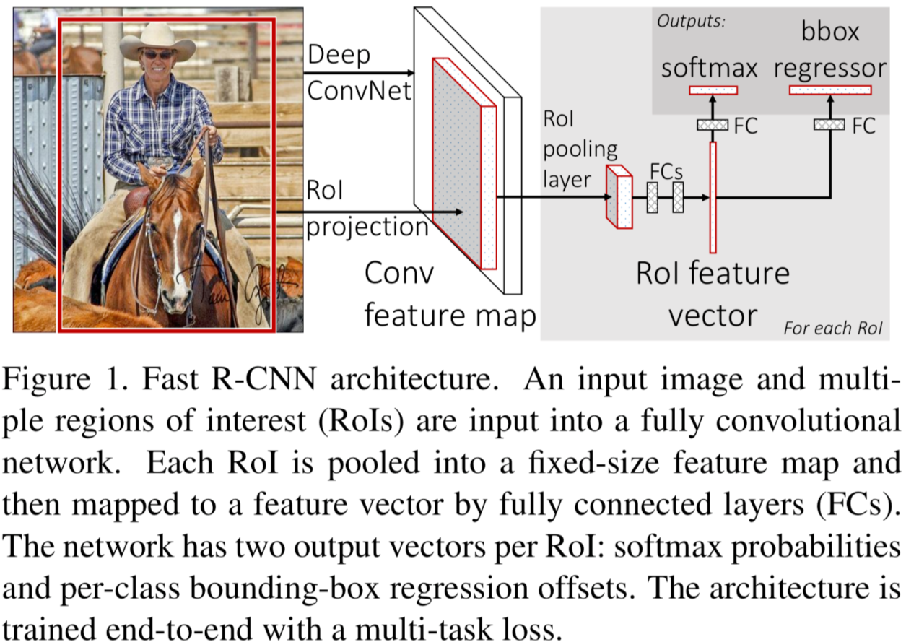

# 1 R-CNN系列发展史

首先要提一下目标检测的发展历史：

**R-CNN** -> **SPP-Net** -> **Fast R-CNN** -> **Faster R-CNN** -> **YOLO** -> **SSD** -> **R-FCN**

在YOLO问世之前的方法都是区域卷积神经网络R-CNN系列，基本思路都是：

1. 提取物体区域**（Region proposal）**
2. 对区域进行分类识别**（Classification）**

下面根据时间顺序简要地介绍一下R-CNN系列的目标检测方法。

## 1.1 R-CNN

1. 用**选择性搜索**Selective Search从图片中提取出2000个左右的**候选区域**
2. 将每个候选区域缩放（warp）到相同的图片大小227 x 227（因为CNN的输入要求图片尺寸相同），并输入到CNN网络
3. 将CNN的FC7层的输出作为特征，并将此特征输入到**SVM进行分类（N + 1个二分类SVM）**，对于属于某个类别的候选区域，使用bounding box回归更加精细地调整候选区域的位置（每个类别一个回归器）

输出共有 N + 1个类别，N类正样本，1类负样本，这个负样本是指bounding box定位失败，与ground truth的IoU小于0.5。

**R-CNN问题所在：**

1. R-CNN训练和预测的时间都很长，其中一个问题在于每个候选区域都要通过一次CNN，而这些候选区域有大量的重叠部分，所以在改进上**可以只让原图通过一次CNN**，然后利用特征图的信息提取候选区域
2. 缩放操作导致图片失真
3. SVM和bbox回归阶段需要将特征存储到磁盘，很费时间空间，同时降低了速度

## 1.2 SPP-Net 

对于每一张输入图片，尺寸是不相同的，如果只通过一次CNN，最后一层卷积层输出的特征长度会不相同，而全连接层需要的特征应当是相同长度的，所以SPP-Net在全连接层之前引入了空间金字塔池化（Spatial Pyramid Pooling，SPP），SPP层可以使输出的特征长度相同。

- 对卷积层可视化发现，输入图片在某个位置上的特征表达在特征图上也是相同的位置
- 基于此，在某个ROI上的特征提取只需要在特征图的相应位置就可以了

**算法流程如下：**

1. **不对图片进行缩放**，直接输入CNN，得到最后一层卷积层输出的高维特征图feature map
2. SPP层将特征图划分为多个大小不同的patch，每个patch内部进行最大池化操作，将其压缩为一个固定长度的向量表示
3. 不同大小的patch可以保证SPP层对于不同大小的输入图像都具有相同的输出大小。具体来说，SPP层将输入图像分别划分为不同大小的网格，然后对每个网格内的特征图进行最大池化操作，得到一个**固定长度**的向量表示
4. SPP层输出的所有向量拼接在一起，形成一个固定长度的特征向量
5. 将特征输入到后面的全连接层、SVM、bbox回归

## 1.3 Fast R-CNN

在R-CNN的基础上采纳了SPP-Net的方法，对R-CNN进行了改进，解决特征重复计算的问题，使得性能进一步提高（既提高了处理速度，又提高了准确率）。

q