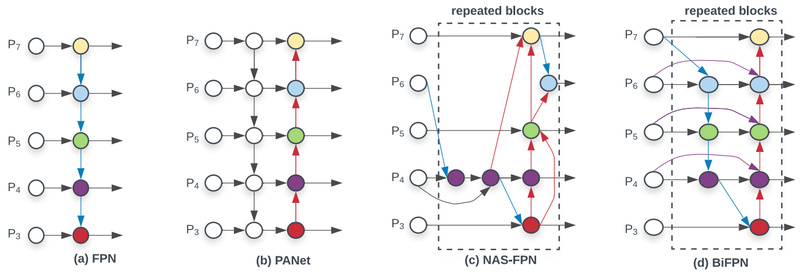
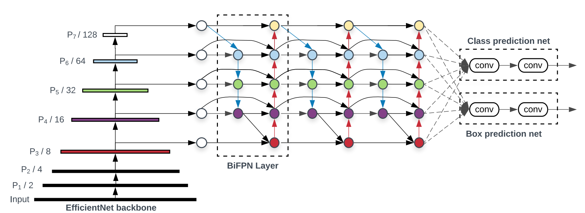
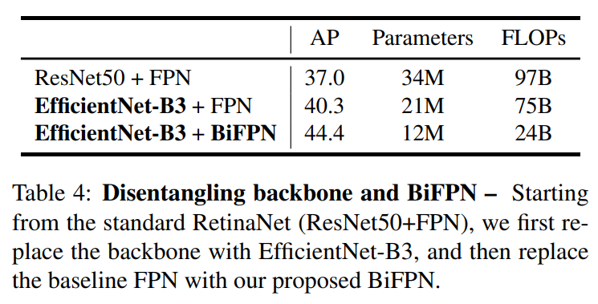

# BiFPN

CVPR 2017 的FPN指出了不同层之间特征融合的重要性，并且以一种比较简单的方法把底层的特征乘两倍和浅层相加来融合。之后人们也试了各种别的融合方法，比如PANet先从底向上连，再自顶向下连回去；M2Det在连的时候加入 skip-connection；Libra-RCNN先把所有feature都汇聚到中间层，然后再refine。

论文的作者基于下面的观察结果/假设，进一步进行了优化：

1. 作者观察到PANet的效果比FPN、NAS-FPN要好，但是计算量更大；
2. 作者从PANet出发，移除掉了只有一个输入的节点。这样做是假设只有一个输入的节点相对不太重要，把PANet简化。
3. 作者在相同 level 的输入和输出节点之间连了一条边，假设是能融合更多特征，类似skip-connection。
4. PANet只有从底向上连，自顶向下两条路径，作者认为这种连法可以作为一个基础层，重复多次。这样就得到了下图的结果（看中间的 BiFPN Layer 部分）。

BiFPN 相对 FPN 能在参数量下降的同时提升4%的AP，如下表所示。

