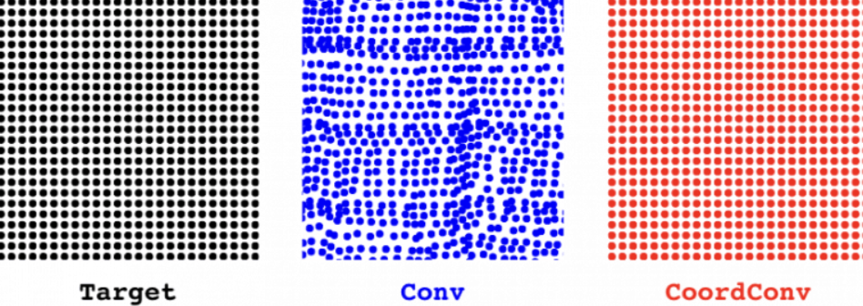

# 1 论文背景

- Paper : [An Intriguing Failing of Convolutional Neural Networks and the CoordConv Solution](https://arxiv.org/abs/1807.03247)

卷积神经网络如今的应用已十分广泛，但是uber的工程师们最近表示，卷积网络在坐标变换上的缺陷限制了它的性能提升，而uber开发的CoordConv结构正好可以解决这一问题。

Uber在很多设计坐标变换的领域都使用了卷积神经网络，从设计自动驾驶工具到自动信号灯监测和建造地图等等，浙西工具都大大提升了空间移动效率。

在深度学习中，很少能有像卷积影响深远的成果。几乎机器视觉中所有先进成果都用了堆叠的卷积层作为基本搭建模块。由于这种结构的广泛应用，我们期待它们能应用于一些简单任务，例如在小尺寸图画上绘画单一像素。

但令人惊讶的是，卷积结构似乎很难处理看上去很平常琐碎的任务。在我们的论文中，我们研究并分析了卷积神经网络的一种常见缺陷，即它**无法将空间表示转换成笛卡尔空间中的坐标和one-hot像素空间中的坐标**。这很意外，因为这些任务似乎很简单，并且此类坐标的转换也是解决常见问题的必备方法，例如图像中的物体检测、训练生成模型、训练强化学习智能体等等，所以也很重要。经过研究我们发现，这些任务已经多多少少受到卷积结构的限制。所以为了提升性能，我们提出了一种名为CoordConv的解决方案，在多个领域进行了成果展示。

对于无法将空间表示转换成笛卡尔空间中的坐标和one-hot像素空间中的坐标，解释为：

1. 笛卡尔空间：指我们通常所说的三维空间，其中一个点的位置用三个坐标（x、y、z）来表示。在笛卡尔空间中，每个坐标轴是相互垂直的。
2. one-hot像素空间：指在计算机视觉中常用的一种像素表示方法。在这种表示中，每个像素用一个向量表示，向量的长度等于图像中的像素数目，向量中只有一个元素为1，其余元素为0。这个元素的位置表示该像素在图像中的位置。

## 1.1 CNN很难做到监督式渲染 (rendering)

我们先从一个简单的监督式渲染开始，假设我们向一个网络中输入(i, j)坐标，要求它输出一个64×64的图像，并在坐标处画一个正方形，如图1a所示。你会用哪种网络进行这一问题呢？

我们可以借鉴很多用于图片生成的方法，用反卷积层画正方形。为了测试这种方法，我们创建了一个数据集，其中在64×64的画布上随机放置了一些9×9的方块，如图1c所示。将数据集中方块所有可能的位置列出后，总共有3136个样本。为了评估模型生成的表现，我们将样本分为两组训练、测试数据集：一组是将数据集中80%坐标用于训练，20%用于测试。另一组中将画布从中分为四个象限，坐标位于前三个象限的用于训练，第四象限的坐标用于测试。两组数据的分布如1d所示。

​																						(a)

我们设想CNN能完成这个任务，因为它很简单（整个数据集可能用两行代码就能完全表示出来），并且数据集很小，我们能轻易地用模型进行参数设定。但结果恰恰相反，CNN表现得极差。即使只有1M的参数、训练了90分钟，模型在第一个数据集上也没达到0.83的IOU分数，在第二个数据集上设置都没超过0.36。

## 1.2 监督式坐标分类对CNN也很困难

所以为什么监督式渲染对CNN这么难？我们需要深入挖掘一下原因。的确，如果在直接的监督条件下渲染训练都这么困难，在无监督下会更有挑战性。

我们先看一下是什么让这个问题变得困难。现在我们让网络简单地绘制一个像素，而不是9×9的方块。可以想象，如果这个任务能解决，那么之后的反卷积网络就可以轻易地将单一像素扩展成更大的方块。于是我们开始了监督式坐标分类任务，其中的数据集包括成对的(i, j)坐标，并且有单一对应像素的图像，如下图

之后我们又尝试了拥有不同参数的网络，发现即使有些网络能记住训练集，但没有一个的测试准确率超过86%（如下图）。并且训练时间都超过了一小时。

我们期望卷积网络能表现的很好，但是很遗憾它并没有。为了弄清楚原因，我们选择了表现最好的网络，来验证结果。

我们让网络画一张图，上面仅有一个像素（即在one-hot表示中的值为1）。为了看看发生了什么，我们放大了该区域。在图5中，目标像素用红色圈出，我们展示出了模型的softmax预测和logits图。第一个像素（第一行）是训练集中的数据，所以模型做对了，虽然模型在其周围也做了一些预测。第二个像素（第二行）来自测试集，模型险些没有猜对，可以看到左上像素的概率也比较大。最后一个像素（第三行）显示模型完全预测错误。

## 1.3 监督式回归对CNN同样很难

所以为什么网络很难定位一个像素呢？是因为从小空间到大空间的转换很困难吗？如果朝一个方向会不会容易点呢？如果我们训练卷积网络将图像信息转换成标量坐标，是否与普通图像分类更相似呢？

结果模型在这种监督式回归的任务上同样表现得不好。在图10中，左边图中的点表示正确的像素坐标，中间图中的点表示模型的预测。模型在测试集上表现得不好，并且在训练集上也差强人意。

简单地说，方向根本不重要。

所以，这一看似简单的坐标转换任务在卷积网络身上主要有两个问题：**从笛卡尔空间转换到one-hot像素空间及其他方式上**。即使用监督式方法进行训练，即使只有一个像素，即使所有的训练案例很容易获得，卷积仍然学不会顺利转换。另外，表现最好的卷积模型体积巨大，训练耗时很长。

# 2 CoordConv

我们提出了解决这一难题的方法。

卷积是等变的，也就是说当每个过滤器应用到输入上时，它不知道每个过滤器在哪。我们可以帮助卷积，让它知道过滤器的位置。这一过程需要在输入上添加两个通道实现，一个在i坐标，另一个在j坐标。我们将这个图层成为CoordConv，如下图所示.

我们提出的CoordConv图层是标准卷积层的简单扩展，其中卷积和坐标相对应。让卷积过滤器看到坐标其实违背了等变性原则，看起来不是个好方法，但是，等变性原则对卷积有好处吗？

我们认为，卷积获得成功的原因主要依靠三个元素：他运用相对较少的学习参数、在GPU上计算速度很快、学习的函数时符合平移等变性的。

CoordConv保留了前两种特点：较少的参数和高效的计算。如果坐标的权重变为零，CoordConv就和普通卷积没什么区别。另一方面，如果平移依赖对下游任务有用的话，它也同样可以学习。

CoordConv与目前很多理念相关，例如局部连接层、复合模式生成网络（CPPN）以及语言建模中用到的位置嵌入。

## 2.1 用CoordConv解决此前的监督问题

首先，让我们回顾下刚刚提到的任务，并看一下CoordConv如何解决。

如图7和图8所示，CoordConv模型在监督式坐标分类和监督式渲染任务上都达到了最佳训练和测试性能。另外，CoordConv的参数比之前少10—100倍，训练时间几十秒就完成，比之前快了150倍。

为了进一步验证，下图9展示了普通反卷积和CoordConv的对比：

当用卷积绘制像素时，我们发现了明显的人工痕迹和过拟合现象。CoordConv在训练集和测试集上都表现的很好。同样，在反方向的情况上也是如此。尽管卷积很难对坐标进行回归，CoordConv能表现的很好：

## 2.2 CoordConv应用广泛

以下是我们总结的CoordConv的应用场景：

**目标检测**

目标检测模型也是在像素块空间中寻找，输出的是笛卡尔空间中的边界框，所以看起来CoordConv很适合。我们还发现，在简单的MNIST数据集检测上，Faster-RCNN网络的IOU分数提高了约24%。

**图像分类**

在所有视觉任务中，我们很期待CoordConv对分类任务的提高，因为分类更关乎的是“这物体是什么”而不是“它在哪”。实际上，当我们将CoordConv图层添加到ResNet-50的底部，并在ImageNet上训练后，却只有很少的进步。

**生成模型**

在类似GAN和VAE这样的生成模型中，像素是在隐藏空间中的，对于高层次概念的编码是很理想的位置。也许CoordConv能对此有所帮助。利用基于Sort-of-CLEVR的简单数据集，我们训练了GAN和VAE，并展示了隐藏空间之间的插值。

**强化学习**

强化学习也是CoordConv想提供帮助的一个领域，我们训练智能体玩吃豆人，我们认为如果卷积过滤器能立刻认出其他豆人并且锁定其在迷宫中的位置，那么这对学习更好的策略是很有帮助的。

我们试着将CoordConv加入到Distributed Prioritized Experience Replay（Ape-X）中，但是CoordConv并没有立即提升其性能。我们又试了A2C，这是一种常用的策略梯度方法，CoordConv起了作用。经过训练，如我们所想，吃豆人的分数有所提高，也证明CoordConv可以帮助强化学习。

