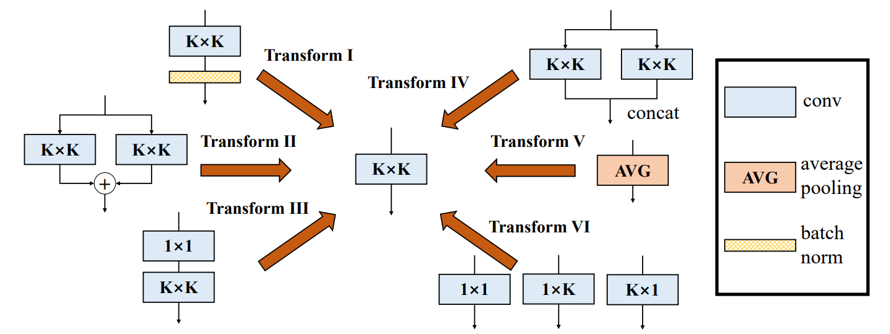
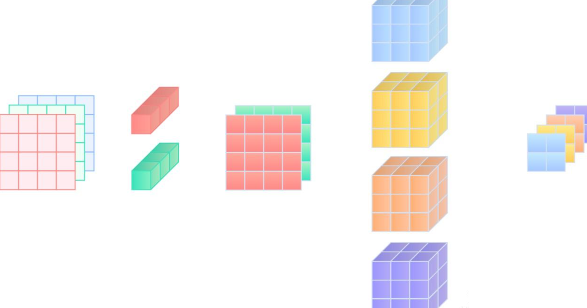
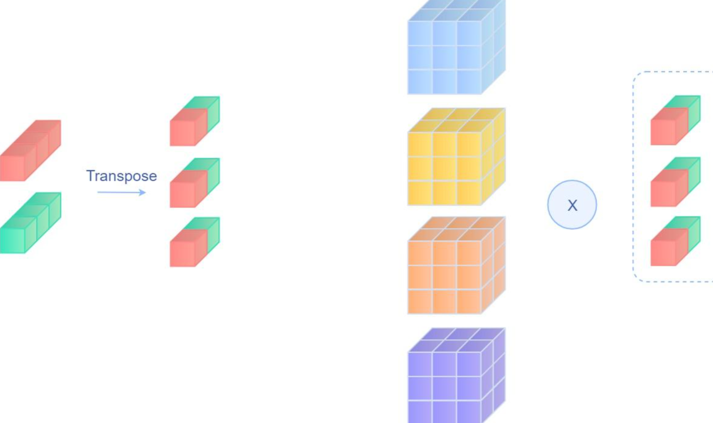
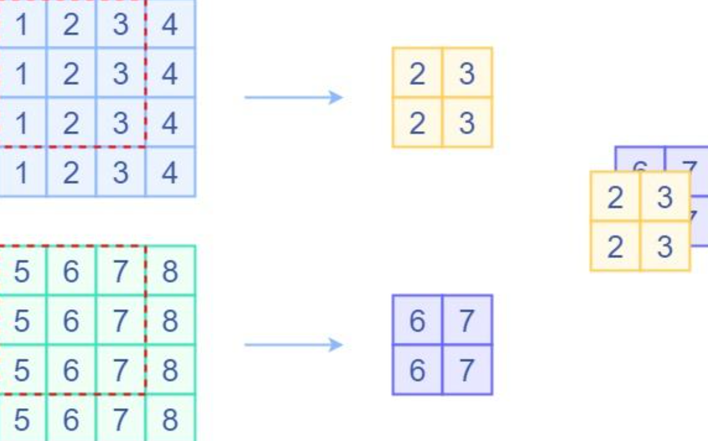
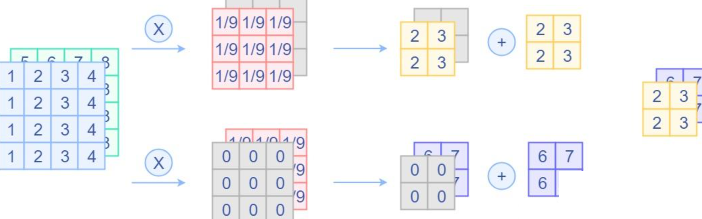
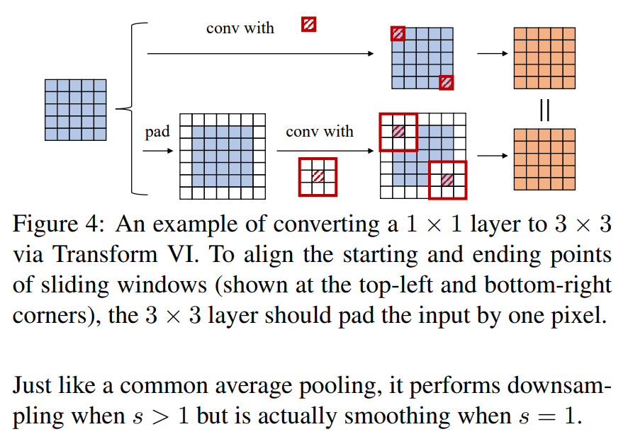
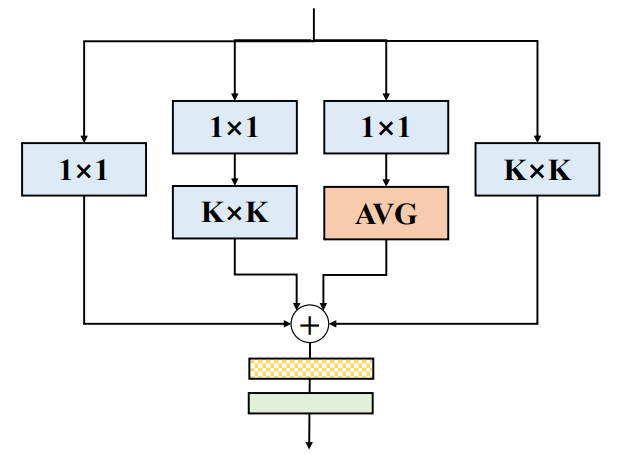

# DBB论文简介

此论文是继前作ACNet的又一次对网络结构重参数化的探索，作者设计了一个类似Inception的模块，**以多分支的结构丰富卷积块的特征空间**，各分支结构包括平均池化，多尺度卷积等。最后在推理阶段前，**把多分支结构中进行重参数化，融合成一个主分支**。这样能在相同的推理速度下，提升模型性能。

论文提出了一种卷积神经网络（ConvNet）的通用构建模块，以在不增加任何推理时间成本的情况下提高性能。这个模块被命名为多样化分支块（Diverse Branch Block，简称DBB），它通过结合不同规模和复杂性的多样化分支来增强单个卷积的表示能力，以丰富特征空间，包括卷积序列、多尺度卷积和平均池化。训练后，一个DBB可以等效地**转换为一个单一的卷积层**进行部署。也就是说，在推理阶段，所有这些多分支都等价转换成一个卷积，这也是结构化模型重参化的精髓所在。这样的等价变换可以作为一个嵌入式模块，灵活应用在现有的网络结构中。如Figure1右侧所示，在训练阶段**使用多个DBB模块代替卷积**，为网络提供更多的分支结构，这样往往能获得模型精度提高。而在推理阶段，再将**DBB模块等价转换成卷积**，从而无损地实现了模型精度提高。与新型ConvNet架构的进步不同，DBB在保持宏观架构的同时复杂化了训练时间的微观结构，因此它可以作为常规卷积层的替代品用于任何架构。这样，模型可以被训练到达到更高的性能水平，然后转换为原始的推理时间结构进行推理。DBB在图像分类（在ImageNet上的top-1准确率提高了最多1.9%）、对象检测和语义分割上改进了ConvNets。




# 转换1 Conv-BN融合

在CNN中，卷积层和BN层经常是成对出现的，我们可以把BN的参数融入到卷积层里，所以可得卷积层公式为
$$
Conv(x) = W(x) + b
$$
BN层的原始公式为
$$
BN(x) = \gamma\frac{(x-mean)}{\sqrt{var}}+\beta
$$
将卷积层的结果带入到BN的原始公式当中
$$
BN(Conv(x)) = \gamma\frac{W(x)+b-mean}{\sqrt{var}}+\beta
$$
化简得
$$
BN(Conv(x)) = \frac{\gamma W(x)}{\sqrt{var}}+(\frac{\gamma(b-mean)}{\sqrt{var}}+\beta) 
$$
这其实就可以等效为一个卷积层，只不过考虑了BN层的参数
$$
W_{fused}=\frac{\gamma W}{\sqrt{var}} \\  B_{fused}=\frac{\gamma(b-mean)}{\sqrt{var}}+\beta
$$
融合之后的结果就是
$$
BN(Conv(x)) = W_{fused}(x)+B_{fused}
$$


# 转换2 分支相加

可加性即在两个**卷积核形状一致**的情况下，卷积结果满足可加性，即
$$
Input \otimes F_1 + Input \otimes F_2 = Input \otimes (F_1+F_2) \\
$$
其中 $F_1$ 和 $F_2$ 分别表示两个独立的卷积操作。

参考如下代码

```python
import oneflow as flow 
import oneflow.typing as tp 
import numpy as np 
from typing import Tuple


@flow.global_function()
def conv_add(x: tp.Numpy.Placeholder(shape=(1, 2, 4, 4)))->Tuple[tp.Numpy, tp.Numpy]: 
    conv1 = flow.layers.conv2d(x, 4, kernel_size=3, padding="SAME", name="conv1")
    conv2 = flow.layers.conv2d(x, 4, kernel_size=3, padding="SAME", name="conv2")
    # Merge Add
    conv_merge_add = flow.layers.conv2d(x, 4, kernel_size=3, padding="SAME", name="conv_merge_add")
    return conv1 + conv2, conv_merge_add

x = np.ones(shape=(1, 2, 4, 4)).astype(np.float32)
weight_1 = np.random.randn(4, 2, 3, 3).astype(np.float32)
weight_2 = np.random.randn(4, 2, 3, 3).astype(np.float32)

# Load numpy weight
flow.load_variables({"conv1-weight": weight_1, "conv2-weight": weight_2, "conv_merge_add-weight": weight_1+weight_2})

original_conv_add, merge_conv_add = conv_add(x)

print("Conv1 + Conv2 output is: ", original_conv_add)
print("Merge Add output is: ", merge_conv_add)
print("Is Match: ", np.allclose(original_conv_add, merge_conv_add, atol=1e-5))
```

这里我们定义了一个方法，conv1和conv2分别表示两个独立的卷积操作，最后相加返回。而conv3表示的是融合后的卷积操作。 定义好后，我们将设定好的权重分别导入给conv1和conv2，然后将相加后的权重，导入给conv3，最后用 `np.allclose` 来验证结果是否准确。


# 转换3 序列卷积融合

在网络设计中，我们也会用到1x1卷积接3x3卷积这种设计（如ResNet的BottleNeck块），它能调整通道数，减少一定的参数量。

其原始公式如下
$$
F_1(D, C, 1, 1) \\
F_2(E, D, K, K) \\
out = F2 \otimes (F_1 \otimes input)
$$
我们假设输入是一个三通道的图片，1x1卷积的输出通道为2，3x3卷积的输出通道为4，那么图示如下



作者提出了这么一个转换方法，**首先将1x1卷积核的第零维和第一维互相调换位置**
$$
Transpose(F_1):F_1(D, C, 1, 1) ->F_1(C, D, 1, 1) \\
$$
然后3x3卷积核权重与转置后的"1x1卷积核"进行卷积操作
$$
F_2 \otimes Transpose(F_1)  形状为(E, C, K, K)\\
$$


最后输入与其做卷积操作，整个流程可以写为
$$
Input \otimes F_2 \otimes (Transpose(F_1)) \\
$$


# 转换4 拼接融合

在Inception模块中，我们经常会用到的一个操作就是concat，将各分支的特征，在通道维上进行拼接。我们也可以将多个卷积拼接转换为一个卷积操作，**只需要将多个卷积核权重在输出通道维度上进行拼接即可**，下面是一个示例代码

```python
import oneflow as flow 
import oneflow.typing as tp 
import numpy as np 
from typing import Tuple


@flow.global_function()
def conv_concat(x: tp.Numpy.Placeholder(shape=(1, 1, 4, 4)))->Tuple[tp.Numpy, tp.Numpy]: 
    conv1 = flow.layers.conv2d(x, 2, kernel_size=3, padding="SAME", name="conv1")
    conv2 = flow.layers.conv2d(x, 2, kernel_size=3, padding="SAME", name="conv2")
    # Merge Concat
    conv_merge_concat = flow.layers.conv2d(x, 4, kernel_size=3, padding="SAME", name="conv_merge_concat")
    return flow.concat([conv1, conv2], axis=1), conv_merge_concat

x = np.ones(shape=(1, 1, 4, 4)).astype(np.float32)
weight_1 = np.random.randn(2, 1, 3, 3).astype(np.float32)
weight_2 = np.random.randn(2, 1, 3, 3).astype(np.float32)

flow.load_variables({"conv1-weight": weight_1, "conv2-weight": weight_2, "conv_merge_concat-weight": np.concatenate([weight_1, weight_2], axis=0)})

original_conv_concat, merge_conv_concat = conv_concat(x)

print("Conv1 concat Conv2 output is: ", original_conv_concat)
print("Merge Concat output is: ", merge_conv_concat)
print("Is Match: ", np.allclose(original_conv_concat, merge_conv_concat, atol=1e-5))
```

# 转换5 平均池化层转换

我们简单回顾一下平均池化层操作，它也是一个滑动窗口，对特征图进行滑动，将窗口内的元素求出均值。**与卷积层不一样的是，池化层是针对各个输入通道的（如Depthwise卷积），而卷积层会将所有输入通道的结果相加**。一个平均池化层的示意图如下：



那其实平均池化层是可以等价一个**固定权重**的卷积层，假设平均池化层窗口大小为3x3，那么我**可以设置3x3卷积层权重为 1/9**，滑动过去就是取平均。另外要注意的是卷积层会将所有输入通道结果相加，**所以我们需要对当前输入通道设置固定的权重，对其他通道权重设置为0**。



另外，由于**最大池化层是一个非线性的操作**，所以是不能用卷积层替换的。


# 转换6 多尺度卷积融合

这部分其实就是ACNet的思想，存在一个卷积核 $ kh × kw (kh ≤ K, kw ≤ K) $ 那么我们可以把卷积核周围补0，来等效替代K x K卷积核 下面是一个示意图




# DBB结构



其中一共有四个分支，分别是1x1 卷积分支、1x1 - KxK卷积分支、1x1 - 平均池化分支、K x K 卷积分支。启发于Inception模块，各操作有不同的感受野以及计算复杂度，能够极大丰富整个模块的特征空间

由于最后都可以等价转换为一个KxK卷积，作者的后续实验就是将这个Block替换到骨干网络中的KxK卷积部分。