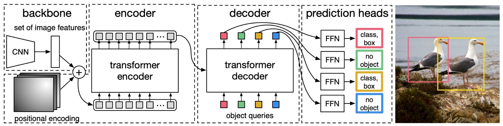
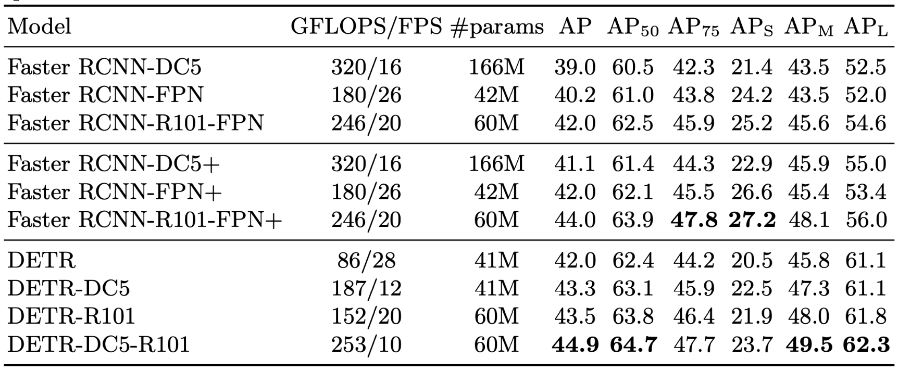

# 1 论文背景

这是FAIR最近新出了一篇用Transformer做目标检测的文章。相比于以往所有的检测方法不同的是，DETR开创了目标检测的新方法，没有使用先验知识比如anchor设计，以及后处理步骤如nms等操作。而是使用Transformer预测集合的形式，直接输出目标位置及类别信息。在目标检测上DETR准确率和运行时间上和Faster R-CNN相当；将模型扩展到全景分割任务上，DETR表现甚至还超过了其他的baseline.

上图展示的是DETR的整体结构图。如上图所示，可以看出关键的部分：

- 使用Transformer的Encoder-Decoder结构生成N个 box predictions；其中N为提前设计的、远大于图像中object数的一个整数

- 设计了bipartite matching loss，基于预测的box和gt box的二分图匹配计算loss，从而使得预测的box更接近gt box

原论文不是按照正常的网络结构的先后顺序来介绍各个部分。而是先介绍了bipartite matching loss，再介绍transformer的encoder和decoder。为了便于理解，这里还是按照网络结构的先后顺序来介绍各个模块。

# 2 网络结构

## 2.1 Transformer Encoder 

如上图左侧所示，在DETR中，首先输入图片送入CNN组成的backbone进行处理，得到feature map。然后将backbone输出的feature map和position encoding相加，输入Transformer Encoder中处理，得到用于输入到Transformer Decoder的image embedding。由于Transformer的输入为序列化数据，因此会对backbone输出的feature map做进一步处理转化为序列化数据，具体处理包括如下：

- **维度压缩**：使用1x1卷积将feature map 维度从C压缩为d, 生成新的feature map。
- **转化为序列化数据：**将空间的维度（高和宽）压缩为一个维度，即把上一步得到的d × H × W维的feature map reshape成d×HW维的feature map；
- **添加positoin encoding:** 由于transformer模型是permutation-invariant（转置不变性），而显然图像中目标是具有空间信息的，与原图的位置有关，所以需要加上position encoding反映位置信息。

## 2.2 Transformer Decoder

这部分的输入除了Encoder本身的输出，还加了一个object queries，object queries有N个，N是前文中提到的、远远大于image中object个数的一个整数），输入Transformer Decoder后分别得到N个 output embedding，然后经过FFN处理之后，输出N个box的位置和类别信息。object queries具体是什么，论文中没有具体阐述。

## 2.3 FFN

这是网络结构的最后输出部分。在DETR论文中提到两种FFN，一种是用来预测物体的中心坐标、宽和高，另外一种是预测class标签。

# 3 损失函数

## 3.1 优化思路

前面讲到Transformer经过FFN之后会预测输出N个prediction boxes,其中，N是提前设计好的一个远大于image objects的正整数。通过得到这N个prediction boxes和image objects的最优二分图匹配，通过计算配对的box pair的loss来对模型进行优化。

## 3.2 最优二分图匹配

假设在某一张图中，image objects的个数为m，由于N是事提前设计好的一个远大于m的正整数，所以 N>>m，即生成的prediction boxes的数量会远远大于image objects 数量，导致数量不一致难以匹配。

为了解决这个问题，作者人为构造了一个新的物体类别 ∅ (no object) 并加入image objects中，上面所说到的多出来的 (N - m) 个prediction embedding就会和类别 ∅ 配对。这样就可以将prediction boxes和image objects的配对看作两个等容量的集合的二分图匹配。 

设计好匹配的损失函数，就可以用匈牙利算法快速找到使损失最小的二分图匹配方案：
$$
\hat{\sigma}=\underset{\sigma \in \widetilde{S}_{N}}{\arg \min } \sum_{i}^{N} \mathcal{L}_{\operatorname{match}}\left(y_{i}, \hat{y}_{\sigma(i)}\right)
$$

## 3.3 计算Set Prediction Loss

上面我们得到了prediction boxes和image objects之间的最优匹配。这里我们基于这个最优匹配，来计算set prediction loss，即评价Transformer生成这些prediction boxes的效果好坏。 set prediction loss的计算如下：
$$
\mathcal{L}_{\text {Hungarian }}(y, \hat{y})=\sum^{N}\left[-\log \hat{p}_{\hat{\sigma}(i)}\left(c_{i}\right)+\mathbb{1}_{\left\{c_{i} \neq \varnothing\right\}} \mathcal{L}_{\text {box }}\left(b_{i}, \hat{b}_{\hat{\sigma}}(i)\right)\right]
$$

# 4 实验

