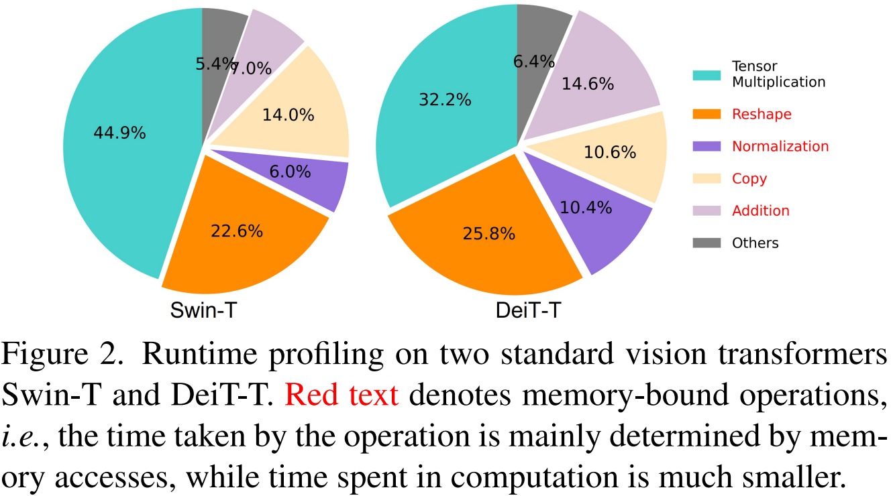
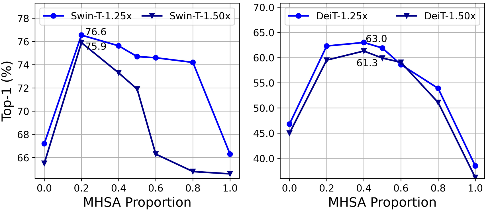
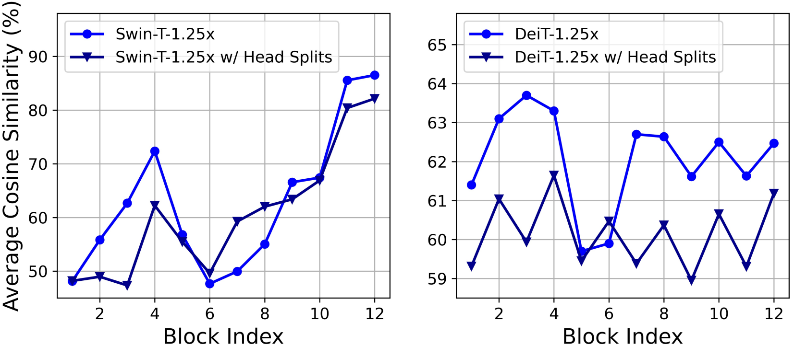
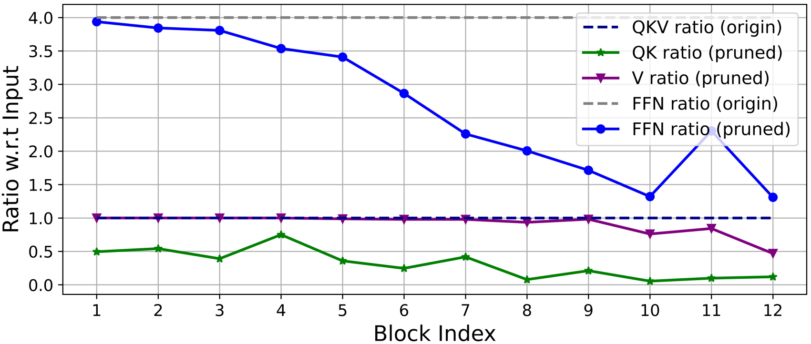
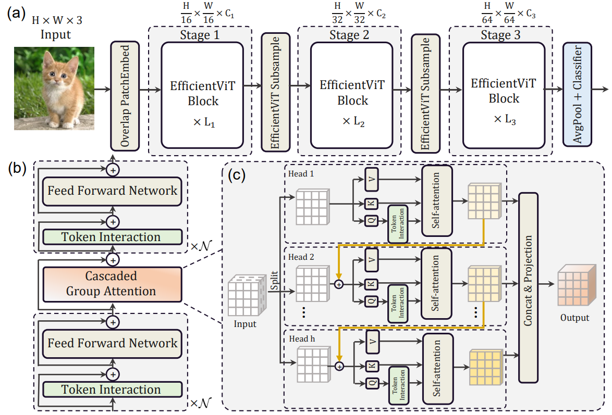

- Paper : [EfficientViT: Memory Efficient Vision Transformer with Cascaded Group Attention](https://arxiv.org/abs/2305.07027)

# 1 核心动机

核心就是针对Vision Transformer的推理效率的优化。ViT 的关键计算瓶颈是 softmax 注意力模块，其计算复杂度与输入分辨率成二次方。降低 ViT 的成本以将其部署在边缘设备上至关重要。

# 2 主要内容

在针对两类主流的Vision Transformer的分析中给出了三点结论。

内存访问开销是影响模型速度的关键因素。Vision Transformer中的许多操作，例如频繁的reshape、元素加法和归一化操作，都是内存效率低下的操作，需要跨不同存储单元进行耗时的访问，如图所示。虽然有一些方法可以通过简化标准softmax自注意的计算来解决这个问题，例如稀疏注意和低秩近似，但它们往往以精度下降和有限的加速为代价。从图中的实验可以看出，对于Vision Transformer而言，适当减少MHSA的使用率可以提升模型的内存效率，同时甚至可能提升性能。

MHSA中，不同的head使用不同的输入通道组，能比所有头使用所有输入通道可以有效强化不同的头学习不同的模式，缓解注意力计算的冗余性，即对应图中，可以降低头之间的相似性。

通过Taylor结构化剪枝技术的分析可以看出，传统Vision Transformer中的通道配置策略可能会让深层块产生更多的冗余性。在设定相同维度的情况下，Q和K的冗余性要大于V，而且V更偏好相对大的通道数量。

# 3 方法细节

## 3.1 方法综述

综合前面的分析，作者设计了一种更加高效的ViT变体

1. 输入时，直接使用重叠的块嵌入层下采样16倍。
2. 模型中仅使用三个尺度的阶段。
3. 不同stage之间的下采样层使用线性层和逆残差模块构成的sandwich布局实现，来减少信息的损失。
4. 模型中统一使用BN和ReLU，提升推理效率。
5. 使用更多的内存有效的FFN，减少内存受限的MHSA的使用。这里基于“基于深度卷积的Token Interaction+线性FFN+GroupAttention+基于深度卷积的Token Interaction+线性FFN”构造了一种sandwich类型的结构作为基础构建块。使用Token Interaction引入更多的局部归纳偏置。

6. 受启发于分组卷积，这里直接对Attention的头设计成分split处理，设计了新的Attention变体。

    - 这里的split指代的是计算Q，K，V之前就开始分组了，而Q，K，V内部计算时不再分头。而标准MHSA中，QKV的获取是使用了全部的输入特征通道。

    - 值得注意的是，这里的分头设计实现的时候，不同分组是级联形式，即上图中所示的橙色连线。每个子头的输出会被加到下一个头的输入上，从而进一步提提升模型的容量，鼓励特征的多样性。

    - Q在参与Attention计算之前会先通过一个独立的token Interaction增强局部表征。

    - 每个头所有阶段的Q和K的投影矩阵使用更少的通道。V的投影矩阵与输入的嵌入具有相同维数。由于FFN的参数冗余，其通道扩展比也从4降低到2。利用该策略，重要模块在高维空间中有更多的通道来学习表征，避免了特征信息的丢失。同时去除不重要模块中的冗余参数，加快推理速度，提高模型效率。

## 3.2 使用深度卷积增强线性注意力

