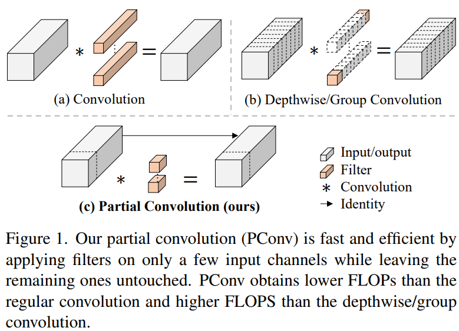

# 1 简介

神经网络在图像分类、检测和分割等各种计算机视觉任务中经历了快速发展。尽管其令人印象深刻的性能为许多应用程序提供了动力，但一个巨大的趋势是追求具有低延迟和高吞吐量的快速神经网络，以获得良好的用户体验、即时响应和安全原因等。

如何快速？研究人员和从业者不需要更昂贵的计算设备，而是倾向于设计具有成本效益的快速神经网络，**降低计算复杂度**，主要以每秒浮点运算（FLOPs）的数量来衡量。

MobileNet、ShuffleNet和GhostNet等利用深度卷积（DWConv）和/或组卷积（GConv）来提取空间特征。然而，在减少FLOPs的过程中，算子经常会受到内存访问增加的副作用的影响。MicroNet进一步分解和稀疏网络，将其FLOPs推至极低水平。尽管这种方法在FLOPs方面有所改进，但其**碎片计算效率很低**。此外，上述网络通常伴随着额外的数据操作，如级联、Shuffle和池化，这些操作的运行时间对于小型模型来说往往很重要。

除了上述纯卷积神经网络（CNNs）之外，人们对使视觉 Transformer（ViTs）和多层感知器（MLP）架构更小更快也越来越感兴趣。例如，MobileViT和MobileFormer通过**将DWConv与改进的注意力机制相结合**，降低了计算复杂性。然而，它们仍然受到DWConv的上述问题的困扰，并且还需要修改的注意力机制的专用硬件支持。使用先进但耗时的标准化和激活层也可能限制其在设备上的速度。

所有这些问题一起导致了以下问题：这些FLOPs较低的神经网络真的很快吗？为了回答这个问题，作者检查了延迟和FLOPs之间的关系，这由
$$
\text{Latency} = \frac{\text{FLOPs}}{\text{FLOPS}}
$$

> FLOPS（Floating Point Operations Per Second）是衡量**计算机或处理器**每秒钟能够执行的浮点运算的数量（相当于是速度）。它是一个性能指标，用于**评估计算机或处理器的计算能力**。通常在科学计算和人工智能领域使用，例如在评估超级计算机性能或深度学习模型的计算需求时。
>
> 而 FLOPs（Floating Point Operations）是指执行浮点运算的操作数的数量（是计算总数量）。它是衡量计算任务中需要执行的浮点运算的数量。在深度学习中，FLOPs用于衡量神经网络模型的计算复杂度或计算量，即**模型**需要执行的浮点运算的总数。通过计算FLOPs，可以评估和比较不同模型的计算复杂度，从而对模型的计算资源需求有一个大致的了解。

得出，其中FLOPS是硬件的每秒浮点运算能力。FLOPs是算法的浮点运算量，作为有效计算速度的度量，但是很少有改进考虑同时优化两者以实现真正的低延迟。为了更好地理解这种情况，作者比较了不同的神经网络

上图的结果表明，许多现有神经网络的FLOPS较低，其FLOPS通常低于流行的ResNet50。由于FLOPS如此之低，这些“快速”的神经网络实际上不够快。它们的FLOPs减少不能转化为延迟的确切减少量。在某些情况下，没有任何改善，甚至会导致更糟的延迟。例如，CycleMLP-B1具有ResNet50的一半FLOPs，但运行速度较慢（即CycleMLPB1与ResNet50的速度为111.9ms与69.4ms）。

> 注意，FLOPs与延迟之间的差异在之前的工作中也已被注意到，但由于它们采用了DWConv/GConv和具有低FLOPs的各种数据处理，因此部分问题仍未解决，当时普遍认为没有更好的选择。

作者旨在通过开发一种简单、快速、有效的运算符来消除这种差异，该运算符可以在减少FLOPs的情况下保持高FLOPS。

具体来说，作者重新审视了现有的操作符，特别是DWConv的计算速度——FLOPS。作者发现导致低FLOPS问题的主要原因是频繁的内存访问。然后，作者提出了PConv作为一种竞争性替代方案，它减少了计算冗余以及内存访问的数量。

后文中配图说明了PConv的设计。它利用了特征图中的冗余，并系统地仅在**一部分输入通道**上应用规则卷积（Conv），而不影响其余通道。本质上，PConv的FLOPs低于常规Conv，而FLOPs高于DWConv/GConv。换句话说，PConv更好地利用了设备上的计算能力。PConv在提取空间特征方面也很有效，这在本文后面的实验中得到了验证。

作者进一步引入PConv设计了FasterNet作为一个在各种设备上运行速度非常快的新网络家族。特别是，FasterNet在分类、检测和分割任务方面实现了最先进的性能，同时具有更低的延迟和更高的吞吐量。例如，在GPU、CPU和ARM处理器上，小模型FasterNet-T0分别比MobileVitXXS快3.1倍、3.1倍和2.5倍，而在ImageNet-1k上的准确率高2.9%。大模型FasterNet-L实现了83.5%的Top-1精度，与Swin-B不相上下，同时在GPU上提供了49%的高吞吐量，在CPU上节省了42%的计算时间。

总之，本论文贡献如下：

- 指出了**实现更高FLOPS**的重要性，而不仅仅是为了更快的神经网络而减少FLOPs
- 引入了一种**简单但快速且有效的卷积PConv**，它很有可能取代现有的选择DWConv
- 推出**FasterNet**，它在GPU、CPU和ARM处理器等多种设备上运行良好且普遍快速
- 对各种任务进行了广泛的实验，并验证了PConv和FasterNet的高速性和有效性

# 2 PConv与FasterNet的设计

## 2.1 原理

DWConv是Conv的一种流行变体，已被广泛用作许多神经网络的关键构建块。对于输入，DWConv应用个滤波器来计算输出。如上图（b）所示，每个滤波器在一个输入通道上进行空间滑动，并对一个输出通道做出卷积。减少了参数量。

与具有的FLOPs常规Conv相比，这种深度计算使得DWConv仅仅具有的FLOPs。虽然在减少FLOPs方面有效，但DWConv（通常后跟逐点卷积或PWConv）不能简单地用于替换常规Conv，因为它会**导致严重的精度下降**。因此，在实践中，DWConv的通道数（或网络宽度）增加到＞以补偿精度下降，例如，倒置残差块中的DWConv宽度扩展了6倍。然而，这会导致更高的内存访问，这会造成**不可忽略的延迟**，并降低总体计算速度，尤其是对于I/O绑定设备。特别是，内存访问的数量现在上升到 $h \times w \times 2c' + k^2 \times c' \approx h \times w \times 2c'$。它比一个常规的Conv还要高，即 $h \times w \times 2c + k^2 \times c^2 \approx h \times w \times 2c$ 。

注意，当内存访问花费在I/O操作上，这被认为已经是最小的成本，很难进一步优化。

## 2.2 PConv

通过可视化在ResNet50预训练的特征图可以发现，特征图在不同通道之间有着高度相似性。也有其他论文提到了这一点，但是很少有用有效的方式利用这一点。

具体而言，作者提出了一种简单的PConv，以同时减少计算冗余和内存访问。下图说明了PConv的工作原理。它只需在**输入通道的一部分**上应用**常规Conv**进行空间特征提取，并保持**其余通道不变**。对于连续或规则的内存访问，将第一个或最后一个连续的通道视为整个特征图的代表进行计算。在不丧失一般性的情况下认为输入和输出特征图具有相同数量的通道。因此，PConv的FLOPs仅为 $h \times w \times k^2 \times c_p^2$。

对于 r＝1/4 ，PConv的FLOPs只有常规Conv的1/16。此外，PConv的内存访问量较小，即 $h \times w \times 2c_p + k^2 \times c^2 \approx h \times w \times 2c_p$ 。

对于 r＝1/4，其仅为常规Conv的1/4。

由于只有部分通道用于空间特征提取，人们可能会问是否可以简单地移除剩余的 $(c - c_p)$ 通道？如果是这样，PConv将等效为具有较少通道的常规Conv，这偏离了减少冗余的目标。保持其余通道不变，而不是从特征图中删除它们。这是因为它们对后续PWConv层有用，PWConv允许特征信息流经所有通道。

## 2.3 在PConv后使用PWConv

