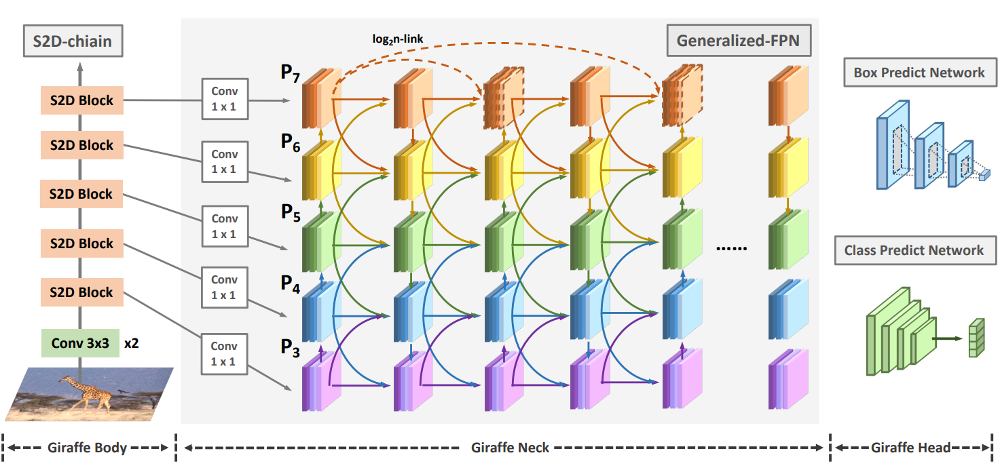
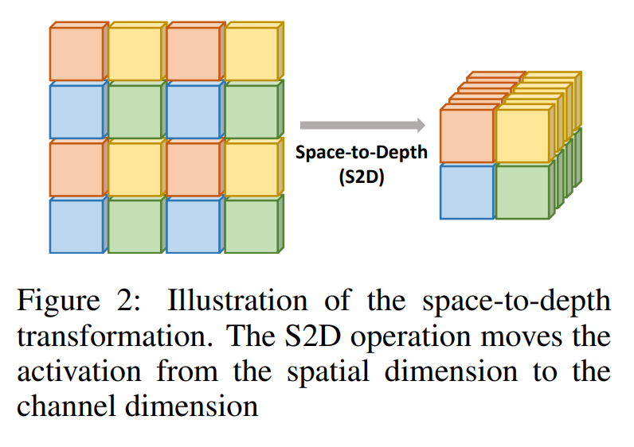
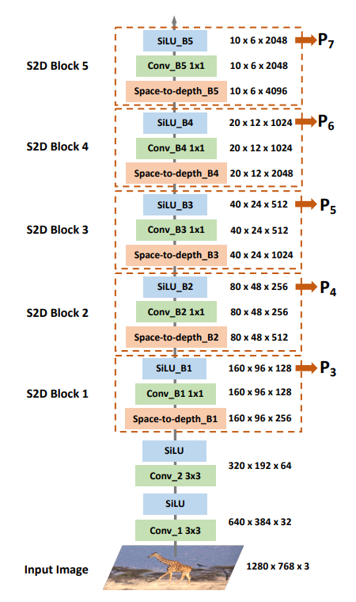
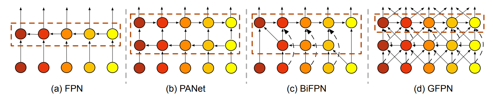
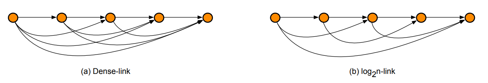
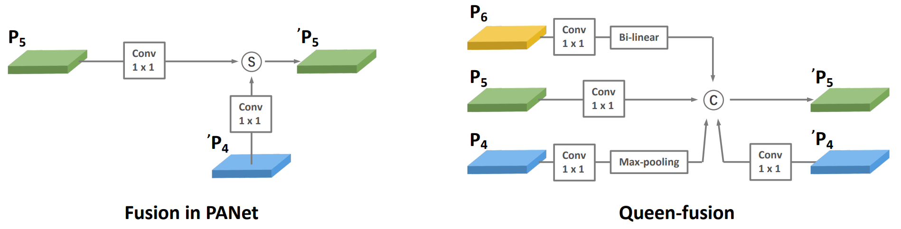
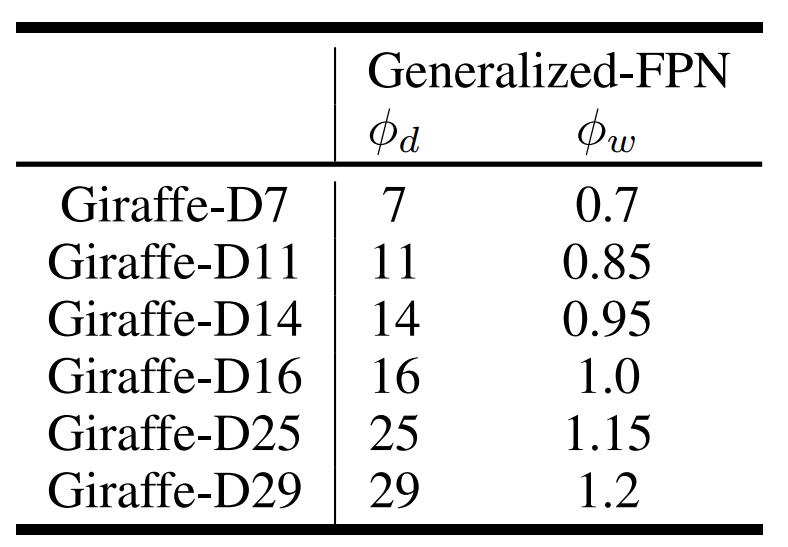
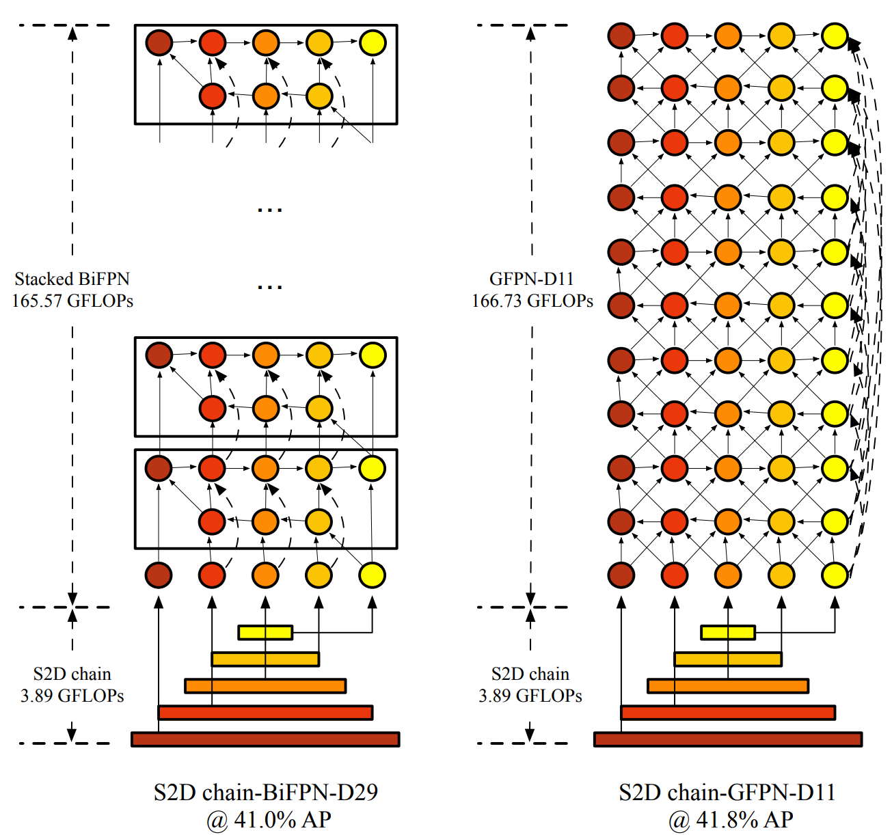

# 摘要

常规目标检测方案往往采用重骨干+轻Neck模式，即骨干部分的计算量占据主导地位(这种设计源自历史遗留问题，即骨干网络往往需要从图像识别模型进行迁移，而非针对目标检测进行端到端设计)。这种检测架构设计会导致次优性能。

为此，我们提出了一种新的重Neck架构GiraffeDet(类长颈鹿网络)用于高效目标检测，GiraffeDet采用超轻量骨干与非常深且大的Neck模块。这种设计范式允许检测器即使在网络早期阶段也能够以相同的优先级处理高层语义信息与底层空间信息，使其对检测而言更为高效。多主流检测基准数据集上的结果表明：**相比其他SOTA模型，GiraffeDet在不同资源约束下均能取得一致的性能优势**。

- 论文提出了首个轻骨干+灵活FPN组合的检测器，所提GiraffeDet包含一个轻量S2D-chain骨干与一个Generalized-FPN并取得了SOTA性能；
- 不同常规骨干，论文设计了一种轻量型S2D-chain骨干，同时通过可控实验证实：相比常规骨干，FPN对于检测模型更为重要；
- 提出GFPN(Generalized-FPN)以跨尺度连接方式对前一层与当前层的特征进行融合，���2�跳层连接提供了更有效的信息传输，同时可以扩展为更深的网络；
- 在不同FLOPs-性能均衡下，所提GiraffeDet均取得了优异性能。当搭配多尺度测试时，GiraffeDet-D29在COCO数据集上取得了54.1%mAP指标，超越了其他SOTA方案。

为达成更高效、更充分的多尺度信息交换，论文提出了GiraffeDet用于高效目标检测，giraffe包含轻量space-to-depth chain、Generalized-FPN以及预测网络，整体架构如上图所示，它延续了一阶段检测设计范式。

# **Lightweight Space-to-Depth Chain**

大多特征金字塔网络以常规CNN骨干提取的多尺度特征为基础上进行特征融合。然而，随着CNN的发展，骨干网络变得越来越大，计算量越来越高。此外，这些骨干网网络采用ImageNet进行预训练。我们认为：这些预训练骨干并不是哟用于检测任务，仍存在域漂移(domain-shift)问题。另外，FPN更多聚焦于高层语义信息与底层空域信息的交互。因此，我们认为：相比常规骨干，FPN在检测模型中的作用更为重要。

受启发于PiexelShuffle与FRVSR，我们提出了Space-to-Depth Chain(S2D Chain)作为轻量骨干网络，**它包含两个** **3×3** **卷积与堆叠S2D-chain模块**。具体来说，3×3卷积用于初始的下采样并引入更多非线性变换；**每个S2D-chain模块包含一个S2D层与一个** **1×1** **卷积**。S2D将更多的空域信息移动到深度维度，同时可以起到无参下采样作用。然后采用1×1卷积提供通道相关池化以生成固定维度特征。下图给出了本文基于S2D模块所设计的轻量型骨干架构示意图。

# **Generalized-FPN (GFPN)**

FPN旨在对CNN骨干网络提取的不同分辨率的多尺度特征进行融合。上图给出了FPN的进化，从最初的FPN到PANet再到BiFPN。我们注意到：这些FPN架构仅聚焦于特征融合，缺少了块内连接。因此，我们设计了一种新的路径融合：包含跳层与跨尺度连接，见上图(d)。

**Skip-layer Connection** 相比其他连接方法，在反向传播过程中跳过连接具有更短的距离。为避免GiraffeDet的重Neck设计的梯度消失问题，我们提出了一种特征连接方案：稠密连接与 $\log_2n$ 连接，见上图。

- **Dense-link**：受启发于DenseNet，对于k级的每个尺度特征 $P_K^l$, 第l层接收前面所有层面的特征，描述如下：

$$
P_k^l = Conv(Concat(P_k^0, \cdots, P_k^{l-1})) \\
$$

- $\log_2n$-**link**：具体来说，在k级，第l层最多接收 $\log_2l + 1$ 层前置特征，可描述如下：

$$
P_k^l = Conv(Concat(P_k^{l-2^n}, \cdots, P_k^{l-2^1}, P_k^{l-2^0})) \\
$$

相比稠密连接，所提 $\log_2n$-link的复杂度为 $O(l \times \log_2l)$，而非 $O(l^2)$。此外，在反向传播过程中，$\log_2n$-link仅将最短距离从1提升到了 $1 + \log_2l$。因此，$\log_2n$-link可以扩展到更深的网络。

**Cross-scale Connection** 基于所提假设，我们设计的充分信息交互应当不仅包含跳层连接，同时还包含跨尺连接以克服大尺度变化。因此，我们提出一种新的跨尺度融合**Queen-fusion**，见上图b。注：我们采用双线性插值与最大值池化进行特征上采样与下采样。

在极限大尺度变化场景下，它需要模型能充分进行高层与底层信息交互。基于跳层与跨尺度连接机制，所提GFPN能够尽可能扩展，类似于Giraffe Neck。基于这种的重Neck与轻骨干设计，所提GiraffeDet可以更好的平衡高精度与高效率。

# **GiraffeDet Family**

按照所提S2D-chain与GFPN，我们开发了一类GiraffeDet模型以满足不同资源约束。已有方案通过对骨干进行缩放调整模型大小，而GiraffeDet则聚焦于调整Neck部分。具体来说，我们采用两个系数 $\phi_d, \phi_w$ 调整GFPN的深度与宽度：
$$
D_{gfpn} = \phi_d, W_{gfpn} = 256 * \phi_w \\
$$

上表给出了本文所设计的不同大小的GiraffeDet缩放系数信息，它们具有与ResNet系列模型相当的FLOPs。下图还给出了S2D chain-BiFPN-D29以及S2D-chain GFPN-D11的架构示意图(这里的Neck部分的箭头连接好像有点问题)。

