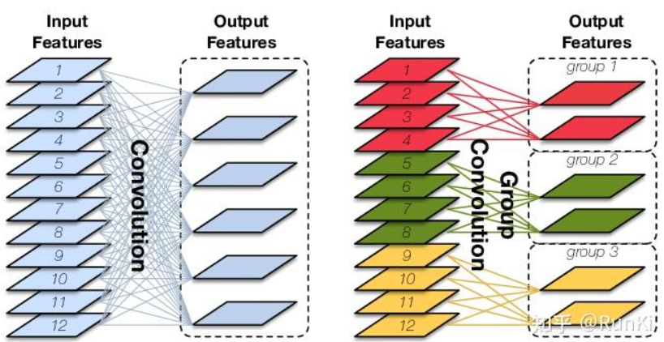
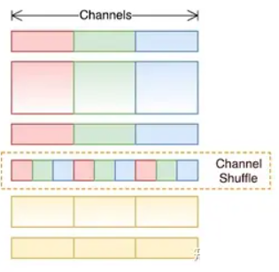
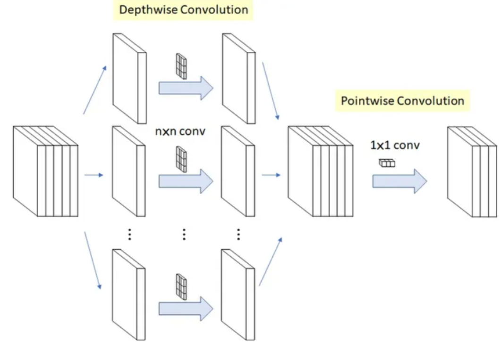
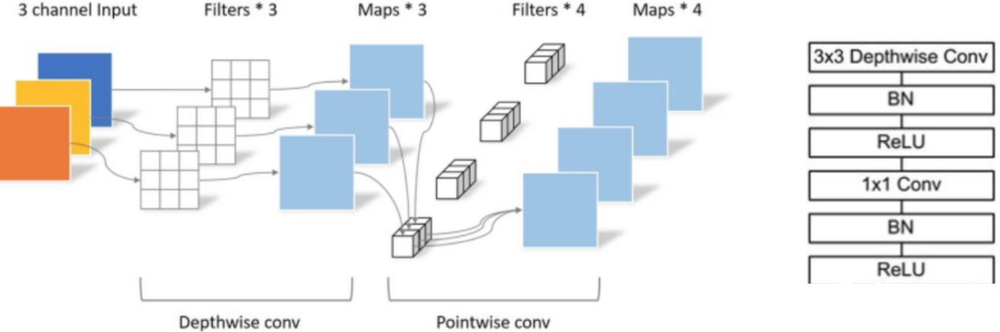

# 1 背景

分组卷积最开始被使用在经典入门卷积神经网络AlexNet上，用于解决显存不足的问题。在现在被广泛用于各种轻量化模型中，用于减少运算量和参数量，其中应用最广的就是深度可分离卷积。

# 2 比较

在PyTorch中常常要处理的数据维度就是 （Batch,Channel, Height, Width），简写（B,C,H,W）。

- 假设输入到输出为 $(B, C_{in}, H_{in}, W_{in}) \Rightarrow (B, C_{out}, H_{out}, W_{out})$

- 卷积核的大小为 $Kernel = K_1 \times K_2,\ Stride = S_1 \times S_2,\ Padding=P_1 \times P_2$

## 2.1 常规卷积

**常规卷积：**

- 每个卷积核的通道数等于输入通道数：$C_{filter} = C_{in}$
- 卷积核数量等于输出通道数：$N_{filter} = C_{out}$  
- 至少需要一个卷积核：$N_{filter} = C_{out} \geq 1$
- 输出特征图的高度：$H_{out}=\frac{H_{in} - K_1 + 2\times P_1}{S_1} + 1$
- 输出特征图的宽度：$W_{out}=\frac{W_{in}  - K_2 + 2\times P_2}{S_2} + 1$
- 计算感受野的公式其实就是计算输出特征图宽高的反推过程，即：$W_{out} \Rightarrow W_{in}$

**常规卷积的运算量：**

- 卷积核的运算量应该由**乘法**和**加法**两部分组成, 也就是乘加次数MAC（Multiply Accumulate)）需要计算乘法和加法两种操作的计算次数。
- 一个卷积核在某一像素点上的运算量是：
    $$
    O_1= 
    \begin{cases} C_{in}\times((K_1 \times K_2) + (K_1 \times K_2-1))=C_{in}\times(2(K_1 \times K_2)-1) & \text{,bias = False}\\  C_{in}\times((K_1 \times K_2) + (K_1 \times K_2-1))+1=C_{in}\times(2(K_1 \times K_2)-1))+1& \text{,bias = True}\\ C_{in}\times(K^2 +( K^2-1))=C_{in}\times(2K^2-1) & \text{,bias = False, }K_1 = K_2 =K\\  C_{in}\times(K^2 + (K^2-1))+1=C_{in}\times(2K^2-1)+1& \text{,bias = True, }K_1 = K_2=K \end{cases} 
    $$
- 一个卷积核在完整特征图上运算量：$ O_f=O_1 \times (H_{out} \times W_{out})  $
- 整个卷积层在一个像素点上的运算量：$FLOPs=C_{out} \times O_f $
- 卷积层的运算量与输入特征图的大小关联，所以对比模型运算量的时候需要确保**输入图像大小相同**

**常规卷积的参数量：**

- 需要注意的是一个卷积核可能有多个通道的掩膜权重，但是只有一个偏置bias

- 一个卷积核的参数量：$\begin{equation} P_1= \begin{cases} C_{in} \times K_1 \times K_2 & \text{, bias = False}\\ C_{in} \times K_1 \times K_2+1& \text{, bias = True} \end{cases} \end{equation}$

- 整个卷积层的参数量：$params = C_{out} \times P_1$

- 卷积层的参数量与本身定义的结构有关，与输入与输出无关

## 2.2 分组卷积

**分组卷积：**

- 将输入特征图按通道均分为 g 组，然后对每一组进行常规卷积
- 由于分组后，每组输入特征图的通道数为 $\frac{C_{in}}{g}$，卷积核个数也降低到 $\frac{C_{in}}{g}$
- 由于每组内进行的是常规卷积，所以每组至少需要一个卷积核，即分组卷积输出通道数至少为g，如果每组有 n个卷积核，则输出 $C_{out} = n \times g, \ n \ge 1$，所以输出通道数是分组数的整数倍，分组卷积中要求输入和输出通道数均能整除分组数 g。

- 分组卷积的参数量和运算量的减少，本质是一个卷积核本身的通道数的减少到原来的 g 分之一
- 整个分组卷积在一个像素上的运算量：$\text{FLOPS}=\frac{C_{in}}{g}\times C_{out} \times O_f$
- 整个分组卷积的参数量：$\begin{equation} Parameters=  \begin{cases} C_{out}\times (\frac{C_{in}}{g} \times K_1 \times K_2)& \text{, bias = False}\\ C_{out}\times (\frac{C_{in}}{g}  \times K_1 \times K_2+1)& \text{, bias = True} \end{cases} \end{equation}$

# 3 作用

1. 减少运算量和参数量，相同输入输出大小的情况下，减少为原来的 $\frac{1}{g}$ 

2. 隔绝不同组的信息交换

3. 在某些情况下，如每个输出与输入的一部分特征图相关联时，分组卷积可以取得比常规卷积更好的性能，假设输出通道为2，它们分别只与输入的1，2和3，4通道相关，这时最好使用 g=2 的分组卷积，相当于直接让模型将不相关的输入通道权重设置为零，加快模型收敛

4. 但对于需要**考虑所有输入特征图信息**的情况，分组卷积会降低模型的性能，对于这个问题，常常在两个分组卷积之间加入Channel_Shuffle模块打乱通道顺序，从而实现不同分组间的信息交换

4 深度可分离卷积

一种极致的分组卷积：当分组数等于输入通道数，且等于输出通道数，即 $g = C_{in} = C_{out}$ 时，我们把分组卷积（Group Convolution）称为深度可分离卷积（Depthwise Convolution）,此时每个输出特征图仅仅与一个输入特征图相关，输入和输出一一对应。

由于深度可分离卷积每个输出通道仅由输入的一个通道得来，缺乏了输入通道之间的信息交换，所以通常在后面加一个 1x1 卷积来实现通道间的信息交换，这个 1x1 卷积被称为Pointwise Convolution，这是MobileNet中提出来的结构，但是 1x1 卷积的运算量在轻量化模型中的比重很大，于是有的方法在设计去除1x1卷积的情况下，实现通道间的信息融合，如LiteHRNet,使用类似于通道注意力模块的方法来实现通道间的信息交换。

