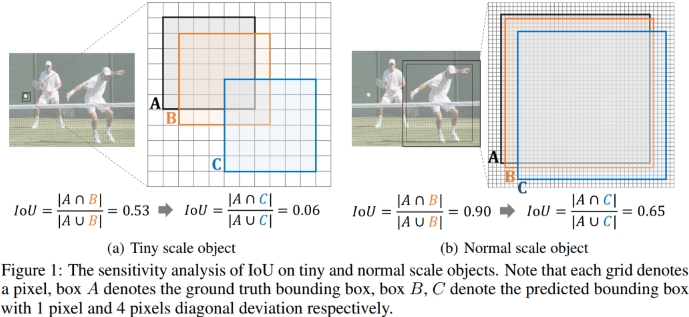
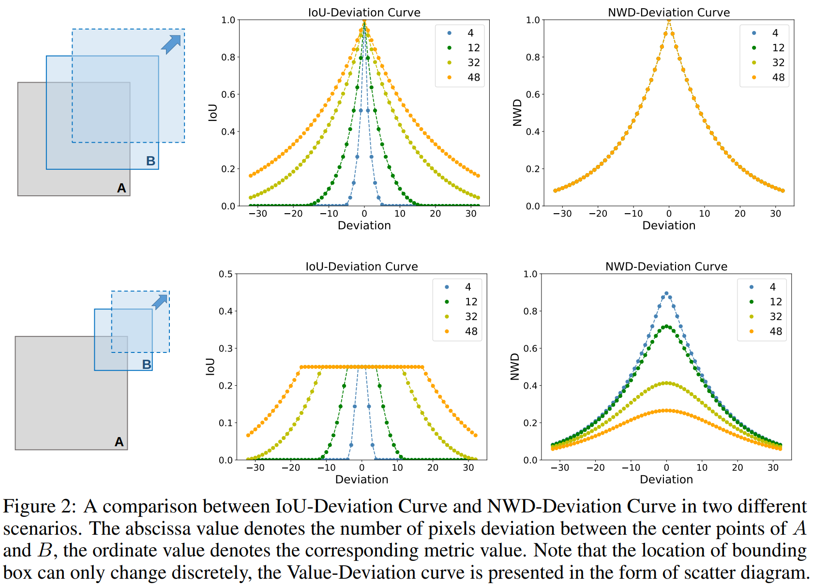

# Normalized Gaussian Wasserstein Distance

# 1 摘要

小目标检测是一个非常具有挑战性的问题，因为小目标只包含几个像素大小。作者证明，由于缺乏外观信息，最先进的检测器也不能在小目标上得到令人满意的结果。作者提出，基于IoU的指标，如IoU本身及其扩展，对小目标的位置偏差非常敏感，在Anchor-Based的检测器中使用时，严重降低了检测性能。

为了解决这一问题，论文提出了一种新的基于Wasserstein距离的小目标检测评估方法。具体来说，首先将BBox建模为二维高斯分布，然后提出一种新的度量标准，称为Normalized Wasserstein Distance(NWD)，通过它们对应的高斯分布计算它们之间的相似性。

NWD度量可以很容易地嵌入到任何Anchor-Based的检测器的Assignment、非最大抑制和损失函数中，以取代常用的IoU度量。作者在一个用于小目标检测(AI-TOD)的新数据集上评估了度量，其中平均目标大小比现有的物体检测数据集小得多。大量的实验表明，当使用NWD度量时，本文方法的性能比标准fine-tuning baseline高出6.7 AP，比SOTA模型高出6.0 AP。

# 2 问题解析

## 2.1 IoU的敏感性

如上图，IoU对不同尺度的物体的敏感性差异很大。具体来说，对于 6×6 像素的小目标，轻微的位置偏差会导致明显的loU下降(从0.53下降到 0.06 )，导致 标签分配不准确。然而，对于 36×36 像素的正常目标，loU略有变化(从0.90到 0.65 )，位置偏差相同。 此外，下图给出了4条不同目标尺度的loU-Deviation曲线，随着目标尺度的减小，曲线下降速度更快。 值得注意的是，loU的敏感性来自于BBox位置只能离散变化的特殊性。

这种现象意味着IoU度量对离散位置偏差的目标尺度是变化的，最终导致标签分配存在以下2个缺陷（其中，IoU阈值 $(\theta_{p}, \ \theta_n)$ 用于Anchor-Based检测器中Pos/Neg训练样本的分配，(0.7,0.3) 用于Region Proposal Network (RPN)）：

- 首先，由于IoU对小目标的敏感性，使得微小的位置偏差翻转Anchor标记，导致Pos/Neg样本特征相似，网络收敛困难；
- 其次，利用IoU度量，作者发现AI-TOD数据集中分配给每个Ground-Truth (GT)的平均正样本数小于1，因为GT与任何Anchor之间的IoU低于最小正阈值。

因此，训练小目标检测的监督信息不足。尽管ATSS等动态分配策略可以根据物体的统计特性自适应地获得分配Pos/Neg标签的IoU阈值，但IoU的敏感性使得小目标检测难以找到一个良好的阈值并提供高质量的Pos/Neg样本。

鉴于IoU不是一个很好的度量小目标的度量标准，论文提出了一种新的度量标准，用Wasserstein距离来度量BBox的相似性来代替标准IoU。具体来说：

- 首先，将包围盒建模为二维高斯分布；
- 然后，使用提出的Normalized Wasserstein Distance (NWD)来度量导出的高斯分布的相似性。
