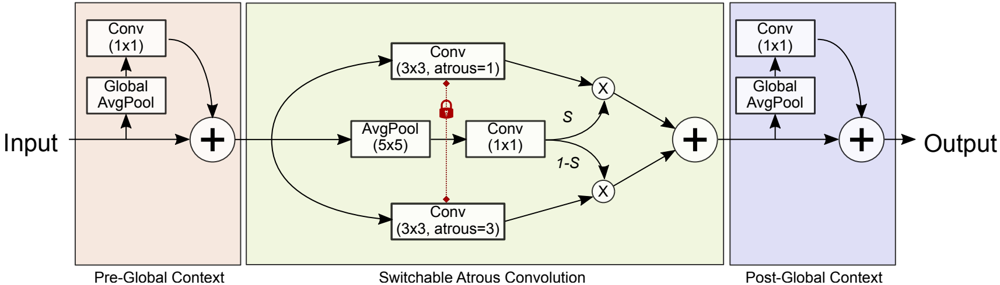

# 可切换的空洞卷积

## SAC（Switchable Atrous Convolution）

如上图所示是SAC的整体结构，作者将ResNet中所有的 $3 \times 3$ 的卷积层都转换为SAC，以实现在不同空洞率的情况下卷积操作的软切换。图中红色的锁表示权重是相同的，只是训练过程可能有差异。两个的全局上下文模块用于将图像级别的信息引入特征中。

用 $y = Conv(x, w, r)$ 来表示卷积操作，其中 $w$ 表示权重，$r$ 表示空洞率，这些都是SAC的超参数。Δw表示具有可训练的权重，并且switch切换函数S（·）由5x5的平均池化层和1x1卷积层组成，其与输入和位置相关。$x$ 是输入，$y$ 是输出。那么可以根据下式将卷积层转换为SAC：
$$
\textbf{Conv}(x, w, 1)\xrightarrow[\text{to  SAC}]{\text{Convert}} \textbf{S}(x) \cdot \textbf{Conv}(x, w, 1) + (1 - \textbf{S}(x)) \cdot \textbf{Conv}(x, w + \Delta w, r)
$$
作者提出一种锁机制，也就是将一个权重设为 $w$，将另一个权重设为 $ w + \Delta w$，这样做的原因为：目标检测通常使用预训练好的模型来对权重进行初始化，但是对于一个由标准卷积层转换而来的SAC来说，较大空洞率的权重通常是缺失的。由于可以在相同的权重下以不同的空洞率粗略地检测出不同大小的目标，因此还是可以用预训练模型的权重来初始化缺失的权重的。

本文使用 $ w + \Delta w$ 作为缺失的权重，其中 $w$ 来自于预训练模型， $\Delta w$ 被初始化为0。当固定 $\Delta w = 0$ 时，AP会降低约0.1%。但是没有锁机制的话， $\Delta w$ 会使AP降低很多。

**SAC中的全局上下文模块（Global Context）**

如上图所示，作者在SAC的主要组件**之前和之后插入两个全局上下文模块**。当输入特征首先被全局平均池化层压缩时，这两个模块的权重就降低了。全局上下文模块与SENet相似，但有两个主要区别：（1）全局上下文模块只有一个卷积层，**没有任何非线性层**；（2）输出被**加**回到主干中，而不是将输入乘以通过Sigmoid重标定操作后的值。

从实验上发现在SAC组件之前添加全局上下文信息（即在switch函数功能中添加全局信息）对检测性能有积极影响。作者推测这是因为**在可以获得全局信息时，switch函数可以做出更稳定的切换预测**。然后，将全局信息移至切换功能之外，并将其放置在主体之前和之后，以便卷积层和switch函数都能获取全局上下文信息。

**SAC的实现细节**

使用**可变形卷**积替换上图中的卷积运算，通过SAC替换骨干网络ResNet中的所有3x3卷积层，全局上下文模块中的权重和偏差用0初始化。switch函数中的权重用0初始化，偏置设置为1。Δw用0初始化。

空洞卷积（Dilated Convolution）和普通卷积（Standard Convolution）的输出大小公式是类似的，都可以用以下公式来计算输出张量的大小：
$$
\begin{aligned}
output_size &= \lfloor \frac{input_size + 2 \times padding - dilation \times (kernel_size - 1) - 1}{stride} \rfloor + 1 \
\end{aligned}
$$
其中，$input_size$ 表示2输入张量的大小，$padding$ 表示填充大小，$dilation$ 表示扩张率，$kernel_size$ 表示卷积核大小，$stride$ 表示步长大小。$\lfloor \cdot \rfloor$ 表示向下取整函数。

需要注意的是，空洞卷积在卷积核中插入了扩张的空洞，因此在计算输出大小时，需要将扩张率 $dilation$ 考虑在内。具体而言，如果输入张量的大小为 $(batch_size, channels, height, width)$，则输出张量的大小为 $(batch_size, out_channels, out_height, out_width)$，其中：

$$
\begin{aligned}
out_height &= \lfloor \frac{height + 2 \times padding - dilation \times (kernel_size - 1) - 1}{stride} \rfloor + 1 \
out_width &= \lfloor \frac{width + 2 \times padding - dilation \times (kernel_size - 1) - 1}{stride} \rfloor + 1 \
out_channels &= \text{卷积核的数量}
\end{aligned}
$$

需要注意的是，如果填充大小 $padding$ 不为 $0$，则输出大小会相应地增加，这是因为填充可以扩大输入张量的大小。在使用空洞卷积时，扩张率 $dilation$ 可以控制感受野的大小，从而影响特征图的尺寸和卷积核的有效 receptive field 大小。
