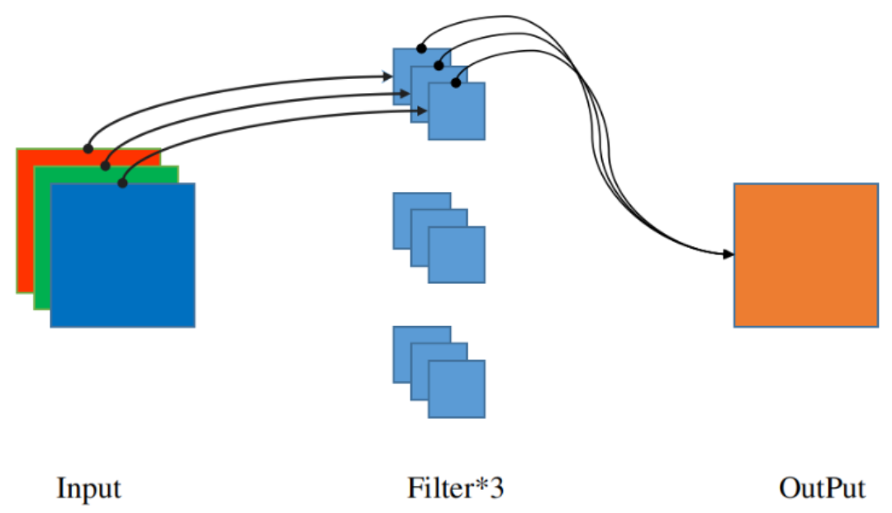
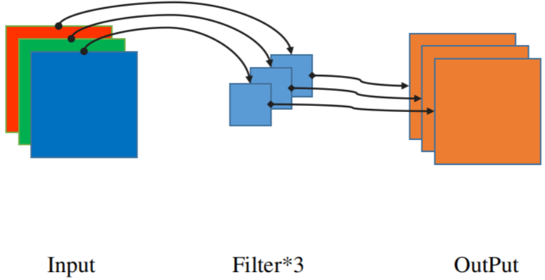
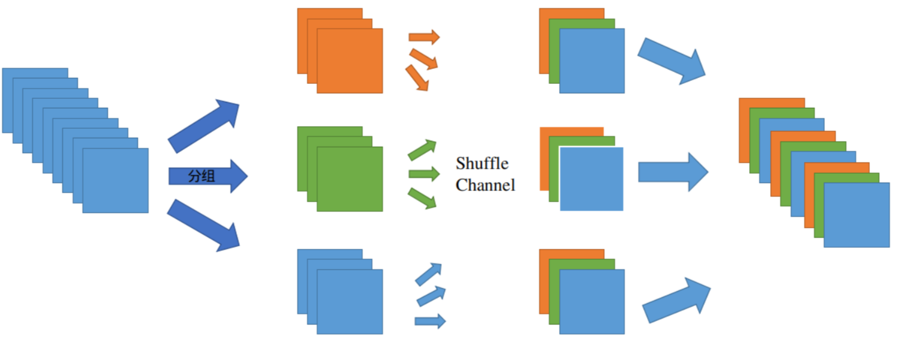
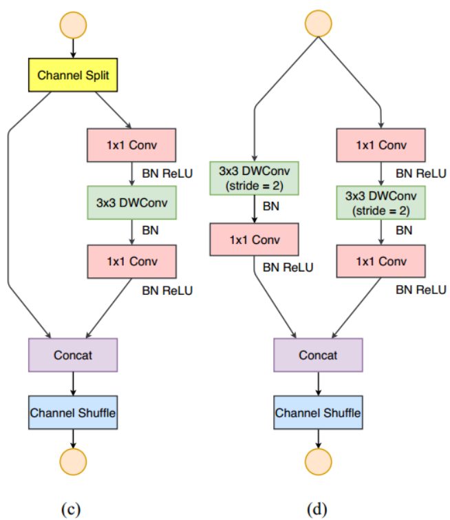

# DWConv

在ShuffleNetV2中采用了与MobileNet同样的深度卷积(DWConv), 目的在于减少卷积计算量，方便在移动设备上运行。

在传统卷积中，一组卷积核对应输出的一个channel，简而言之，卷积核的组数决定输出Tensor的channel。假设输入Tensor channel=3，每组卷积核channel=3，共有6组，则输出Tensor channel=6。传统卷积如下图所示：

DWConv的设计理念则是减少计算量，输入Tensor的channel与一组卷积核的channel相同并且输入Tensor的一个channel只与一组卷积核的一个channel进行计算，输出tensor的channel等于一组卷积核channel等于输入Tensor的channel。DWConv如下图所示：

# PWConv

Pointwise Convolution的运算与普通卷积运算一样，**它的卷积核的尺寸为 1×1×C**，C等于输入tensor的channel。1x1的卷积不会改变输入tensor尺度，但是能起到升维或者降维的作用。

普通Conv和DWConv+PWConv计算量对比如下，

**普通卷积**

- 输入 `tensor = [5,5,3]`，卷积核尺度 [3,3,3], 卷积核组数 6，完成一次卷积操作的计算量为 `3x3x3x6=162`

- 输出 `tensor = [3,3,6]`

**DWConv+PWConv**

**DWConv**

- 输入 `tensor=[5,5,3]`，卷积核尺度 [3,3,3]，卷积核组数 1，完成一次卷积操作的计算量为 `3x3x3x1=27`

- 输出 `tensor=[3,3,3]`

**PWConv**

- 输入 `tensor=[5,5,3]`，卷积核尺度 [1,1,3]，卷积核组数 6，计算量 `1x1x3x6=18`

- 输出 `tensor=[3,3,6]`

总计算量：27+18=45

由此可见，最后输出的tensor尺度相同但是计算量却差别巨大，使用**DWConv+PWConv**可以有效**减少计算量**。

# GConv

Group Convolution即分组卷积，最早见于AlexNet 2012年ImageNet的冠军网络，由于当时硬件条件限制，使得训练十分缓慢，Group Convolution被用来切分网络，使其在2个GPU上并行运行，加速训练过程。但是组卷积的好处并不止于此，分组卷积可以使计算量降低至 1/G，在这里展开说明GConv的好处，需要提出是GConv带来的缺点，由于GConv，导致每组之间的交流太少，信息缺少融合，使用在ShuffleNetV2中就提出了新方法 Shuffle channel。

# Shuffle Channel

为了解决GConv的问题，在ShuffleNetV2中提出了Shuffle Channel的方法，通过对通道分组，在重新组合通道，到达混合信息的效果。

Shuffle Net Block

在ShuffleNetV2的论文中给出了两种block结构，当DWConv stride=1的时候，采用左边block结构，当DWConv stride=2的时候，采用右边block结构。

1. 当stride=1的时候，需要对input data进行channel split 分割因子为2
2. 当stride=2的时候，不需要对input data进行channel分割，直接进行计算

**这里需要注意一下。两个分支计算完成后，最后的操作不是相加(ADD)，而且拼接(Concat)，如果是写成了相加那么channel就不对了，直接变成输入的一半。**

