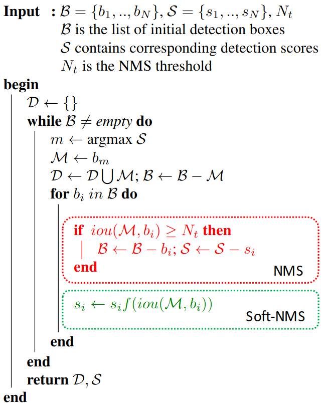

# 概述

传统的NMS算法首先在被监测图片中产生一系列的检测框B以及对应的分数S。当选中最大分数的检测框M时，该框从集合B中移出并放入最终检测结果集合D。与此同时，集合B中任何与检测框M重叠部分大于一定阈值的检测框也将随之移除。但是传统的NMS存在一个问题：如果一个物体在**另一个物体重叠区域**出现，即当两个目标框接近时，分数更低的框就会因为与之重叠面积过大而被删掉，从而导致对该物体的检测失败并降低了算法的平均检测率。

如上图所示，检测算法本来应该输出两个检测框，但是传统的NMS由于绿框的得分较低且绿框和红框的IoU大于设定的阈值，因此会被过滤掉，导致只检测出一匹马，显然这样的算法设计是不合理的。NMS直接粗暴的将和得分最大的bbox的IoU大于阈值的bbox得分置0。为了解决上述问题，提出一种缓和（soft）的方式，这就引出了Soft-NMS，简而言之，Soft-NMS就是用一个稍微小一点的分数替代原有的分数，而非直接粗暴的置0。

# 算法流程

传统的NMS，当前检测框和最高分检测框的IoU大于阈值时，直接将该检测框的得分置0，其算法如上图红色框所示，这将导致重叠区域较大的目标框被漏检。NMS算法可以用下面的式子表示：（其中s_i表示当前检测框的得分，N_t为IoU的阈值，M为得分最高的检测框。）

为了改变NMS这种hard threshold做法，并遵循IoU越大，得分越低的原则（iou越大，越有可能是false positiive），就可以用下面的公式来表示Soft-NMS：

但是上面这个公式是不连续的，这样会导致bbox集合中的score出现断层，因此就有了下面这个soft NMS式子（也是大部分实验中采用的式子），将当前检测框得分乘以一个权重函数，该函数会衰减与最高得分检测框M有重叠的相邻检测框的分数，越是与M框高度重叠的检测框，其得分衰减越严重，为此选择高斯函数为权重函数，从而修改其删除检测框的规则。高斯权重函数如下所示（δ通常取0.3）。

