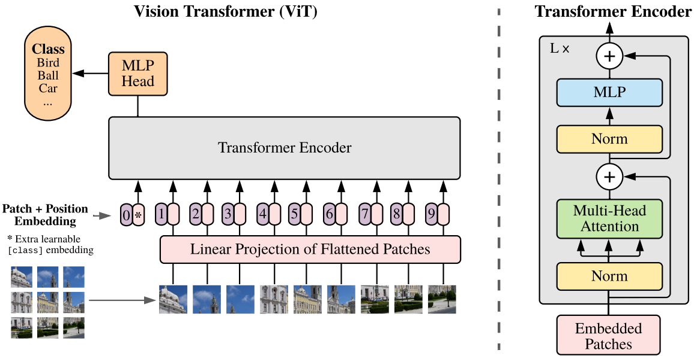

# ViT (Vision Transformer)

ViT（Vision Transformer）是一种基于Transformer架构的图像分类模型，由Google在2020年提出。传统的卷积神经网络（CNN）在图像分类任务上表现出色，但是在处理大量数据时，需要大量的计算资源，而且难以扩展到其他视觉任务。ViT通过将图像分割成固定数量的小块（称为patch）并将它们转换为向量，然后通过Transformer模型来学习这些向量之间的关系，从而实现了对图像的分类。

# 1 Patch Embedding

首先对比NLP中的Transformer和CV中的VIT。从变量的类型来看，两者都是一个tensor张量；而从变量的维度来看，NLP中的输入往往是二维的tensor，而CV中往往是一个三维的RGB图像。(在忽略了Batch维度的情况下) 这种维度的不统一会导致不能直接将图片数据输入到Transformer结构中去，而是需要进行一定的维度转换，即将三维的tensor转换成二维的tensor，这个过程被称为Patch Embedding。

可以看到，上图将一张RGB图片分成了9个相同大小的小块。假设原图尺寸为 H × W × C, 每个块的大小为 m × n × C ，对于上图一共分成了9块，应有 $\frac{H}{m} = 3$、$\frac{W}{n} = 3$。这样的一个操作就已经把三维的tensor转化为二维的tensor了，即由原图的 $H×W×C \to 9×(m×n×C)$。(注：此时每个小块的图片尺寸都是 $m×n×C$，其展平其实就是一个维度)

线性投射层实际就是一个全连接层

