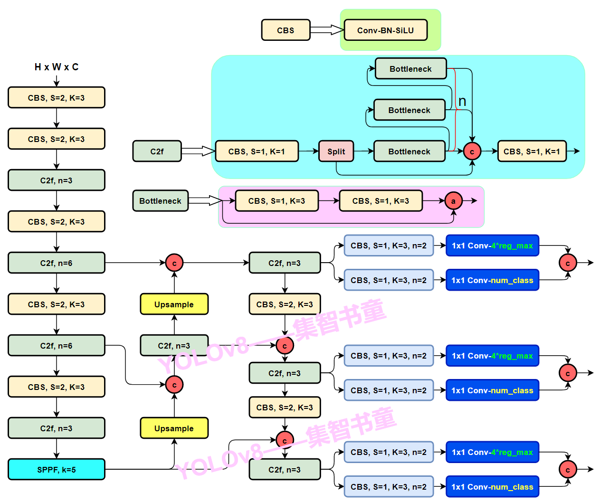

YOLOv8所做的改进：

- **Backbone**：使用的依旧是CSP的思想，不过YOLOv5中的C3模块被替换成了C2f模块，实现了进一步的轻量化，同时YOLOv8依旧使用了YOLOv5等架构中使用的SPPF模块；

- **PAN-FPN**：毫无疑问YOLOv8依旧使用了PAN的思想，不过通过对比YOLOv5与YOLOv8的结构图可以看到，YOLOv8将YOLOv5中PAN-FPN上采样阶段中的卷积结构删除了，同时也将C3模块替换为了C2f模块；

- **Decoupled-Head**：是不是嗅到了不一样的味道？是的，YOLOv8走向了Decoupled-Head；

- **Anchor-Free**：YOLOv8抛弃了以往的Anchor-Base，使用了**Anchor-Free**的思想；

- **损失函数**：YOLOv8使用BCE Loss作为分类损失，使用VFL Loss + CIOU Loss作为回归损失；

- **样本匹配**：YOLOv8抛弃了以往的IOU匹配或者单边比例的分配方式，而是使用了Task-Aligned Assigner匹配方式。

