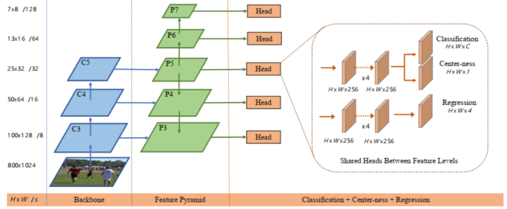
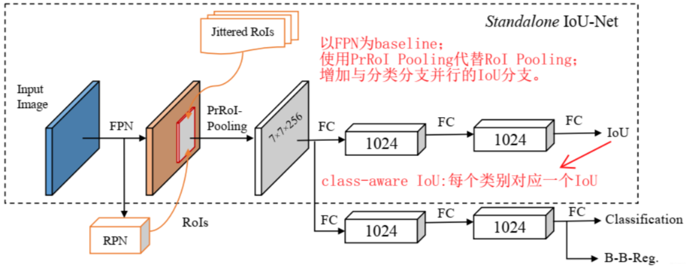
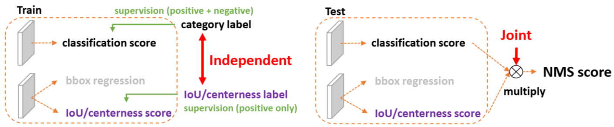
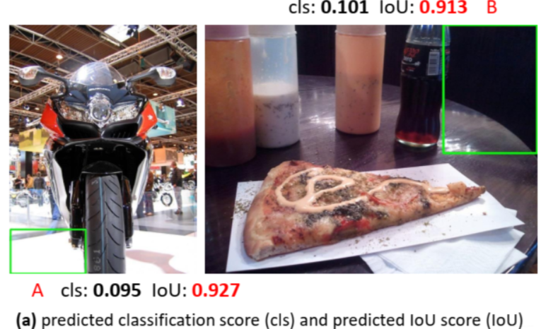
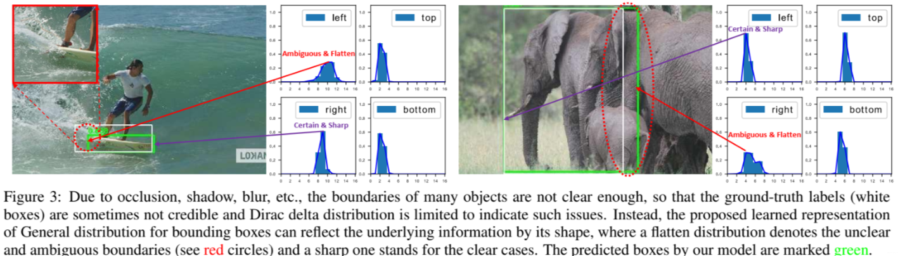
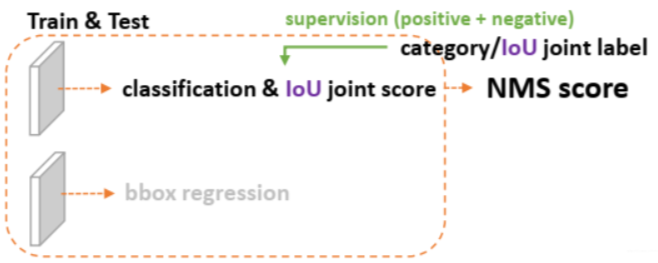
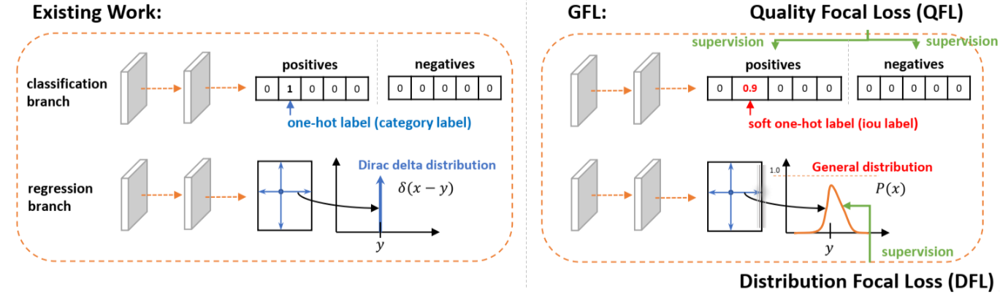
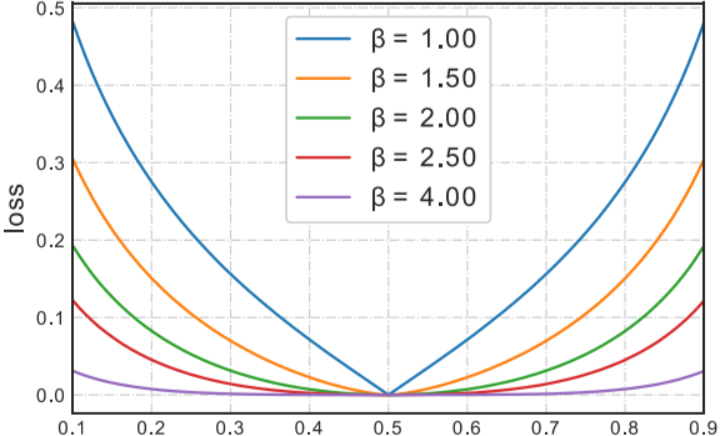
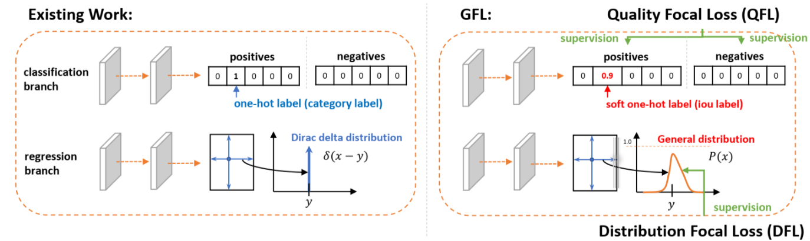
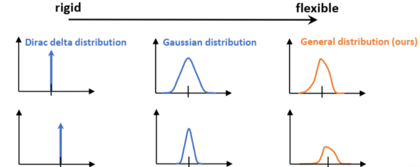

# 1 Motivation

## 1.1 存在的问题

目前，有些检测器为了评估检测框的质量，会在detection head添加一个与分类分支和回归分支并行的新分支，比如FCOS/ATSS中的centerness分支、IoU-Net中的IoU score分支。通常这些表示预测框质量的分支的输出值是0~1内的连续值。

- IoU-Net

尽管新添加的预测框质量评估分值可以提高检测器的性能，但是也会存在两个问题

- **classification score和IoU/centerness score训练测试不一致**

1） **用法不一致**。训练时，分类分支和质量估计分支是各自独立训练的，但测试时，却又是乘在一起作为NMS score排序的依据，这个操作显然没有end-to-end，必然存在一定的gap。

2） **对象不一致**。借助Focal Loss的力量，分类分支能够使得少量的正样本和大量的负样本一起成功训练，但是质量估计通常就只针对正样本训练。那么，对于one-stage的检测器而言，在做NMS score排序的时候，所有的样本都会将分类score和质量预测score相乘用于排序，那么必然会存在一部分分数较低的“负样本”的质量预测是没有在训练过程中有监督信号的，有就是说对于大量可能的负样本，他们的质量预测是一个未定义行为。这就很有可能引发这么一个情况：**一个分类score相对低的真正的负样本，由于预测了一个不可信的极高的质量score，而导致它可能排到一个真正的正样本（分类score不够高且质量score相对低）的前面**，如图所示：

- **bbox regression采用的表示不够灵活，没有办法建模复杂场景下的不确定性**

在复杂场景中，边界框的表示具有很强的不确定性，而现有的框回归本质都是建模了非常单一的狄拉克分布，非常不灵活。我们希望用一种更一般的分布去建模边界框的表示。如图所示（比如被水模糊掉的滑板，以及严重遮挡的大象）：

## 1.2 解决方法

- 对于第一个问题，为了保证训练和测试时的一致性，同时保证分类score和质量预测score都能够训练到所有的正负样本，将两者的表示进行联合，此时将分类分支和质量评估分支合在一起，得到的输出不再表示单一的类别score或质量预测score，而是两者的联合表示。

- 对于第二个问题，选择直接回归一个任意分布来建模框的表示。当然，在连续域上回归是不可能的，所以可以用离散化的方式，通过softmax来实现即可。这里面涉及到如何从狄拉克分布的积分形式推导到一般分布的积分形式来表示框。

# 2. Generalized Focal Loss(GFL)

## 2.1 Quality Focal Loss (QFL)

​		传统方法中，分类分支输出$W\times H\times K$的类别预测概率，其中，$K$ 是类别总数，而第 $k$ 个通道上某个位置的值表示该边界框属于第 $k$ 类的概率。在构建训练标签时，每个通道上特征图的每个位置的标签是离散的，即 y ∈ { 0 , 1 } ，其中，$y=1$ 表示边界框属于对应类别。

​		显然，特征图的每个位置的坐标已经编码了类别信息，当与质量预测（如IoU score）进行联合时，可令每个位置上的值表示该边界框与GT框的IoU，这样，特征图的每个位置的训练标签从离散变成了连续，即 y ∈ [ 0 , 1 ] ，此时，实现了对hard label {0 , 1} 进行平滑化，得到soft label [0 , 1]，相比于hard label，soft label包含了更多信息。

​		Focal Loss是为one-stage检测器的分类分支服务的，它支持0或1这样的离散类别label。然而，对于分类-质量联合表示，label却变成了0~1之间的连续值。我们既要保证Focal Loss此前的平衡正负、难易样本的特性，又需要让其支持连续数值的监督学习，因此，需要对Focal Loss在连续域进行拓展，拓展结果为本文的Quality Focal Loss (QFL)。
​		Focal loss的形式为
$$
FL(p_t)=-(1-p_t)^{\gamma}log(p_t), \ \ \gamma \geq0 \\

p_t = 
\begin{cases}
p, & if \ \ \ y = 1 \\
1 - p, & otherwise
\end{cases}
$$
​		如何在连续域进行拓展？还记得CornerNet中使用高斯函数对分类标签进行平滑化后构造相应的损失函数吗？其思想和Quality Focal Loss (QFL)如出一辙，即基本的分类损失仍然使用hard label的二元交叉熵损失
$$
CE(p,y)=−y \log{p} −(1−y) \log{(1−p)}
$$

​		而soft label则体现在对基本二元交叉熵损失添加一个权重，目的是减少某些样本的权重。实际上，Quality Focal Loss (QFL)就具有这样的形式
$$
QFL(p)=-|y-p|^\beta[ylog(p)+(1-y)log(1-p)]
$$
当预测值 $p$ 与其标签 $y$ 接近时，表示预测得比较好，视为easy example，权重 $|y-p|^\beta$ 用来减小easy example产生的损失，当预测值 $ p$ 与其标签 $y$ 较远时，表示预测得较差，视为hard example，权重 $|y-p|^\beta$ 较大，令模型更加关注hard example的学习。下图表示当 $y = 0.5$ 时，不同 β 下，不同预测概率 $p$ 对应的Quality Focal Loss (QFL)。论文表示，β = 2 时效果最好。

## 2.2 Distribution Focal Loss (DFL)

传统的方法如FCOS、ATSS等anchor-free检测器将边界框建模成狄拉克函数，这种建模方法得到的是"硬边界"，无法对噪声引入的不确定性进行建模；KL loss和Gaussian yolov3将边界框建模成高斯分布，实现对不确定性的建模；本文则将边界框建模成一般分布，更好地对歧义性和不确定性进行建模。

假设真实回归标签y yy表示边界框内某点到某边界的距离，预测值为x xx，则狄拉克函数 $\delta(x-y)$ 满足

$$
\int_\limits{-\infty}^{\infty} \sigma(x-y) \mathrm{d}x= 1
$$
所以
$$
y = \int\limits_{-\infty}^{\infty} \delta(x-y)x \mathrm{d}x
$$
本文将边界框建模成一般分布 $P(x)$, 则当 $y_0 \le y \le y_n, \ x \in N_+$时, 最终边界框的预测值 $y'$ 同样应满足  $y_0 \le y' \le y_n $, 且
$$
y' = \int\limits_{-\infty}^{\infty} P(x)x \mathrm{d}x = \int\limits_{y_0}^{y_n} P(x)x \mathrm{d}x
$$
いつの日か　大事なもの見つけたら

迷わず走れ　突っ走れ　頑張れ