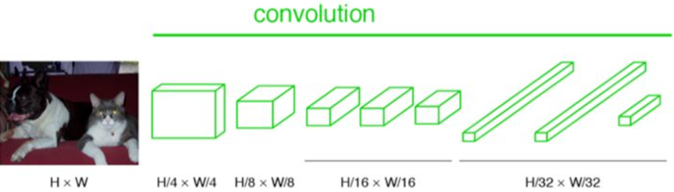
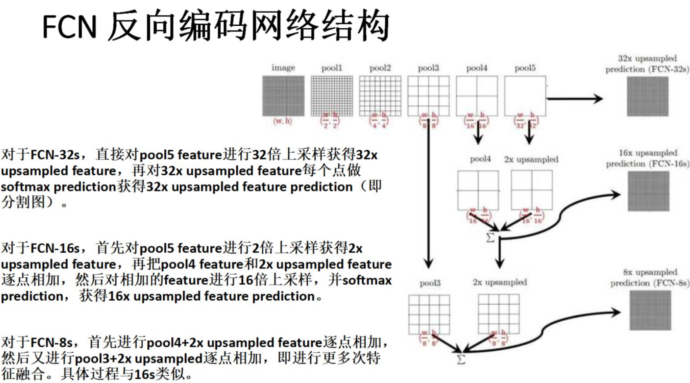

# Fully Convolutional Networks

FCN是深度学习应用在语义分割的开山之作, 是一种端到端(end to end)的图像分割方法, 让网络做像素级别的预测直接得出`label map`, 下面来详细介绍一下FCN。

## **网络结构**

FCN对图像进行像素级的分类，从而解决了语义级别的图像分割（semantic segmentation）问题。与经典的CNN在卷积层之后使用全连接层得到固定长度的特征向量进行分类（全连接层＋softmax输出）不同，FCN可以接受任意尺寸的输入图像，采用反卷积层对最后一个卷积层的feature map进行上采样, 使它恢复到输入图像相同的尺寸，从而可以对每个像素都产生了一个预测, 同时保留了原始输入图像中的空间信息, 最后在上采样的特征图上进行逐像素分类。

## **全卷积网络**

通常CNN网络在卷积层之后会接上若干个全连接层, 将卷积层产生的特征图(feature map)映射成一个固定长度的特征向量。以AlexNet为代表的经典CNN结构适合于图像级的分类和回归任务，因为它们最后都得到整个输入图像的一个**概率向量**，比如AlexNet的ImageNet模型输出一个1000维的向量表示输入图像属于每一类的概率(softmax归一化)。

在CNN中, 猫的图片输入到AlexNet, 得到一个长为1000的输出向量, 表示输入图像属于每一类的概率, 其中在tabby cat这一类统计概率最高, 用来做分类任务。FCN与CNN的区别在于把于CNN最后的全连接层转换成卷积层，输出的是一张已经Label好的图片, 而这个图片就可以做语义分割。

CNN的强大之处在于它的**多层结构能自动学习特征**，并且可以学习到**多个层次的特征**：

- 较浅的卷积层感知域较小，学习到一些局部区域的特征
- 较深的卷积层具有较大的感知域，能够学习到更加抽象一些的特征

高层的抽象特征对物体的大小、位置和方向等敏感性更低，从而有助于识别性能的提高, 所以我们常常可以将卷积层看作是特征提取器.

CNN难以实现对像素级别的分类，对于传统的滑动窗口方法，有下列缺点：

1. **存储开销很大**。例如对每个像素使用的图像块的大小为15x15，然后不断滑动窗口，每次滑动的窗口给CNN进行判别分类，因此则所需的存储空间根据滑动窗口的次数和大小急剧上升。
2. **计算效率低下**。相邻的像素块存在**大量重复信息**，针对每个像素块逐个计算卷积，这种计算也有很大程度上的重复。
3. **像素块大小的限制了感知区域的大小**。通常像素块的大小比整幅图像的大小小很多，只能提取一些局部的特征，从而导致分类的性能受到限制。

FCN不限定输入图片的大小。对此，首先来看CNN为什么需要固定输入图片大小。

对于CNN的卷积和pooling层时，这些层是不需要指定图片大小的。比如对于一个卷积层， 它并不关心inputsize多大，对于一个inputsize大小的输入feature map，滑窗卷积，输出outputsize大小的feature map即可。pooling层同理。但是在进入全连接层时，feature map（假设大小为n×n）要拉成一条向量，而向量中每个元素（共n×n个）作为一个结点都要与下一个层的所有结点（假设4096个）全连接，这里的权值个数是4096×n×n，而我们知道神经网络结构一旦确定，它的权值个数都是固定的，所以这个n不能变化，n是卷积的outputsize，所以层层向回看，每个outputsize都要固定，对应的每个inputsize都要固定，因此输入图片大小要固定。

## 特征提取

下图是一个全卷积层，不一样的是图像对应的大小下标，CNN中输入的图像大小是缩放成 227x227 大小的图像，第一层pooling后为55x55，第二层pooling后图像大小为27x27，第五层pooling后的图像大小为13x13。而FCN输入的图像是H*W大小，第一层pooling后变为原图大小的$\frac{1}{2}$，第二层变为原图大小的$\frac{1}{8}$，第五层变为原图大小的$\frac{1}{16}$，第八层变为原图大小的$\frac{1}{32}$，以此类推。

经过多次卷积和pooling以后，得到的图像越来越小，分辨率越来越低。其中图像到 $\frac{H}{32} \times \frac{W}{32}$ 的时候图片是最小的一层时，所产生图叫做heatmap热图，热图就是我们最重要的高维特征图，得到高维特征的heatmap之后就是最重要的一步也是最后的一步对原图像进行upsampling，把图像进行放大到原图像的大小。

最后的输出是1000张heatmap经过upsampling变为原图大小的图片，为了对每个像素进行分类预测label成最后已经进行语义分割的图像，这里有一个trick，就是最后通过逐个像素地求其在1000张图像该像素位置的最大数值描述（概率）作为该像素的分类。因此产生了一张已经分类好的图片，如下图右侧有狗狗和猫猫的图。

## 上采样Unsample

相较于使用被转化前的原始卷积神经网络对所有36个位置进行迭代计算，使用转化后的卷积神经网络进行一次前向传播计算要高效得多，因为36次计算都在共享计算资源。这一技巧在实践中经常使用，一次来获得更好的结果。比如，通常将一张图像尺寸变得更大，然后使用变换后的卷积神经网络来对空间上很多不同位置进行评价得到分类评分，然后在求这些分值的平均值。

最后，如果我们想用步长小于32的浮窗怎么办？用多次的向前传播就可以解决。比如我们想用步长为16的浮窗。那么先使用原图在转化后的卷积网络执行向前传播，然后分别沿宽度，沿高度，最后同时沿宽度和高度，把原始图片分别平移16个像素，然后把这些平移之后的图分别带入卷积网络。

如下图所示，当图片在网络中经过处理后变成越小的图片，其特征也越明显，就像图像中颜色所示。注意，最后一层的图片并不是一个1个像素的图片，而是原图像 H/32 x W/32 大小的图，这里为了简化而画成一个像素。

如下图所示，对原图像进行卷积conv1、pool1后原图像缩小为1/2；之后对图像进行第二次conv2、pool2后图像缩小为1/4；接着继续对图像进行第三次卷积操作conv3、pool3缩小为原图像的1/8，此时保留pool3的featureMap；接着继续对图像进行第四次卷积操作conv4、pool4，缩小为原图像的1/16，保留pool4的featureMap；最后对图像进行第五次卷积操作conv5、pool5，缩小为原图像的1/32，然后把原来CNN操作中的全连接变成卷积操作conv6、conv7，图像的featureMap数量改变但是图像大小依然为原图的1/32，此时图像不再叫featureMap而是叫heatMap。

现在我们有1/32尺寸的heatMap，1/16尺寸的featureMap和1/8尺寸的featureMap，1/32尺寸的heatMap进行upsampling操作之后，因为这样的操作还原的图片仅仅是conv5中的卷积核中的特征，限于精度问题不能够很好地还原图像当中的特征，因此在这里向前迭代。把conv4中的卷积核对上一次upsampling之后的图进行反卷积补充细节（相当于一个差值过程），最后把conv3中的卷积核对刚才upsampling之后的图像进行再次反卷积补充细节，最后就完成了整个图像的还原。

而不同的结构产生的结果对比如下

## 跳层连接

其实直接使用前两种结构就已经可以得到结果了，但是直接将全卷积后的结果上采样后得到的结果通常是很粗糙的。所以这一结构主要是用来优化最终结果的，思路就是将不同池化层的结果进行上采样，然后结合这些结果来优化输出，具体结构如下:

