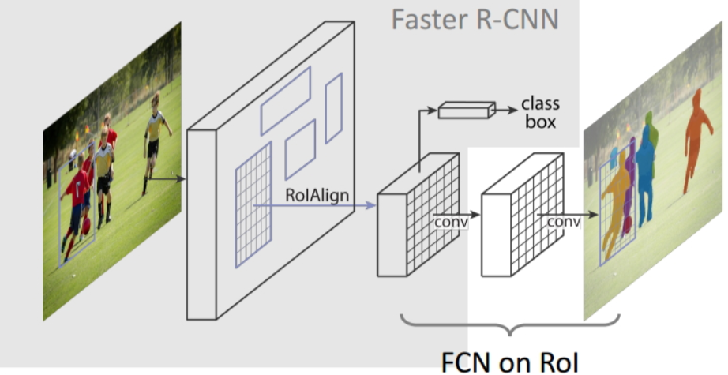

# 1 前言

Mask R-CNN是一个实例分割算法，同时可用于做目标检测、目标实例分割、目标关键点检测。

**实例分割和语义分割的区别与联系**：

- 联系：语义分割和实例分割都是目标分割中的两个小的领域，都是用来对输入的图片做分割处理；

- 区别：实例分割需要识别出同一类的不同物体，也可以理解为实例分割就是目标检测加语义分割

**Mask R-CNN预期达到的目标**

- 高速
- 高性能（高分类准确率、高检测准确率、高实例分割准确率等）
- 简单直观
- 易于使用

**如何实现这些目标**

- 高速和高准确率：为了实现这个目的，作者选用了经典的目标检测算法Faster-rcnn和经典的语义分割算法FCN。Faster-rcnn可以既快又准的完成目标检测的功能；FCN可以精准的完成语义分割的功能，这两个算法都是对应领域中的经典之作。Mask R-CNN比Faster-rcnn复杂，但是最终仍然可以达到5fps的速度，这和原始的Faster-rcnn的速度相当。由于发现了ROI Pooling中所存在的像素偏差问题，提出了对应的ROIAlign策略，加上FCN精准的像素MASK，使得其可以获得高准确率。

- 简单直观：整个Mask R-CNN算法的思路很简单，就是在原始Faster-rcnn算法的基础上面增加了FCN来产生对应的MASK分支。即Faster-rcnn + FCN，更细致的是 RPN + ROIAlign + Fast-rcnn + FCN。

- 易于使用：整个Mask R-CNN算法非常的灵活，可以用来完成多种任务，包括目标分类、目标检测、语义分割、实例分割、人体姿态识别等多个任务，这将其易于使用的特点展现的淋漓尽致。我很少见到有哪个算法有这么好的扩展性和易用性，值得我们学习和借鉴。除此之外，我们可以更换不同的backbone和head来获得不同性能的结果。

# 2 算法解析

## 2.1 算法步骤

- 输入待处理的图片，然后进行对应的预处理操作，获得预处理后的图片；
- 将其输入到一个预训练的神经网络中（ResNeXt等）获得对应的feature map；
- 对这个feature map中的每一点设定预定个的ROI，从而获得多个候选ROI；
- 对这些候选的ROI送入RPN网络进行二值分类（前景或背景）和BB回归，过滤掉一部分候选的ROI；
- 对这些剩下的ROI进行ROIAlign操作（即先将原图和feature map的pixel对应起来，然后将feature map和固定的feature对应起来）；
- 对这些ROI进行分类（N类别分类）、BB回归和MASK生成（在每一个ROI里面进行FCN操作）。

## 2.2 结构分解

Mask R-CNN可以分解个模块，Faster R-CNN、ROIAlign和FCN。然后分别对这3个模块进行讲解，这也是该算法的核心。

3. Faster-rcnn

4. FCN
