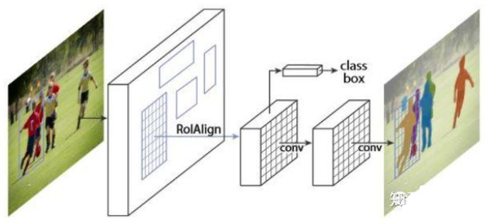

# 1 前言

实例分割（Instance Segmentation）是视觉经典四个任务中相对最难的一个，它既具备语义分割（Semantic Segmentation）的特点，需要做到**像素层面上的分类**，也具备目标检测（Object Detection）的一部分特点，即**需要定位出不同实例，即使它们是同一种类**。可以说实例分割相当于是语义分割与目标检测的结合。因此，实例分割的研究长期以来都有着两条线，分别是自下而上的基于语义分割的方法和自上而下的基于检测的方法，这两种方法都属于两阶段的方法，下面将分别简单介绍。

## 自上而下的实例分割方法

思路是：首先通过目标检测的方法**找出实例所在的区域**（bounding box），再**在检测框内进行语义分割**，每个分割结果都作为一个不同的实例输出。

自上而下的密集实例分割的开山鼻祖是DeepMask，它通过滑动窗口的方法，在每个空间区域上都预测一个mask proposal。这个方法存在以下三个缺点：

- **mask与特征的联系（局部一致性）丢失了**，如DeepMask中使用全连接网络去提取mask
- **特征的提取表示是冗余的**， 如DeepMask对每个前景特征都会去提取一次mask
- **下采样**（使用步长大于1的卷积）导致的位置信息丢失

## 自下而上的实例分割方法

思路是：首先进行像素级别的语义分割，再通过聚类、度量学习等手段区分不同的实例。这种方法虽然保持了更好的低层特征（细节信息和位置信息），但也存在以下缺点：

- 对密集分割的质量要求很高，**会导致非最优的分割**
- **泛化能力较差**，无法应对类别多的复杂场景
- **后处理**方法繁琐

**单阶段实例分割**（Single Shot Instance Segmentation），这方面工作其实也是受到了单阶段目标检测研究的影响，因此也有两种思路，一种是**受one-stage, anchor-based 检测模型如YOLO，RetinaNet启发，代表作有YOLACT和SOLO；一种是受anchor-free检测模型如 FCOS 启发，代表作有PolarMask和AdaptIS。**

# 2 代表性模型介绍

## 2.1 Mask R-CNN （2017.3）

Mask-RCNN是一个两阶段实例分割模型，并且通过增加不同的分支可以完成目标分类，目标检测，语义分割，人体姿态估计等多种任务。对于实例分割来讲，就是**在Faster-RCNN的基础上(分类+回归分支)增加了一个分支用于语义分割**，其抽象结构如下图所示：

可以看到其结构与Faster RCNN非常类似，但有3点主要区别：

- 在基础网络中采用了较为优秀的**ResNet-FPN结构**，多层特征图有利于多尺度物体及小物体的检测。原始的FPN会输出P2、P3、P4与P54个阶段的特征图，但在Mask RCNN中**又增加了一个P6。将P5进行最大值池化即可得到P6，目的是获得更大感受野的特征，该阶段仅仅用在RPN网络中。**

- 提出了RoI Align方法来替代RoI Pooling，原因是**RoI Pooling的取整做法损失了一些精度，而这对于分割任务来说较为致命。**Maks RCNN提出的RoI Align取消了取整操作，而是**保留所有的浮点**，然后通过**双线性插值的方法**获得多个采样点的值，再将多个采样点进行最大值的池化，即可得到该点最终的值。
- 得到感兴趣区域的特征后，在原来分类与回归的基础上，**增加了一个Mask分支来预测每一个像素的类别**。具体实现时，采用了F**CN（Fully Convolutional Network）的网络结构**，利用卷积与反卷积构建端到端的网络，最后对每一个像素分类，实现了较好的分割效果。

**下面是Mask R-CNN算法的主要流程：**

- 首先，将输入图片输入到特征提取网络输出特征图。
- 然后**对特征图的每一个像素位置设定固定个数的ROI（Region of Interest, 在其他模型中被称为Anchor）**，然后将ROI区域送入**RPN网络**进行二分类(前景和背景)以及坐标回归，以获得精炼后的ROI区域。
- 对上个步骤中获得的ROI区域执行论文提出的**ROIAlign操作**，即先将原图和feature map的pixel对应起来，然后将feature map和固定的feature对应起来。
- 最后对这些ROI区域进行多类别分类，候选框回归和引入FCN生成Mask，完成分割任务。

