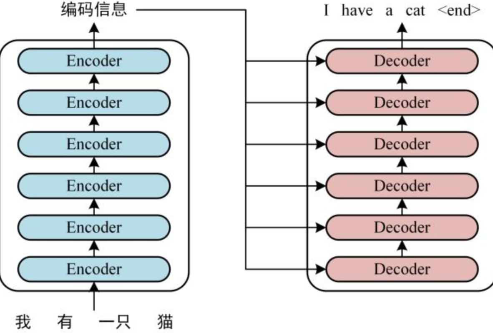
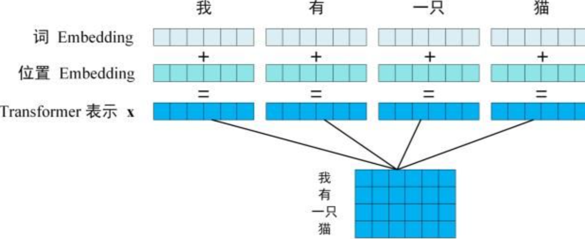
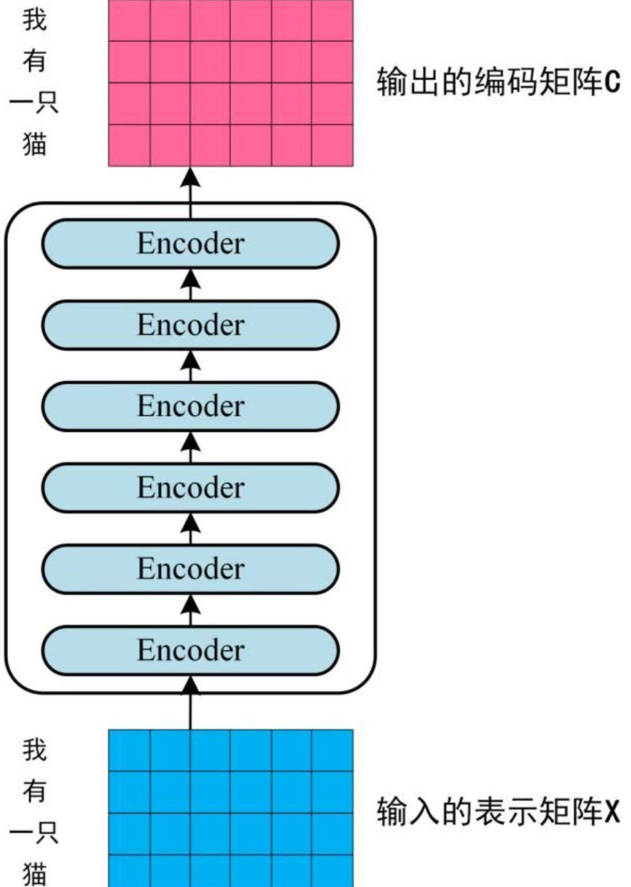
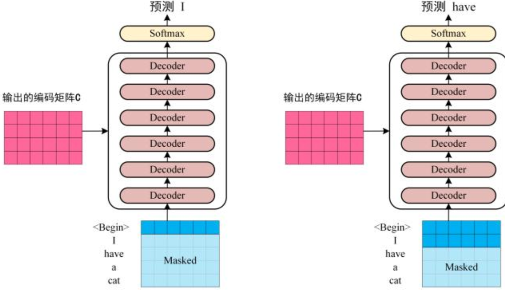
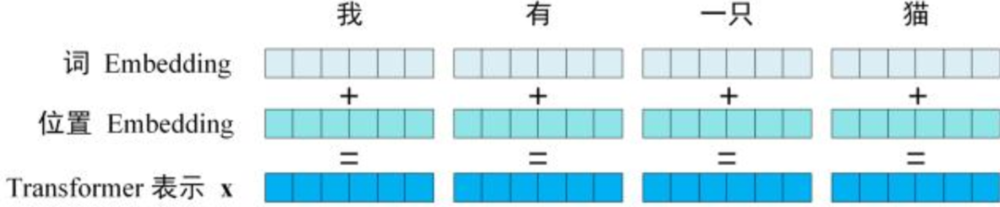
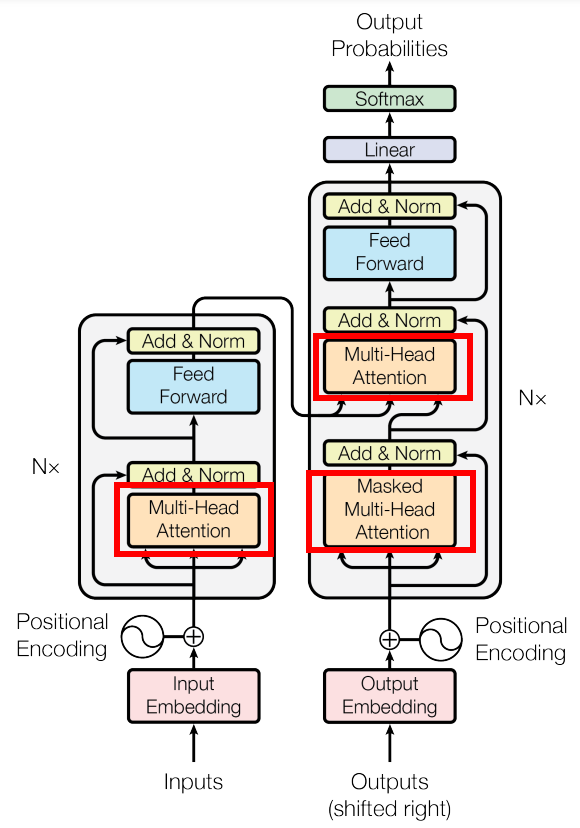
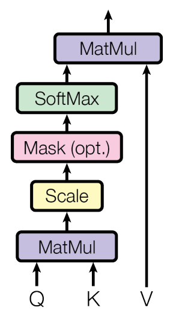
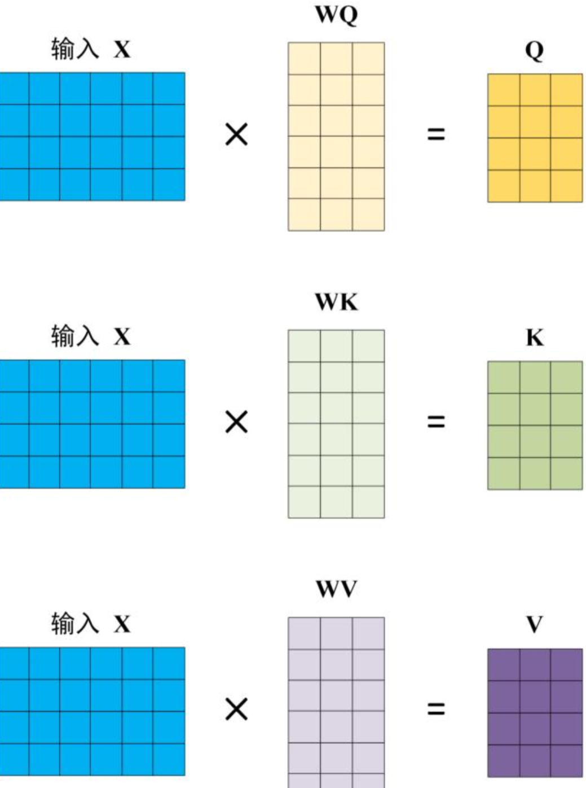

# 前言

Transformer由论文 [*Attention is All You Need*](https://arxiv.org/pdf/1706.03762.pdf) 提出，现在是谷歌云TPU推荐的参考模型。论文相关的Tensorflow的代码可以从GitHub获取，其作为Tensor2Tensor包的一部分。哈佛的NLP团队也实现了一个基于PyTorch的版本，并注释该论文。

# 1 整体结构

首先介绍Transformer的整体结构，下图是Transformer用于中英文翻译时的整体结构

可以看到Transformer由Encoder和Decoder两个部分组成，Encoder和Decoder都是由6个block组成。Transformer的大致工作流程如下：

**第一步**：获取输入句子的每一个单词的表示向量 **X** , **X** 由单词的 Embedding（Embedding就是从原始数据提取出来的Feature） 和单词位置的 Embedding 相加得到。

**第二步**：将得到的单词表示向量矩阵（如上图所示的矩阵，每一行是一个单词的表示 **X**）传入 Encoder 中，经过 6 个 Encoder block 后可以得到句子所有单词的编码信息矩阵 **C**，如下图。单词向量矩阵用 $X_{n \times d}$ 表示， $ n $ 是句子中单词个数， $ d $ 是表示向量的维度 (论文中 d=512)。每一个 Encoder block 输出的矩阵维度与输入完全一致。

**第三步**：将 Encoder 输出的编码信息矩阵 **C** 传递到 Decoder 中，Decoder 依次会根据当前翻译过的单词 $ 1 \to i  $ 翻译下一个单词 $ i + 1 $ ，如下图所示。在使用的过程中，翻译到单词 $ i + 1 $ 的时候需要通过 **Mask (掩盖)** 操作遮盖住 $ i + 1 $ 之后的单词。

上图 Decoder 接收了 Encoder 的编码矩阵 **C**，然后首先输入一个翻译开始符 `<Begin>`，预测第一个单词 `I`；然后输入翻译开始符 `<Begin>` 和单词 `I`，预测单词 `have`，以此类推。这是 Transformer 使用时候的大致流程，接下来是里面各个部分的细节。

# 2 输入

Transformer 中单词的输入表示 **X** 由**单词 Embedding** 和**位置 Embedding** （Positional Encoding）相加得到。

### 2.1 单词 Embedding

它是将输入序列中的每个单词（或标记）转换为一个固定长度的向量表示。这些向量包含了单词的语义信息和上下文关系。在Transformer中，通常使用一个可训练的嵌入矩阵，将每个单词映射为一个向量。单词的 Embedding 有很多种方式可以获取，例如可以采用 Word2Vec、Glove 等算法预训练得到，也可以在 Transformer 中训练得到。

### 2.2 位置 Embedding

由于Transformer没有使用循环结构，无法通过位置顺序来表达句子中单词的顺序信息。为了解决这个问题，Transformer引入了位置编码，用于表示单词在句子中的位置。位置编码是一个固定的向量序列，其维度与单词Embedding的维度相同。位置编码通过一些函数或公式的计算，将位置信息编码为连续向量。Transformer 中除了单词的 Embedding，还需要使用位置 Embedding 表示单词出现在句子中的位置。**因为 Transformer 不采用 RNN 的结构，而是使用全局信息，不能利用单词的顺序信息，而这部分信息对于 NLP 来说非常重要。**所以 Transformer 中使用位置 Embedding 保存单词在序列中的相对或绝对位置。

位置 Embedding 用 **PE**表示，**PE** 的维度与单词 Embedding 是一样的。PE 可以通过训练得到，也可以使用某种公式计算得到。在 Transformer 中采用了后者，计算公式如下：
$$
PE_{(pos, 2i)} = sin (\frac{pos}{10000^{\frac{2i}{d}}}) \\ 
PE_{(pos, 2i + 1)} = cos (\frac{pos}{10000^{\frac{2i}{d}}})
$$
其中，pos 表示单词在句子中的位置， $ d $ 表示 PE 的维度 (与词 Embedding 一样)， $ 2i $ 表示偶数的维度， $ 2i+1 $  表示奇数维度 (即 $2i \le d, 2i + 1 \le d$)。使用这种公式计算 PE 有以下的好处：

- 使 PE 能够适应比训练集里面所有句子更长的句子，假设训练集里面最长的句子是有 20 个单词，突然使用一个长度为 21 的句子进行预测，则使用公式计算的方法可以计算出第 21 位的 Embedding。
- 可以让模型容易地计算出相对位置，对于固定长度的间距 k，**PE(pos+k)** 可以用 **PE(pos)** 计算得到。因为 $sin(A+B) = sin(A)cos(B) + cos(A)sin(B), cos(A+B) = cos(A)cos(B) - sin(A)sin(B) $。

将单词的词 Embedding 和位置 Embedding 相加，就可以得到单词的表示向量 **x**，**x** 就是 Transformer 的输入。

# 3 Self-Attention

上图是论文中 Transformer 的内部结构图，左侧为 Encoder block，右侧为 Decoder block。红色圈中的部分为 **Multi-Head Attention**，是由多个 **Self-Attention**组成的，可以看到 Encoder block 包含一个 Multi-Head Attention，而 Decoder block 包含两个 Multi-Head Attention (其中有一个用到 Masked)。Multi-Head Attention 上方还包括一个 Add & Norm 层，Add 表示残差连接 (Residual Connection) 用于防止网络退化，Norm 表示 Layer Normalization，用于对每一层的激活值进行归一化。

因为 **Self-Attention**是 Transformer 的重点，所以我们重点关注 Multi-Head Attention 以及 Self-Attention，首先详细了解一下 Self-Attention 的内部逻辑。

## 3.1 结构

上图是 Self-Attention 的结构，在计算的时候需要用到矩阵**Q(查询), K(键值), V(值)**。在实际中，Self-Attention 接收的是输入(单词的表示向量x组成的矩阵X) 或者上一个 Encoder block 的输出。而**Q, K, V**正是通过 Self-Attention 的输入进行线性变换得到的。

## 3.2 Q, K, V的计算

Self-Attention 的输入用矩阵X进行表示，则可以使用线性变阵矩阵**WQ, WK, WV**计算得到**Q, K, V**。计算如下图所示，**注意 X, Q, K, V 的每一行都表示一个单词。**

