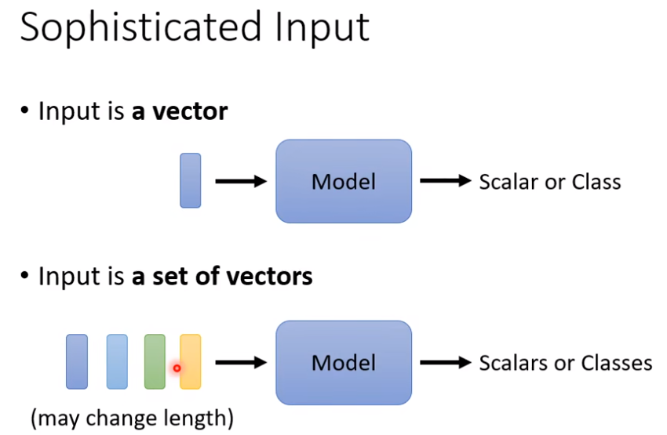
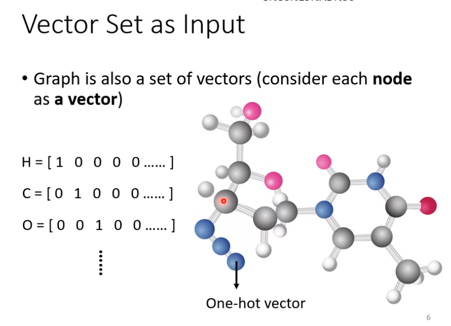
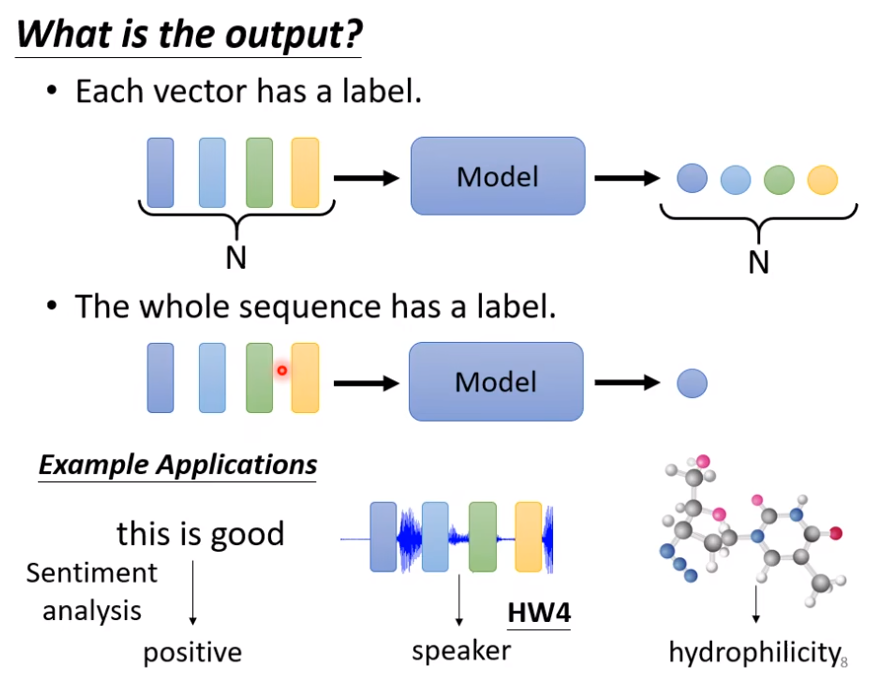
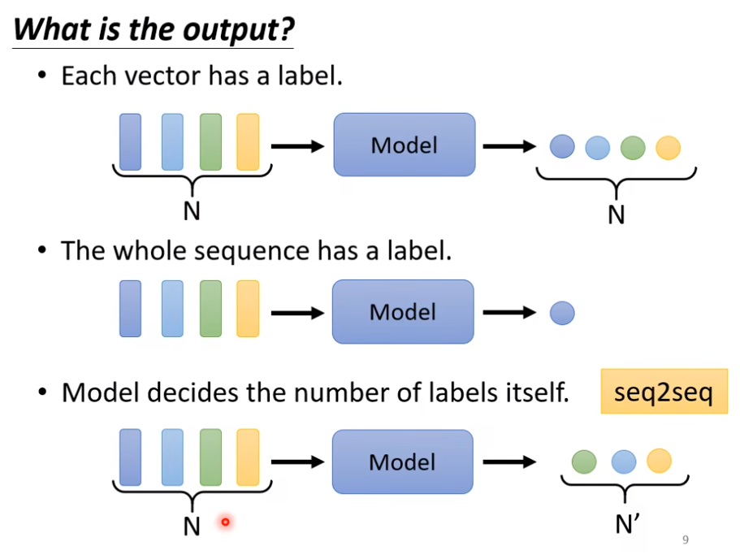
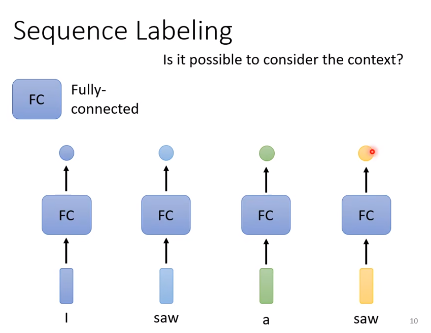

# Self-Attention 

考虑当输入是一系列相关联的向量，并且向量的长度是可改变的情况。

将一个句子的每个单词看做一个向量，为了将单词映射为向量，最简单的方法是使用One-Hot Encoding。 即使用一个很长的向量，长度和现今世界上所有的单词数量一致，每一个维度对应一个单词。但是，这种方法假设所有单词之间是没有关联的，向量里面没有任何语义信息。

第二个方法是Word Embedding， 其中包含语义信息，如果将其中的单词全部画出，会发现相似特征的词汇全部集中在相似的位置。

假设有一段声音信息，将其中25ms取成一个范围，叫做一个window，window内的信息作为一个向量，这个向量称为frame。一秒钟就包含了100个frames，如果是一分钟的声音信号，就包含了6000个frames。

## 三种输出

### （1）每一个输出向量都有一个label

- 例子1：词性分类

- 例子2：单个字母语音识别

- 例子3：人际关系决策

### （2）所有的输出向量是一个label

- 例子1：判断语义的正负性

- 例子2：识别出说话者

- 例子3：预测分子的特性

### （3）输出label数量由机器本身决定

- 例子1：翻译
- 例子2：语音识别

输入输出长度一致的情况，称为Sequence Labeling。不能单单使用FC层，因为会忽略词汇之间的关联性

