# Self-Attention 

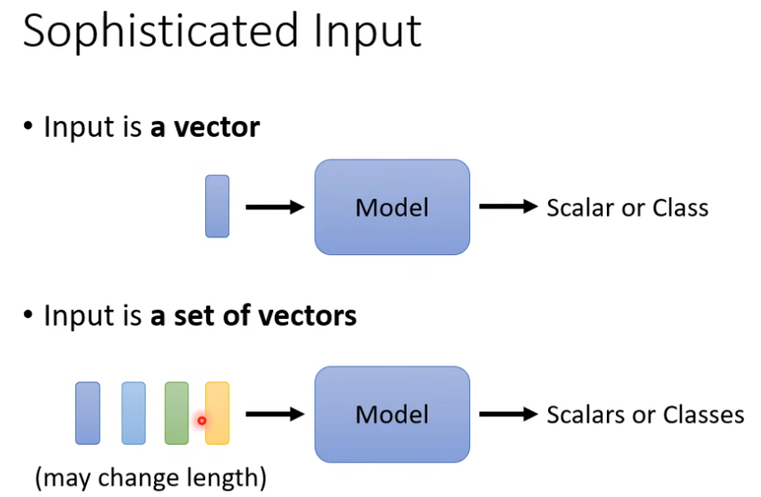

考虑当输入是一系列向量，向量的长度是可改变的情况

将一个句子的每个单词当成是一个向量，将单词映射为向量，最简单的方法是使用One-Hot Encoding， 假设开一个很长的向量，长度和现今世界上所有的单词数量一致，每一个维度对应带一个词汇，但是这种方法假设所有词汇之间是没有关联的，向量里面没有任何语义的信息、

第二个方法是Word Embedding， 其中包含语义信息，如果将其中的单词全部画出，会发现相似特征的词汇全部集中在一块

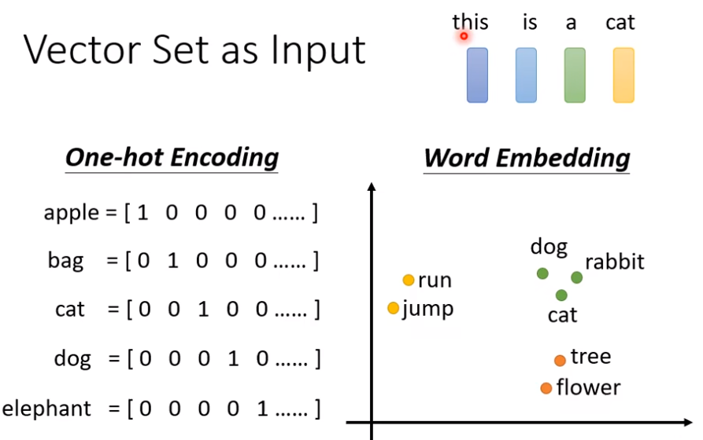

假设有一段声音信息，将其中25ms取成一个范围，叫做window，范围内的信息作为一个向量，这个向量称为frame。如果是一分钟的声音信号，就是100 * 60 就是6000 个信号 

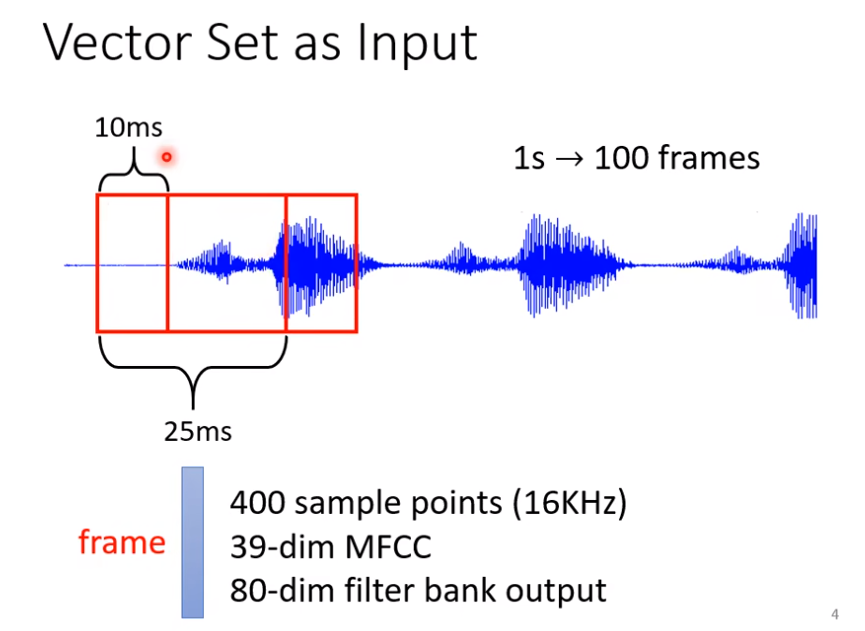

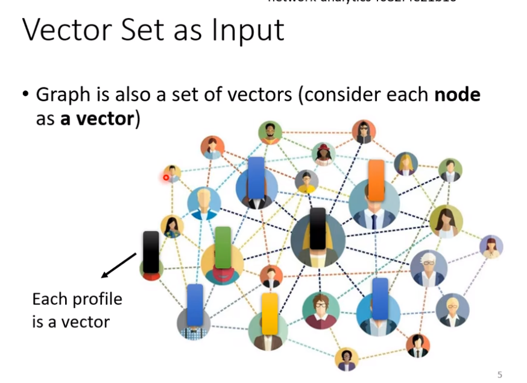

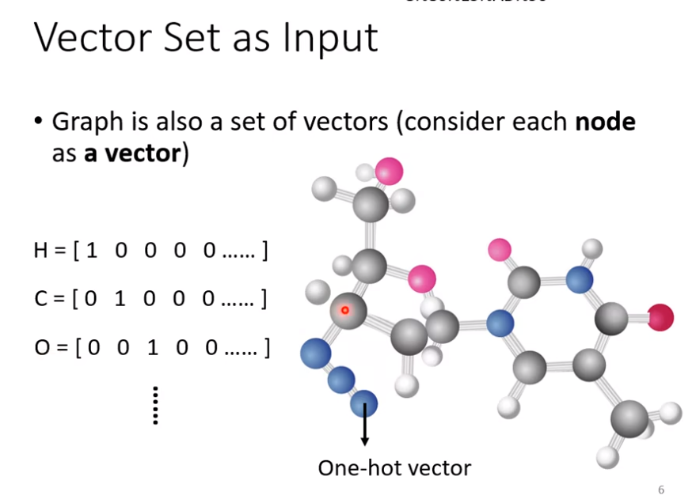

输出是什么

每一个输出向量都有一个label

例子1：词性分类

例子2：单个字母语音识别

例子3：决策

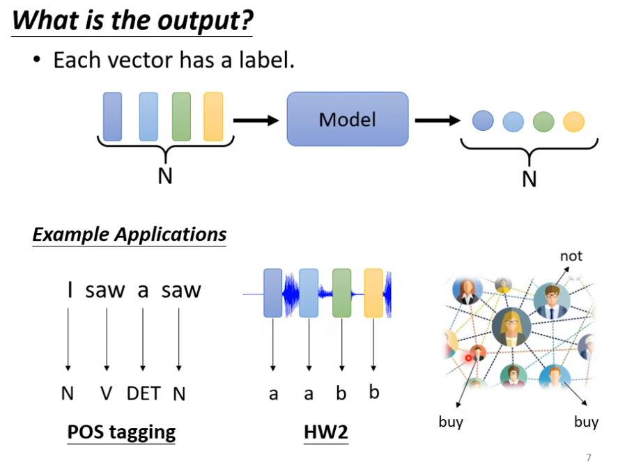

所有的输出向量是一个label：

例子1：判断语句的正负性

例子2：识别出说话者

例子3：预测分子的特性

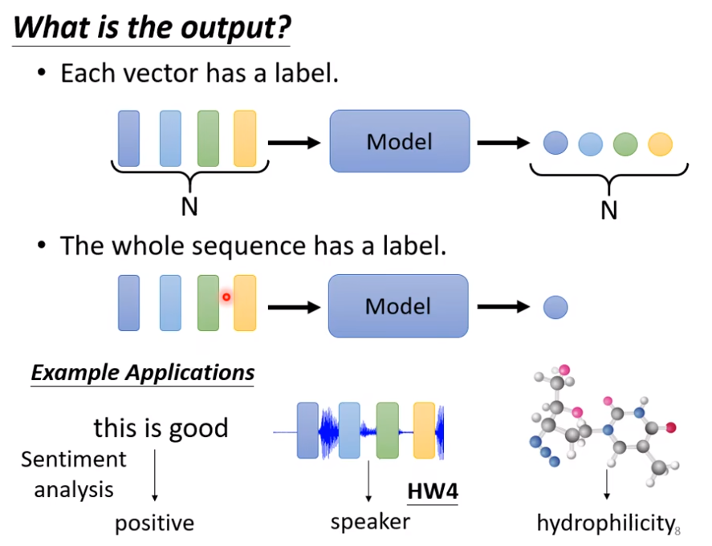

不知道应该输出多少个label，由任务本身决定

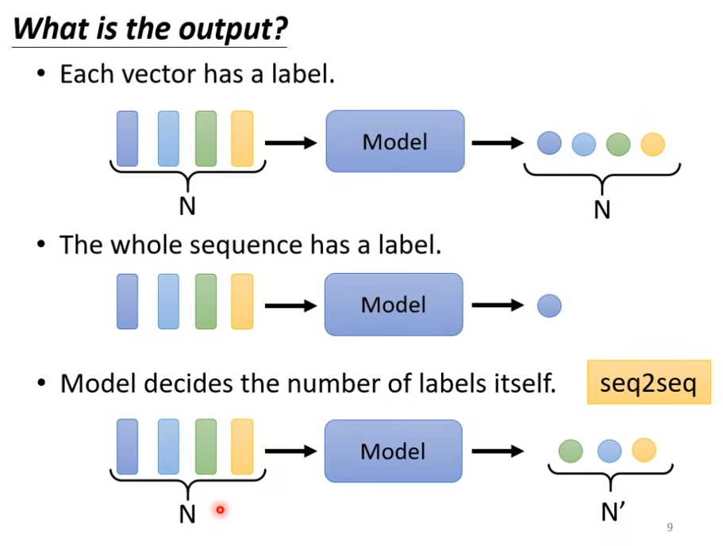

比如说翻译和语音识别

输入输出一样多的情况，成为Sequence Labeling

不能单单使用FC层，因为会忽略词汇之间的关联性：

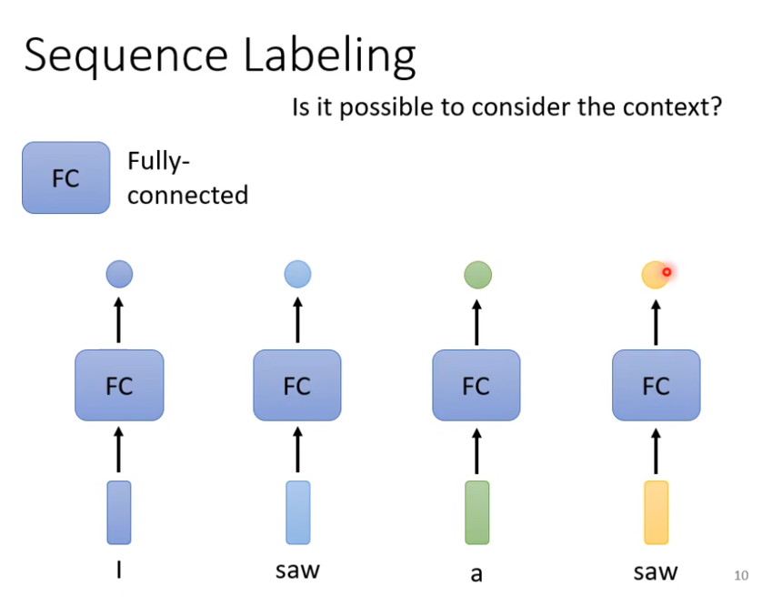

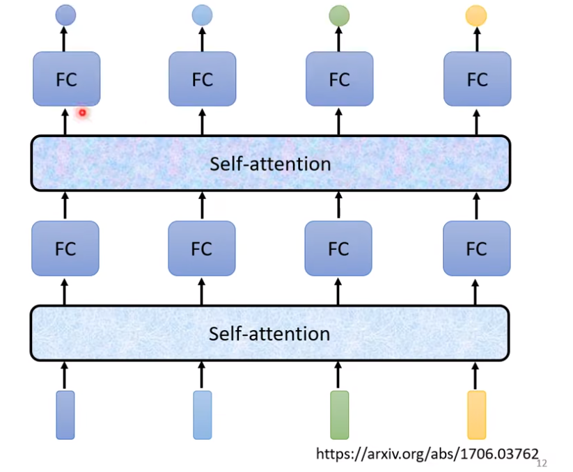

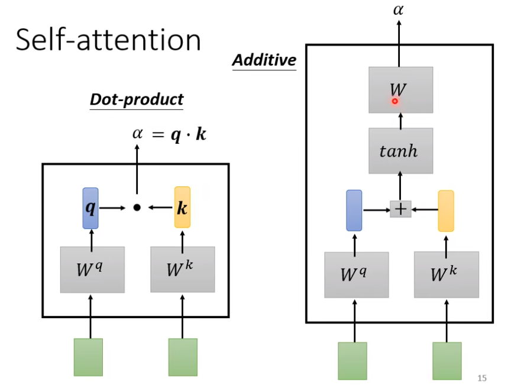

当输出向量的长度是由机器自行决定的时候，例如夏敏的例子：

语音识别的例子：输入的是声音信号，无法从开始就判断输出的长度，应该由机器来判断

翻译的例子

翻译时两种语言的句子长度不一致，需要机器来自行判断：

甚至有的语言没有文字，只能只用语音翻译，直接将其翻译为特定的语言

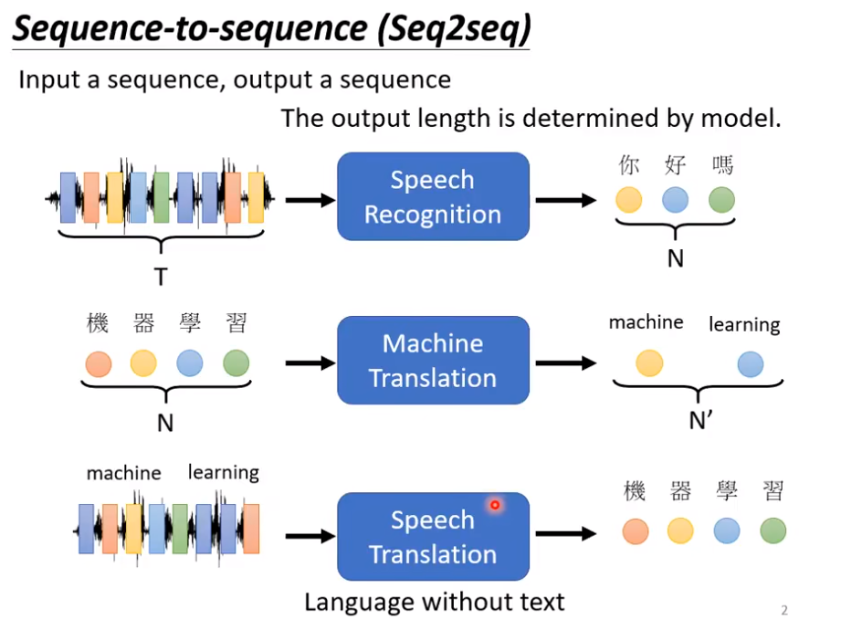

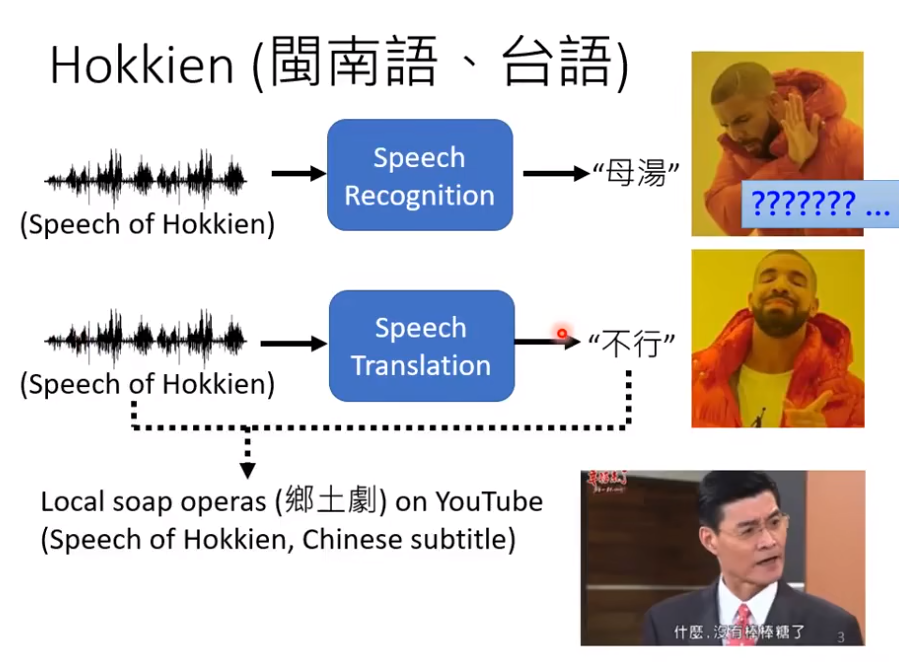

输入闽南语的语音资料，输出的事普通话的汉语，

有时翻译时需要倒装，在此情况下，学习就比较困难

为不同的任务客制化不同的seq2seq模型，会达到更好的效果

