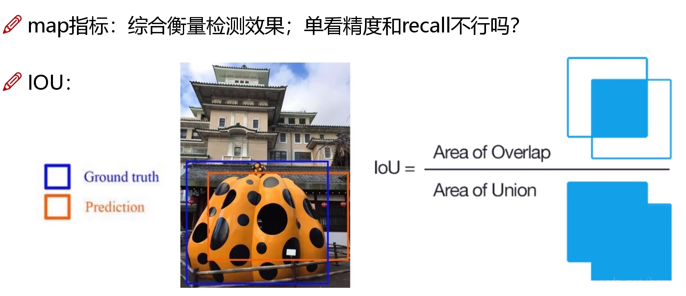
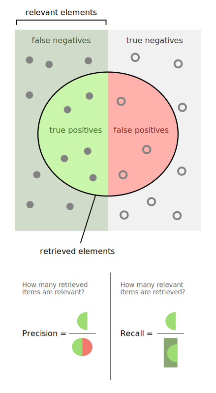
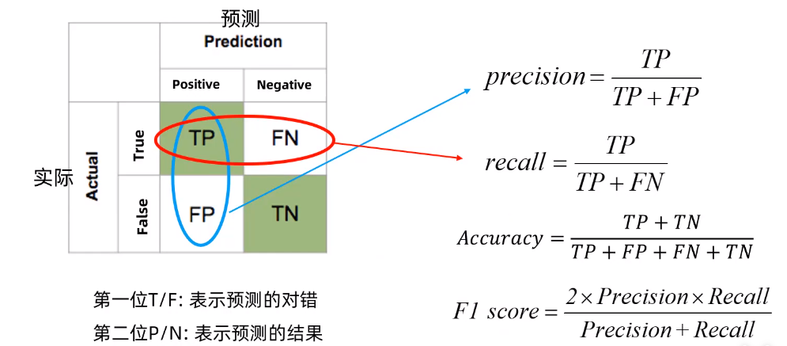
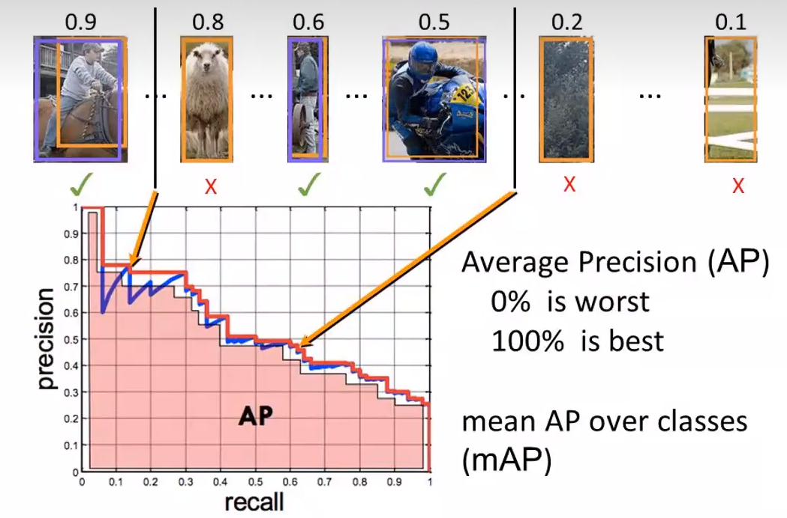
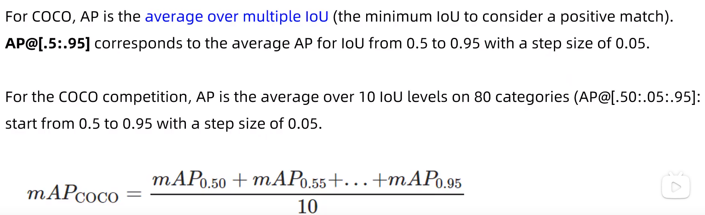
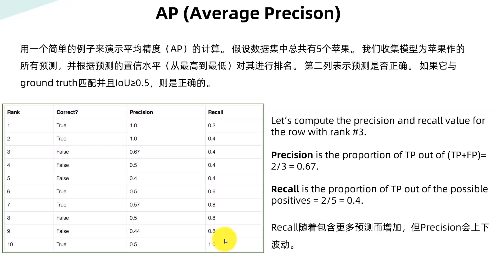
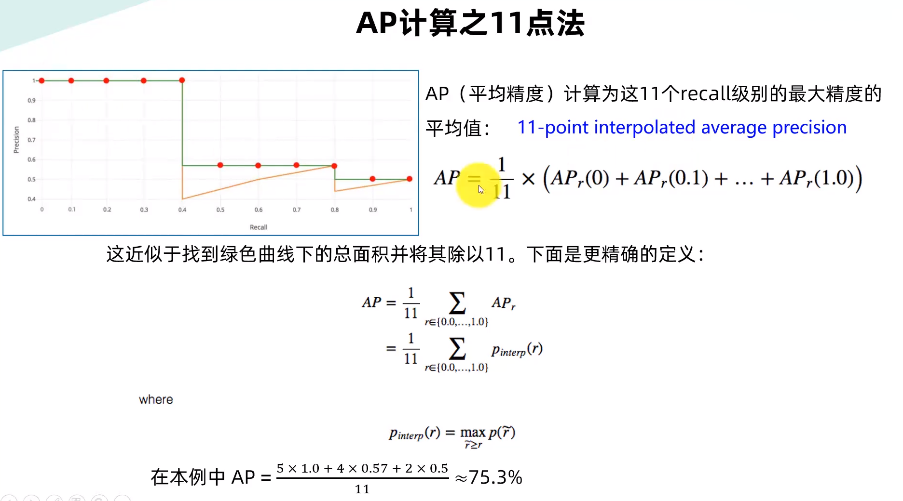

# 1 任务说明

定位和检测：

- 定位：找到检测图像中带有一个给定标签的**单个目标**
- 检测：找到图像中带有给定标签的**所有目标**

得出类别标签和置信度得分

# 2 数据集

- PASCAL VOC

PASCAL VOC 2012有11530张图像，27450个标注，20个类别。

 

- MS COCO

20万个图像，50万个标注，80个类别。

# 3 性能指标与检测精度

## 3.1 检测精度

- Precision, Recall, F1 score
- IoU (Intersection over Union)
- P-R curve (Precision-Recall curse)
- AP (Average Precision)
- mAP (mean Average Precision)

## 3.2 检测速度

- 前传还是
- FPS
- 浮点运算量（FLOPS）

# 4 深度学习经典检测方法

- One-Stage（单阶段）：YOLO系列

一个CNN做回归任务，直接给出预测结果

- Two-Stage（两阶段）：Faster-RCNN、Mask-RCNN系列

加入一个RPN（区域建议网络），多了预选框（Proposal）

## 4.1 优缺点

### 4.1.1 单阶段

速度快，适合做实时目标检测

但是效果不太好

### 4.1.2 两阶段

速度慢，Mask-RCNN论文给出的速度是5FPS

## 4.2 IoU

IoU越大，意味着预测越准确。可以设置一个阈值，比如是0.5：

- 如果 IoU > 0.5, 就将其设置为Ture Positive（TP） 
- 如果 IoU < 0.5, 就将其设置为False Postitive（FP）

- 当图片中有一个ground truth，但是网络没有检测到的话，就把它标记为False Negative（FN）

- 任何一个没有检测为物体的部分，是True Negative（TN），但是在目标检测中没有作用，所以忽略它

指标分析：

- 理解成：(True/False)地把它判断成了(Positive/Negative)

### 4.2.1 混淆矩阵

- 精度Precision（查准率）是评估预测的准不准（看预测列）
- 召回率Recall（查全率）是评估找的全不全（看预测行）

## 4.3 AP与mAP

AP衡量的是学习出来的模型在每个类别上的好坏。

mAP衡量出来的是模型在所有类别上的好坏，mAP就是所有类别上AP的均值。

AP在不同数据集的规则：

- 对于PASCAL VOC，如果IoU大于0.5，就视为正样本（TP）。但是，如果检测到同一目标的多个检测，则视第一个目标为正样本（TP），其余目标位负样本（FP）

在COCO数据集中：

AP@.50 meas the AP with IoU=0.50.

AP@.75 meas the AP with IoU=0.75.

$$AP_S$$代表大物体的精度 

$$AP_M$$代表中等大小的物体的精度

$$AP_{S}$$代表小物体的精度 

