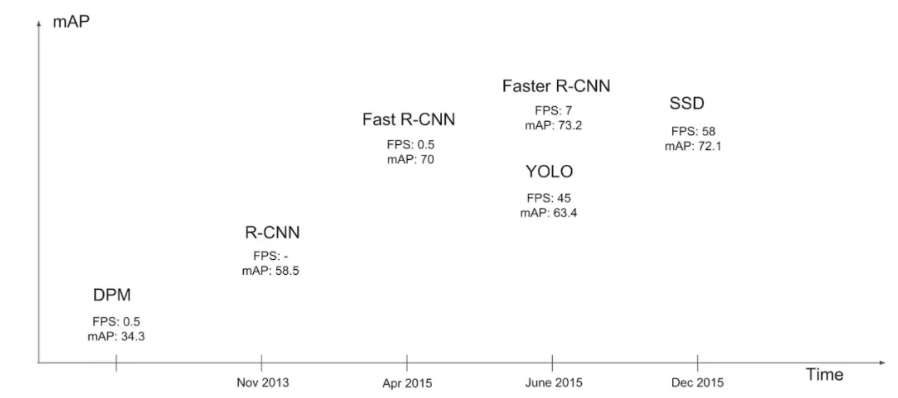
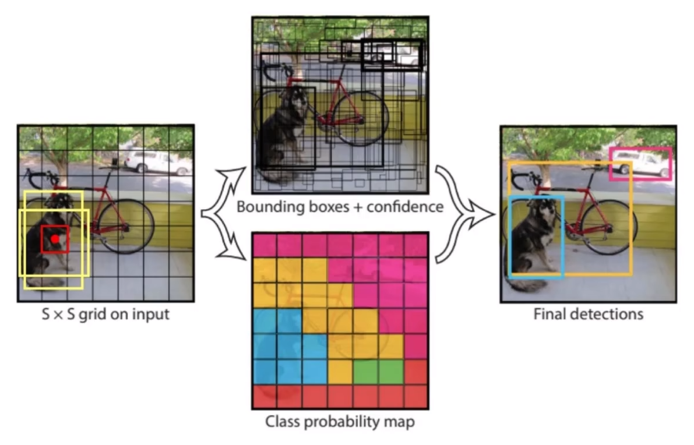
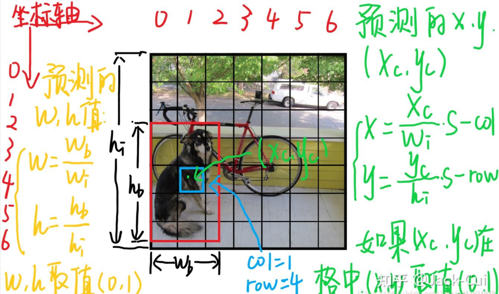
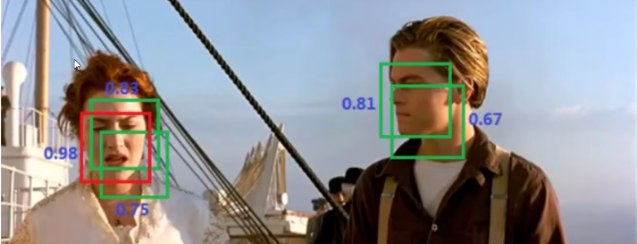

# YOLOv1

- 经典的One-Stage方法

- 把检测问题转化为回归问题

- 可以对视频进行实时检测，应用领域广

    

## 核心思想

- 首先，对于 $$s \times s$$ 的输入，将其分成多个网格
- 每个网格预测它所代表的物体 
- 黄色框是预先得出的两种框，框的长款比列是由经验得出的
- 训练过程中对框的坐标等进行调整，此时该任务成为回归任务
- 计算每个候选框对真实值的 $$IoU$$
- 将得出的 $$x, y, w, h$$ 以及置信度映射到原始图像

> 1. 将输入图像分割为S×S个网格。
> 2. 每个网格预测B个边界框和这些边界框的置信度。
> 3. 每个网格预测C个条件类别概率。
> 4. 计算每个边界框的类别置信度。
> 5. 通过阈值处理和非极大值抑制（NMS）来产生最终的检测结果。

## 网络架构

>  最后输出的大小是 $$7 \times 7 \times 30$$，其中的含义：
>
>  $$7*7$$ 代表最开始划分的每个网格的大小，每个网格还包含了30个值。
>
>  前5个值，代表第一个框$$B_{1}$$的 $$x, y, w, h$$ 以及置信度。
>
>  接下来5个值，代表第二个框$$B_{2}$$的 $$x, y, w, h$$ 以及置信度。
>
>  接下来20个值，代表每个类的概率，一共有20个类。
>
>  至于如何实现这样的输出，是由神经网络在学习过程中逐渐学会这样的规则  。

- **$$(x, y)$$ 是BBox的中心相对于对于单元格的offset**

对于下图中蓝色框的单元格坐标为 $ (x_{col} = 1, \  y_{row}=4) $，假设它预测的是红色的BBox，假设红色BBox的中心坐标为  $(x_{c}, \  y_{c})$，那么最终预测出的 $(x, y)$ 是经过归一化处理的，表示的是中心相对于单元格的offset，计算公示如下：

$x = \frac{x_{c}}{w_i}S - x_{col}, \ y = \frac{y_c}{h_i}S - y_{row}$

- **$(w, h)$ 是BBox相对于整个图片的比例**

 预测的BBox的宽和高为 $(w_b, h_b)$, $(w, h)$ 表示的是BBox相对于整个图片的占比，计算公式如下：

$w = \frac{w_b}{w_i}, h = \frac{h_b}{h_i}$

- confidence

这个置信度由两部分组成，一部分是格子内是否有目标，而是BBox的准确度。定义为置信度 $P_{r}(Object) \times IOU_{pred}^{truth}$ .

如果BBox内有物体，则 $P_r(Object) = 1$ , 此时置信度等于IOU；如果BBox内没有物体，则 $P_r(Object) = 0$， 此时置信度为0。

- C类的条件概率

条件概率定义为 $P_r(Class_i\ | \ Object)$，表示该单元格存在物体且属于第 $i$ 类的概率。

在测试时，每个单元格预测最终输出的概率定义为：

$P_r(Class_i\ |\ Object) \times P_r(Object) \times IOU_{pred}^{truth} = P_r(Class_i) \times IOU_{pred}^{truth}$

## 损失函数

## NMS

有重叠的检测框时使用最大值

## 存在的问题

1. 每个网格只能预测一个类别，导致难以检测重叠的物体
2. 难以检测到小物体
3. 长宽比的选择单一

