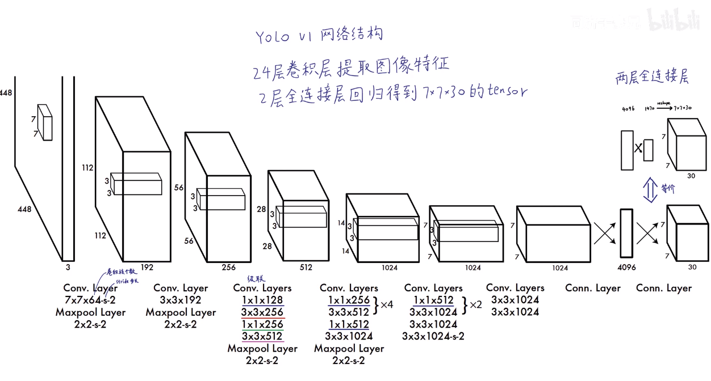
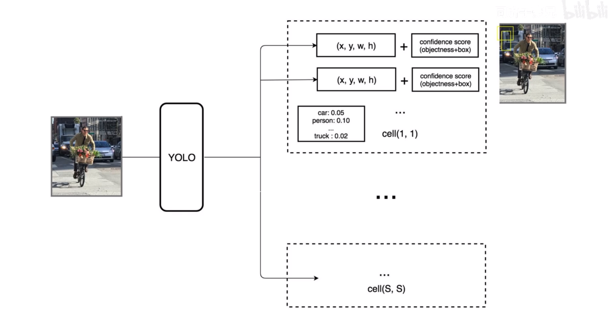
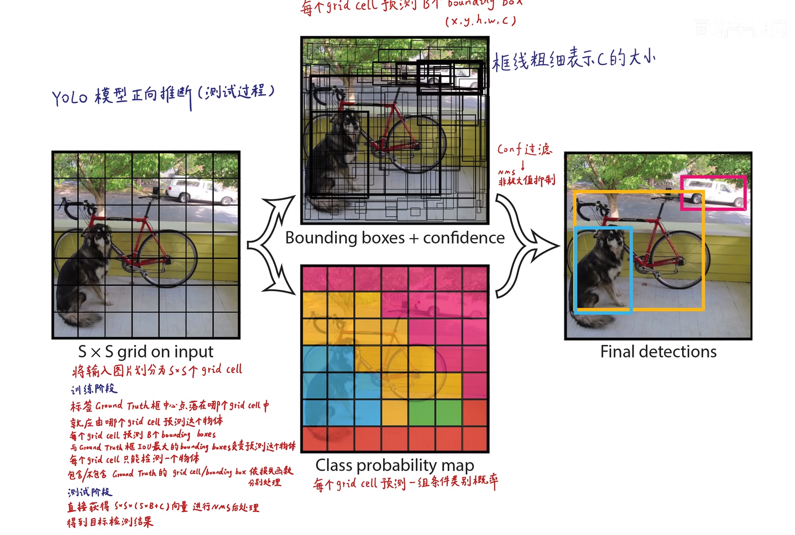
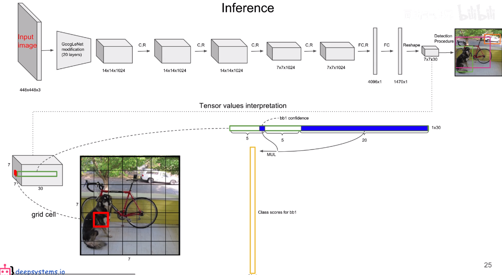
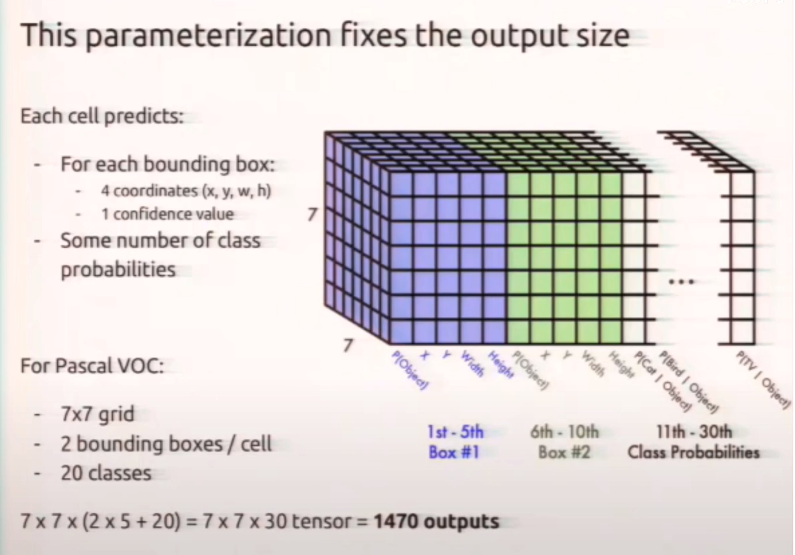
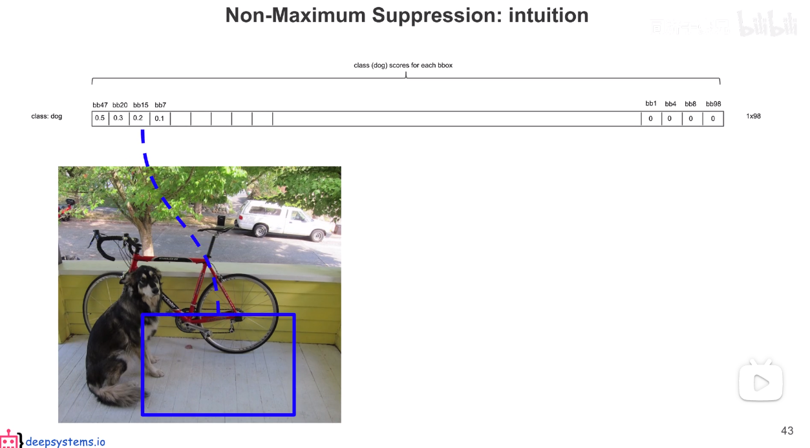
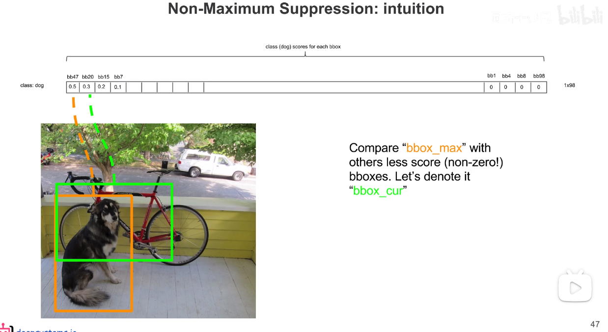
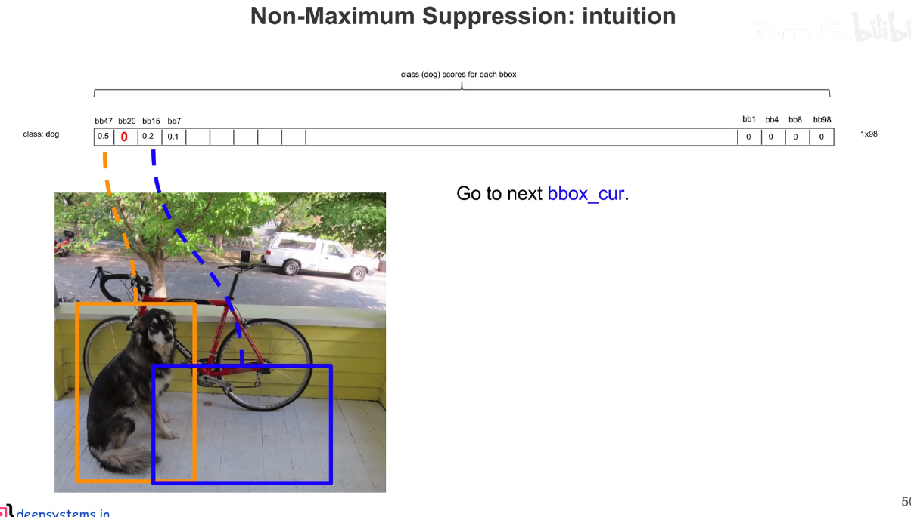
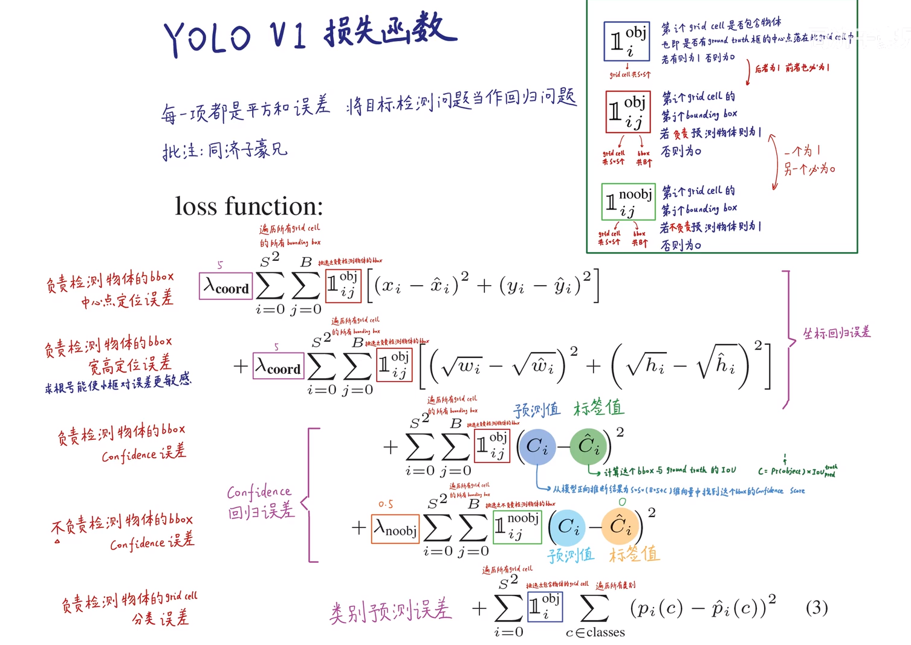

## YOLO(You Only Look Once)

前言：YOLO系列是基于深度学习的回归方法(预测物体的位置)。

**YOLO v.s Faster R-CNN**

1. 统一网络：YOLO没有显式求解region proposal的过程。Faster R-CNN中尽管RPN与fast rcnn共享卷积层，但是在模型训练过程中，需要反复训练RPN网络和fast rcnn网络。相对于R-CNN系列。总之，相对于R-CNN系列的“看两眼”（候选框提取与分类），YOLO只需要Look Once。
2. YOLO统一为一个一个回归问题，而R-CNN将检测结果分为两部分求解：物体位置即bounding box（回归问题）和物体类别（分类问题）。

------

## YOLOv1

### 1. 核心思想

将整张图片作为网络的输入（类似于Fast-RCNN），直接在输出层对BBox的位置和类别进行回归。

- Resize image：将输入图片resize到448x448。
- Run ConvNet：使用CNN提取特征，FC层输出分类和回归结果。
- Non-max Suppression：非极大值抑制筛选出最终的结果。

### 2. 预测阶段（前向推断）

首先将输入图片分成S × S个网格（grid cell），如果某个object的中心落在这个网格中，则这个网格就负责预测这个object。

- 每个网格需要预测B个BBox的位置信息和confidence（置信度），一个BBox对于着**四个位置信息** $(x,y,w,h)$ **和一个confidence信息**。
- 每个网格会预测出B个BBox的位置信息，每个BBox需要 $(x,y,w,h)$ 来表示其位置。其中 $(x, y)$ 是BBox中心点的位置，$ (w, h) $是BBox的宽和高，这是相对于整张图片的。$(x,y,w,h)$ 都要相对于单元格归一化到 0~1 之间。例如图片的宽为width,高为height，BBox中心落在的网格坐标为 $(x_0, y_0)$，则BBox的]实际坐标为

$$
\frac{x}{(Width / S)} - x_0 \\

\frac{y}{(Width / S)} - y_0 \\

\frac{w}{width} \\

\frac{h}{height} \\
$$

- 每一个置信度confidence包含两个方面，一是该边界框含有目标的可能性大小，二是该边界框的准确度。前者记为 $Pr(Object)$，当该边界框是背景时（即不包含目标），此时 $Pr(Object) =  0 $；当该边界框包含目标时，  $Pr(Object) = 1 $。后者即边界框的准确度可以用**预测框与实际框（ground truth）的 IOU**（intersection over union，交并比）来表征，记为 $IOU_{pred}^{truth}$.
    $$
    confidence = Pr(object)*IOU^{truth}_{pred} \\
    $$

- 每个网格要预测B个bounding box还要预测**C个categories**。输出就是 $S \times S \times(5*B+C)$ 的一个tensor。
- C个categories表征的是由该单元格负责预测的两个边界框中的目标属于各个类别的概率，即 $Pr(class_i|object) $, 也就是说**不管一个单元格预测多少个边界框，该单元格只预测一组类别概率值。**
- 对于每个bounding box的 class-specific confidence score:

$$
Pr(class_i|object)*confidence=\\Pr(object)*IOU^{truth}_{pred}=Pr(class_i)*IOU^{truth}_{pred} \\
$$

- 得到每个box的class-specific confidence score以后，设置**阈值**，滤掉得分低的BBox，对保留的BBox进行**NMS处理**，就得到最终的检测结果。阈值处理：去除掉大部分不含预测物体的背景框 NMS处理：去除掉多余的bounding box，防止重复预测同一物体。

输出大小 $$7 \times 7 \times 30$$ 的含义

一个30维的向量就是一个Grid Cell的信息，总共有 $ 7 \times 7 $ 个Grid Cell，所以大小是 $$7 \times 7 \times 30$$.

- $$7 \times 7$$ 代表每个Gird Cell的大小

- 30中的前5个值，代表第一个BBox $$B_{1}$$ 的 $$x, y, w, h$$ 以及置信度$c$

- 接下来5个值，代表第二个BBox $$B_{2}$$ 的 $$x, y, w, h$$ 以及置信度$c$

- 接下来20个值，代表每个类的条件概率，一共有20个类。条件概率表示在包含物体的情况下是这个类的概率

- 置信度乘以条件概率才是真正这个类别的概率

### 3. 预测阶段后处理流程

- NMS操作流程

（1）对于**每一类**，首先把所有 $score<thresh1 $ 的bb(bbox)的score设为0

（2）将所有的bb对于每一类按照得分排序，选中最高分及其对应的bb

（3）遍历其余的bb，如果和当前最高分bb的重叠面积(IoU)大于一定的阀值，便将该bb删除(score置0)

（4）从**未处理的bb**中继续选择一个最高分的bb，重复上述过程

（5）重复上述过程，直到找到全部保留的bb，再进行下一个类别的bb处理

（6）然后根据所有保留bb的class score和class color画出最后的预测结果

### 4. 训练阶段（反向传播）

以YOLOv1定义的网络参数进行说明，在PASCAL VOC中，图像输入为448x448，取S=7，B=2，一共有20个类别(C=20)。则输出就是7x7x30的一个tensor。整个网络结构如下图所示：

借鉴了GoogleLeNet设计，共包含24个卷积层，2个全链接层（前20层中用1×1 reduction layers 紧跟 3×3 convolutional layers 取代GoogleLeNet的 inception modules）。

每个单元格对应输出30维的向量，网格周边的信息也会被识别和整理，最后编码到那个30维向量中。

**loss函数**——是通过ground truth和输出之间的sum-squared error进行计算的，所以相当于把分类问题也当成回归问题来计算loss
$$
\begin{gathered} \lambda_{\text {coord }} \sum_{i=0}^{S^{2}} \sum_{j=0}^{B} \mathbb{1}_{i j}^{\text {obj }}\left[\left(x_{i}-\hat{x}_{i}\right)^{2}+\left(y_{i}-\hat{y}_{i}\right)^{2}\right] \\ +\lambda_{\text {coord }} \sum_{i=0}^{S^{2}} \sum_{j=0}^{B} \mathbb{1}_{i j}^{\text {obj }}\left[\left(\sqrt{w_{i}}-\sqrt{\hat{w}_{i}}\right)^{2}+\left(\sqrt{h_{i}}-\sqrt{\hat{h}_{i}}\right)^{2}\right] \\ +\sum_{i=0}^{S^{2}} \sum_{j=0}^{B} \mathbb{1}_{i j}^{\text {obj }}\left(C_{i}-\hat{C}_{i}\right)^{2} \\ +\lambda_{\text {noobj }} \sum_{i=0}^{S^{2}} \sum_{j=0}^{B} \mathbb{1}_{i j}^{\text {noobj }}\left(C_{i}-\hat{C}_{i}\right)^{2} \\ +\sum_{i=0}^{S^{2}} \mathbb{1}_{i}^{\text {obj }} \sum_{c \in \text { classes }}\left(p_{i}(c)-\hat{p}_{i}(c)\right)^{2} \end{gathered} \\
$$

包含三部分：

- 位置误差

计算BBox和对应的ground truth box（人工标注）之间的sum-squared error。

需要注意的是并不是所有的BBox都参与loss的计算，首先必须是**第i个单元格中存在object，并且该单元格中的第j个BBox和ground truth box有最大的IoU值**,那么这个BBox才参与计算，其他不满足的BBox不参与。也就是说只有预测正确的BBox才贡献这部分误差。

对不同大小的box预测中，相比于大box预测偏一点，小box预测偏一点肯定更不能被忍受的。所以采用 \sqrt{w} 和 \sqrt{h} ,以此减弱大小框的影响

- 置信度误差

分两种情况，一是有object的单元格的置信度计算，另一种是没有object的单元格的置信度计算。两种情况都是单元格中所有的BBox都参与计算。

对于有object的单元格中的BBox**置信度 confidence=\hat{C}i=1\*IOU^{truth}{pred}** ,需要注意的是这个IOU是在训练过程中不断计算出来的，因为网络在训练过程中每次预测的BBox是变化的，所以BBox和ground truth计算出来的IOU每次也会不一样。

对于没有obeject的单元格中的BBox置信度 confidence=\hat{C}i=1*IOU^{truth}{pred}=0

- 分类误差

当作回归误差来计算，使用sum-squared error来计算分类误差，需要注意的是**只有包含object的单元格才参与分类loss的计算**，即有object中心点落入的单元格才进行分类loss的计算，而这个单元格的ground truth label就是该物体的label。

总结起来就是：

- 对于有object的cell，那么计算cell的分类误差，然后cell中两个BBox的置信度误差（$ \hat{C}i=1*IOU^{truth}{pred} $），然后cell中和ground truth box的IoU最大的BBox的位置误差。

$$
分类误差=\sum_{i=0}^{S^{2}} \mathbb{1}_{i}^{\text {obj }} \sum_{c \in \text { classes }}\left(p_{i}(c)-\hat{p}_{i}(c)\right)^{2} \\置信度误差= \sum_{i=0}^{S^{2}} \sum_{j=0}^{B} \mathbb{1}_{i j}^{\text {obj }}\left(C_{i}-\hat{C}_{i}\right)^{2} \\

位置误差= \lambda_{\text {coord }} \sum_{i=0}^{S^{2}} \sum_{j=0}^{B} \mathbb{1}_{i j}^{\text {obj }}\left[\left(x_{i}-\hat{x}_{i}\right)^{2}+\left(y_{i}-\hat{y}_{i}\right)^{2}\right] \\ +\lambda_{\text {coord }} \sum_{i=0}^{S^{2}} \sum_{j=0}^{B} \mathbb{1}_{i j}^{\text {obj }}\left[\left(\sqrt{w_{i}}-\sqrt{\hat{w}_{i}}\right)^{2}+\left(\sqrt{h_{i}}-\sqrt{\hat{h}_{i}}\right)^{2}\right] \\ \\
$$

- 对于没有object的cell，那就只计算cell中两个BBox的置信度误差( $\hat{C}i=0*IOU^{truth}{pred}=0 $）。

$$
置信度误差=\lambda_{\text {noobj }} \sum_{i=0}^{S^{2}} \sum_{j=0}^{B} \mathbb{1}_{i j}^{\text {noobj }}\left(C_{i}-\hat{C}_{i}\right)^{2} \\
$$

### 5. 优缺点

**优点**

- 快速，pipline简单。
- 背景误检率低。
- 通用性强。YOLO对于艺术类作品中的物体检测同样适用。它对非自然图像物体的检测率远远高于DPM和RCNN系列检测方法。

**缺点**

- **预测阶段输入图片尺寸限制**。由于输出层为全连接层，因此在检测时，YOLO训练模型只支持与训练图像相同分辨率的输入图片。
- **群体检测困难**。虽然每个格子可以预测B个bounding box，但是最终只选择只选择IOU最高的bounding box作为物体检测输出，即**每个格子最多只预测出一个物体**。当物体占画面比例较小，如图像中包含畜群或鸟群时，每个格子包含多个物体，但却只能检测出其中一个。这是YOLO方法的一个缺陷。
- **小物体检测困难** ,YOLO loss函数中，大物体IOU误差和小物体IOU误差对网络训练中loss贡献值接近（虽然采用求平方根方式，但没有根本解决问题）。因此，对于小物体，小的IOU误差也会对网络优化过程造成很大的影响，从而降低了物体检测的定位准确性。
