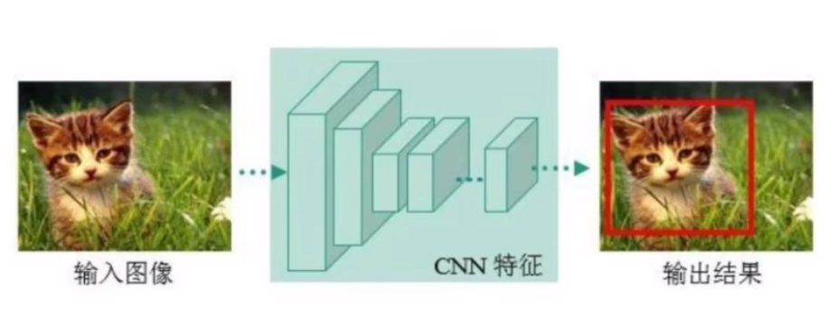
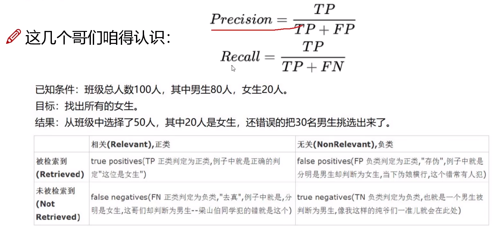
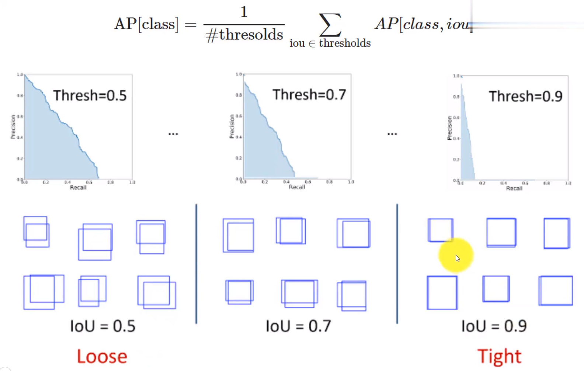

# 1 目标检测任务说明

定位和检测：

- 定位：找到检测图像中带有一个给定标签的**单个目标**
- 检测：找到图像中带有给定标签的**所有目标**

得出类别标签和置信度得分。

# 2 数据集

- PASCAL VOC

PASCAL VOC 2012有11530张图像，27450个标注，20个类别。

- MS COCO

20万个图像，50万个标注，80个类别。

# 3 性能指标与检测精度

## 3.1 检测精度

- Precision, Recall, F1 score
- IoU (Intersection over Union)
- P-R curve (Precision-Recall curse)
- AP (Average Precision)
- mAP (mean Average Precision)

F1分数（F1 Score）是用于评估二分类和多分类问题模型精确度的一个指标。它是精确度（Precision）和召回率（Recall）的调和平均，可以同时表示模型的精确性和召回率。$F1 = 2 \times \frac{Precision \times Recall} {Precision + Recall}$

P-R曲线（Precision-Recall Curve）是一种用于评估二分类问题和信息检索任务中模型效果的可视化工具。P-R曲线的横坐标是召回率（Recall），纵坐标是精确率（Precision）。P-R曲线下的面积（Area Under Curve，AUC）也被用来评估模型的性能，该值越大，说明模型的性能越好。

## 3.2 检测速度

- FPS
- 浮点运算量（FLOPS）

# 4 深度学习经典检测方法

One-Stage（单阶段）检测器：YOLO系列

这种检测器的特点是，只使用一个CNN做回归任务，网络直接给出预测结果。

Two-Stage（两阶段）：Faster-RCNN、Mask-RCNN系列

除了CNN之外，还会加入一个RPN（区域建议网络），还有预选框（Proposal）。

## 4.1 优缺点

单阶段检测器：速度快，适合做实时目标检测。但是一般来说精度和召回率较低。

两阶段检测器：速度慢，例如Mask-RCNN论文给出的速度仅仅只有5FPS。但是精度和召回率较高。

## 4.2 指标分析

### 4.2.1 IoU

IoU越大，意味着预测越准确。可以设置一个阈值，比如是0.5：

- 如果 IoU > 0.5, 就将其设置为Ture Positive（TP） 
- 如果 IoU < 0.5, 就将其设置为False Postitive（FP）

- 当图片中有一个ground truth，但是网络没有检测到的话，就把它标记为False Negative（FN）

- 任何一个没有检测为物体的部分，是True Negative（TN），但是在目标检测中没有作用，所以忽略它

### 4.2.2 TP/FP/TN/FN

- 理解成：(True/False)地把它判断成了(Positive/Negative)

### 4.2.3 混淆矩阵

- 精度Precision（查准率）是评估预测的准不准（看预测列）
- 召回率Recall（查全率）是评估找的全不全（看预测行）

### 4.2.4 AP与mAP

AP衡量的是学习出来的模型在每个类别上的好坏；mAP衡量出来的是模型在所有类别上的好坏，mAP就是所有类别上AP的均值。

AP在不同数据集的规则：

- 对于PASCAL VOC，如果IoU大于0.5，就视为正样本（TP）。但是，如果检测到同一目标的多个检测，则视第一个目标为正样本（TP），其余目标位负样本（FP）

在COCO数据集中：

AP@.50 meas the AP with IoU=0.50.

AP@.75 meas the AP with IoU=0.75.

- $$AP_S$$代表大物体的精度 

- $$AP_M$$代表中等大小的物体的精度

- $$AP_{S}$$代表小物体的精度 

