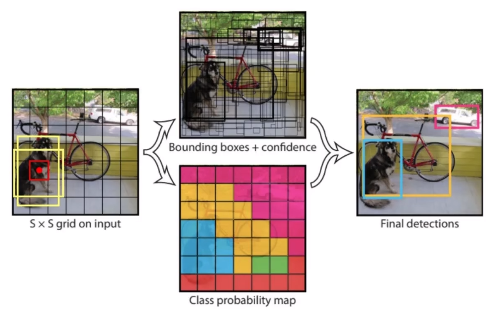
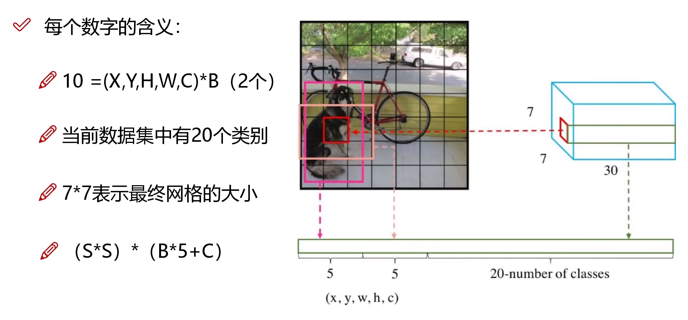

# YOLOv1 前言

- 经典的One-Stage方法

- 把检测问题转化为回归问题

- 速度快，可以对视频进行实时检测，应用领域广

    

# 1 核心思想

1. 将输入图像分割为 $ s \times s $ 个网格。
2. 每个网格预测B个边界框和这些边界框的置信度。通常 $B=2$，框的大小是由经验得出的。
3. 每个网格预测C个条件类别概率。
4. 计算每个边界框的类别置信度。
5. 通过阈值处理和非极大值抑制（NMS）来产生最终的检测结果。

# 2 网络架构

最后输出的维度是 $$7 \times 7 \times 30$$，其中的含义如下

1. $7 \times 7$ 代表最开始划分的每个**gird cell**的大小。

2. 第三维度中30的前5个值，代表第一个**bounding box** $$B_{1}$$的 $$x, y, w, h$$ 以及置信度$c$。

3. 接下来5个值，代表第二个**bbox** $$B_{2}$$的 $$x, y, w, h$$ 以及置信度$c$。

- $x$、$y$：这是预测边界框的中心点的坐标。这个坐标是相对于每个网格单元的，值的范围是[0,1]

- $h$、$w$：这是预测边界框的高度和宽度。这个高度和宽度是相对于整个图像的，值的范围也是[0,1]

4. 最后20个值，代表将要预测的20个类的概率。

- **$(x, y)$ 是bbox的中心相对于对于单元格的offset（偏移量）**

对于下图中蓝色框的单元格坐标为 $ (x_{col} = 1, \  y_{row}=4) $，假设它预测的是红色的BBox，假设红色BBox的中心坐标为  $(x_{c}, \  y_{c})$，那么最终预测出的 $(x,\  y)$ 是经过归一化处理的，表示的是中心相对于单元格的offset，计算公式如下
$$
x = \frac{x_{c}}{w_i}S - x_{col}, \ y = \frac{y_c}{h_i}S - y_{row}
$$

-  $ x_{c} $、$ y_{c} $ 是预测框的中心点在整个图片中的坐标。
-  $ w_{i} $、$ h_{i} $ 是输入图片的宽和高。
-  $ s $ 是YOLO模型**gird cell**的大小，即图像被划分成了 $ s \times s $ 个**gird cells**。
-  $ x_{col} $、$ y_{row} $ 是指当前网格在网格系统中的列索引和行索引（索引从0开始）。

- **$(w, h)$ 是BBox相对于整个图片的比例**

 预测的BBox的宽和高为 $(w_b, h_b)$, $(w, h)$ 表示的是BBox相对于整个图片的占比，计算公式如下
$$
w = \frac{w_b}{w_i}, h = \frac{h_b}{h_i}
$$

- confidence

这个置信度由两部分组成，一部分是格子内是否有目标，而是BBox的准确度。定义为置信度 
$$
P_{r}(Object) \times IOU_{pred}^{truth}
$$
如果BBox内有物体，则 $P_r(Object) = 1$ , 此时置信度等于IOU；如果BBox内没有物体，则 $P_r(Object) = 0$， 此时置信度为0。

- C类的条件概率

条件概率定义为 $P_r(Class_i\ | \ Object)$，表示该单元格存在物体且属于第 $i$ 类的概率。

在测试时，每个单元格预测最终输出的概率定义为
$$
P_r(Class_i\ |\ Object) \times P_r(Object) \times IOU_{pred}^{truth} = P_r(Class_i) \times IOU_{pred}^{truth}
$$

# 3 损失函数

# 4 NMS

有重叠的检测框时使用最大值

# 5 存在的问题

1. 每个网格只能预测一个类别，导致难以检测重叠的物体
2. 难以检测到小物体
3. 长宽比的选择单一

