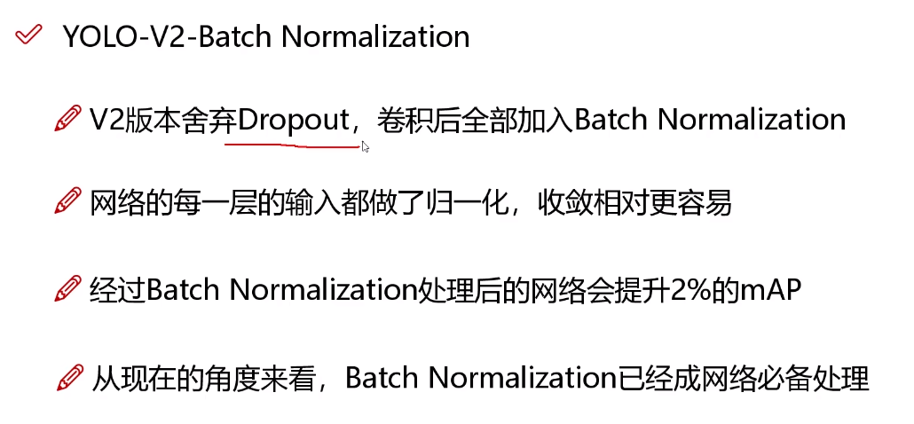
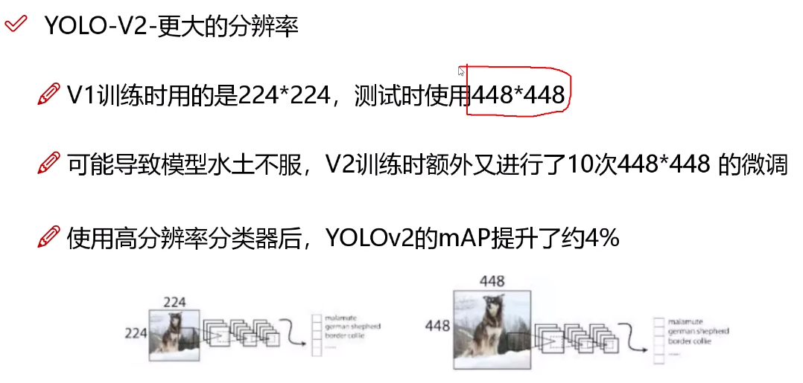
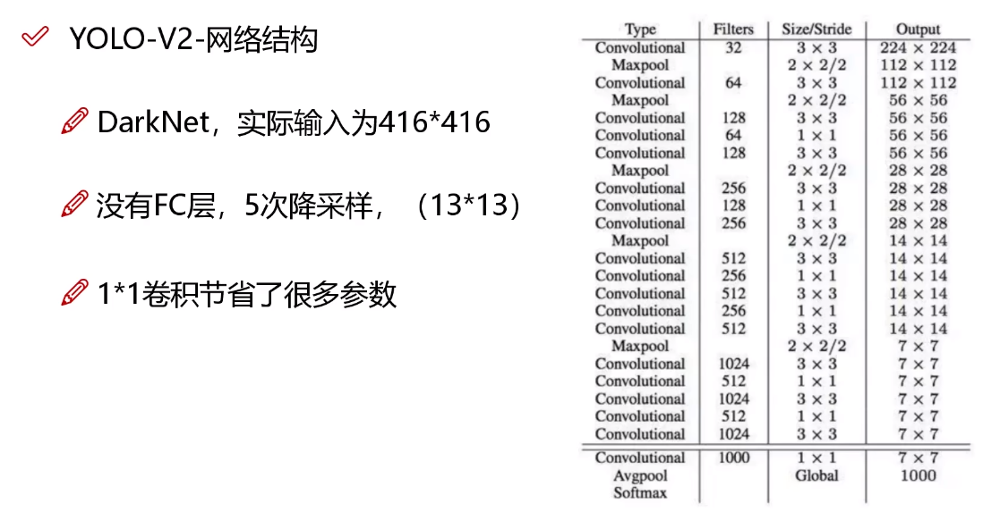
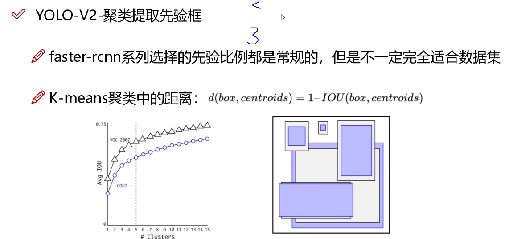
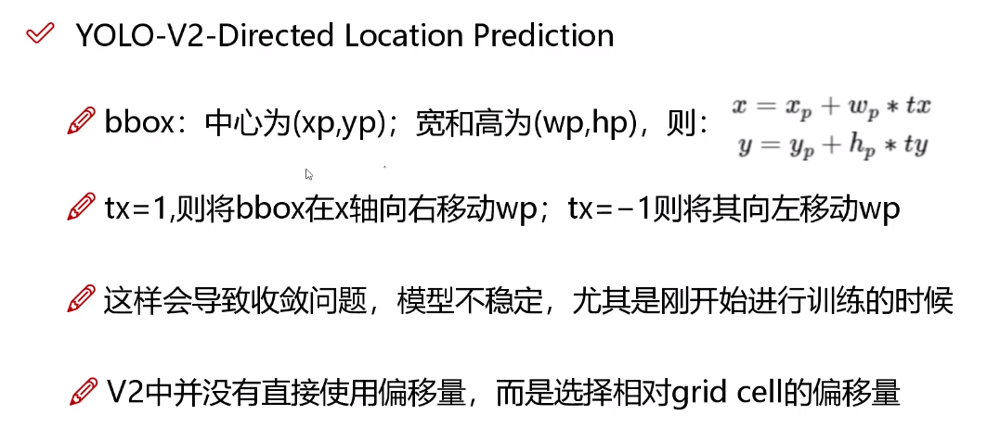
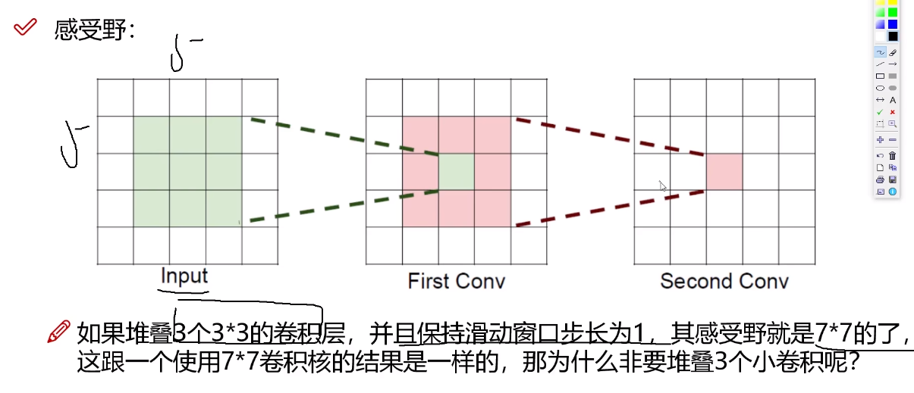
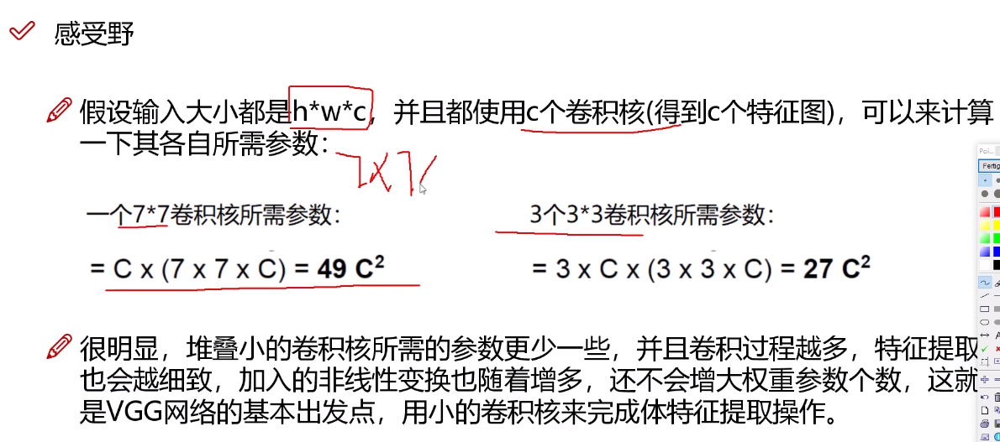
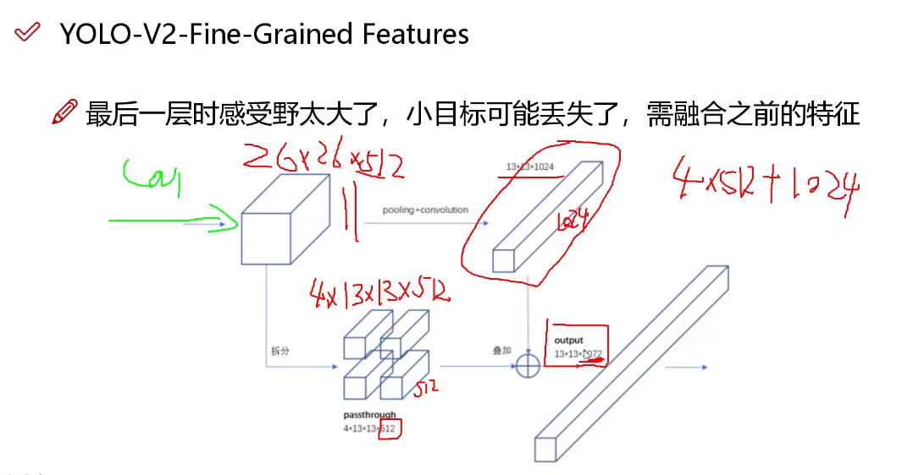
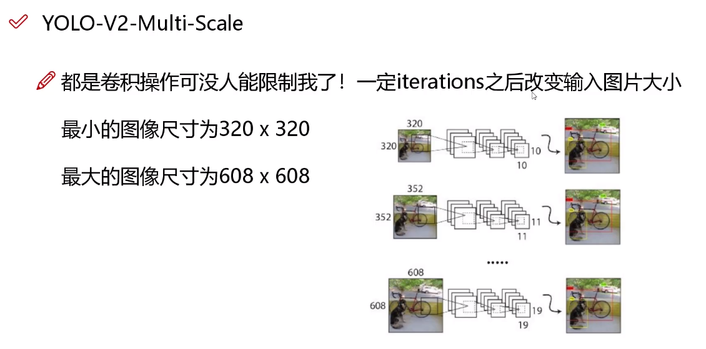

# 所做的改进

YOLOv1有两种先验框，但是物体的形状远不止两种。

YOLOv2选取了三个scale，产生了更多先验框。

YOLOv2对COCO数据集中的检测框进行聚类，使用K-Means算法对相似形状的框进行聚类。找到更合适的比列。按照这种方法提取出的比例都是实际值，更具有可信度。

在YOLOv2中是使用的k=5进行聚类。

在聚类中使用的距离并不是欧式距离，而是根据IoU计算得出的距离。此时距离不会与物体的大小有关。

$\sigma$ 即Sigmoid函数

## 感受野

## 多尺度检测

