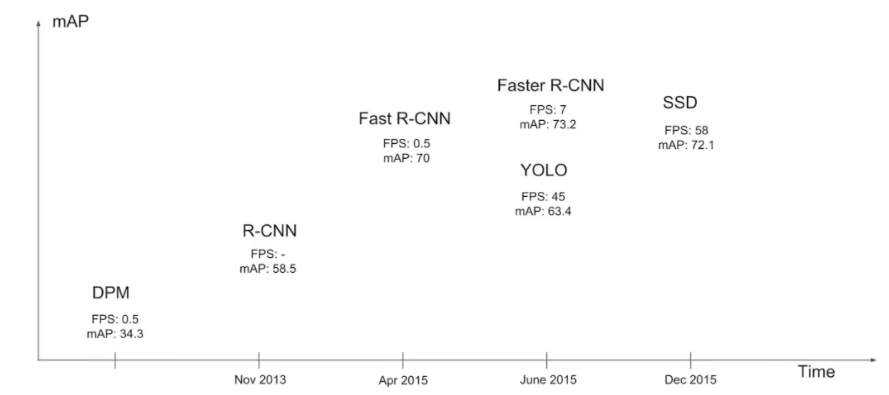
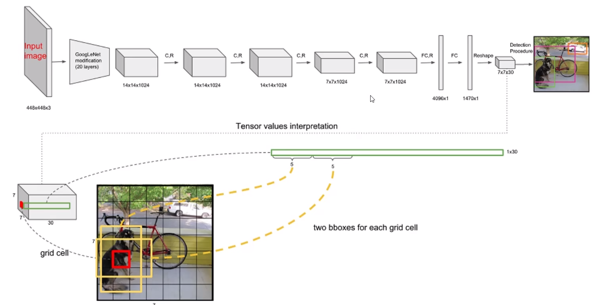
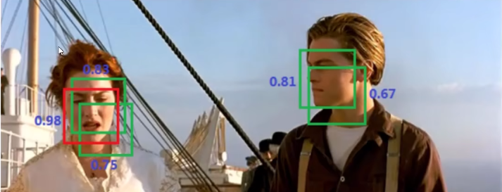

# YOLOv1

- 经典的One-Stage方法

- 把检测问题转化为回归问题

- 可以对视频进行实时检测，应用领域广

    

## 核心思想

- 首先，对于 $$s \times s$$ 的输入，将其分成多个网格
- 每个网格预测它所代表的物体 
- 黄色框是预先得出的两种框，框的长款比列是由经验得出的
- 训练过程中对框的坐标等进行调整，此时该任务成为回归任务
- 计算每个候选框对真实值的 $$IoU$$
- 将得出的 $$x, y, w, h$$ 以及置信度映射到原始图像

> 1. 将输入图像分割为S×S个网格。
> 2. 每个网格预测B个边界框和这些边界框的置信度。
> 3. 每个网格预测C个条件类别概率。
> 4. 计算每个边界框的类别置信度。
> 5. 通过阈值处理和非极大值抑制（NMS）来产生最终的检测结果。

## 网络架构

>  最后输出的大小是 $$7 \times 7 \times 30$$，其中的含义：
>
>  $$7*7$$ 代表最开始划分的每个网格的大小，每个网格还包含了30个值。
>
>  前5个值，代表第一个框$$B_{1}$$的 $$x, y, w, h$$ 以及置信度。
>
>  接下来5个值，代表第二个框$$B_{2}$$的 $$x, y, w, h$$ 以及置信度。
>
>  接下来20个值，代表每个类的概率，一共有20个类。
>
>  至于如何实现这样的输出，是由神经网络在学习过程中逐渐学会这样的规则  。

## 损失函数

## NMS

有重叠的检测框时使用最大值

## 存在的问题

1. 每个网格只能预测一个类别，导致难以检测重叠的物体
2. 难以检测到小物体
3. 长宽比的选择单一

