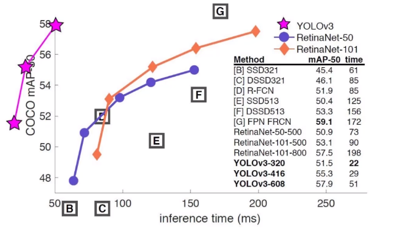
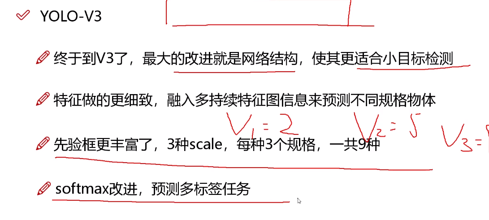
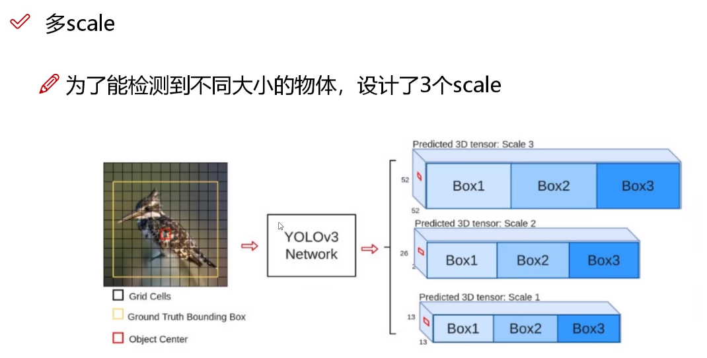
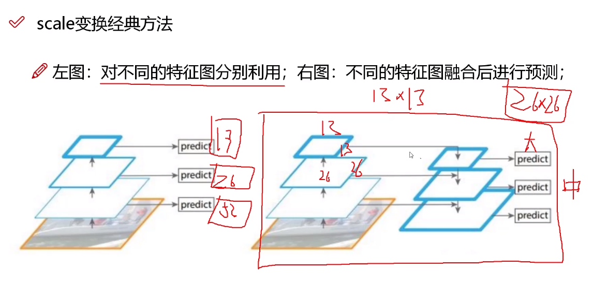
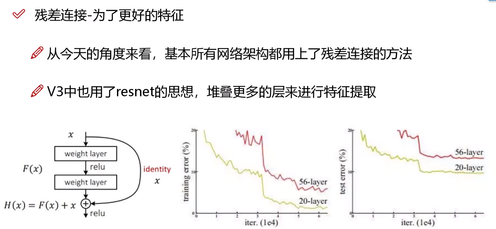
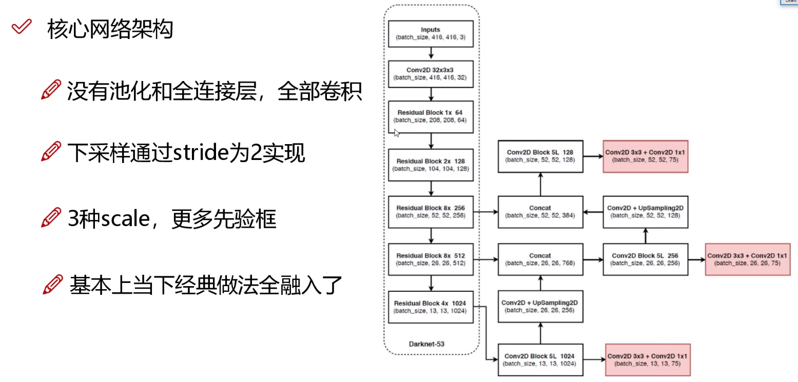
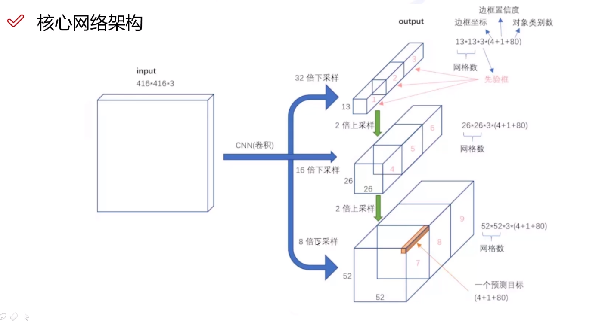
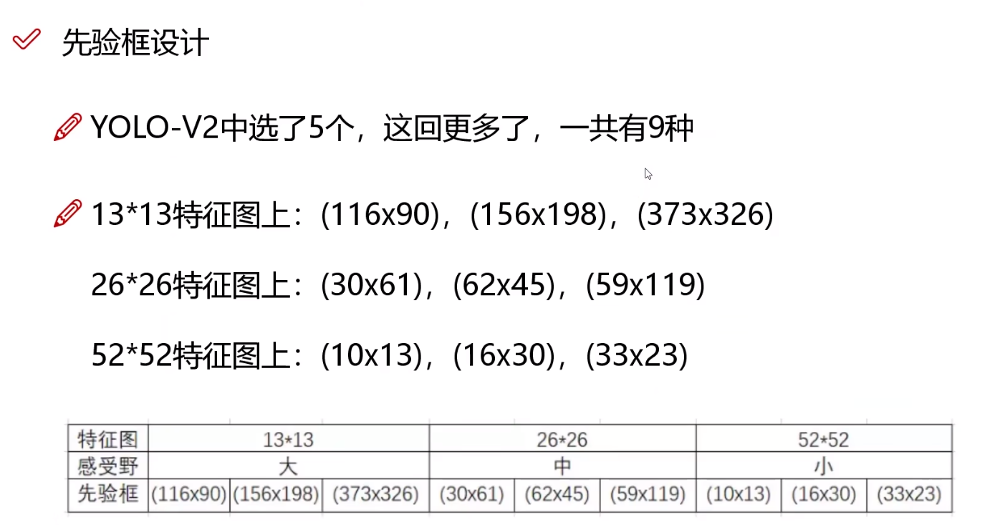
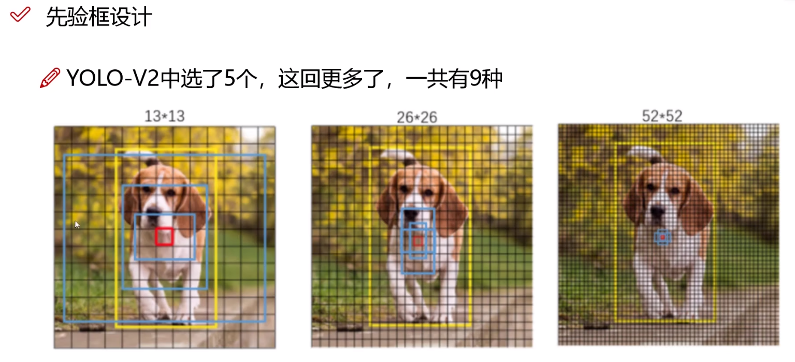
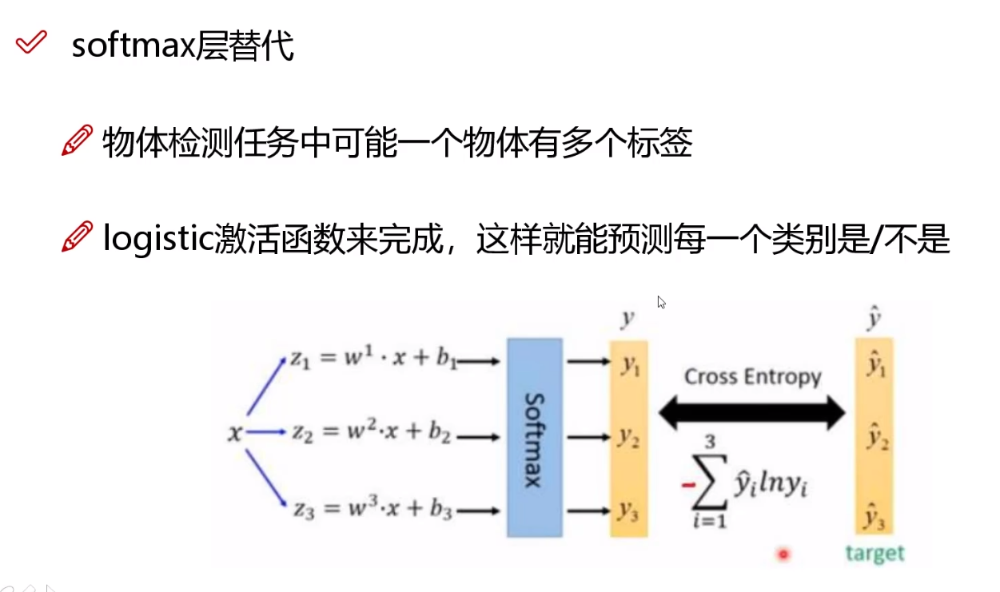

# YOLOv3

所做的改进：

- 改进网络结构，使其更适合小目标检测
- 特征做的更细致，融入多持续特征图信息来预测不同的规格的物体
- 先验框更加丰富，选取了3种scale，每种scale对应三种规格，一共产生9种先验框
- 改进了Softmax，可以预测多标签任务

## 多Scale

为了提升检测效果，设置列9检测框

大的检测框适合检测感受野较小的物体，而小的检测框擅长检测感受野较大的物体

将输入图像压缩大小，但是太耗时

将13 * 13的图像进行上采样，做成26 * 26的大小，再进行特征图融合，输入到网络中

核心网络架构：

- 没有池化和全连接层，全是卷积
- 下采样通过stride为2实现
- 引入了3种scale，拥有更多的先验眶
- 融入了当下几乎所有的优秀算法

核心网络架构：

当进行多标签检测时，对每个类别进行分类，大于阈值的均属于该类。

