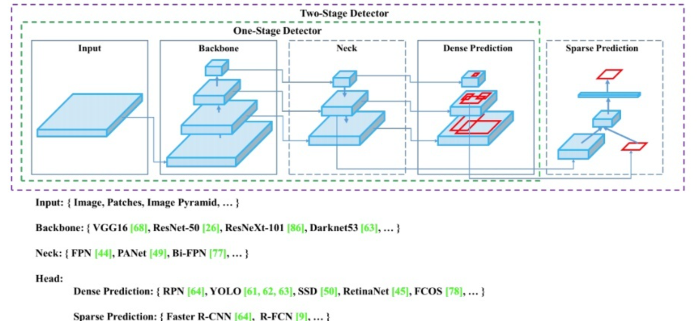
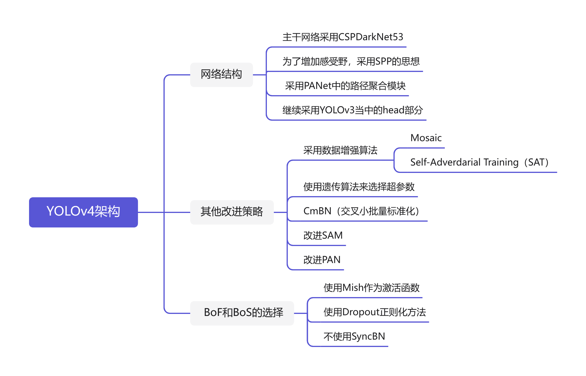
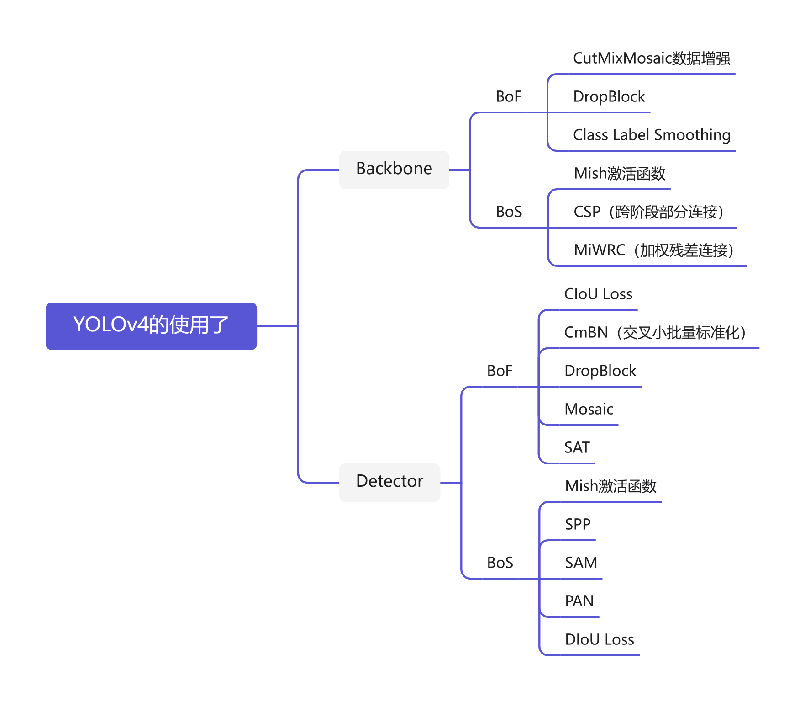
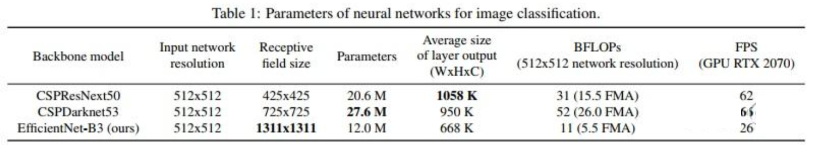
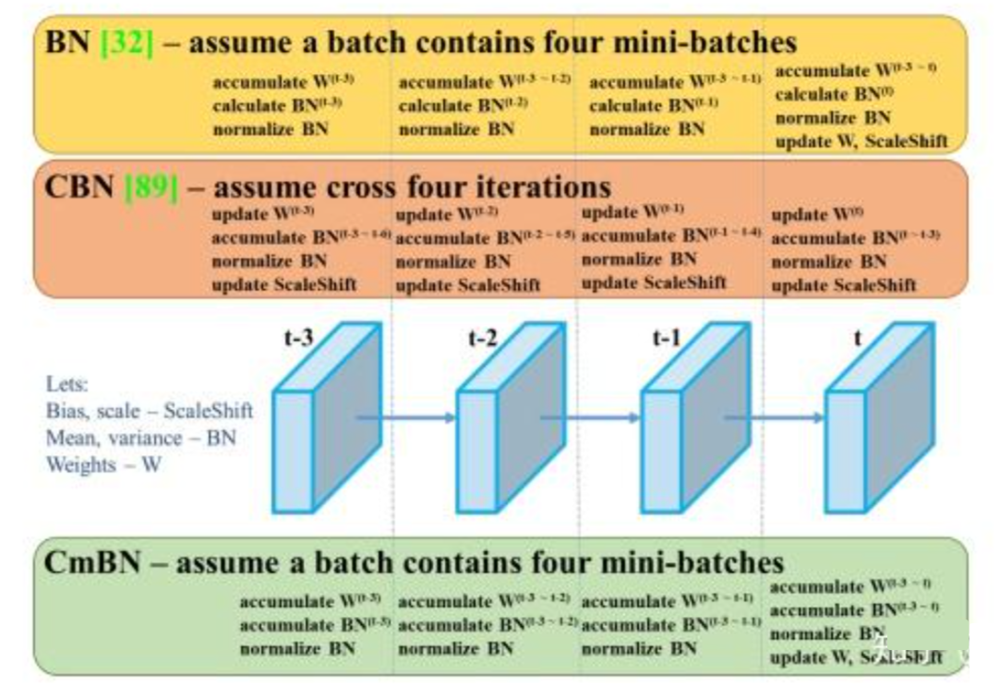
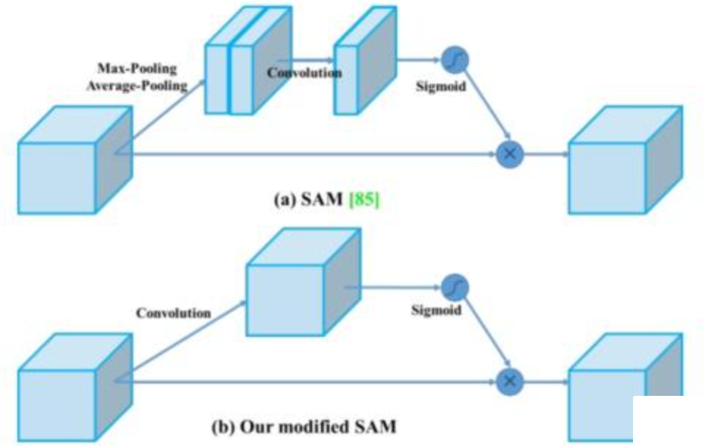
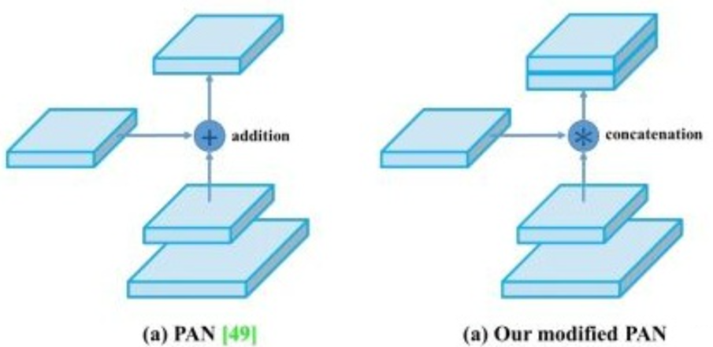

# 1 YOLOv4改进点

通俗的讲，就是YOLOv4算法是在原有YOLO目标检测架构的基础上，采用了近些年CNN领域中最优秀的优化策略，从**数据处理、主干网络、网络训练、激活函数、损失函数**等各个方面都有着不同程度的优化，虽没有理论上的创新，但是会受到许许多多的工程师的欢迎，各种优化算法的尝试。文章如同于**目标检测的trick综述**，效果达到了实现FPS与Precision平衡的目标检测new baseline。

**论文主要有以下三点贡献**

1. 开发了一个高效而强大的模型，使得任何人都可以使用一张1080Ti或者2080Ti GPU去训练一个超级快速和精确的目标检测器。
2. 验证了一系列SOTA的目标检测器训练方法的影响。
3. 修改了SOTA方法，使得他们在使用单个GPU进行训练时更加有效和适配，包括CBN，PAN，SAM等。

**作者把训练的方法分成了两类**

1. BoF（Bag of freebies）：只改变训练策略或者只增加训练成本，比如数据增强。
2. BoS（Bag of specials）：插件模块和后处理方法，它们仅仅增加一点推理成本，但是可以极大地提升目标检测的精度。

第三部分会对上面的方法进行详解。

# 2 网络结构

目前主流的two-stage检测器的使用的改进方法

- **Input部分：**Image，Patches，Images Pyramid (图像金字塔)

- **Backbone部分**：VGG16，ResNet-50，SpineNet，EfficientNet-B0 / B7，CSPResNeXt50，CSPDarknet53

- **Neck部分：**

- - Additional blocks：SPP，ASPP，RFB，SAM
    - Path-aggregation blocks：FPN，PAN，NAS-FPN，Fully-Connected FPN，BiFPN，ASFF，SFAM

- **Heads部分：**

- - **Dense Predictions** (one-stage)：

    - RPN，SSD，YOLO，RetinaNet （anchor-based）
      - CornerNet，CenterNet，MatrixNet，FCOS（anchor-free）

    - **Sparse Predictions** (two-stages)：
      - Faster R-CNN，R-FCN，Mask R-CNN（anchor-based）RepPoints（anchor-free）
    

下图为 YOLOv4 网络结构的采用的算法，其中保留了**YOLOv3的head部分，修改了主干网络为CSPDarknet-53，同时采用了SPP（空间金字塔池化）的思想来扩大感受野，PANet作为neck部分。**

# 3 **算法改进相关释义**

## 3.1 **BoF**

Bag of Freebies

在文中是指那些**能够提高精度而不增加推理时间**的技术。

- 比如数据增广的方法：图像几何变换、cutout、grid mask等
- 网络正则化的方法：Dropout、Dropblock等
- 类别不平衡的处理方法
- 难例挖掘方法
- 损失函数的设计等

## **3.2 BoS**

Bag of Specials

是指那些**增加稍许推断代价，但可以提高模型精度**的方法。

- 比如增大模型感受野的SPP、ASPP、RFB等
- 引入注意力机制Squeeze-and-Excitation (SE) 、Spatial Attention Module (SAM)等 
- 特征集成方法SFAM , ASFF , BiFPN等
- 改进的激活函数Swish、Mish等
- 或者是后处理方法如soft NMS、DIoU NMS等

## 3.3 通用优化改进方法

在目标检测训练中，通常对CNN的优化改进方法。

- 激活函数：ReLU，Leaky-ReLU，parameter-ReLU，ReLU6，SELU，Swish或**Mish**
- bbox回归loss函数：MSE，IoU，GIoU，**CIoU**，DIoU
- 数据增强：CutOut，MixUp，**CutMix**
- 正则化方法：DropOut，DropPath，Spatial Dropout或**DropBlock**
- 通过均值和方差对网络激活进行归一化：Batch Normalization (BN), Cross-GPU Batch Normalization (CGBN or SyncBN), Filter Response Normalization (FRN), or**Cross-Iteration Batch Normalization (CBN)**
- 跨连接：Residual connections, Weightedresidual connections, Multi-input weighted residualconnections, or Cross stage partial connections (CSP)

## 3.4 **CSPDarkNet-53**

由论文可知，CSPDarkNet-53包含29个卷积层，725*725的感受野，27.6M参数。

## 3.5 **CmBN**

BN是对当前mini-batch进行归一化。CBN是对当前以及当前往前数3个mini-batch的结果进行归一化，本文提出的CmBN则是仅仅在这个Batch中进行累积。在消融实验中，**CmBN要比BN高出不到一个百分点。**

## **3.6 SAM**

Attention机制中的CBAM, CBAM含有空间注意力机制和通道注意力机制,

**SAM就是其中的空间注意力机制.**

## **3.7 PANet**

PANet融合的时候使用的方法是Addition.

YOLOv4算法将融合的方法由add变为concat。

