# 1 需求解读

作为一种经典的单阶段目标检测框架，YOLO系列的目标检测算法得到了学术界与工业界们的广泛关注。由于YOLO系列属于单阶段目标检测，因而具有较快的推理速度，能够更好的满足现实场景的需求。随着YOLOv3算法的出现，使得YOLO系列的检测算达到了高潮。YOLOv4则是在YOLOv3算法的基础上增加了很多实用的技巧，使得它的速度与精度都得到了极大的提升，本文将对YOLOv4算法的细节进行分析。

# 2 YOLOv4算法简介

YOLOv4是一种单阶段目标检测算法，该算法在YOLOv3的基础上添加了一些新的改进思路，使得其速度与精度都得到了极大的性能提升。主要的改进思路如下所示：

- 输入端：在模型训练阶段，做了一些改进操作，主要包括Mosaic数据增强、cmBN、SAT自对抗训练；
    BackBone基准网络：融合其它检测算法中的一些新思路，主要包括：CSPDarknet53、Mish激活函数、Dropblock；

- Neck中间层：目标检测网络在BackBone与最后的Head输出层之间往往会插入一些层，Yolov4中添加了SPP模块、FPN+PAN结构；

- Head输出层：输出层的锚框机制与YOLOv3相同，主要改进的是训练时的损失函数CIOU_Loss，以及预测框筛选的DIOU_nms。

# 3 YOLOv4 算法详解

## 3.1 YOLOv4 网络架构

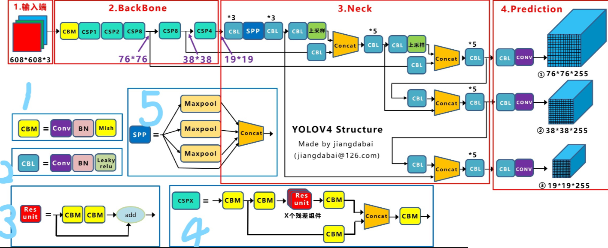

上图展示了YOLOv4目标检测算法的整体框图。对于一个目标检测算法而言，我们通常可以将其划分为4个通用的模块，具体包括：输入端、基准网络、Neck网络与Head输出端，对应于上图中的4个红色模块。

- **输入端**：输入端表示输入的图片。该网络的输入图像大小为 $608 \times 608$，该阶段通常包含一个图像预处理阶段，即将输入图像缩放到网络的输入大小，并进行归一化等操作。在网络训练阶段，YOLOv4使用**Mosaic数据增强**操作提升了模型的训练速度和网络的精度，利用**cmBN**及**SAT自对抗训练**来提升网络的泛化性能；

- **基准网络**：基准网络通常是一些性能优异的分类器种的网络，该模块用来提取一些通用的特征表示。YOLOv4中使用了**CSPDarknet53**作为基准网络；利用**Mish激活函数**代替原始的RELU激活函数；并在该模块中增加了**Dropblock**来进一步提升模型的泛化能力 。

- **Neck网络**：Neck网络通常位于基准网络和头网络的中间位置，利用它可以进一步提升特征的多样性及鲁棒性。YOLOv4利用**SPP模块**来融合不同尺度大小的特征图；利用自顶向下的**FPN特征金字塔**于自底向上的PAN特征金字塔来提升网络的特征提取能力。

- **Head输出端**：Head用来完成目标检测结果的输出。针对不同的检测算法，输出端的分支个数不尽相同，通常包含一个分类分支和一个回归分支。YOLOv4利用**CIOU Loss**来代替Smooth L1 Loss函数，并利用**DIOU nms**来代替传统的NMS操作，从而进一步提升算法的检测精度。

## 3.2 YOLOv4 实现细节详解

### 3.2.1 YOLOv4 基础组件

- CBM-CBM是Yolov4网络结构中的最小组件，由`Conv+BN+Mish`激活函数组成，如上图中模块1所示。
- CBL-CBL模块由`Conv+BN+Leaky ReLU`激活函数组成，如上图中的模块2所示。
- Res unit借鉴ResNet网络中的残差结构，用来构建深层网络，CBM是残差模块中的子模块，如上图中的模块3所示。
- CSPX借鉴CSPNet网络结构，由卷积层和X个Res unit模块Concate组成而成，如上图中的模块4所示。
- SPP采用$1×1、5×5、9×9和13×13$的最大池化方式，进行多尺度特征融合，如上图中的模块5所示。

### 3.2.2 输入端细节详解

- Mosaic数据增强：YOLOv4中在训练模型阶段使用了Mosaic数据增强方法，该算法是在CutMix数据增强方法的基础上改进而来的。CutMix仅仅利用了两张图片进行拼接，而Mosaic数据增强方法则采用了4张图片，并且按照随机缩放、随机裁剪和随机排布的方式进行拼接而成，具体的效果如下图所示。这种增强方法可以将几张图片组合成一张，这样不仅可以丰富数据集的同时极大的提升网络的训练速度，而且可以降低模型的内存需求。

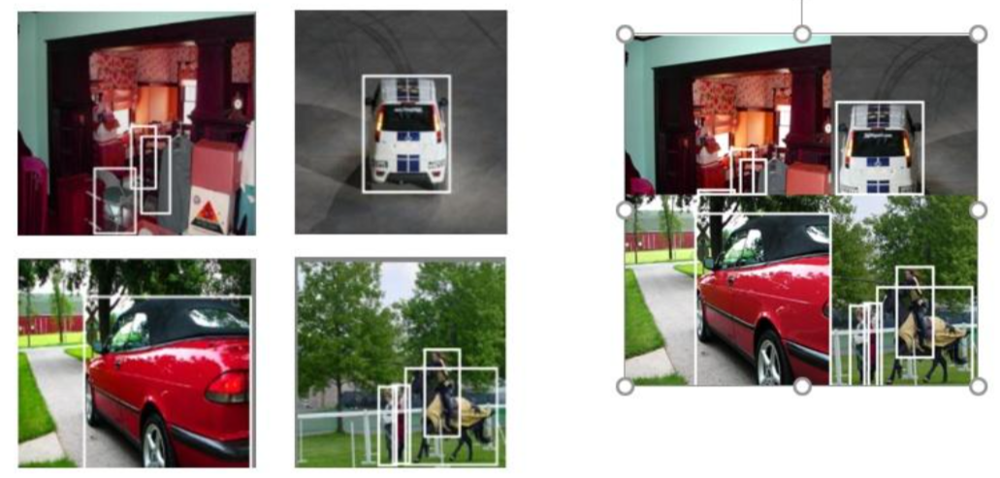

### 3.2.3 基准网络细节详解

- CSPDarknet53：它是在YOLOv3主干网络Darknet53的基础上，借鉴了2019年发表的CSPNet算法的经验，所形成的一种Backbone结构，其中包含了5个CSP模块。每个CSP模型的实现细节如3.2.1所述。CSP模块可以先将基础层的特征映射划分为两部分，然后通过跨阶段层次结构将它们合并起来，这样不仅减少了计算量，而且可以保证模型的准确率。它的优点包括：

    ​	（1）增强CNN网络的学习能力，轻量化模型的同时保持模型的精度；

    ​	（2）降低整个模型的计算瓶颈；

    ​	（3）降低算法的内存成本。有关CSP模块的更多细节请看该论文。

- Mish激活函数：该激活函数是在2019年提出的，该函数是在Leaky ReLU算法的基础上改进而来的，具体的比较如下图。当 $x>0$ 时，Leaky ReLU与Mish激活函数基本相同；当 $x<0$ 时，Mish函数基本为0，而Leaky RelLU函数为$λx$。YOLOv4的Backbone中均使用了Mish激活函数，而后面的Neck网络中则使用了Leaky ReLU激活函数。总而言之，Mish函数更加平滑一些，可以进一步提升模型的精度。更多的细节参考[论文](https://arxiv.org/pdf/1908.08681.pdf)。

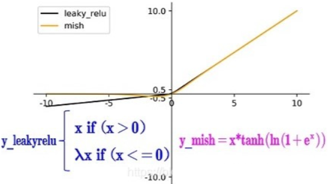

- Dropblock：Dropblock是一种解决模型过拟合的正则化方法，它的作用与Dropout基本相同。Dropout的主要思路是随机的使网络中的一些神经元失活，从而形成一个新的网络。如下图所示，最左边表示原始的输入图片，中间表示经过Dropout操作之后的结果，它使得图像中的一些位置**随机失活**，Dropblock的作者认为：由于卷积层通常是三层结构，即卷积+激活+池化层，池化层本身就是对相邻单元起作用，因而卷积层对于这种随机丢弃并不敏感。除此之外，即使是随机丢弃，卷积层仍然可以从相邻的激活单元学习到相同的信息。因此，在全连接层上效果很好的Dropout在卷积层上效果并不好。最右边表示经过Dropblock操作之后的结果，我们可以发现**该操作直接对整个局部区域进行失活（连续的几个位置）**。

    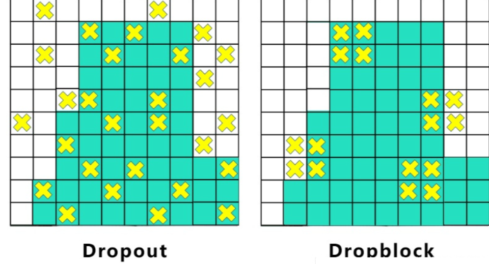

Dropblock是在Cutout数据增强方式的基础上改进而来的，Cutout的主要思路是将输入图像的部分区域清零，而Dropblock的创新点则是将Cutout应用到每一个特征图上面。而且并不是用固定的归零比率，而是在训练时以一个小的比率开始，随着训练过程线性的增加这个比率。与Cutout相比，Dropblck主要具有以下的优点：

（1）实验效果表明Dropblock的效果优于Cutout；

（2）Cutout只能应用到输入层，而Dropblock则是将Cutout应用到网络中的每一个特征图上面；

（3）Dropblock可以定制各种组合，在训练的不同阶段可以灵活的修改删减的概率，不管是从空间层面还是从时间层面来讲，Dropblock更优一些。

### 3.2.4 Neck细节详解

为了获得更鲁棒的特征表示，通常会在基准网络和输出层之间插入一些层，YOLOv4的主要添加了SPP模块与FPN+PAN2种方式。

SPP模块: SPP模块通过融合不同大小的最大池化层来获得鲁棒的特征表示，YOLOv4中的k=\{$1 \times 1$,$\ 5 \times 5,$$\ 9 \times 9,$$\ 13 \times 13$}包含这4种形式。这里的最大池化层采用padding操作，移动步长为1，比如输入特征图的大小为 $13 \times 13$，使用的池化核大小为 $5 \times 5$，padding=2，因此池化后的特征图大小仍然是$ 13 \times 13$ 。YOLOv4论文表明：

（1）与单纯的使用 $k \times k$ 最大池化的方式相比，采用SPP模块的方式能够更有效的增加主干特征的接收范围，显著的分离了最重要的上下文特征。

（2）在COCO目标检测任务中，当输入图片的大小为 $608 \times  608$ 时，只需要额外花费0.5%的计算代价就可以将mAP50提升2.7%，因此YOLOv4算法中也采用了SPP模块。

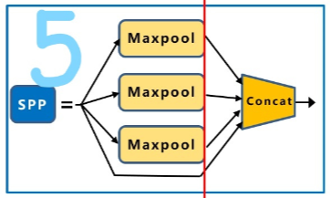

FPN+PAN：所谓的FPN，即特征金字塔网络，通过在特征图上面构建金字塔，可以更好的解决目标检测中尺度问题。PAN则是借鉴了图像分割领域PANet算法中的创新点，它是一种自底向上的结构，它在FPN的基础上增加了两个PAN结构，如下图中的2和3所示。

（1）整个网络的输入图像大小为 $608 \times 608$；然后经过CSP块之后生成一个 $76 \times 76$ 大小的特征映射，经过下采样操作之后生成 $38 \times 38$的特征映射，经过下采样操作之后生成 $19 \times 19$ 的特征映射；

（2）接着将其传入FPN结构中，依次对$19 \times 19$、$38 \times 38$、$76 \times  76$ 执行融合操作，即先对比较小的特征映射层执行上采样操作，将其调整成相同大小，然后将两个同等大小的特征映射叠加起来。通过FPN操作可以将 $19 \times 19$大小的特征映射调整为 $76 \times 76$ 大小，这样不仅提升了特征映射的大小，可以更好的解决检测中尺度 问题，而且增加了网络的深度，提升了网络的鲁棒性。

（3）接着将其传入PAN结构中，PANet网络的PAN结构是将两个相同大小的特征映射执行按位加操作，YOLOv4中使用Concat操作来代替它。经过两个PAN结构，我们将 $76 \times 76$ 大小的特征映射重新调整为 $19 \times 19$ 大小，这样可以在一定程度上提升该算法的目标定位能力。FPN层自顶向下可以捕获强语义特征，而PAF则通过自底向上传达强定位特征，通过组合这两个模块，可以很好的完成目标定位的功能。

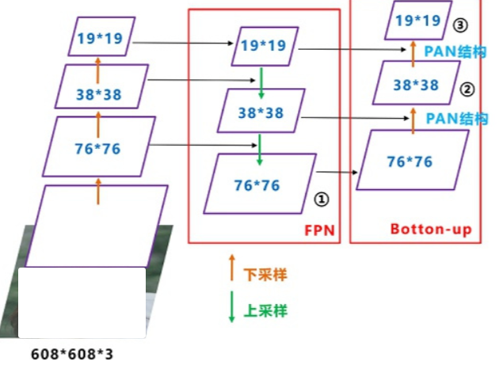

### 3.2.5 Head细节详解

- 各种IoU之间的讲解参照[这篇笔记](../边框回归损失函数.md)(`../边框回归损失函数.md`)

**DIoU NMS**

如下图所示，对于重叠的摩托车检测任务而言，传统的NMS操作会遗漏掉一些中间的摩托车；由于DIoU NMS考虑到边界框中心点的位置信息，因而得到了更准确的检测结果，适合处理密集场景下的目标检测问题。

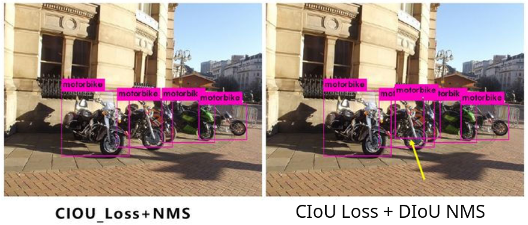

# 4 YOLOv4效果展示与分析

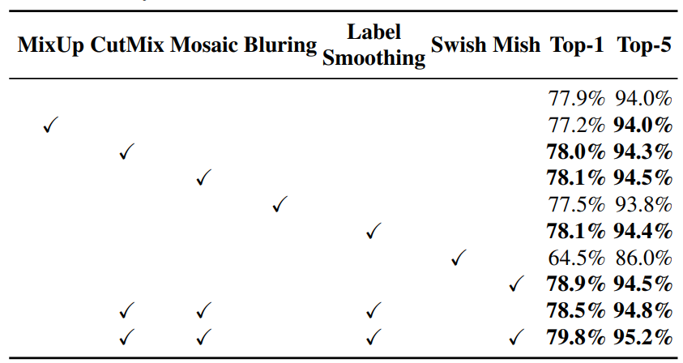

上图展示了不同的数据增强操作对CSPResNeXt-50分类器的精度影响。通过观察我们可以发现：

（1）使用CutMix数据增强操作之后，CSPResNeXt-50分类器的top1与top5精度都得到了较大的提升；

（2）与CutMix数据增强操作相比，使用Mosaic数据增强操作之后，CSPResNeXt-50分类器能够获得进一步的提升；

（3）同时使用CutMix、Mosaic、Label Smoothing与Mish操作之后，CSPResNeXt-50分类器的top1与top5精度得到了最高的精度。

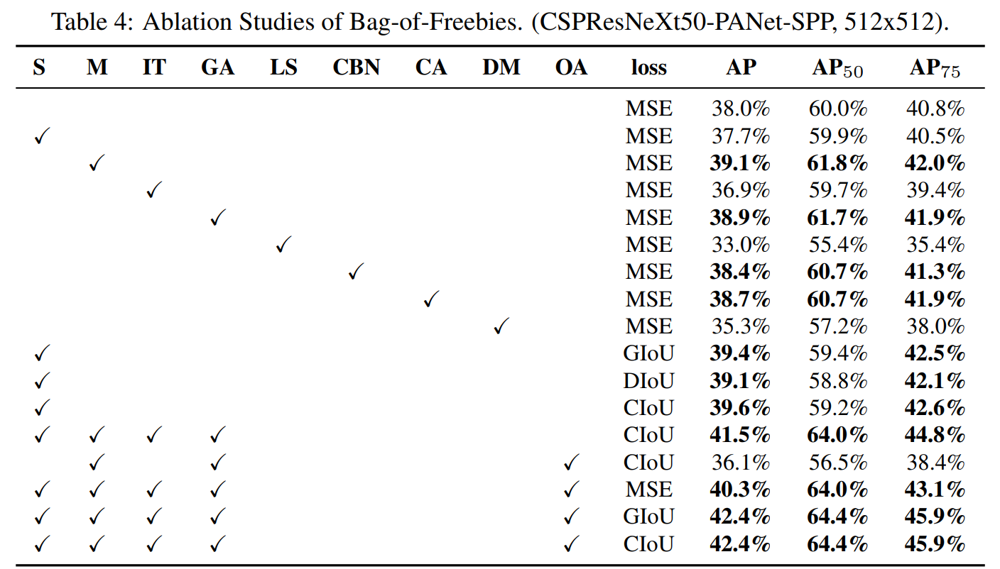

上图展示了使用不同的优化策略之后，对YOLOv4算法的AP指标所产生的影响。其中S表示消除梯度敏感度，M表示使用Mosia数据增强操作，IT表示IoU阈值，GA表示遗传算法，LS表示类别标签平滑操作，CBS表示最小Batch归一化操作，CA表示模拟退火机制，DM表示动态最小Batch大小，OA表示优化的锚点框，loss表示回归分支的损失函数。通过观察我们可以得出以下的初步结论：

（1）与没有使用任何优化操作的AP指标相比，使用Mosia数据增强操作之后的AP指标提升了1.1%；

（2）与没有使用任何优化操作的AP指标相比，使用GA来选择最优的超参数的方法可以将AP指标提升到38.9%；

（3）同时使用消失梯度敏感度、Mosaic数据增强操作、IoU阈值、遗传算法、优化的锚点框和CIoU损失之后，可以获得最高的AP指标。

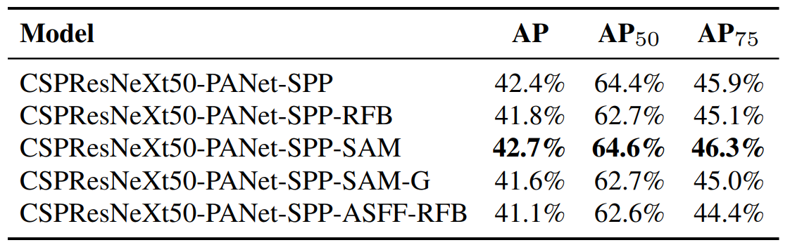

上图展示了PAN、SPP、RFB与SAM模块对YOLOv4算法的影响。通过观察我们可以发现：在基准网络CSPResNeXt50的基础上，同时利用PAN、SPP与SAM模块，可以获得最高的AP指标。

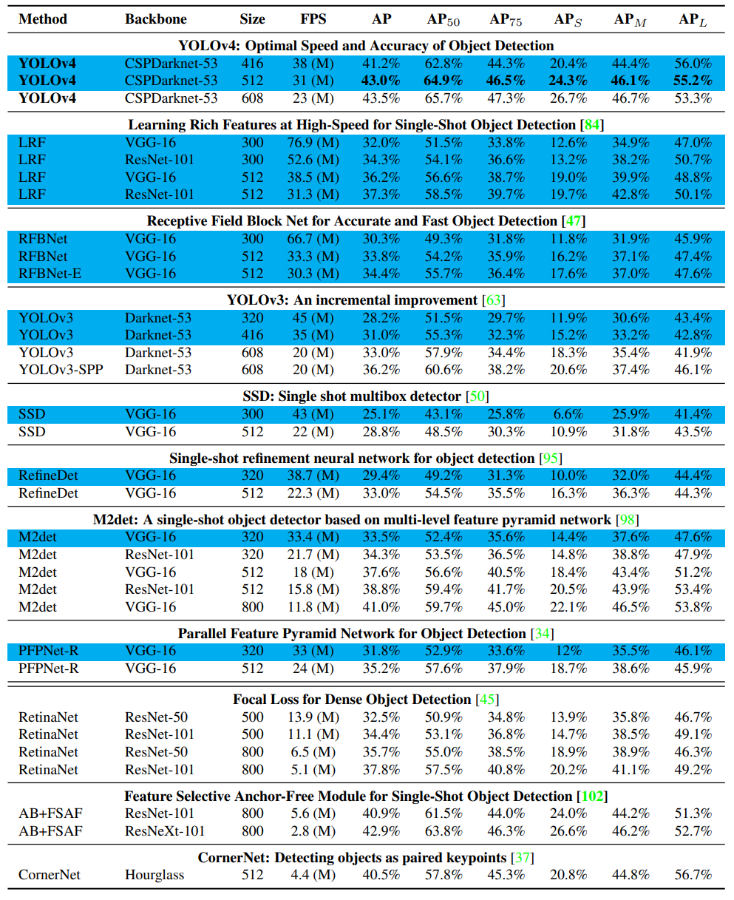

上图展示了YOLOv4与其它SOTA目标检测算法在MS COCO数据集上面的各项指标。具体包括目标检测的Backbone网络、模型Size大小、模型帧率FPS、模型评估指标AP、AP50、AP75、APS、APM与APL。通过观察上图，我们可以得出以下的初步结论：

（1）与YOLOv3相比，YOLOv4几乎具有相同的输入分辨率，具有相似的模型大小，各项AP指标却得到了极大的性能提升，平均提升了10个百分点左右；

（2）与性能优异的RetinaNet相比，YOLOv4不仅具有较小的输入分辨率，而且性能得到了极大的提升，平均提升了5个百分点左右；

（3）与基于Anchor-free的目标检测算法CornerNet相比，虽然YOLOv4的模型较大一些，但是YOLOv4的性能提升了3个百分点左右。

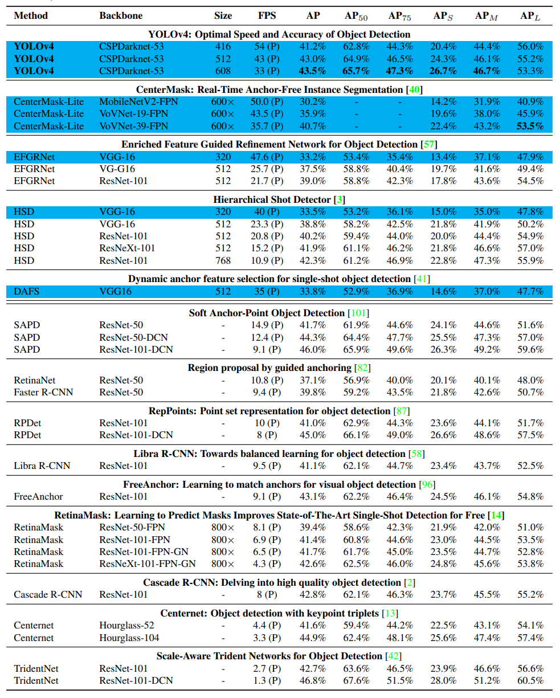

上图展示了YOLOv4与其它SOTA目标检测算法在MS COCO数据集上面的各项指标。通过观察上图，我们可以得出以下的初步结论：

（1）与CenterMask-Lite算法相比，虽然CenterMask-Lite具有更大的分辨率，但是YOLOv4算法的精度提升了3个百分点左右；

（2）与HSD目标检测算法相比，两者的分辨率大小基本相同，虽然HSD算法使用了更深的基准网络，但是算法精度并不如YOLOv4算法；

（3）与双阶段目标检测算法Faster R-CNN、RetinaNet与Cascade R-CNN相比，YOLOv4算法的AP指标都得到了极大的性能提升；

（4）与基于Anchor-free的目标检测算法Centernet相比，当使用了基准网络Hourglass-104之后，虽然Centernet获得了更高的AP指标，但是其推理速度并不能满足很多设备的要求。

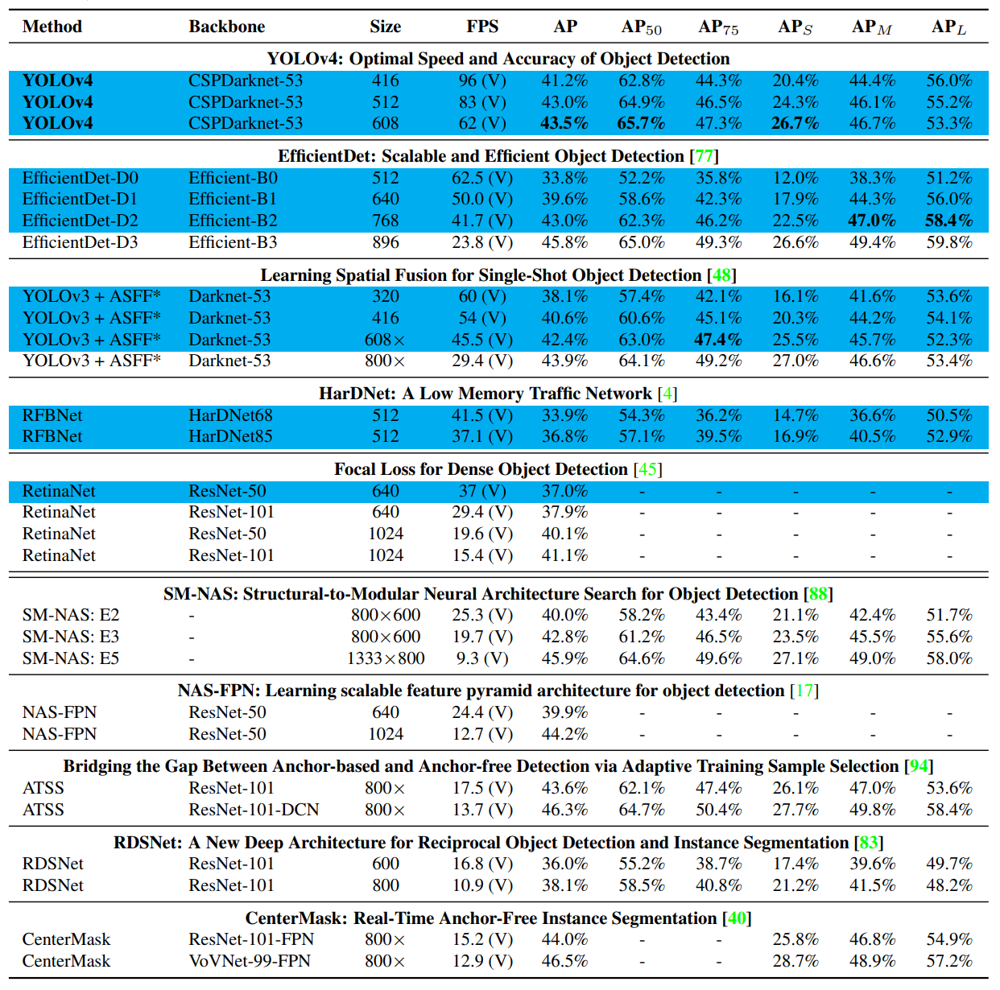

上图展示了YOLOv4与其它SOTA目标检测算法在MS COCO数据集上面的各项指标。通过观察上图，我们可以得出以下的初步结论：

（1）与轻量级目标检测算法EfficientDet相比，当其具有相似的分辨率时，获得了相似的AP指标，但是YOLOv4算法的运行速度更快一些；

（2）与添加了ASFF模块的YOLOv3算法相比，虽然它们具有相同的输入分辨率，但是YOLOv4在精度与速度方面优于前者；

（3）与SM-NAS E3算法相比，虽然SE-NAS的输入图像更大一些，但是其速度与AP精度均不如YOLOv4检测算法。

（4）与NAS-FPN算法相比，该算法不仅利用到NAS技术来寻找最优的目标检测网络架构，而且利用FPN操作来解决目标检测中的尺度问题。当输入图像大小为1024*1024时，虽然NAS-FPN在AP指标上面更高一些，但是它的运行速度变得很慢。

# 5 总结与分析

YOLOv4是一种单阶段目标检测算法，该算法在YOLOv3的基础上添加了一些新的改进思路，使得其速度与精度都得到了极大的性能提升，具体包括：

- 输入端的**Mosaic数据增强**、**cmBN**、**SAT自对抗训练**操作；

- 基准端的**CSPDarknet53**、**Mish激活函数**、**Dropblock**操作；

- Neck端的**SPP**与**FPN+PAN**结构；

- 输出端的**损失函数CIoU Loss**以及预测框筛选的**DIoU NMS**。

实际测试发现YOLOv4算法确定具有较大的性能提升。除此之外，YOLOv4中的各种改进思路仍然可以应用到其它的目标检测算法中。