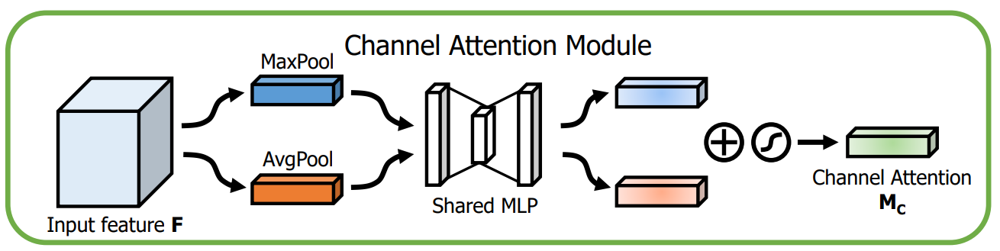
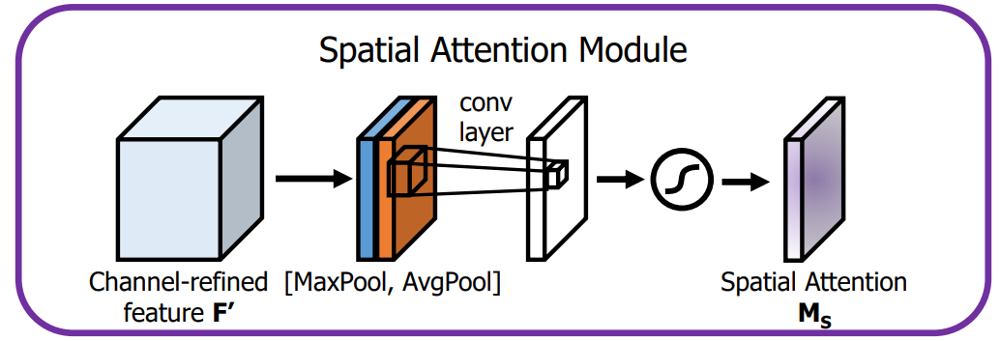
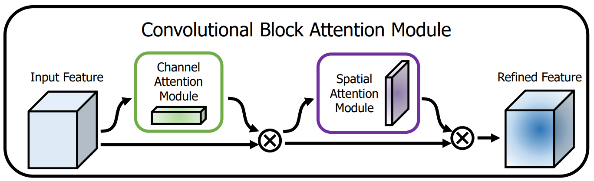
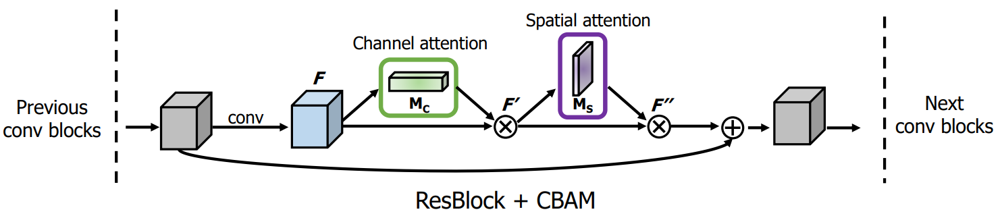
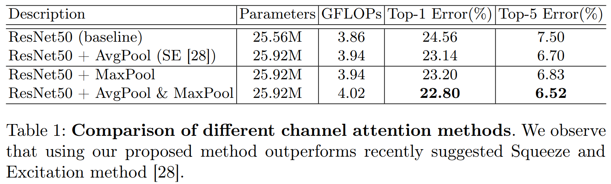
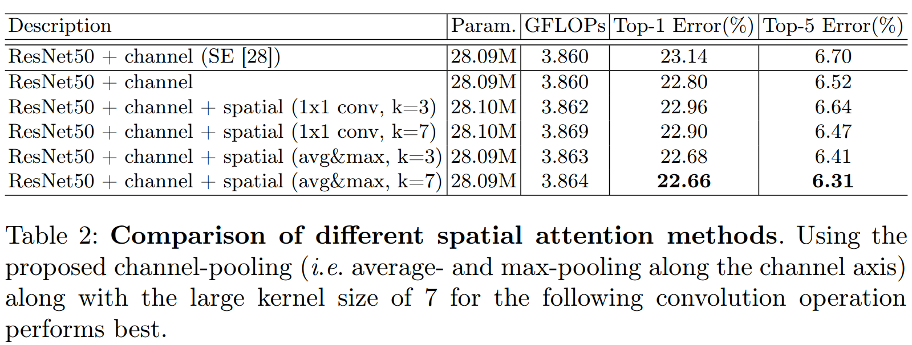
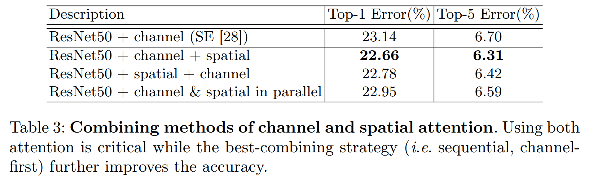
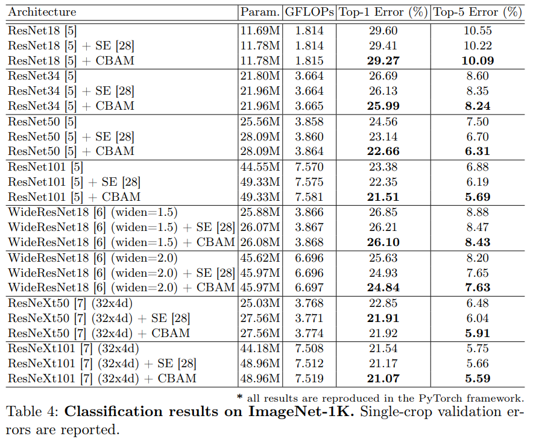
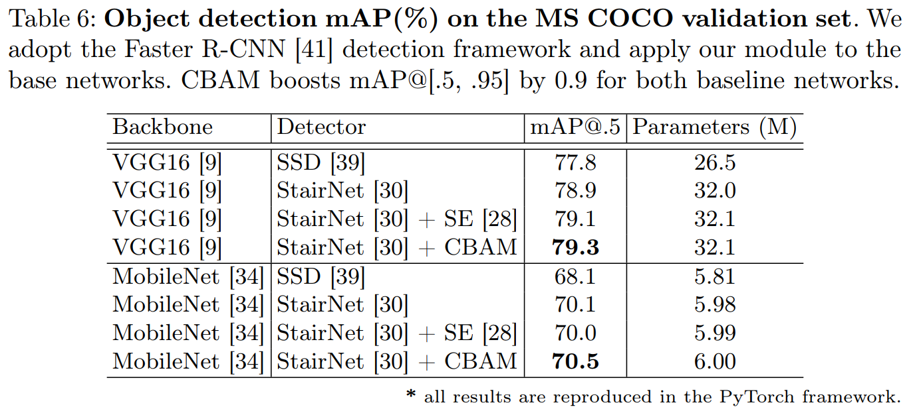

# 1 摘要

在论文中作者提出了一个简单但有效的注意力模块 CBAM，给定一个中间特征图，我们沿着空间和通道两个维度依次推断出注意力权重，然后与原特征图相乘来对特征进行自适应调整。

由于 CBAM 是一个轻量级的通用模块，它可以无缝地集成到任何 CNN 架构中，额外开销忽略不计，并且可以与基本 CNN 一起进行端到端的训练。

在不同的分类和检测数据集上，将 CBAM 集成到不同的模型中后，模型的表现都有了一致的提升，展示了其广泛的可应用性。

# 2 介绍

为了提升 CNN 模型的表现，最近的研究主要集中在三个重要的方面：深度、宽度和基数（cardinality）。ResNet 让构建非常深的网络成为可能，而 GoogLeNet 则表明宽度也是提升模型性能的另一个重要的因素。此外，Xception 和 ResNeXt 提出增加网络的基数，经验表明，基数不仅可以节省参数总量，还可以产生比深度和宽度更强的表示能力。

除了这些因素，作者则研究了网络架构设计的另一个不同方向：注意力。注意力不仅要告诉我们重点关注哪里，还要提高关注点的表示。 我们的目标是通过使用注意机制来增加表现力，关注重要特征并抑制不必要的特征。

为了强调空间和通道这两个维度上的有意义特征，作者依次应用通道和空间注意模块，来分别在通道和空间维度上学习关注什么、在哪里关注。此外，通过了解要强调或抑制的信息也有助于网络内的信息流动。

# 3 网络结构

作者将注意力过程分为两个独立的部分，通道注意力模块和空间注意力模块。这样不仅可以节约参数和计算力，而且保证了其可以作为即插即用的模块集成到现有的网络架构中去。

## 3.1 通道注意力模块

特征的每一个通道都代表着一个专门的检测器，因此，通道注意力是关注什么样的特征是有意义的。为了汇总空间特征，作者采用了全局平均池化和最大池化两种方式来分别利用不同的信息。

如上图所示，输入是一个 H×W×C 的特征 F，我们先分别进行一个空间的全局平均池化和最大池化得到两个 1×1×C 的通道描述。接着，再将它们分别送入一个两层的神经网络，第一层神经元个数为 C/r，激活函数为 Relu，第二层神经元个数为 C。注意，这个两层的神经网络是共享的。

然后，再将得到的两个特征相加后经过一个 Sigmoid 激活函数得到权重系数 Mc。最后，拿权重系数和原来的特征 F 相乘即可得到缩放后的新特征。

## 3.2 空间注意力模块

在通道注意力模块之后，我们再引入空间注意力模块来关注哪里的特征是有意义的。

与通道注意力相似，给定一个 H×W×C 的特征 F‘，我们先分别进行一个通道维度的平均池化和最大池化得到两个 H×W×1 的通道描述，并将这两个描述按照通道拼接在一起。然后，经过一个 7×7 的卷积层，激活函数为 Sigmoid，得到权重系数 Ms。最后，拿权重系数和特征 F’ 相乘即可得到缩放后的新特征。

## 3.3 CBAM

通道注意力和空间注意力这两个模块可以以并行或者顺序的方式组合在一起，但是作者发现顺序组合并且将通道注意力放在前面可以取得更好的效果。

一个完整的 CBAM 模块如上图所示。

将 CBAM 集成到 ResNet 中的方式如下图所示。

# 4 结果比较

## 4.1 Ablation Studies

可以看到，在通道注意力模块中，同时引入最大池化和平均池化可以得到最好的效果。

在空间注意力模块中，同时引入最大池化和平均池化比利用一个 1×1 的卷积要好，同时，卷积层采用 7×7 的卷积核要优于 3×3 的卷积核。

至于通道注意力和空间注意力的组合方式，则是顺序组合通道注意力在前最好。

## 4.2 Classfication

将 CBAM 集成到所有的 ResNet 系列网络中去，都会降低最终的分类错误率，这展示了 CBAM 的通用性和巨大的潜力。

## 4.4 Detection

在物体检测领域，引入 CBAM 后模型性能的提升效果同样非常明显。