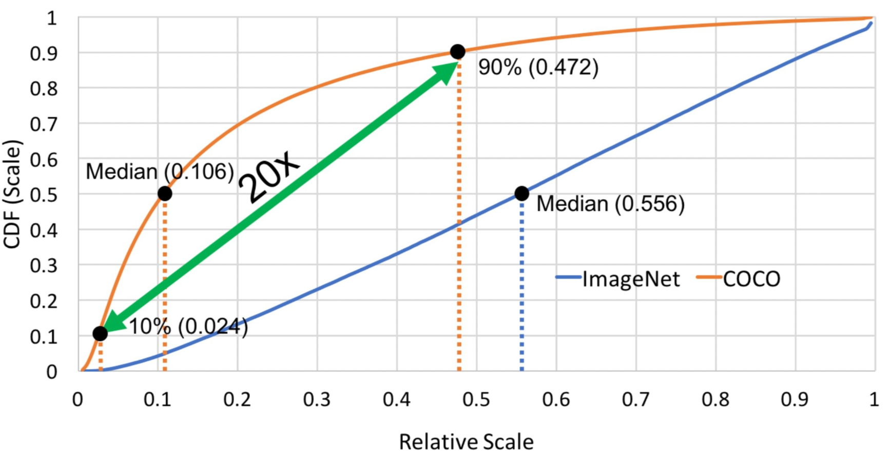
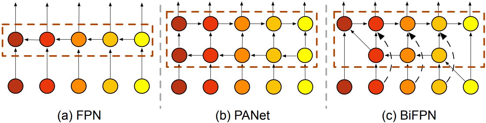
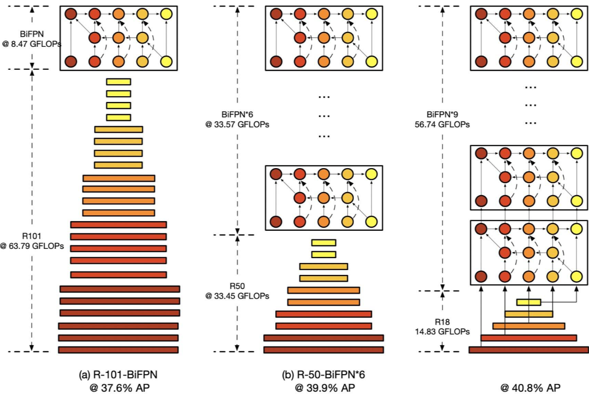
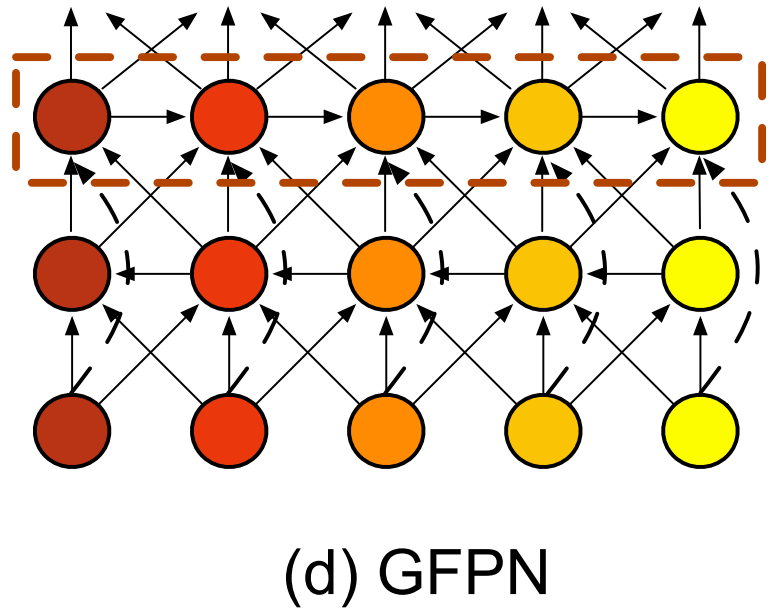
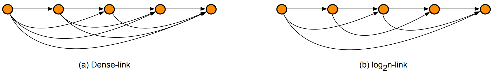
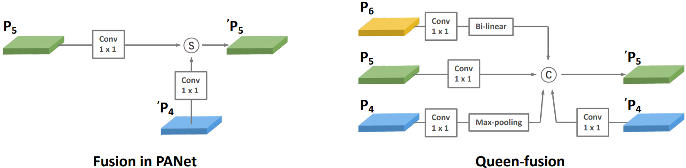
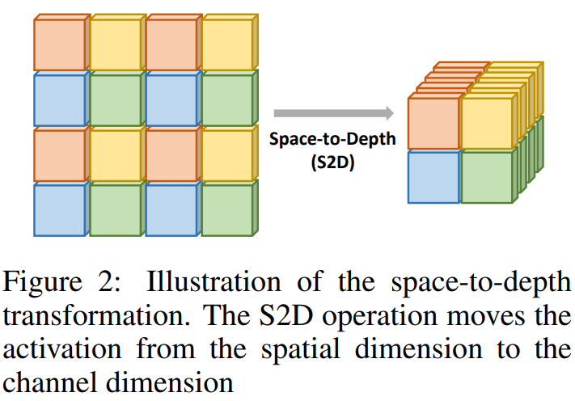
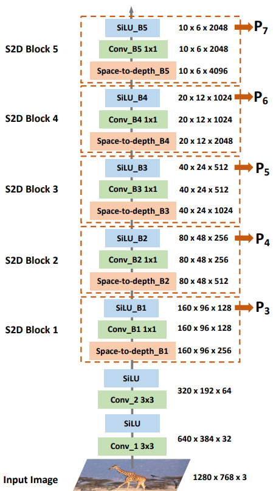
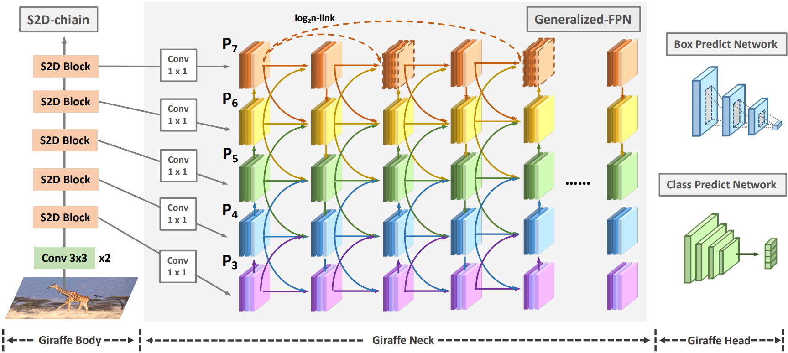
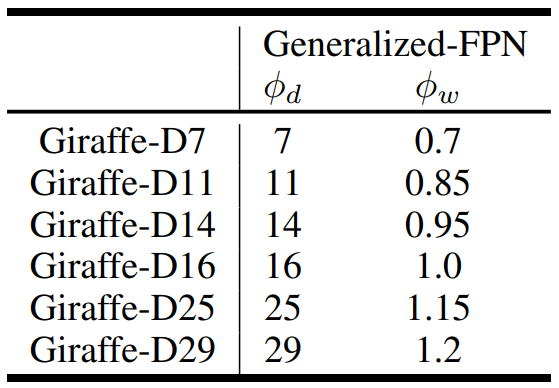

# 1 论文背景

目标检测任务面临的主要挑战在于尺度差异(Scale Variance)。上图给出了ImageNet和COCO数据集中的前景目标在不同scale的分布，横轴(Relative Scale)为前景目标尺度相对于图片尺度的相对scale，竖轴(CDF)为当前scale下的前景目标数量占整个数据集中所有前景目标数量的百分比。可以看到：

1. COCO数据集中的前景目标scale跨度大：10%的小前景目标的scale(0.024)和10%的大前景目标的scale(0.472)相差了将近20倍；
2. COCO数据集和ImageNet数据集的前景目标scale分布存在偏移：COCO数据集中小目标占比更大，有一半的目标的relative scale<0.106；相比之下ImageNet数据集中前景目标scale分布比较均匀，一半的前景目标的relative scale<0.556；

基于以上观察，论文中提出了两个问题：

1. 如何解决尺度差异的挑战，获得针对目标检测任务有效的多尺度的表征(multi-scale representation)；
2. 目标检测网络的backbone基本都为scale-decreased的模型，使用ImageNet数据集进行预训练，这类设计的backbone是否在目标检测任务上不可或缺；

针对上述问题，论文提出了创新性的轻计算量backbone重计算量neck的GiraffeDet模型。

# 2 方法

解决Scale Variance这个问题，常用的两大种策略就是Image Pyramid或者Feature Pyramid。Image Pyramid在deep learning时代比较经典的有MTCNN, SNIP等；另外一大类方法是Feature Pyramid，也就是在neck上进行不同尺度特征的融合，代表作主要有FPN、PANet、BiFPN，具体实现如下。考虑到Image Pyramid带来的训练和测试时间成本，论文使用Feature Pyramid。

从Feature Pyramid的各种改进我们能看到，BiFPN设计了更多的不同层的连接以及跳跃连接来增加更多的特征融合。然而，单层的BiFPN能否达到充分的特征融合，输出multi-scale representation呢？为了回答这个问题，我们做了一个对比实验，控制整个网络在同一FLOPs量级下，调整backbone和neck的计算量比例，观察哪种设计在目标检测任务上更有效，结果见下图：

从图3可以看到，在scratch 3x训练下，轻计算量backbone重计算量neck的网络(R18+BiFPN*9)能够取得比重计算量backbone轻计算量neck的网络(R101+BiFPN)更优的精度，因此将更多计算量放在特征融合上对于解决scale variance问题是有所帮助的。

然而BiFPN中提出的简单堆叠并非最优的，因为BiFPN当中每个block都是彼此独立，而且堆叠过深可能存在梯度消失的风险。基于此，论文提出了GFPN的neck结构。

## 2.1 GFPN

GFPN主要有以下模块

### 2.1.1 Skip Layer

**(a) Dense-link**

借鉴DenseNet ，在每一层中，论文提出了dense-link，以增加更多的特征复用。然而由于额外连接带来的计算量提升，无法将GFPN设计的非常深。考虑到dense-link存在信息冗余，同时希望将GFPN设计的更深，我们将dense-link改进为log2n-link。相比于dense-link的 $O(l^2)$ 复杂度，log2n-link的复杂度为 $O(l \times log_2l)$。 
$$
P_k^l = Conv(Concat(P_k^0,...,P_k^{l - 1})),
$$
**(b) $\textbf{log}_\textbf{2}\textbf{n-link}$** 

同时，在反向传播的过程中，log2n-link将最短距离从1提升到了 $1 + log_2 l$  。因此，在同等计算量约束下，log2n-link能够将GFPN扩展的更深，并保留有效的特征复用。
$$
P_k^l = Conv(Concat(P_k^{l-2^n},...,P_k^{l-2^1},P_k^{l-2^0})),
$$

### 2.2.2 **Queen Fusion**

为了让GFPN能够克服大的尺度变化，论文作者设计了Queen-Fusion的结构以增加更多的特征融合。如下图，每一个节点不仅接收上一个节点的输入，同时还接收斜上方、斜下方节点的输入。并且，考虑到sum的方式进行特征融合会带来信息的丢失，我们使用concat方式进行特征融合，具体结构见下图所示。 

## 2.2 Lightweight Space-to-Depth Chain

大多数目标检测范式中，特征金字塔网络以常规CNN-backbone提取的多尺度特征为基础上进行特征融合。然而，随着CNN的发展，backbone变得越来越大，计算量越来越高。此外，backbone基本采用ImageNet进行预训练。但是作者认为这些预训练骨干并不适用于检测任务，仍存在域漂移(domain-shift)问题。另外，FPN更多聚焦于高层语义信息与底层空域信息的交互。因此，作者认为：**相比常规骨干，FPN在检测模型中的作用更为重要。**

受启发于PixelShuffle与FRVSR，作者提出了Space-to-Depth Chain(S2D Chain)作为轻量级的backbone，结构见如下图所示。它包含两个3x3卷积与五个堆叠的S2D-block模块。具体来说，卷积用于初始的下采样并引入更多非线性变换；每个S2D-block包含一个S2D层与一个1x1卷积。S2D将更多的空域信息移动到深度维度，同时可以起到无参下采样作用。然后采用卷积提供通道维度池化以生成固定通道数的特征。

## 2.3 GiraffeDet Pipeline

GiraffeDet整体的框架如下图，包含轻量级space-to-depth chain作为backbone、**Generalized-FPN**作为neck以及head，它延续了一阶段检测设计范式。

## 2.4 GiraffeDet Family

作者设计了一系列GiraffeDet模型以满足不同资源约束。相比于之前检测网络通过对backbone进行缩放来调整模型大小，作者聚焦于调整进行多尺度特征融合的Neck部分。具体来说，作者采用两个系数 $\phi_w$、$\phi_s$ 来控制GFPN的深度与宽度，下面是论文所设计的不同大小的GiraffeDet缩放系数信息。
$$
D_{gfpn} = \phi_d, \ W_{gfpn} = 256 \times \phi_w, 
$$
