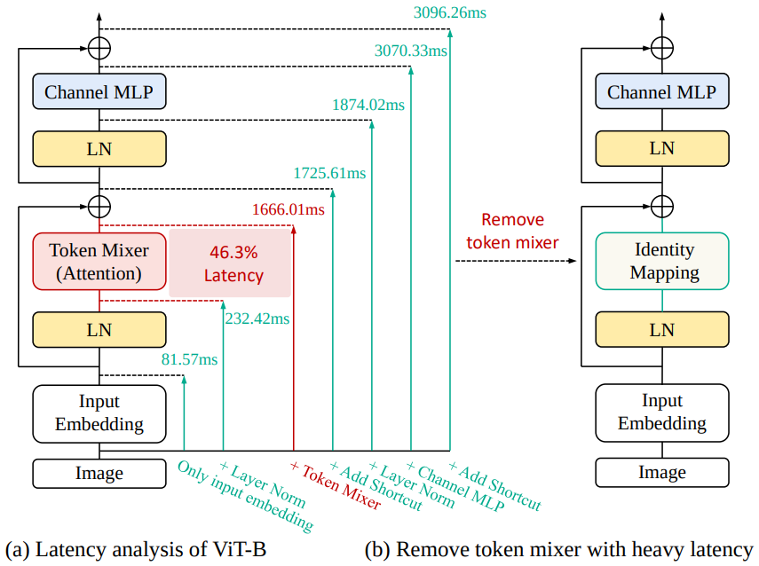
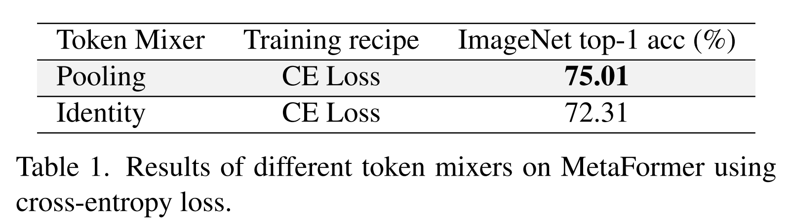
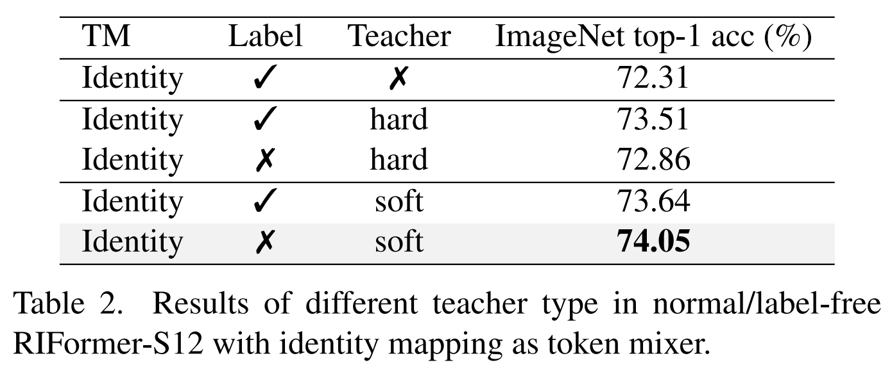
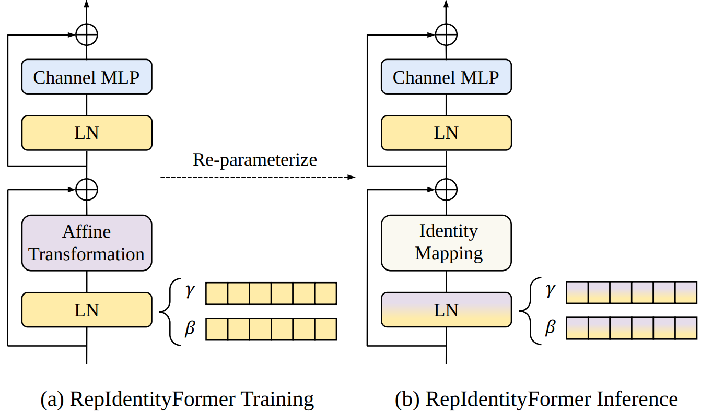
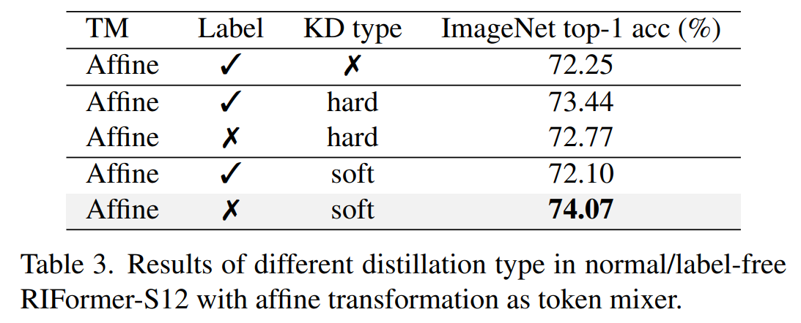
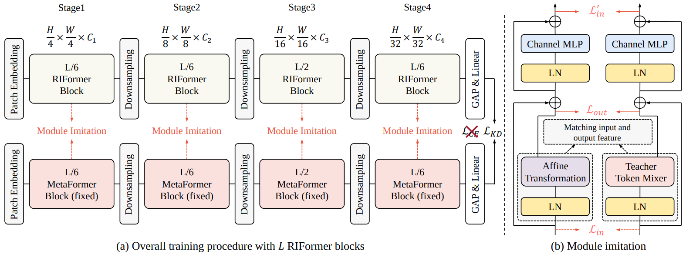
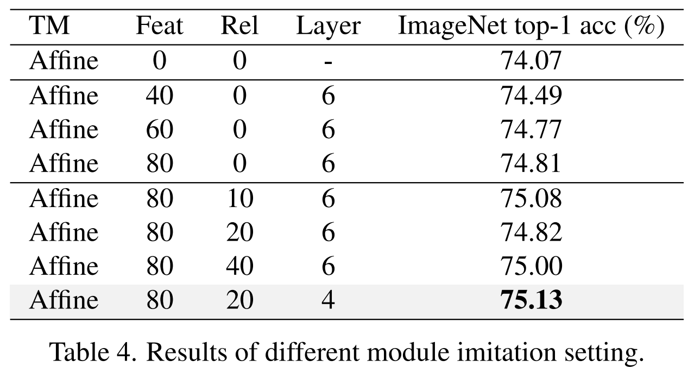
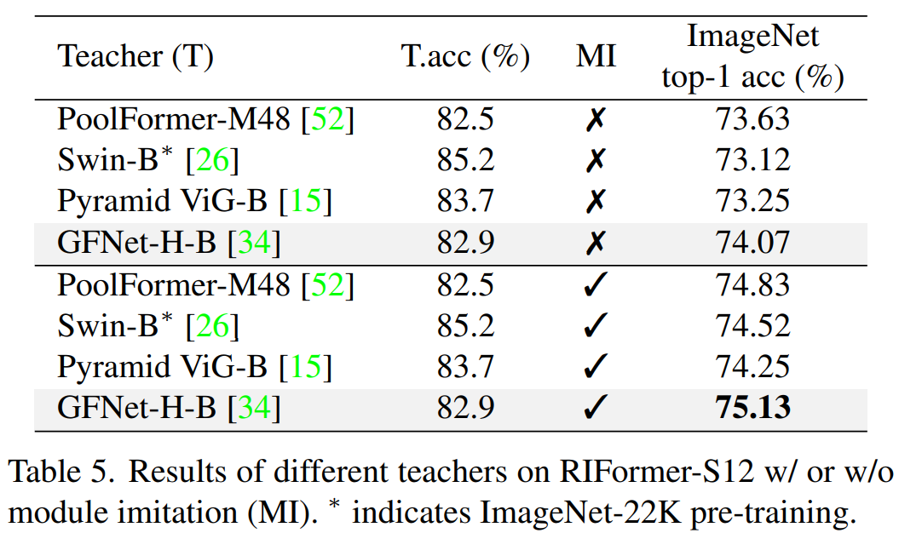
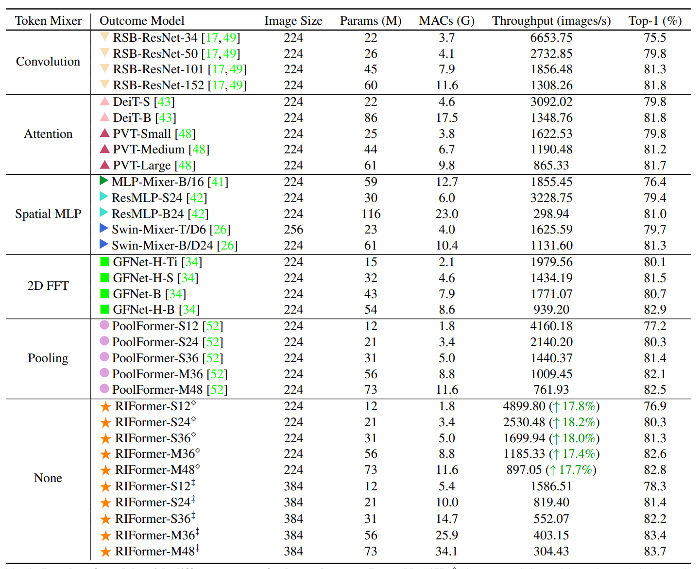

# 论文背景

Token Mixer是ViT骨干非常重要的组成成分，它用于对不同空域位置信息进行自适应聚合，但常规的自注意力往往存在高计算复杂度与高延迟问题。而直接移除Token Mixer又会导致不完备的结构先验，进而导致严重的性能下降。

基于此，本文**基于重参数机制提出了RepIdentityFormer方案以研究无Token Mixer的架构体系**。紧接着，作者改进了学习架构以打破无Token Mixer架构的局限性并总结了5条指导方针。搭配上所提优化策略后，本文构建了一种极致简单且具有优异性能的视觉骨干，此外它还具有高推理效率优势。

实验结果表明：**通过合适的优化策略，网络结构的归纳偏置可以被集成进简单架构体系中**。本文为后续优化驱动的高效网络设计提供了新的起点和思路。****

Token Mixer是ViT架构中用于空域信息聚合的关键模块，但由于采用了自注意力机制导致其计算量与内存消耗与图像尺寸强相关(`quadratic`)。

基于修正版12层ViT-B架构，作者进行了系统的延迟分析(可参考上图)。从仅包含`Input Embedding`的模块出发，逐步添加不同的操作单元，如LN、Attention、MLP等，最终构成了无GAP与分类头的ViT-Base架构。从图示可以看到：**Token Mixer部分耗时约为1433.6ms，约占整个架构耗时的46.3%**。

也就是说，Token Mixer对于模型延迟有非常大的影响，这无疑限制了其实际应用。不有而然升起一个疑问：**是否可以移除Token Mixer同时保持其高性能呢**？[MetaFormer](https://link.zhihu.com/?target=https%3A//mp.weixin.qq.com/s%3F__biz%3DMzIyMjIxNDk3OA%3D%3D%26mid%3D2651686930%26idx%3D1%26sn%3Da0931714319870e41c7049641eae56ce%26scene%3D21%23wechat_redirect)提出了无Token Mixer的架构，但发现会导致不可忽视的性能退化。基于此，**本论文旨在通过先进的优化策略(如知识蒸馏、结构重参数等)来挖掘极简ViT架构的潜力**。

# RIFomer探索之路

接下来，我们将呈现出从全监督到更先进训练体系的探索之路，调研并指定了不同的优化机制。**RIFormer采用了与MetaFormer相同的宏观与微观模块，区别仅在于RIFormer未使用Token Mixer**。

## **无Token Mixer的视觉骨干**

本文旨在移除每个基础模块中的TokenMixer以得到更高推理速度且性能保持的视觉骨干(仅在推理时移除)。

以PoolFormer-S12为起点，将其中用于TokenMixer的Pooling操作替换为Identity，同时采用常规监督方式进行训练，可以看到：**RIFormer-S12会导致不可接受的性能下降(下降约2.7%)。也就是说，当没有TokenMixer操作时，常规的监督式训练在辅助模型学习有用信息时存在一定局限性，需要更先进的训练机制**。

接下来，作者调查并修改了一系列训练机制以改善基线模型性能，可总结如下：

- Knowledge distillation
- teacher type influence
- Structure Re-parameterization
- Module Imitation
- Local partial parameters from teacher.

## **Distillation Paradigm Design**

上表对比了四种不同训练配置下的性能对比，默认老师模型为GFNet-H-B，从中可以看到：

- Hard标签蒸馏可以将模型性能从72.31%提升至73.51%。这说明带TokenMixer的老师模型对于无TokenMixer的学生模型可以起到正面促进作用了；
- Soft标签蒸馏可以取得最佳性能，学生模型性能可提升至74.05%。

总体来看：监督式训练范式看起来并非无TokenMixer架构的最佳训练方式；带TokenMixer的老师模型有助于引导训练，但仍无法弥补因移除TokenMixer导致的性能损失，即还需要引入其他策略。

## **Re-parameterization for Identity Mapping**

这几年，重参数方法在各个领域得到了广泛的应用。RIFormer推理时的TokenMixer模块可以视作LN+Identity组合。因此，训练时模块续满足以下两个前提条件：

- **per-location**操作以支撑等价变换；
- **parameteric**操作以支撑额外的表达能力。
- 使用来支撑额额外的表达能力

基于上述分析，作者在训练阶段采用仿射变换以替代恒等变换，它仅在通道维度进行缩放与移位操作，见上图。**在推理阶段，该仿射变换参数可以合并进LN层，故训练时的LN+仿射变换可以等价为LN+Identity**。详细分析请查看原文，这里给出参数变换公式如下：
$$
\gamma_i^{'} = \gamma_i(s_i - 1) \\ \beta_i^{'} = \beta_i(s_i - 1) + t_i \\
$$

从上表可以看到：**直接使用结构重参数机制并无显著优势**。作者认为：导致该现象的原因在于LN中的仿射变换是一种线性变换。因此，如果仅仅通过模型的输出进行监督训练，**额外参数的潜力可能并未得到充分挖掘**。与此同时，老师与学生模型的同构设计促使我们探索一种更有效的方式进行模块间的知识迁移。

## **Module Imitation**

有鉴于上述分析，作者进一步提出了`Module Imitation`以充分利用老师模型TokenMixer后的有用信息。如上图所示，作者希望：在训练过程中仿射操作能近似模拟TokenMixer的行为。此时，两者之间的MSE可以计算如下：
$$
\mathcal{L}_{in} = \alpha_i \| LN(T^{(a), m}) - LN(T^{(t),m}) \|_F^2 \\
$$

考虑到当前层的输入为前一Block的输出特征，因此，作者从Block层面进行匹配，此时上述损失简化为：

$$
\mathcal{L}_{in}^{'} = \alpha_i \| T^{(a), m+1} - T^{(t),m+1}\|_F^2 \\
$$

此外，在输出特征层面还进行隐特征蒸馏。

$$
\mathcal{L}_{rel} = \alpha_w \| \mathcal{R}(T^{(a), m+1}) - \mathcal{R}(T^{(t), m+1}) \|_F^2 \\
$$

仿射操作与TokenMixer输出的MSE计算如下：
$$
\mathcal{L}_{out} = \alpha_1 \| f(LN(T^{(a), m})) -g(LN(T^{(t), m})) \|_F^2 \\
$$
组合上述公式即可得到总损失：
$$
\mathcal{L} = \mathcal{L}_{soft} + \lambda_1 \mathcal{L}_{in}^{'} + \lambda_2 \mathcal{L}_{out} + \lambda_3 \mathcal{L}_{rel} \\
$$

从上表可以看到：**Module Imitation对与学生模型有正向促进作用**。最简方案已取得了75.13%，超越了PoolFormer-S12的75.01%。

从上表可以看到：尽管GFNet-H-B并没有最佳指标，但它仍是更佳的选择(无论是否使用Module Imitation)。可能这与感受野有关，**对于有限感受野的RIFormer而言，具有更大感受野的模型会是更优的老师选型**，而GFNet具有全局感受野。

最后，作者还尝试了直接加载老师模型中除TokenMixer之外的预训练参数到学生模型，学生模型的性能可以从75.13%提升至75.36%。

# 实验部分

上表给出了RIFormer与其他方案的性能对比，从中可以看到的主要信息：

- RIFormer-M36的吞吐量可达1185，同时精度高达82.6%；而PoolFormer-M36的吞吐量为109，精度为82.1%。
- 对比GFNet与RIFormer，GFNet-H-B吞吐量为939，精度为82.9%，但需要特殊的、硬件不友好的FFT操作；而RIFormer可达到与之相关的水准且无复杂的操作。
