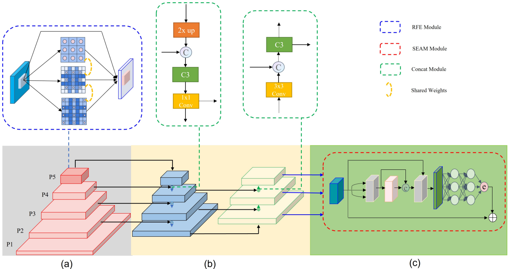
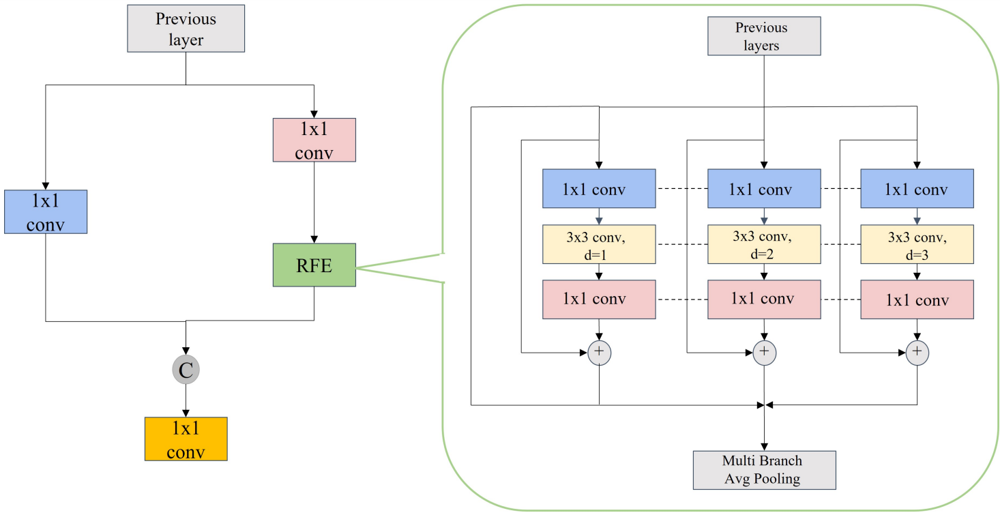

# 1 论文背景

人脸检测是很多人脸相关应用中必不可少的步骤，例如人脸识别、人脸验证和人脸属性分析等。随着近年来深度卷积神经网络的蓬勃发展，人脸检测器的性能得到了极大的提升。已经提出了许多基于深度学习的高性能人脸检测算法。一般来说，这些算法可以分为两个分支。

1. 典型的基于深度学习的人脸检测算法的一个分支使用**神经网络的级联方式作为特征提取器和分类器**来检测从粗到细的人脸。尽管它们取得了巨大的成功，但值得注意的是，级联检测器存在一些缺点，例如训练困难和检测速度慢。

2. 另一个分支是从**通用目标检测算法**改进而来的。通用目标检测器考虑了目标更常见的特征和更广泛的特征。因此，特定于任务的检测器可以共享这些信息，然后通过特殊设计强制执行这些壮观的属性。一些流行的人脸检测器，包括 YOLO、Faster R-CNN 和 RetinaNet 都属于这一类。

在本论文中，受 YOLOv5、TridentNet 和 FAN 中的注意力网络的启发，提出了一种新颖的人脸检测器，它实现了单阶段人脸检测的最新技术。尽管深度卷积网络显著改善了人脸检测，但在现实场景中检测具有高度变化的人脸、姿势、遮挡、表情、外观和照明仍然是一个巨大的挑战。在之前的工作中提出了 YOLO-Face，这是一种基于 YOLOv3 的改进人脸检测器，主要关注尺度方差问题，设计适合人脸的Anchor比率，并利用更准确的回归损失函数。WiderFace 验证集上 Easy、Medium 和 Hard 的mAP分别达到了 0.899、0.872 和 0.693。从那时起，出现了各种新的检测器，人脸检测性能得到了显著提高。

然而，对于小目标，单阶段检测器必须以更细的粒度划分搜索空间，因此容易造成正负样本不平衡的问题。此外，复杂场景中的人脸遮挡会显著影响人脸检测器的准确性。针对人脸尺度变化、样本不平衡、人脸遮挡等问题，本文提出了一种基于 YOLOv5 的人脸检测方法，称为 YOLO-FaceV2。

# 2 YOLO-FaceV2

## 2.1* 网络结构

YOLO-FaceV2 检测器的架构上图所示。它由3部分组成：Backbone、Neck 和 Head。

YOLO-FaceV2以 YOLO当中CSPDarknet53 为Backbone，并在 P5 层用 RFE 模块替换Neck，以融合多尺度特征。在Neck，保持了 SPP 和 PAN 的结构。此外，为了提高目标位置感知能力，还将P2层集成到PAN中。Head用于对类别进行分类并回归目标的位置。作者还在Head添加了一个特殊的分支，以增强模型的遮挡检测能力。

- 在图a中，左边的红色部分是检测器的Backbone，由CSP块和CBS块组成。主要用于提取输入图像的特征。并且在P5层增加RFE模块，扩大有效感受野，增强多尺度融合能力。
- 在图b中，右边的蓝色和黄色部分称为Neck层，由 SPP 和 PAN 组成。还融合了 P2 层的特征，以提高更准确的目标定位能力。
- 在图c中，引入了分离和增强注意力模块（SEAM）来增强Neck层输出部分后被遮挡人脸的响应能力。

## 2.2 Scale-Aware RFE

由于不同大小的感受野意味着不同的捕获远程依赖的能力，作者设计RFE模块以充分利用特征图中感受野的优势，通过使用扩张卷积。受 TridentNet的启发使用4个不同速率的扩张卷积分支来捕获多尺度信息和不同范围的依赖关系。所有的分支都有共享权重，唯一的区别是它们独特的感受野。

一方面，它减少了参数的数量，从而降低了潜在过拟合的风险。另一方面，它可以充分利用每个样本。

提出的RFE模块可以分为2部分：基于扩张卷积的多分支和聚集加权层，如上图所示。多分支部分分别以1,2和3作为不同扩张速率，它们都使用固定的卷积核大小 3×3。此外，作者添加了一个残差连接来防止训练过程中梯度爆炸和消失的问题。gathering and weighting 层用于收集来自不同分支的信息并对特征的每个分支进行加权。加权操作用于平衡不同分支的表示。

