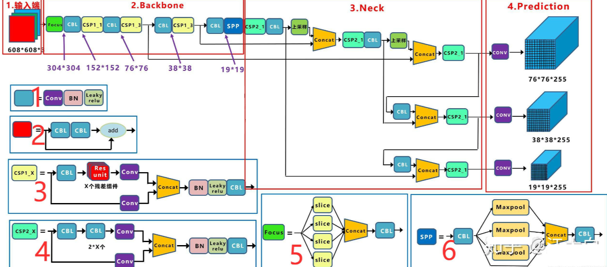
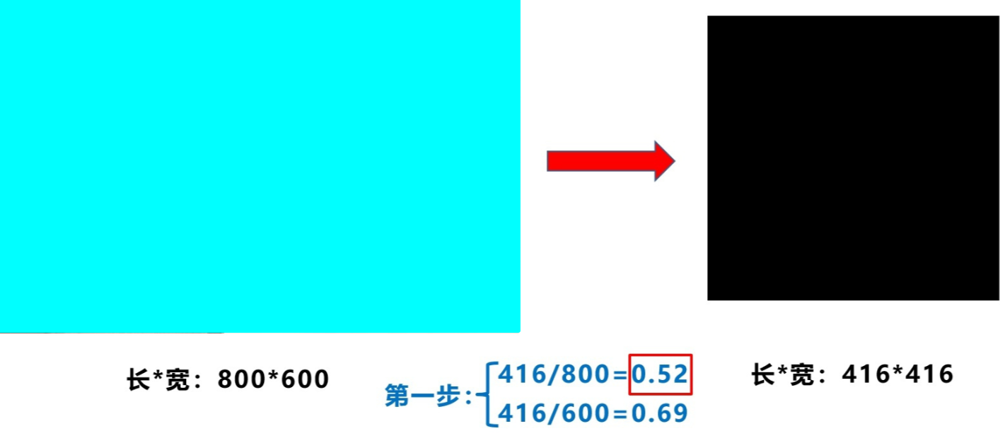
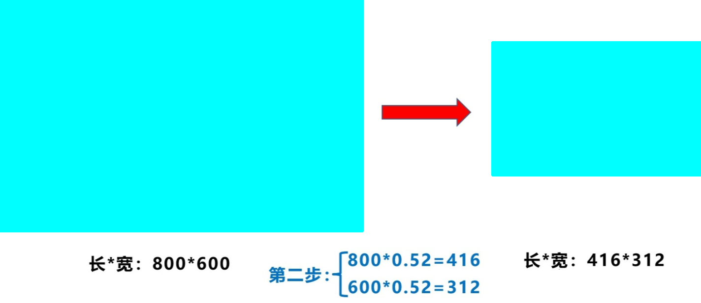
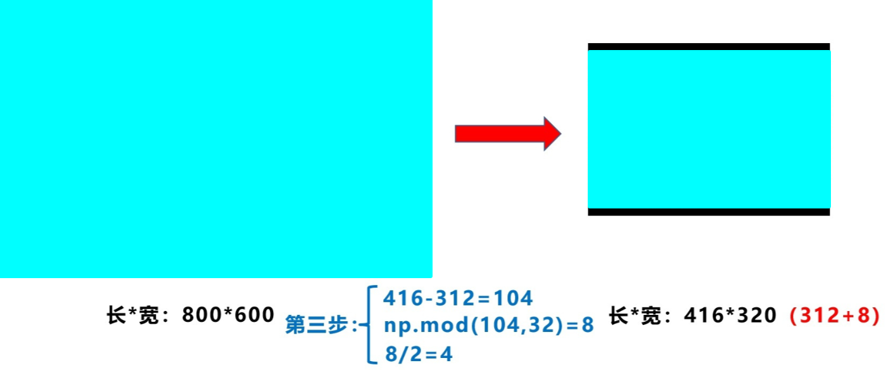

# 1 需求解读

YOLOV4出现之后不久，YOLOv5横空出世。YOLOv5在YOLOv4算法的基础上做了进一步的改进，检测性能得到进一步的提升。虽然YOLOv5算法并没有与YOLOv4算法进行性能比较与分析，但是YOLOv5在COCO数据集上面的测试效果还是挺不错的。大家对YOLOv5算法的创新性半信半疑，有的人对其持肯定态度，有的人对其持否定态度。在我看来，YOLOv5检测算法中还是存在很多可以学习的地方，虽然这些改进思路看来比较简单或者创新点不足，但是它们确定可以提升检测算法的性能。其实工业界往往更喜欢使用这些方法，而不是利用一个超级复杂的算法来获得较高的检测精度。本文将对YOLOv5检测算法中提出的改进思路进行记录。

# 2 YOLOv5算法简介

YOLOv5是一种单阶段目标检测算法，该算法在YOLOv4的基础上添加了一些新的改进思路，使其速度与精度都得到了极大的性能提升。主要的改进思路如下所示：

- 输入端：在模型训练阶段，提出了一些改进思路，主要包括Mosaic数据增强、自适应锚框计算、自适应图片缩放；
- 基准网络：融合其它检测算法中的一些新思路，主要包括：Focus结构与CSP结构；
- Neck网络：目标检测网络在BackBone与最后的Head输出层之间往往会插入一些层，Yolov5中添加了FPN+PAN结构；
- Head输出层：输出层的锚框机制与YOLOv4相同，主要改进的是训练时的损失函数GIOU_Loss，以及预测框筛选的DIOU_nms。

# 3 YOLOv5算法详解

## 3.1 YOLOv5网络架构

上图展示了YOLOv5目标检测算法的整体框图。对于一个目标检测算法而言，我们通常可以将其划分为4个通用的模块，具体包括：输入端、基准网络、Neck网络与Head输出端，对应于上图中的4个红色模块。YOLOv5算法具有4个版本，具体包括：YOLOv5s、YOLOv5m、YOLOv5l、YOLOv5x四种，本文重点讲解YOLOv5s，其它的版本都在该版本的基础上对网络进行加深与加宽。

- 输入端-输入端表示输入的图片。该网络的输入图像大小为 $608 \times 608$，该阶段通常包含一个图像预处理阶段，即将输入图像缩放到网络的输入大小，并进行归一化等操作。在网络训练阶段，YOLOv5使用Mosaic数据增强操作提升模型的训练速度和网络的精度；并提出了一种**自适应锚框计算与自适应图片缩放**方法。
- 基准网络-基准网络通常是一些性能优异的分类器种的网络，该模块用来提取一些通用的特征表示。YOLOv5中不仅使用了CSPDarknet53结构，而且使用了**Focus结构**作为基准网络。
- Neck网络-Neck网络通常位于基准网络和头网络的中间位置，利用它可以进一步提升特征的多样性及鲁棒性。虽然YOLOv5同样用到了SPP模块、FPN+PAN模块，但是实现的细节有些不同。
- Head输出端-Head用来完成目标检测结果的输出。针对不同的检测算法，输出端的分支个数不尽相同，通常包含一个分类分支和一个回归分支。YOLOv4利用GIoU Loss来代替Smooth L1 Loss函数，从而进一步提升算法的检测精度。

## 3.2 YOLOv5实现细节详解

### 3.2.1 YOLOv5基础组件

- CBL：CBL模块由Conv+BN+Leaky_relu激活函数组成，如上图中的模块1所示。
    Res unit-借鉴ResNet网络中的残差结构，用来构建深层网络，CBM是残差模块中的子模块，如上图中的模块2所示。
- CSP1_X：借鉴CSPNet网络结构，该模块由CBL模块、Res unit以及卷积层、Concate组成而成，如上图中的模块3所示。
- CSP2_X：借鉴CSPNet网络结构，该模块由卷积层和X个Res unit以及Concate组成而成，如上图中的模块4所示。
- Focus：如上图中的模块5所示，Focus结构首先将多个slice结果Concat起来，然后将其送入CBL模块中。
- SPP：采用1×1、5×5、9×9和13×13的最大池化方式，进行多尺度特征融合，如上图中的模块6所示。

### 3.2.2 输入端细节详解

- **Mosaic数据增强**：[详见YOLOv4笔记]()(`../YOLOv4/YOLOv4-2.md`)当中的详解

- **自适应锚框计算**：在YOLO系列算法中，针对不同的数据集，都需要设定特定长宽的锚点框。在网络训练阶段，模型在初始锚点框的基础上输出对应的预测框，计算其与GT框之间的差距，并执行反向更新操作，从而更新整个网络的参数，因此设定初始锚点框也是比较关键的一环。在YOLOv3和YOLOv4检测算法中，训练不同的数据集时，都是通过单独的程序运行来获得初始锚点框。YOLOv5中将此功能嵌入到代码中，每次训练时，根据数据集的名称自适应的计算出最佳的锚点框，用户可以根据自己的需求将功能关闭或者打开，具体的语句为 `parser.add_argument(‘–noautoanchor’, action=‘store_ true’, help=‘disable autoanchor check’)`，如果需要打开，只需要在训练代码时增加 `–noautoanchor`选项即可。

- **自适应图片缩放**：

针对不同的目标检测算法而言，我们通常需要执行图片缩放操作，即将原始的输入图片缩放到一个固定的尺寸，再将其送入检测网络中。YOLO系列算法中常用的尺寸包括 $416 \times 416$，$608 \times 608$ 等尺寸。原始的缩放方法存在着一些问题，由于在实际的使用中的很多图片的长宽比不同，因此缩放填充之后，两端的黑边大小都不相同，然而如果填充的过多，则会存在大量的信息冗余，从而影响整个算法的推理速度。为了进一步提升YOLOv5算法的推理速度，该算法提出一种方法能够自适应的添加最少的黑边到缩放之后的图片中。具体的实现步骤如下所述。
（1）根据原始图片大小与输入到网络图片大小计算缩放比例。

​									 
​    

（2）根据原始图片大小与缩放比例计算缩放后的图片大小

（3）计算黑边填充数值

如上图所示，416表示YOLOv5网络所要求的图片宽度，312表示缩放后图片的宽度。首先执行相减操作来获得需要填充的黑边长度104；然后对该数值执行取余操作，即$104\  \%\  32 = 8$，使用32是因为整个YOLOv5网络执行了5次下采样操作，即 $2^5 = 32$；最后对该数值除以2，即将填充的区域分散到两边。这样将$416 \times 416$大小的图片缩小到$416 \times 320$ 大小，因而极大的提升了算法的推理速度。
需要注意的是：

（1）该操作仅在模型推理阶段执行，模型训练阶段仍然和传统的方法相同，将原始图片裁剪到 $416 \times 416$ 大小；

（2）YOLOv3与YOLOv4中默认填充的数值是(0, 0, 0)，而YOLOv5中默认填充的数值是(114, 114, 114)；

（3）该操作仅仅针对原始图片的短边而言，仍然将长边裁剪到416。