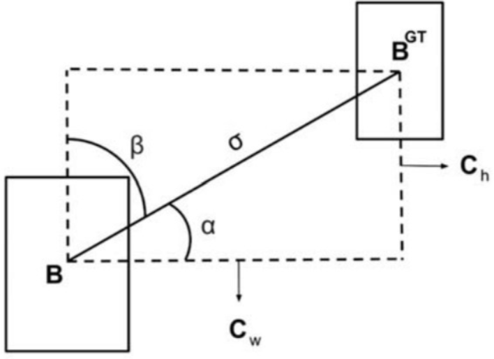
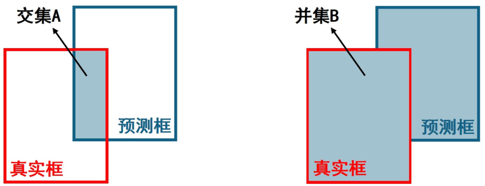

# 1 SIoU Loss

## 1.1 改进目的

一般的IoU损失函数，如GIoU, DIoU, CIoU没有考虑到真实框与预测框之间的方向，导致收敛速度较慢。SIoU在CIoU的基础上，更进一步考虑了预测框和真实框的形状相似性以及中心点的距离。具体来说，SIoU在计算IoU时会对预测框和真实框的长宽比进行归一化处理，这样可以消除不同形状的框在计算IoU时可能出现的偏差。同时，SIoU还会考虑预测框和真实框中心点的距离，这样可以更好地反映预测框和真实框的空间位置差异。

## 1.2 原理

SIoU引入真实框和预测框之间的向量角度，重新定义相关损失函数，具体包含四个部分。

**(1) 角度损失 Angle Cost**


$$
\Lambda = 1-2 \times \sin^2(\arcsin(\frac{c_h}{\sigma}) - \frac{\pi}{4})=\cos(2 \times (\arcsin(\frac{c_h}{\sigma}) - \frac{\pi}{4}))
$$
其中 $c_h$ 为真实框和预测框中心点的高度差，$\sigma$ 为真实框和预测框中心点的距离，事实上 $\text{arcsin}(\frac{c_h}{\sigma}) = \alpha$.
$$
\frac{c_h}{\sigma}=\sin(\alpha), \\

 \sigma = \sqrt{(b_{c_x}^{gt}-b_{c_x})^2+(b_{c_y}^{gt}-b_{c_y})^2}, \\

c_h = \max(b_{c_y}^{gt}, b_{c_y}) - \min(b_{c_y}^{gt}, b_{c_y}),
$$
$(b_{c_x}^{gt}, b_{c_y}^{gt})$ 为真实框中心坐标 $(b_{c_x}, b_{c_y})$ 为预测框中心坐标，可以注意到当 $\alpha$ 为 $\frac{\pi}{2}$ 或 $0$ 时，角度损失为 $0$，在训练过程中若 $\alpha < \frac{\pi}{4}$，则最小化 $\alpha$，否则最小化 $\beta$.

**（2）距离损失 Distance Cost**


$$
\Delta = \sum_{t=x,y}(1-e^{-\gamma\rho_t})=2-e^{-\gamma\rho_x}-e^{-\gamma\rho_y}, \\

\text{其中 }

\rho_x = (\frac{b_{c_x}^{gt} - b_{c_x}}{c_w})^2, \quad \rho_y= (\frac{b_{c_y}^{gt} - b_{c_y}}{c_h})^2 \quad \gamma = 2 - \Lambda,
$$
这里的 $(c_w, c_h)$ 为真实框和预测框最小外接矩形的宽和高。

**（3）形状损失 Shape Cost**
$$
\Omega = \sum_{t=w, h}(1-e^{-w_t})^\theta=(1-e^{-w_w})^\theta+(1-e^{-w_h})^\theta,\\

\text{其中 }

w_w=\frac{|w-w^{gt}|}{\max(w, w^{gt})}, \quad w_h=\frac{|h-h^{gt}|}{\max(h, h^{gt})}.
$$
$(w,h)$ 和 $(w^{gt}, h^{gt})$ 分别为预测框和真实框的宽和高，$\theta$ 控制对形状损失的关注程度，为了避免过于关注形状损失而降低对预测框的移动，作者使用遗传算法计算出 $\theta \approx 4$，因此作者定于 θ 参数范围为 [2, 6].

**（4）IoU损失 IoU Cost**



$$
\text{IoU} = \frac{并集B}{交集A} \\
$$
SIoU损失函数定义如下
$$
\text{Loss}_\text{SIoU} = 1 - \text{IoU}+\frac{\Delta + \Omega}{2}.
$$


## 1.3 改进结果


# 2 CBAM Attention

## 2.1 改进目的

在YOLOv5中添加CBAM注意力机制的主要目的是增强模型对于图像中重要部分的关注度，以此提升模型的性能和精度。通过CBAM，模型可以自适应地强化有用的特征并抑制不那么重要的特征，以此学习到更具代表性和区分度的特征表达。同时，利用CBAM生成的注意力图，我们还可以更好地理解模型在做出预测时关注的区域，这对于提升模型的解释性也有一定的帮助。

## 2.2 原理

CBAM的结构图如下


简单的分析一下上图，首先有一个原始的特征图，即输入特征图Input Feature。接着会将输入特征图送入一个Channel Attention Module（通道注意力模块）和Spatial Attention Module（空间注意力模块），最终会得到最终的特征图Refined Feature。

**Channel Attention Module（通道注意力模块）**


论文中给出了上述通道注意力模块示意图。首先会对输入特征图F分别做一个全局最大池化下采样和全局平均池化下采样， $F$ 由原来的 $H  \times W \times C$ 变成两个 $1  \times 1 \times C$ 的特征图，接着我们会将这两个特征图送入到两个全连接层（MLP）中，最终会输出两个 $1  \times 1 \times C$ 的特征图。这里两个特征图共用这两个全连接层。得到两个 $1  \times 1 \times C$ 的特征图后，我们将其相加并经过 $\text{Sigmoid}$ 激活函数将其值限制在0~1之间，这就得到了最后的Channel Attention，即上图中的 $M_c$，其尺寸为 $1  \times 1 \times C$. 这个过程用公式表示如下
$$
\textbf{M}_C(\textbf{F}) = \sigma(MLP(AvgPool(\textbf{F})) + MLP(MaxPool(\textbf{F})))
$$
在通道注意力中得到了 $1  \times 1 \times C$ 尺寸的特征图 $M_c$，并不是将 $M_c$ 作为输入送到空间注意力中，而是先用 $F$ 和 $M_c$ 相乘，得到特征图 $F'$，$F'$ 的尺寸和 $F$ 一致，都是 $H  \times W \times C$.

**Spatial Attention Module（空间注意力模块）**


论文中给出了空间注意力模块示意图，首先我们知道在上一步我们得到了一个 $H  \times W \times C$ 大小的特征图 $F'$，空间注意力首先同样会分别进行一个全局最大池化下采样和全局平均池化下采样，但是这时候我们是在channel维度上进行，全局最大池化下采用会得到上图蓝色的特征图，其尺寸为 $H \times W \times 1$，全局平均池化下采样会得到上图橙色的特征图，其尺寸也为 $H \times W \times 1$。然后我们将橙色和蓝色的特征图在channel维度进行拼接，会得到 $H \times W \times 2$ 大小的特征图。接着再次进行一次卷积，将刚刚得到的 $H \times W \times 1$ 大小的特征图变成 $H \times W \times 1$ 的特征图。最后同样接一个 $\text{sigmoid}$ 激活函数将特征图的值限制在0~1之间，即得到最终的 $M_s$，其尺寸为 $H \times W \times 1$. 这个过程用公式表示如下，其中 $f^{7 \times 7}$ 表示进行 $7 \times 7$ 的卷积
$$
\textbf{M}_c(\textbf{F}) = \sigma (f^{7 \times 7}([AvgPool(\textbf{F}); \ MaxPool{(\textbf{F})}]))
$$


## 3.4 改进结果


# 3 BiFPN

## 3.1 改进目的

将YOLOv5中的PANet层替换为BiFPN（双向特征金字塔网络）可以有助于提升模型的性能。BiFPN是一种有效的特征融合结构，通过自上而下和自下而上的双向信息流，它能够更好地融合不同层次的特征，有助于模型捕获不同尺度的目标。相比于PANet，BiFPN的融合策略不仅考虑了深层特征对浅层特征的影响（自上而下的信息流），还考虑了浅层特征对深层特征的反向影响（自下而上的信息流），使得各层特征可以更充分地交互和更新。这种全面的特征融合可以帮助模型更好地处理多尺度、多样式的目标检测任务，从而提升模型的性能。


## 3.2 原理

BiFPN 全称 Bidirectional Feature Pyramid Network 加权双向（自顶向下 + 自低向上）特征金字塔网络。

相比较于PANet，BiFPN在设计上的改变：

> 总结下图：
> 图d 蓝色部分为自顶向下的通路，传递的是高层特征的语义信息；红色部分是自底向上的通路，传递的是低层特征的位置信息；紫色部分是上述第二点提到的同一层在输入节点和输入节点间新加的一条边。


我们删除那些只有一条输入边的节点。这么做的思路很简单：如果一个节点只有一条输入边而没有特征融合，那么它对旨在融合不同特征的特征网络的贡献就会很小。删除它对我们的网络影响不大，同时简化了双向网络；如上图d 的 P7右边第一个节点

如果原始输入节点和输出节点处于同一层，我们会在原始输入节点和输出节点之间添加一条额外的边。思路：以在不增加太多成本的情况下融合更多的特性；

与只有一个自顶向下和一个自底向上路径的PANet不同，我们处理每个双向路径(自顶向下和自底而上)路径作为一个特征网络层，并重复同一层多次，以实现更高层次的特征融合。如下图EfficientNet 的网络结构所示，我们对BiFPN是重复使用多次的。而这个使用次数也不是我们认为设定的，而是作为参数一起加入网络的设计当中，使用NAS技术算出来的。


Weighted Feature Fusion (带权特征融合)：学习不同输入特征的重要性，对不同输入特征有区分的融合。
设计思路：传统的特征融合往往只是简单的 feature map 叠加/相加 (sum them up)，比如使用concat或者shortcut连接，而不对同时加进来的 feature map 进行区分。然而，不同的输入 feature map 具有不同的分辨率，它们对融合输入 feature map 的贡献也是不同的，因此简单的对他们进行相加或叠加处理并不是最佳的操作。所以这里我们提出了一种简单而高效的加权特融合的机制。
常见的带权特征融合有三种方法，分别是：

- Unbounded fusion: $O = \sum_{i} w_i * I_i$ , 这种方法比较简单，直接加一个可学习的权重。但是由于这个权重不受限制，所有可能引起训练的不稳定，所有并不推荐。

- Softmax-based fusion: $O = \sum_{i} \frac{e^{w_i} * I_i}{ \epsilon+\sum_{j}e^{w_j}}$ , 使用这种方法可以将范围放缩到 [0, 1] 之间，训练稳定，但是训练很慢，所有也不推荐。

- Fast normalized fusion: $O = \sum_{i} \frac{w_i * I_i}{ \epsilon+\sum_{j}w_j}$, 这种方法类似于Softmax也是将范围放缩到 [0, 1] 之间，而且训练速度快效率高，所以我们使用这种带权特征融合方法。


## 3.3 改进结果


# 4 Involution Conv

`models/common.py`

```python
class Involution(nn.Module):									# 935
    def __init__(self, c1, c2, kernel_size, stride):
        ...
    	return out												# 965
```

`models/yolo.py`

```python
		if m in {												# 317
                Conv, GhostConv, Bottleneck, GhostBottleneck, SPP, SPPF, 
            	DWConv,MixConv2d, Focus, CrossConv, BottleneckCSP, C3, C3TR, C3SPP, 
            	C3Ghost, nn.ConvTranspose2d, DWConvTranspose2d, C3x, Conv_CBAM,
                Involution}:									# 320
```


# 5 GELU Activation*

`utils/activations.py`

```python
class GELU(nn.Module):											# 107
    def __init__(self):
        ...
                return 0.5 * x ...								# 112
```

`models/common.py `

```python
from utils.activations import GELU
class Conv(nn.Module):
    # Standard convolution
    def __init__(self, c1, c2, k=1, s=1, p=None, g=1, act=True):  # ch_in, ch_out, kernel, stride, padding, groups
        super(Conv, self).__init__()
        #.conv = nn.Conv2d(c1, c2, k, s, autopad(k, p),dilation=1, groups=g, bias=False)#空洞卷积
        self.conv = nn.Conv2d(c1, c2, k, s, autopad(k, p), groups=g, bias=False)
        self.bn = nn.BatchNorm2d(c2)
        self.act = GELU() if act is True else (act if isinstance(act, nn.Module) else nn.Identity())

    def forward(self, x):
        return self.act(self.bn(self.conv(x)))

    def forward_fuse(self, x):
        return self.act(self.conv(x))
```


# 6 Concat BIFPN

models/common.py 

```python
GlobalParams = collections.namedtuple('GlobalParams', [			# 972
    'width_coefficient', 'depth_coefficient', 'image_size', 'dropout_rate',
...
		return x												# 1044
```

models/yolo.py

```python 
        elif m is Concat_BIFPN:
            c2 = max([ch[x] for x in f]) 	
```


# 7 MobileNetv3

models/common.py 

```python
def h_sigmoid(x):												# 1049
    return F.relu6(x + 3) / 6
...
            return y											# 1169
```

models/yolo.py

````python
        if m in {												# 317
                Conv, GhostConv, Bottleneck, GhostBottleneck, SPP, SPPF, DWConv, 
            	MixConv2d, Focus, CrossConv,
                BottleneckCSP, C3, C3TR, C3SPP, C3Ghost, nn.ConvTranspose2d, 
            	DWConvTranspose2d, C3x, Conv_CBAM,
                Involution, MobileNetV3_InvertedResidual}:
````

