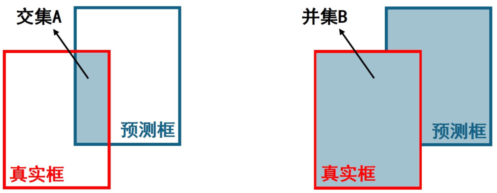
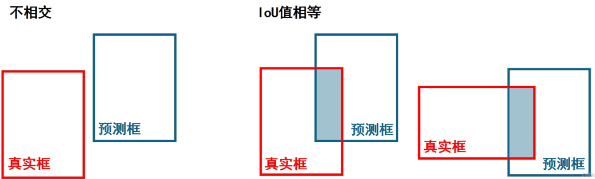
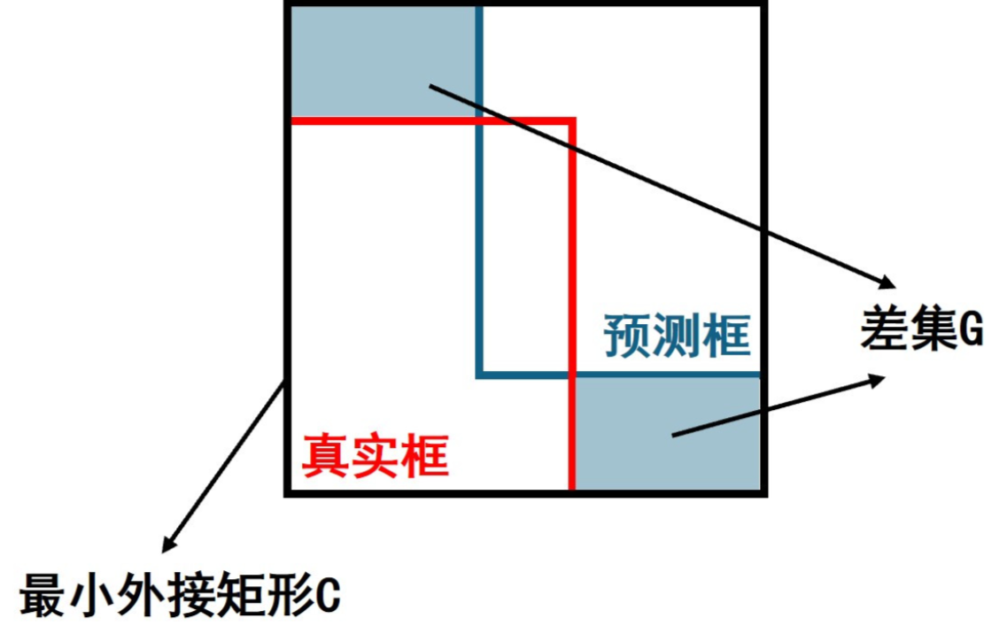
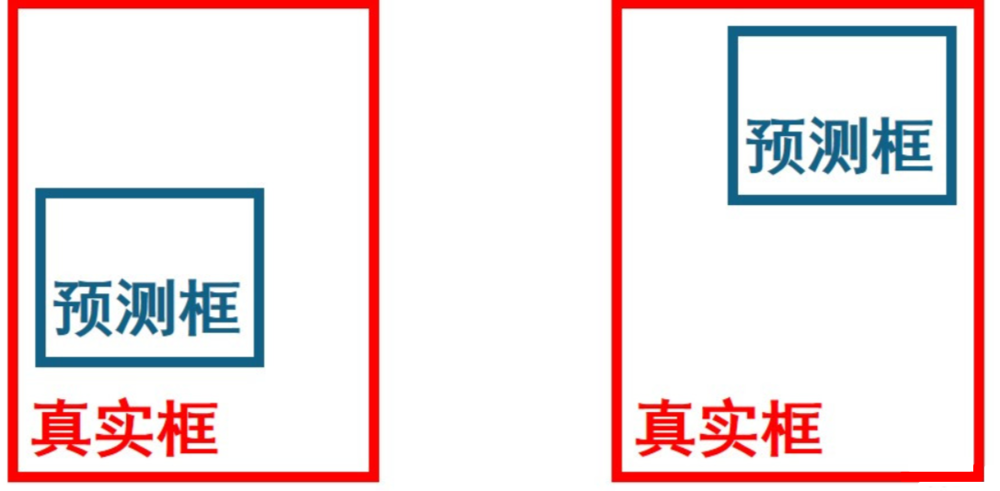
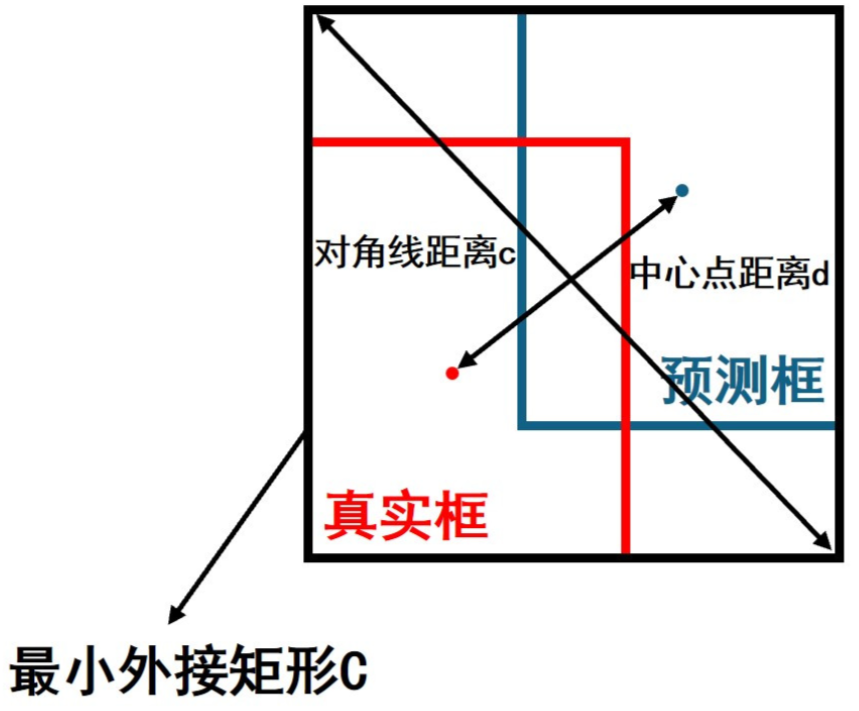
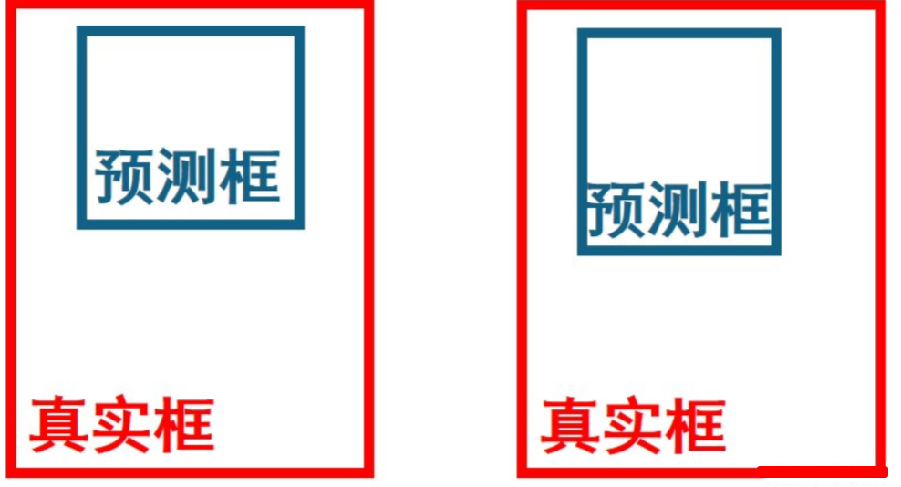
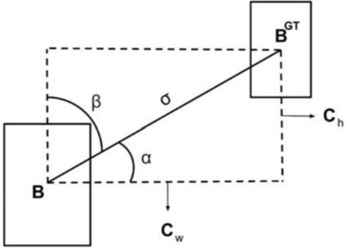
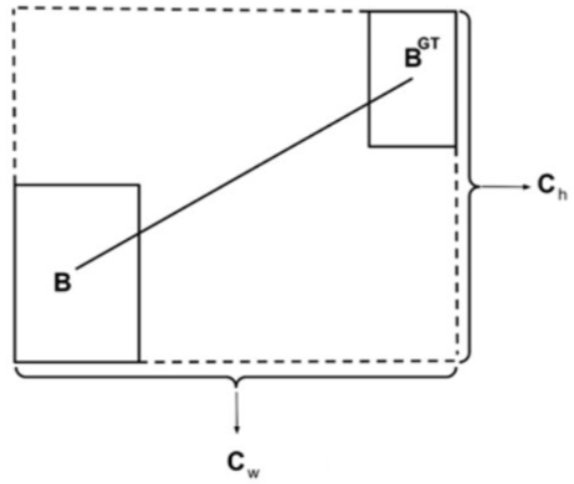
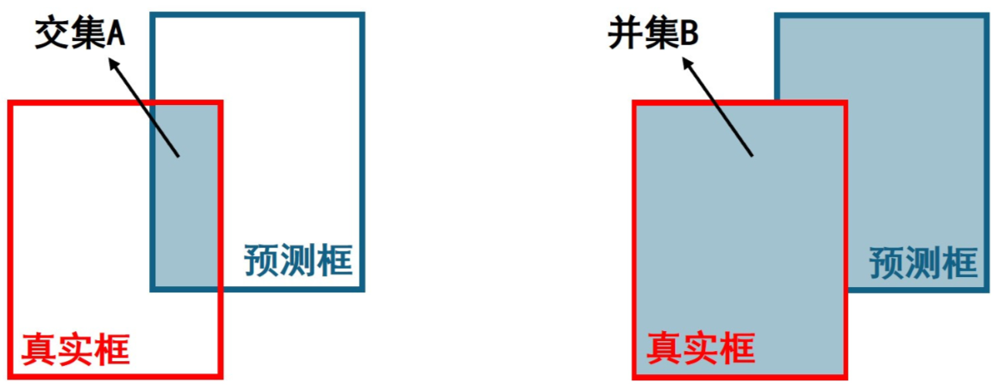

# 1 IoU

## 1.1 原理

IoU(Intersection of Union)，在目标检测中表示为真实框和预测框得交并比，定义如下：
$$
\text{IoU} = \frac{交集A}{交集B}
$$
当真实框与预测框完全重合时，IoU为1，因此在目标检测中边框损失函数定义为
$$
\text{Loss}_{\text{IoU}} = 1 - \text{IoU}
$$



## 1.2 代码实现

```python
def IoU(bbox, prebox):
'''
bbox:真实框，坐标为(左下角坐标，右上交坐标)，即(x_min1, y_min1, x_max1, y_max1)
prebox:预测框，坐标为(左下角坐标，右上交坐标)，即(x_min2, y_min2, x_max2, y_max2)
'''
#计算交集部分左下角坐标x_l, y_l,右上角坐标x_r，y_r
x_l = max(bbox[0], prebox[0])
y_l = max(bbox[1], prebox[1])
x_r = min(bbox[2], prebox[2])
y_r = min(bbox[3], prebox[3])

bbox_area = (x_max1 - x_min1) * (y_max1 - y_min1) #真实框面积
prebox_area = (x_max2 - x_min2) * (y_max2 - y_min2) #预测框面积
inter_area = max(0, x_r - x_l) * max(0, y_r - y_l) #交集部分面积

iou = inter_area / (bbox_area + prebox_area - inter_area + 1e-6) #计算iou，其中1e-6可以避免分母为0
return iou

```


# 2 GIoU

## 2.1 原理

GIoU的出现是为了解决IoU的问题。



1. 当预测框和真实框不相交时IoU恒为0，无法反应两个框之间距离得远近，并且此时IoU损失函数不可导，导致无法优化两个框不相交得情况。
2. 当两个框大小面积相同，交集部分面积也相等时，IoU损失函数无法区分预测框和真实框不同的相交情况。

因此，对GIoU引入最小外接矩形和差集。
$$
\text{GIoU} = \text{IoU} - \frac{差集G}{最小外接矩形C} \\

\text{Loss}_\text{GIoU} = 1 - \text{GIoU}
$$
GIoU不仅关注了交集区域，同时还关注其他非重合区域，更好得反映预测框和真实框的重合度；IoU损失函数取值为[0, 1]，而GIoU损失函数取值为[0, 2].


## 2.2 代码实现

```python
def GIoU(bbox, prebox):
'''
bbox:真实框，坐标为(左下角坐标，右上交坐标)，即(x_min1, y_min1, x_max1, y_max1)
prebox:预测框，坐标为(左下角坐标，右上交坐标)，即(x_min2, y_min2, x_max2, y_max2)
'''
#计算交集部分左下角坐标x_l, y_l,右上角坐标x_r，y_r
x_l = max(bbox[0], prebox[0])
y_l = max(bbox[1], prebox[1])
x_r = min(bbox[2], prebox[2])
y_r = min(bbox[3], prebox[3])

#计算最小外接矩形左下角坐标c_xl, c_yl,右上角坐标c_xr, c_yr
c_xl = min(bbox[0], prebox[0])
c_yl = min(bbox[1], prebox[1])
c_xr = max(bbox[2], prebox[2])
c_yr = max(bbox[3], prebox[3])

bbox_area = (x_max1 - x_min1) * (y_max1 - y_min1) #真实框面积
prebox_area = (x_max2 - x_min2) * (y_max2 - y_min2) #预测框面积
inter_area = max(0, x_r - x_l) * max(0, y_r - y_l) #交集部分面积
c_area = (c_xr - c_xl) * (c_yr - c_yl) #最小外接矩形面积
b_area = bbox_area + prebox_area - inter_area #并集面积

iou = inter_area / (b_area + 1e-6) #计算iou，其中1e-6为了防止分母为0

giou = iou - (c_area - b_area) / c_area #计算giou
return giou

```


# 3 DIoU

## 3.1 原理

DIoU的出现是为了解决GIoU的问题。对于GIoU，当预测框在真实框内部且预测框面积相等时，GIoU无法区分预测框和真实框的相对位置关系。



对DIoU引入中心距离，具体定义如下
$$
\text{DIoU} = \text{IoU} - \frac{d^2}{c^2} \\

\text{Loss}_{\text{DIoU}} = 1- \text{DIoU}
$$
其中d为预测框和真实框中心点的距离，c为最小外接矩形的对角线距离。



通过最小化DIoU损失函数可以直接拉近预测框和真实框之间的距离，收敛速度快。


## 3.2 代码实现

```python
def DIoU(bbox, prebox):
'''
bbox:真实框，坐标为(左下角坐标，右上交坐标)，即(x_min1, y_min1, x_max1, y_max1)
prebox:预测框，坐标为(左下角坐标，右上交坐标)，即(x_min2, y_min2, x_max2, y_max2)
'''
#计算交集部分左下角坐标x_l, y_l,右上角坐标x_r，y_r
x_l = max(bbox[0], prebox[0])
y_l = max(bbox[1], prebox[1])
x_r = min(bbox[2], prebox[2])
y_r = min(bbox[3], prebox[3])

#计算最小外接矩形左下角坐标c_xl, c_yl,右上角坐标c_xr, c_yr
c_xl = min(bbox[0], prebox[0])
c_yl = min(bbox[1], prebox[1])
c_xr = max(bbox[2], prebox[2])
c_yr = max(bbox[3], prebox[3])

bbox_area = (x_max1 - x_min1) * (y_max1 - y_min1) #真实框面积
prebox_area = (x_max2 - x_min2) * (y_max2 - y_min2) #预测框面积
inter_area = max(0, x_r - x_l) * max(0, y_r - y_l) #交集部分面积

iou = inter_area / (bbox_area + prebox_area - inter_area + 1e-6) #计算iou，其中1e-6为了防止分母为0

#计算真实框的中心坐标b_x, b_y，预测框的中心坐标p_x, p_y
p_x = (x_min2 + x_max2) / 2
p_y = (y_min2 + y_max2) / 2
b_x = (x_min1 + x_max1) / 2
b_y = (y_min1 + y_max1) / 2

c = (c_xr - c_xl) ** 2 + (c_yr - c_yl) ** 2 #对角线距离c
d = (p_x - b_x) ** 2 + (p_y - b_y) ** 2 #中心距离d

diou = iou - d / c #计算diou
return diou

```


# 4 CIoU

## 4.1 原理

CIoU的出现是为了解决DIoU的问题。对于DIoU，当预测框在真实框内部且预测框面积以及中心距离相等时，GIoU无法区分预测框和真实框的长宽比关系。



对于DIoU，当预测框在真实框内部且预测框面积以及中心距离相等时，GIoU无法区分预测框和真实框的长宽比关系。对此CIoU引入长宽比因子，具体定义如下
$$
\text{CIoU} = \text{IoU} - \frac{d^2}{c^2} - \frac{\nu^2}{(1 - \text{IoU} ) + \nu} \\

\text{Loss}_{\text{CIoU}} = 1 - \text{CIoU}
$$
其中d为预测框和真实框中心点的距离，c为最小外接矩形的对角线距离，$\nu$是长宽比的相似性因子，定义如下
$$
\nu = \frac{4}{\pi^2}(\text{arctan} \frac{W_b}{H_b} - \text{arctan} \frac{W_p}{H_p}) ^ 2
$$
其中$W_b, H_b, W_p, H_p$分别为真实框宽、高以及预测框宽、高。


## 4.2 代码实现

```python
def CIoU(bbox, prebox):
'''
bbox:真实框，坐标为(左下角坐标，右上交坐标)，即(x_min1, y_min1, x_max1, y_max1)
prebox:预测框，坐标为(左下角坐标，右上交坐标)，即(x_min2, y_min2, x_max2, y_max2)
'''
#计算交集部分左下角坐标x_l, y_l,右上角坐标x_r，y_r
x_l = max(bbox[0], prebox[0])
y_l = max(bbox[1], prebox[1])
x_r = min(bbox[2], prebox[2])
y_r = min(bbox[3], prebox[3])

#计算最小外接矩形左下角坐标c_xl, c_yl,右上角坐标c_xr, c_yr
c_xl = min(bbox[0], prebox[0])
c_yl = min(bbox[1], prebox[1])
c_xr = max(bbox[2], prebox[2])
c_yr = max(bbox[3], prebox[3])

bbox_area = (x_max1 - x_min1) * (y_max1 - y_min1) #真实框面积
prebox_area = (x_max2 - x_min2) * (y_max2 - y_min2) #预测框面积
inter_area = max(0, x_r - x_l) * max(0, y_r - y_l) #交集部分面积

iou = inter_area / (bbox_area + prebox_area - inter_area + 1e-6) #计算iou，其中1e-6为了防止分母为0

#计算真实框的中心坐标b_x, b_y，预测框的中心坐标p_x, p_y
p_x = (x_min2 + x_max2) / 2
p_y = (y_min2 + y_max2) / 2
b_x = (x_min1 + x_max1) / 2
b_y = (y_min1 + y_max1) / 2

c = (c_xr - c_xl) ** 2 + (c_yr - c_yl) ** 2 #对角线距离c
d = (p_x - b_x) ** 2 + (p_y - b_y) ** 2 #中心距离d

v = 4 * (math.atan((x_max1 - x_min1) / (y_max1 - y_min1)) - math.atan((x_max2 - x_min2) / (y_max2 - y_min2))) ** 2 / (math.pi ** 2) #计算长宽比因子

ciou = iou - d / c - v ** 2 / (1 - iou + v)#计算ciou
return ciou

```


# 5 SIoU

## 5.1 原理

一般的IoU损失函数，如GIoU, DIoU, CIoU没有考虑到真实框与预测框之间的方向，导致收敛速度较慢，对此SIoU引入真实框和预测框之间的向量角度，重新定义相关损失函数，具体包含四个部分。

**（1）角度损失 Angle Cost**


$$
\Lambda = 1-2 \times \sin^2(\arcsin(\frac{c_h}{\sigma}) - \frac{\pi}{4})=\cos(2 \times (\arcsin(\frac{c_h}{\sigma}) - \frac{\pi}{4}))
$$
其中 $c_h$ 为真实框和预测框中心点的高度差，$\sigma$ 为真实框和预测框中心点的距离，事实上 $\text{arcsin}(\frac{c_h}{\sigma})$ 等于角度 $\alpha$。
$$
\frac{c_h}{\sigma}=\sin(\alpha) \\

 \sigma = \sqrt{(b_{c_x}^{gt}-b_{c_x})^2+(b_{c_y}^{gt}-b_{c_y})^2} \\

c_h = \max(b_{c_y}^{gt}, b_{c_y}) - \min(b_{c_y}^{gt}, b_{c_y})
$$
$(b_{c_x}^{gt}, b_{c_y}^{gt})$ 为真实框中心坐标 $(b_{c_x}, b_{c_y})$ 为预测框中心坐标，可以注意到当 $\alpha$ 为 $\frac{\pi}{2}$ 或 $0$ 时，角度损失为 $0$，在训练过程中若 $\alpha < \frac{\pi}{4}$，则最小化 $\alpha$，否则最小化 $\beta$.


**（2）距离损失Distance Cost**


$$
\Delta = \sum_{t=x,y}(1-e^{-\gamma\rho_t})=2-e^{-\gamma\rho_x}-e^{-\gamma\rho_y} \\

\text{其中 }

\rho_x = (\frac{b_{c_x}^{gt} - b_{c_x}}{c_w})^2, \quad \rho_y= (\frac{b_{c_y}^{gt} - b_{c_y}}{c_h})^2 \quad \gamma = 2 - \Lambda
$$
注意：这里的 $(c_w, c_h)$ 为真实框和预测框最小外接矩形的宽和高。


**（3）形状损失 Shape Cost**
$$
\Omega = \sum_{t=w, h}(1-e^{-w_t})^\theta=(1-e^{-w_w})^\theta+(1-e^{-w_h})^\theta\\

\text{其中 }

w_w=\frac{|w-w^{gt}|}{\max(w, w^{gt})}, \quad w_h=\frac{|h-h^{gt}|}{\max(h, h^{gt})}
$$
$(w,h)$ 和 $(w^{gt}, h^{gt})$ 分别为预测框和真实框的宽和高，$\theta$ 控制对形状损失的关注程度，为了避免过于关注形状损失而降低对预测框的移动，作者使用遗传算法计算出 $\theta \approx 4$，因此作者定于 θ 参数范围为[2, 6].


**（4）IoU损失 IoU Cost**



$$
\text{IoU} = \frac{并集B}{交集A} \\
$$
综上所述，SIoU损失函数定义如下
$$
\text{Loss}_\text{SIoU} = 1 - \text{IoU}+\frac{\Delta + \Omega}{2}
$$


## 5.2 代码实现

```python
elif self.iou_type == 'siou':
	# SIoU Loss https://arxiv.org/pdf/2205.12740.pdf
	'''
	预测框和真实框坐标形式为xyxy，即左下右上角坐标或左上右下角坐标
	'''
	s_cw = (b2_x1 + b2_x2 - b1_x1 - b1_x2) * 0.5 #真实框和预测框中心点的宽度差
	s_ch = (b2_y1 + b2_y2 - b1_y1 - b1_y2) * 0.5 #真实框和预测框中心点的高度差
	sigma = torch.pow(s_cw ** 2 + s_ch ** 2, 0.5) #真实框和预测框中心点的距离
	sin_alpha_1 = torch.abs(s_cw) / sigma #真实框和预测框中心点的夹角β
	sin_alpha_2 = torch.abs(s_ch) / sigma #真实框和预测框中心点的夹角α
	threshold = pow(2, 0.5) / 2 #夹角阈值
	sin_alpha = torch.where(sin_alpha_1 > threshold, sin_alpha_2, sin_alpha_1) #α大于45°则考虑优化β，否则优化α
	angle_cost = torch.cos(torch.arcsin(sin_alpha) * 2 - math.pi / 2) #角度损失
	rho_x = (s_cw / cw) ** 2 
	rho_y = (s_ch / ch) ** 2
	gamma = angle_cost - 2
	distance_cost = 2 - torch.exp(gamma * rho_x) - torch.exp(gamma * rho_y) #距离损失
	omiga_w = torch.abs(w1 - w2) / torch.max(w1, w2)
	omiga_h = torch.abs(h1 - h2) / torch.max(h1, h2)
	shape_cost = torch.pow(1 - torch.exp(-1 * omiga_w), 4) + torch.pow(1 - torch.exp(-1 * omiga_h), 4) #形状损失
	iou = iou - 0.5 * (distance_cost + shape_cost) #siou

loss = 1.0 - iou

```


