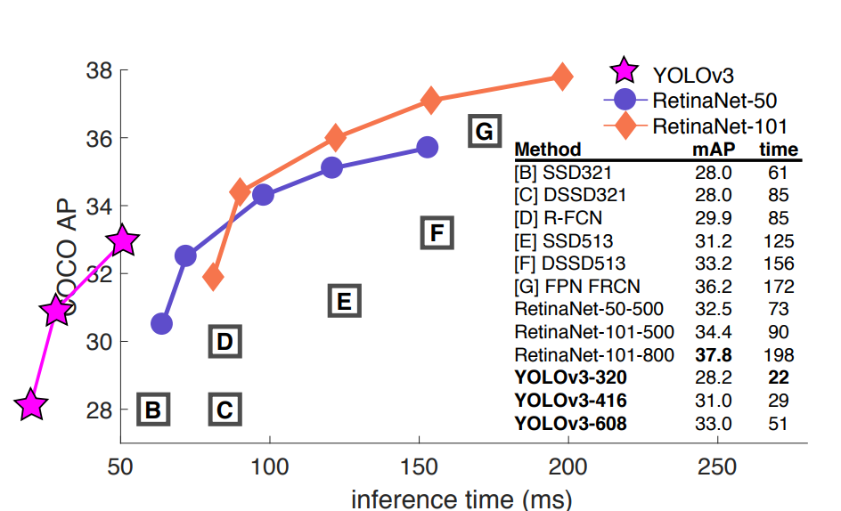
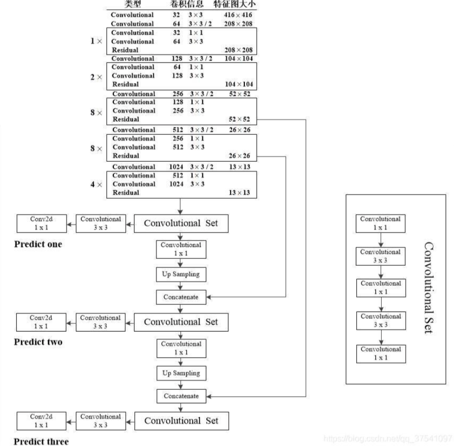
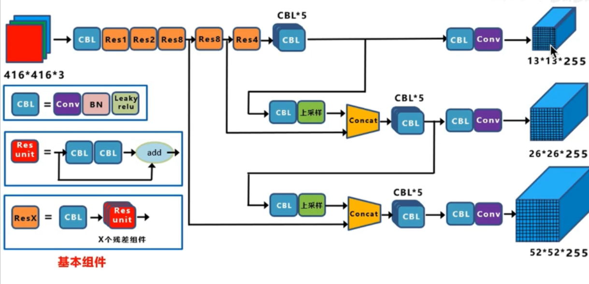
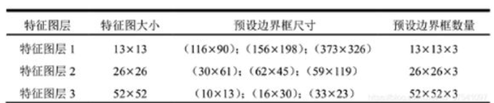
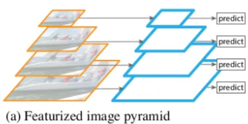
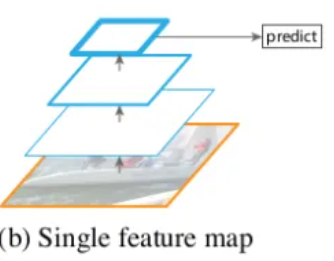
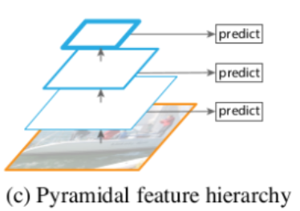
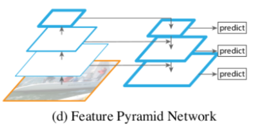

![YOLO学习笔记[3]——YOLOv3详解](https://picx.zhimg.com/70/v2-ba0f2e39eb12b2e83b6101e7432feb24_1440w.image?source=172ae18b&biz_tag=Post)

# YOLOv3详解

YOLOv3模型相较之前复杂了许多，可以通过**改变模型结构来权衡速度和精度**，而且保留了很多v2和v1的特性，由于v3的论文写的十分随意，所以掌握v1和v2是十分必要的。


### 2.1 原始版本特性保留

YOLOv3保留v1和v2中的特性如下：

- 从YOLOv1开始，YOLO算法就是通过**划分单元格grid cell**来做检测，只是划分的数量不一样。
- 采用"**leaky ReLU**"作为激活函数。

> Leaky ReLU函数通过把 $x$ 的非常小的线性分量给予负输入 0.01$x$ 来调整负值的零梯度问题。 Leaky有助于扩大ReLU函数的范围，通常 $\alpha x$ 的值为0.01左右。 Leaky ReLU的函数范围是负无穷到正无穷。


$$
LeakyRelu(x)
\begin{cases}
x, \ \ \ \ \ x > 0\\
\alpha x,\ \ \  x \le 0

\end{cases}
$$

- **端到端进行训练**,统一为回归问题。一个loss function搞定训练，只需关注输入端和输出端。
- 从YOLOv2开始，YOLO就用batch normalization作为正则化、加速收敛和避免过拟合的方法，**把BN层和leaky relu层接到每一层卷积层之后**。
- **多尺度训练**。想速度快点，可以牺牲准确率；想准确率高点，可以牺牲一点速度。
- 沿用了v2中边框预测的方法(**详见[YOLOv2解析](https://zhuanlan.zhihu.com/p/564732055)中的2.2、2.3、2.4节**)


### 2.2 v3改进之处

YOLO每一代的提升很大一部分决定于backbone网络的提升，从v2的darknet-19到v3的darknet-53。YOLOv3还提供为了速度而生的轻量级主干网络backbone——tiny darknet。速度改进如下：



本次最主要的改进之处为以下三点：

- 多尺度预测（引入FPN）
- 更好的backbone(darknet-53,类似于ResNet引入残差结构)
- 分类器不再使用softmax(darknet-19中使用)，损失函数中采用binary cross-entropy loss（二分类交叉损失熵）


## 3.多尺度预测（引入FPN）

### 3.1 多尺度预测

在每个grid cell预先设定一组不同大小和宽高比的边框，来覆盖整个图像的不同位置和多种尺度。每种尺度预测3个box, anchor的设计方式仍然使用`聚类`（**详见[YOLOv2解析](https://zhuanlan.zhihu.com/p/564732055)中的2.2、2.3、2.4节**）,得到9个聚类中心,将其按照大小均分给3个尺度，**利用这三种尺度的特征层进行边框的预测**。



上图是YOLOv3 416模型进行绘制的，输入的尺寸是416x416，预测的三个特征层大小分别是13，26，52。其中Convolutional是指Conv2d + BN + Leaky-ReLU。

将上图可视化：



上图三个蓝色方框内表示Yolov3的三个基本组件：

1. **CBL：**YOLOv3网络结构中的最小组件，由**Conv+Bn+Leaky_relu**激活函数三者组成。
2. **Res unit：**借鉴**Resnet**网络中的残差结构，让网络可以构建的更深。
3. **ResX：**由一个**CBL**和**X**个残差组件构成，是YOLOv3中的大组件。每个Res unit模块前面的CBL都起到下采样的作用，因此经过5次Res模块后，得到的特征图是**416 -> 208 -> 104 -> 52 -> 26 -> 13大小**。

**其他基础操作：**

1. **Concat**：张量拼接，会扩充两个张量的维度，例如 $26 \times 26 \times 256$ 和$ 26 \times 26 \times 512$ 两个张量拼接，结果是 $ 26 \times 26 \times 768$。Concat和cfg文件中的route功能一样。
2. **add**：张量相加，张量直接相加，不会扩充维度，例如 $104 \times 104 \times 128$ 和 $104 \times 104 \times 128$ 相加，结果还是 $104 \times 104 \times 128$。add和cfg文件中的shortcut功能一样。

由上述操作获得三种尺度的特征图如下：

- 尺度1：在基础网络之后添加一些卷积层，输出 $ 13 \times 13 $ 大小的特征图。
- 尺度2：从尺度1中的倒数第二层的卷积层上采样(  $ \times 2 $ )再与最后一个 $ 26 \times 26 $ 大小的特征图相加,再次通过多个卷积后，输出 $ 26 \times 26 $ 大小的特征图。
- 尺度3：从尺度2中的倒数第二层的卷积层上采样( $ \times 2 $ )再与最后一个 $ 52 \times 52 $ 大小的特征图相加,再次通过多个卷积后，输出 $ 52 \times 52 $ 大小的特征图。




### 3.2 FPN介绍

```
FPN论文链接：https://arxiv.org/abs/1612.03144
```

特征图金字塔网络FPN（Feature Pyramid Networks）是2017年提出的一种网络，FPN主要解决的是物体检测中的多尺度问题，通过简单的网络连接改变，在基本不增加原有模型计算量的情况下，大幅度提升了小物体检测的性能。

**低层的特征语义信息比较少，但是目标位置准确；高层的特征语义信息比较丰富，但是目标位置比较粗略**。另外虽然也有些算法采用多尺度特征融合的方式，但是一般是采用融合后的特征做预测，而本文FPN不一样的地方在于预测是在不同特征层独立进行的。

- 第一种金字塔：使用图像金字塔来创建一个特征金字塔，每个尺度的图像分别计算其特征。也就是说要先使用原图通过多次缩放来创建一个图像金字塔，然后再计算每个尺度图像的特征生成一个特征金字塔。特征化图像金字塔的优点是它创建的多尺度特征的所有层次都包含很强的语义特征，包括高分辨率的层次。这种方法的优点是精度比较高；但是缺点也很明显，那就是需要大量的算力和内存空间。而且图像金字塔通常用于测试阶段，这就导致了训练和测试的不一致。



- 第二种金字塔： 由于种种的原因，在Fast R-CNN和Faster R-CNN中默认的配置没有使用图像金字塔，但**只取了最后一层特征**。在到后来人工特征就被通过深度卷积网络计算特征替代了。深度卷积网络不仅可以表示更高层次的语义，对尺度的变化也有更好的鲁棒性，因此可以使用一个尺度的输入计算的特征来进行识别任务。第二种金字塔中只使用了最后卷积层的结果，卷积网络中的不同层次会产生不同空间分辨率的特征图，但是不同的卷积层得到的特征图会有很大的语义鸿沟。高分辨率具有很好的低层次特征，但是不利于识别物体，低分辨率的特征具有很好的高层次特征，但是不利于识别小物体。



- 第三种金字塔： SSD网络中使用的是第三种金字塔，SSD中将卷积网络中不同层计算出的特征图组成了一个特征金字塔。但是为了避免使用低层次的特征，在构建特征金子塔的时候是从后面的层次开始，并且又追加了几个新层。这样就损失了高分辨率的特征图，对检测小目标是不利的。



- 第四种金字塔： 也就是主角FPN，目的是只使用一个尺度的输入创建一个所有层次都具有很强语义特征的特征金字塔。主要分了自下向上的一条路径和自上到下的一条路径。**自下向上就是深度卷积网络的前向提取特征的过程，自上而下则是对最后卷积层的特征图进行上采样的过程，横向的连接则是融合深层的卷积层特征和浅层卷积特征的过程**。这也就是为什么对小物体也有很好的检测效果，它融合了深层卷积层的高级别特征和浅层卷积层的低级别特征。




### 3.3 FPN计算过程


- 第一步bottom-up：自下而上的路径。取深度卷积网络,也就是backbone网络中每个stage的输出作为我们金字塔的一个层，例如以Resnet作为backbone，我们取conv2，conv3，conv4，conv5这几个残差块的最后输出组成特征金字塔，也就是上图中左边的金字塔。我们记为{C2 , C3 , C4 , C5}，对应的stride为{4, 8, 16, 32}。因为会占用大量的内存，没有取第一个残差块的输出。
- 第二步top-down：自上而下的路径。首先将{C2 , C3 , C4 , C5}执行1x1的卷积来降低通道的维度，再将空间信息少但是语义信息强的深层卷积层的输出进行2倍的上采样（在原有图像像素的基础上在像素点之间采用合适的插值算法插入新的像素，在本文中使用的是最近邻上采样(插值)）。记上采样得到{P2, P3 , P4 , P5}。
- 第三步lateral connection：利用横向连接将第一步和第二步的结果merge到一起。因为每个stage输出的特征图之间是2倍的关系，所以上一层上采样得到的特征图的大小 P_{n+1} 和本层 C_n 的大小一样，就可以直接将对应元素相加。


- 第四步： 在merge得到的结果后面接一个3x3的卷积来减轻上采样的混叠效应（混叠效应产生原因：插值生成的图像灰度不连续，在灰度变化的地方可能出现明显的锯齿状）。

## 4. 新backbone——Darknet-53


上图是以输入图像256 \times 256进行预训练来进行介绍的，常用的尺寸是416 \times 416，都是32的倍数。这个网络主要是由一系列的1x1和3x3的卷积层组成（**每个卷积层后都会跟一个BN层和一个LeakyReLU层**），作者说因为网络中有53个convolutional layers，所以叫做Darknet-53（2 + 1*2 + 1 + 2*2 + 1 + 8*2 + 1 + 8*2 + 1 + 4*2 + 1 = 53 按照顺序数，最后的Connected是全连接层也算卷积层，一共53个）

整个v3结构里面，是**没有池化层和全连接层**的。前向传播过程中，张量的尺寸变换是通过改变卷积核的步长来实现的，比如stride=(2, 2)，这就等于将图像边长缩小了一半(即面积缩小到原来的1/4)。在YOLOv3中，要经历5次缩小，会将特征图缩小到原输入尺寸的1/32。输入为416x416，则输出为13x13(416/32=13)。

YOLOv2中对于前向过程中张量尺寸变换，都是通过**最大池化**来进行，一共有5次。而v3是通过**卷积核增大步长**来进行，也是5次。

> 注：多通道卷积
> 对于多通道图像+多卷积核做卷积，计算方法如下:


> 输入有3个通道，同时有2个卷积核。对于每个卷积核，先在输入3个通道分别作卷积，再将3个通道结果加起来得到卷积输出。**所以对于某个卷积层，无论输入图像有多少个通道，输出图像通道数总是等于卷积核数量**！ 对**多通道图像做**1\times1**卷积**，其实就是将输入图像于每个通道乘以卷积系数后加在一起，即相当于把原图像中本来 **各个独立的通道“联通”**在了一起。

## 5.分类损失采用binary cross-entropy loss

### 5.1 不使用Softmax对每个框进行分类

- **预测对象类别时**改成使用logistic的输出进行预测。这样能够支持多标签对象（比如一个人有Woman 和 Person两个标签）。
- Softmax使得每个框分配一个类别（score最大的一个），而对于`Open Images`这种数据集，目标可能有重叠的类别标签(people和woman)，因此Softmax不适用于多标签分类。
- Softmax可被独立的多个logistic分类器替代，且准确率不会下降。

### 5.2 loss function

在v3的论文里没有明确提所用的损失函数，我们可以从分析前者的版本和源码获知v3的损失函数形式。

在v1中使用了一种叫sum-square error的损失计算方法，就是简单的差方相加而已。想详细了解的可以看我《[YOLOv1解析](https://zhuanlan.zhihu.com/p/564708049)》。在目标检测任务里，有几个关键信息是需要确定的: (x,y),(w,h),class,confidence 根据关键信息的特点可以分为上述四类，损失函数应该由各自特点确定。最后加到一起就可以组成最终的loss_function了，也就是一个loss_function搞定端到端的训练。可以从代码分析出v3的损失函数，同样也是对以上四类，不过相比于v1中简单的总方误差，还是有一些调整的：

```python
xy_loss = object_mask * box_loss_scale * K.binary_crossentropy(raw_true_xy, raw_pred[..., 0:2],
                                                                       from_logits=True)
wh_loss = object_mask * box_loss_scale * 0.5 * K.square(raw_true_wh - raw_pred[..., 2:4])
confidence_loss = object_mask * K.binary_crossentropy(object_mask, raw_pred[..., 4:5], from_logits=True) + \
                          (1 - object_mask) * K.binary_crossentropy(object_mask, raw_pred[..., 4:5],
                                                                    from_logits=True) * ignore_mask
class_loss = object_mask * K.binary_crossentropy(true_class_probs, raw_pred[..., 5:], from_logits=True)

xy_loss = K.sum(xy_loss) / mf
wh_loss = K.sum(wh_loss) / mf
confidence_loss = K.sum(confidence_loss) / mf
class_loss = K.sum(class_loss) / mf
loss += xy_loss + wh_loss + confidence_loss + class_loss
```

以上是一段keras框架描述的YOLOv3 的loss_function代码。忽略恒定系数不看，可以从上述代码看出：除了**w, h的损失函数依然采用总方误差**之外，**其他部分的损失函数用的是二值交叉熵**最后加到一起。（binary_crossentropy是一个最简单的交叉熵，一般用于二分类）


## 6.YOLOv3的训练与预测

参考：[深入浅出Yolo系列之Yolov3&Yolov4&Yolov5&Yolox核心基础知识完整讲解 - 知乎 (zhihu.com)](https://zhuanlan.zhihu.com/p/143747206)

[【精读AI论文】YOLO V3目标检测（附YOLOV3代码复现）_哔哩哔哩_bilibili](https://link.zhihu.com/?target=https%3A//www.bilibili.com/video/BV1Vg411V7bJ%3Fp%3D1)

### 6.1 训练


训练过程中，当输入为 416*416 模型会输出10647个预测框(三种尺寸的特征图，每种尺寸三个预测框一共 (13\times13+26\times26+52\times52)\times3=10647 )，为每个输出框根据训练集中的ground truth为每个预测框**打上标签**(正例：与ground truth的IOU最大；负例：IOU<阈值0.5；忽略：预测有物体的框但IOU并非最大在NMS中被舍去)。再使用**损失函数**进行优化，更新网络参数。

### 6.2 预测


如上图所示：在训练过程中对于每幅输入图像，YOLOv3会预测三个不同大小的3D tensor，对应着三个不同的scale，设计这三个scale的目的是为了能检测出不同大小的物体。 这里以13 * 13的tensor为例，对于这个scale,原始输入图像会被分割成13 × 13的grid cell，每个grid cell对应着3D tensor中的1x1x255这样一个长条形voxel。255是由3*(4+1+80)而来，由上图可知，公式 N\times N\times [3\times (4+1+80)] 中 N\times N 表示的是scale size例如上面提到的 13\times13 。3表示的是each grid cell predict 3 boxes。4表示的是坐标值即 (t_x,t_y,t_h,t_w) 。1表示的是置信度，80表示的是COCO类别数目。

- 如果训练集中某一个ground truth对应的bounding box中心恰好落在了输入图像的某一个grid cell中，那么这个grid cell就负责预测此物体的bounding box,于是这个grid cell所对应的置信度为1，其他grid cell的置信度为0．每个grid cell都会被赋予3个不同大小的prior box，学习过程中，这个grid cell会学会如何选择哪个大小的prior box。作者定义的是**选择与ground truth的IOU重合度最高的prior box**。
- 上面说到的三个预设的不同大小的prior box，这三个大小是如何计算的，首先在训练前，将COCO数据集中的所有bbox使用k-means clustering分成９个类别，每３个类别对应一个scale，故总共３个scale，这种关于box大小的先验信息帮助网络准确预测每个box的offset和coordinate。从直观上，大小合适的box会使得网络更精准的学习。（**详见《[YOLOv2解析](https://zhuanlan.zhihu.com/p/564732055)》中的2.4 Dimension Cluster**）


将图片输入训练好的预测网络，首先输出预测框的信息 (obj,t_x,t_y,t_h,t_w,cls) ，每个预测框的class-specific confidence score(conf_score=obj*cls)以后，设置**阈值**，滤掉得分低的预测框，对保留的预测框进行**NMS处理**，就得到最终的检测结果。（**详见《[YOLOv1解析](https://zhuanlan.zhihu.com/p/564708049)》中的3. IOU和NMS处理流程**）

- 阈值处理：去除掉大部分不含预测物体的背景框
- NMS处理：去除掉多余的bounding box，防止重复预测同一物体

总结预测流程就是：

然后再遍历三种尺度

\rightarrow 遍历每种尺度的预测框

\rightarrow 将预测框分类scores中最大的作为该box的预测类别

\rightarrow 将预测框的confidence与其80维的分类scores相乘

\rightarrow 设定nms_thresh和iou_thresh，使用nms和iou去除背景边框和重复边框

\rightarrow 遍历留下的每一个预测框，可视化

## YOLO系列链接：

## 参考：

[(卷积神经网络——FPN(Feature Pyramid Networks)介绍_itlilyer的博客-CSDN博客_fpn神经网络](https://link.zhihu.com/?target=https%3A//blog.csdn.net/itlilyer/article/details/111321634%3Fspm%3D1001.2101.3001.6650.2%26utm_medium%3Ddistribute.pc_relevant.none-task-blog-2~default~CTRLIST~Rate-2.pc_relevant_default%26depth_1-utm_source%3Ddistribute.pc_relevant.none-task-blog-2~default~CTRLIST~Rate-2.pc_relevant_default%26utm_relevant_index%3D5)

[YOLO v3网络结构分析_霹雳吧啦Wz-CSDN博客_YOLOv3网络结构](https://link.zhihu.com/?target=https%3A//blog.csdn.net/qq_37541097/article/details/81214953)

[深入浅出Yolo系列之Yolov3&Yolov4&Yolov5&Yolox核心基础知识完整讲解 - 知乎 (zhihu.com)](https://zhuanlan.zhihu.com/p/143747206)

[【精读AI论文】YOLO V3目标检测（附YOLOV3代码复现）_哔哩哔哩_bilibili](https://link.zhihu.com/?target=https%3A//www.bilibili.com/video/BV1Vg411V7bJ/%3Fspm_id_from%3D333.788.recommend_morevideo.0)

[YOLO系列之YOLO v3【深度解析】_木盏-CSDN博客_YOLO3](https://link.zhihu.com/?target=https%3A//blog.csdn.net/leviopku/article/details/82660381)

[YOLO算法最全综述：从YOLOv1到YOLOv5 - 知乎 (zhihu.com)](https://zhuanlan.zhihu.com/p/297965943)

编辑于 2022-10-05 17:35

「真诚赞赏，手留余香」

赞赏

还没有人赞赏，快来当第一个赞赏的人吧！

[YOLOv3](https://www.zhihu.com/topic/20756884)

[深度学习（Deep Learning）](https://www.zhihu.com/topic/19813032)

[目标检测](https://www.zhihu.com/topic/19596960)

已赞同 8添加评论

分享

喜欢收藏申请转载


已赞同 8

分享


评论千万条，友善第一条


还没有评论，发表第一个评论吧

### 文章被以下专栏收录

- [](https://www.zhihu.com/column/c_1553891378555457536)

- ## [CV 目标检测](https://www.zhihu.com/column/c_1553891378555457536)

- 目标检测系列算法学习、实现记录

### 推荐阅读

- 

- # YOLOv3 算法改进

- AI高级人...发表于深度人脸识...

- 

- # 2.2 YOLO入门教程：YOLOv2(2)-搭建更好的YOLOv2+网络

- Kissr...发表于第二卷-基...

- # 从零开始手把手教你训练YOLOv5

- 模型简介YOLOv5是一个在COCO数据集上预训练的物体检测架构和模型系列，它代表了Ultralytics对未来视觉AI方法的开源研究，其中包含了经过数千小时的研究和开发而形成的经验教训和最佳实践。Y…

- 智星云算力平台

- # 目标检测之YOLOv3算法: An Incremental Improvement

- \1. 前言 论文地址：https://pjreddie.com/media/files/papers/YOLOv3.pdf 相关代码：https://github.com/yjh0410/YOLOv2-YOLOv3_PyTorch 目标检测之YOLO算法：YOLOv1,YOLOv2,YOLOv3,TinyYOL…

- 初识CV发表于初识CV