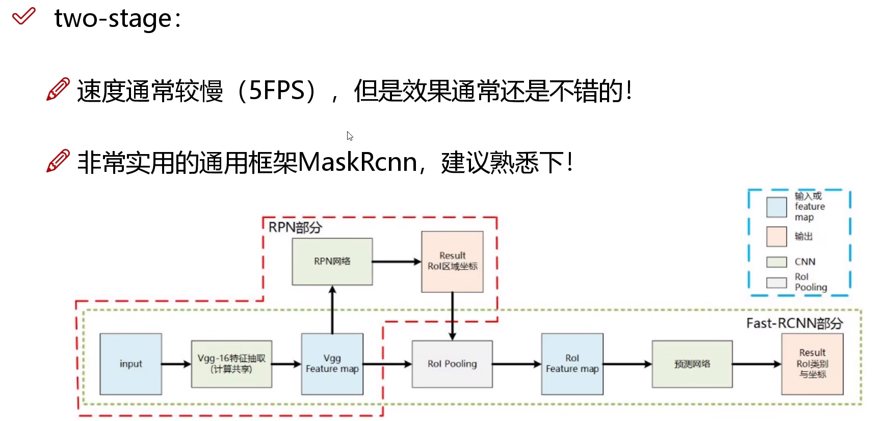
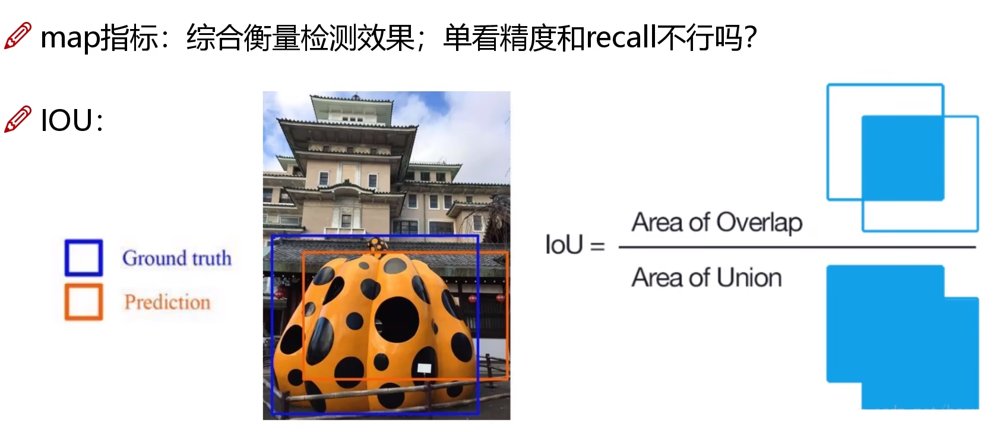
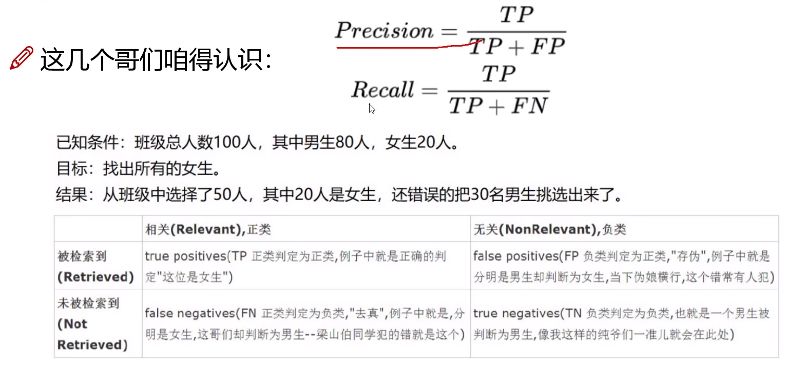

# 深度学习经典检测方法

- One-Stage（单阶段）：YOLO系列

一个CNN做回归任务，直接给出预测结果

- Two-Stage（两阶段）：Faster-RCNN、Mask-RCNN系列

加入一个RPN（区域建议网络），多了预选框（Proposal）

# 优缺点

单阶段：

速度快，适合做实时目标检测

但是效果不太好

两阶段：

速度慢，Mask-RCNN论文给出的速度是5FPS

指标分析：

