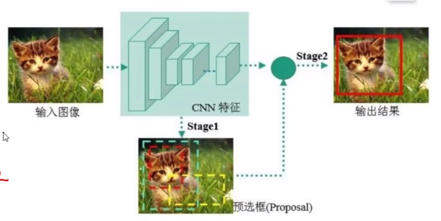
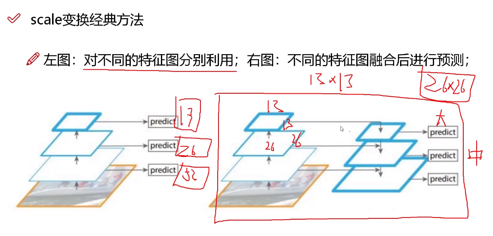

# 深度学习经典检测方法

- One-Stage（单阶段）：YOLO系列

一个CNN做回归任务，直接给出预测结果

- Two-Stage（两阶段）：Faster-RCNN、Mask-RCNN系列

加入一个RPN（区域建议网络），多了预选框（Proposal）

## 优缺点

### 单阶段

速度快，适合做实时目标检测

但是效果不太好

### 两阶段

速度慢，Mask-RCNN论文给出的速度是5FPS

指标分析：

- 理解成：(True/False)地把它判断成了(Positive/Negative)

# YOLOv1

- 经典的One-Stage方法
- 把检测问题转化为回归问题
- 可以对视频进行实时检测，应用领域广

  

## 核心思想

- 首先，对于 $$s \times s$$ 的输入，将其分成多个网格
- 每个网格预测它所代表的物体 
- 黄色框是预先得出的两种框，框的长款比列是由经验得出的
- 训练过程中对框的坐标等进行调整，此时该任务成为回归任务
- 计算每个候选框对真实值的 $$IoU$$
- 将得出的 $$x, y, w, h$$ 以及置信度映射到原始图像

## 网络架构

>  最后输出的大小是 $$7 \times 7 \times 30$$，其中的含义：
>
>  $$7*7$$ 代表最开始划分的每个网格的大小，每个网格还包含了30个值。
>
>  前5个值，代表第一个框$$B_{1}$$的 $$x, y, w, h$$ 以及置信度。
>
>  接下来5个值，代表第二个框$$B_{2}$$的 $$x, y, w, h$$ 以及置信度。
>
>  接下来20个值，代表每个类的概率，一共有20个类。
>
>  至于如何实现这样的输出，是由神经网络在学习过程中逐渐学会这样的规则  。

## 损失函数

## NMS

有重叠的检测框时使用最大值

## 存在的问题

1. 每个网格只能预测一个类别，导致难以检测重叠的物体
2. 难以检测到小物体
3. 长宽比的选择单一

# YOLOv2

YOLOv2所做的改进

YOLOv1有两种先验框，但是物体的形状远不止两种。

YOLOv2选取了三个scale，产生了更多先验框。

YOLOv2对COCO数据集中的检测框进行聚类，使用K-Means算法对相似形状的框进行聚类。找到更合适的比列。按照这种方法提取出的比例都是实际值，更具有可信度。

在YOLOv2中是使用的k=5进行聚类。

在聚类中使用的距离并不是欧式距离，而是根据IoU计算得出的距离。此时距离不会与物体的大小有关。

$\sigma$ 即Sigmoid函数

感受野

**多尺度**

但是其中的思想没有该比你，都是经过特种提取网络得出的节后

# YOLOv3

