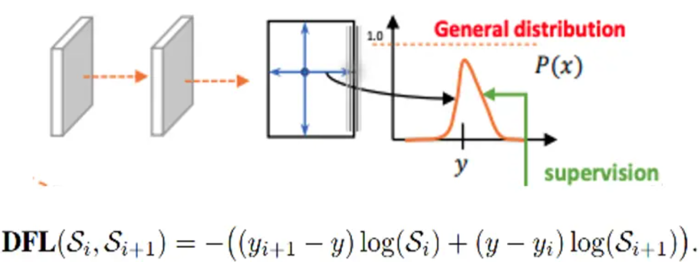
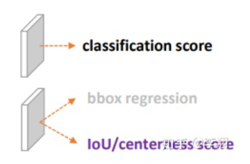
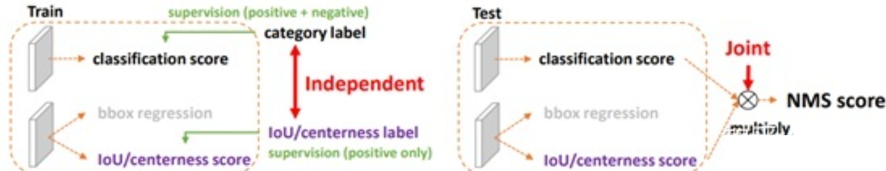

### 损失函数

对于YOLOv8，其分类损失为BCE Loss，其回归损失为CIOU Loss+DFL的形式，这里Reg_max默认为16。

VFL主要改进是提出了非对称的加权操作，FL和QFL都是对称的。而非对称加权的思想来源于论文PISA，该论文指出首先正负样本有不平衡问题，即使在正样本中也存在不等权问题，因为mAP的计算是主正样本。
$$
\text{VFL}(p, q) = 
\begin{cases}
-q(qlog(p) + (1 - q)log(1- p)) & q > 0 \\
-\alpha p^{\gamma} log(1 - p) & q = 0
\end{cases}
$$
q是label，正样本时候q为bbox和gt的IoU，负样本时候q=0，当为正样本时候其实没有采用FL，而是普通的BCE，只不过多了一个自适应IoU加权，用于突出主样本。而为负样本时候就是标准的FL了。可以明显发现VFL比QFL更加简单，主要特点是正负样本非对称加权、突出正样本为主样本。

针对这里的DFL（Distribution Focal Loss），其主要是将框的位置建模成一个 general distribution，让网络快速的聚焦于和目标位置距离近的位置的分布。

DFL 能够让网络更快地聚焦于目标 y 附近的值，增大它们的概率；

DFL的含义是以交叉熵的形式去优化与标签y最接近的一左一右2个位置的概率，从而让网络更快的聚焦到目标位置的邻近区域的分布；也就是说学出来的分布理论上是在真实浮点坐标的附近，并且以线性插值的模式得到距离左右整数坐标的权重。

这个工作核心是围绕“表示”的改进来的，也就是大家所熟知的“representation”这个词。这里的表示具体是指检测器最终的输出，也就是head末端的物理对象，目前比较强力的one-stage anchor-free的检测器（以FCOS，ATSS为代表）基本会包含3个表示：

\1. 分类表示

\2. 检测框表示

\3. 检测框的质量估计（在FCOS/ATSS中，目前采用centerness，当然也有一些其他类似的工作会采用IoU，这些score基本都在0~1之间）

三个表示一般情况下如图所示：

那么要改进表示一定意味着现有的表示或多或少有那么一些问题。事实上，我们具体观察到了下面两个主要的问题：

**问题一：classification score 和 IoU/centerness score 训练测试不一致。**

这种不一致主要体现在两个方面

1. 用法不一致。训练时，分类和质量没有直接关联，但是测试的时候确实乘在一起的。
2. 作为NMS Score排序的时候，这个操作显然没有端到端，必定存在一定的gap

2） 对象不一致。借助Focal Loss的力量，分类分支能够使得少量的正样本和大量的负样本一起成功训练，但是质量估计通常就只针对正样本训练。那么，对于one-stage的检测器而言，在做NMS score排序的时候，所有的样本都会将分类score和质量预测score相乘用于排序，那么必然会存在一部分分数较低的“负样本”的质量预测是没有在训练过程中有监督信号的，有就是说对于大量可能的负样本，他们的质量预测是一个未定义行为。这就很有可能引发这么一个情况：一个分类score相对低的真正的负样本，由于预测了一个不可信的极高的质量score，而导致它可能排到一个真正的正样本（分类score不够高且质量score相对低）的前面。问题一如图所示：

那么有了这些问题，我们自然可以提出一些方案来一定程度上解决他们：

1） 对于第一个问题，为了保证training和test一致，同时还能够兼顾分类score和质量预测score都能够训练到所有的正负样本，那么一个方案呼之欲出：就是将两者的表示进行联合。这个合并也非常有意思，从物理上来讲，我们依然还是保留分类的向量，但是对应类别位置的置信度的物理含义不再是分类的score，而是改为质量预测的score。这样就做到了两者的联合表示，同时，暂时不考虑优化的问题，我们就有可能完美地解决掉第一个问题。

2） 对于第二个问题，我们选择直接回归一个任意分布来建模框的表示。当然，在连续域上回归是不可能的，所以可以用离散化的方式，通过softmax来实现即可。这里面涉及到如何从狄拉克分布的积分形式推导到一般分布的积分形式来表示框，详情可以参考原论文。

Ok，方案都出来了还算比较靠谱，但是问题又来了：怎么优化他们呢？

这个时候就要派上Generalized Focal Loss出马了。我们知道之前Focal Loss是为one-stage的检测器的分类分支服务的，它支持0或者1这样的离散类别label。然而，对于我们的分类-质量联合表示，label却变成了0~1之间的连续值。我们既要保证Focal Loss此前的平衡正负、难易样本的特性，又需要让其支持连续数值的监督，自然而然就引出了我们对Focal Loss在连续label上的拓展形式之一，我们称为Quality Focal Loss (**QFL**)，具体地，它将原来的Focal Loss从：
$$
\mathbf{FL}(p) = -(1- P_t) ^ \gamma \log{p_t} \\

p_t = 
\begin{cases}
p, & y = 1 \\
1 - p, & y = 0
\end{cases}
$$
变为：
$$
\mathbf{QFL}({\sigma}) = - |y - \sigma| ^ {\beta} ((1 - y) \log{(1 - \sigma)} + y\log(\sigma)) 
$$
其中y为0~1的质量标签，$\sigma$ 为预测。注意QFL的全局最小解即是 $\sigma = y$。这样交叉熵部分变为完整的交叉熵，同时调节因子变为距离绝对值的幂次函数。和Focal Loss类似，我们实验中发现一般取 $\beta = 2$ 为最优。

对于任意分布来建模框的表示，它可以用积分形式嵌入到任意已有的和框回归相关的损失函数上，例如最近比较流行的GIoU Loss。这个实际上也就够了，不过涨点不是很明显，我们又仔细分析了一下，发现如果分布过于任意，网络学习的效率可能会不高，原因是一个积分目标可能对应了无穷多种分布模式。如下图所示：