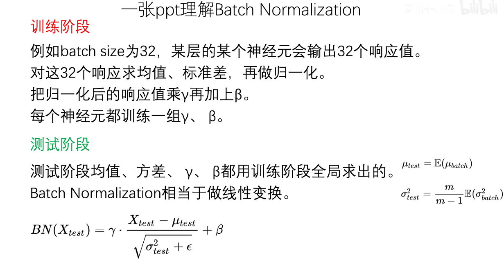
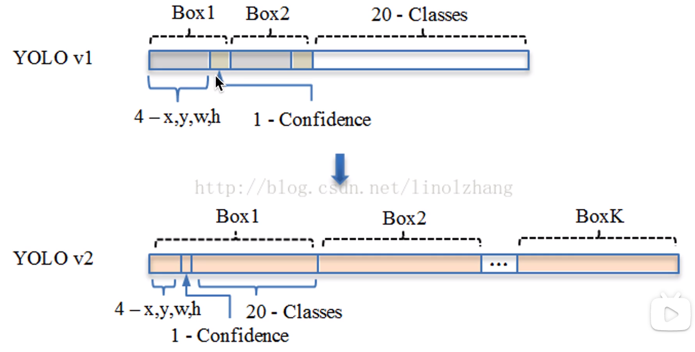
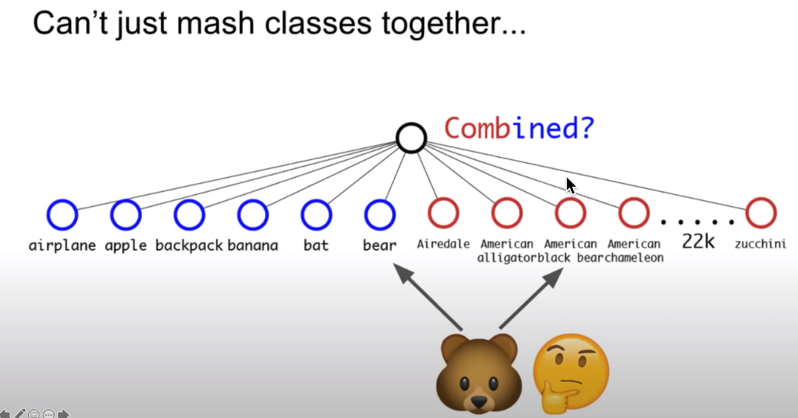
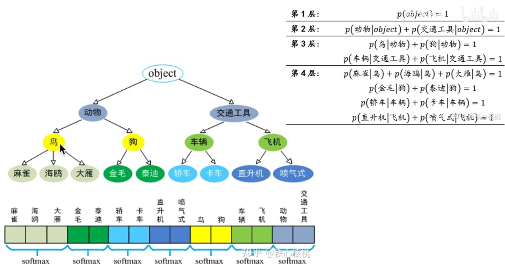
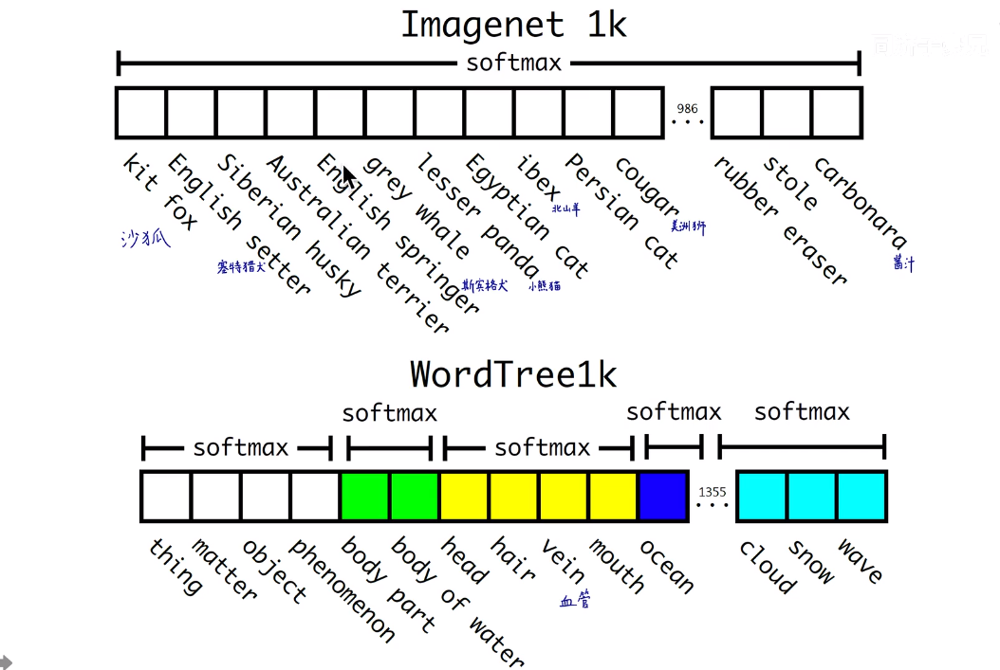

# YOLO学习笔记——YOLOv2详解


## 1. 前言

作者首先在YOLOv1的基础上提出了改进的YOLOv2，然后提出了一种**检测与分类联合训练**方法，使用这种联合训练方法在COCO检测数据集和ImageNet分类数据集上训练出了YOLO9000模型，其可以检测超过9000多类物体。所以，这篇文章其实包含两个模型：YOLOv2和YOLO9000，不过后者是在前者基础上提出的，两者模型主体结构是一致的。YOLOv2相比YOLOv1做了很多方面的改进，这也使得YOLOv2的mAP有显著的提升，并且YOLOv2的速度依然很快，保持着自己作为one-stage方法的优势。

**YOLOv1算法缺点：**

1. 在物体定位方面（localization）不够准确

2. 难以找到图片中的所有物体，召回率（recall）较低

3. 检测小目标和密集目标性能比较差

4. 虽然速度快，但是map准确度比较低

进行改进的策略如下:


**注：mAP定义**

- mAP：mean Average Precision, 即各类别AP的平均值
- AP：PR曲线下面积
- PR曲线：Precision-Recall曲线
- Precision：在所有生成的检测框之中，真正正确的检测框数量（TP）的比例
- Recall：在所有真正的检测框中（ground truths），被找到的比例


- 查准率 $Precision = \frac{TP}{TP+FP} = \frac{TP}{all detections}$

- 查全率 $Recall = \frac{TP}{TP + FN} = \frac{TP}{all ground truths}$
- TP: >0.5的检测框数量（同一Ground Truth只计算一次）
- FP: IoU<=0.5的检测框，或者是检测到同一个GT的多余检测框的数量
- FN: 没有检测到的GT（ground truths）的数量


## 2. Better

### 2.1 Batch Normalization

BN层就是对网络的每一层的输入进行归一化，使得网络不需要去学数据分布，加快了收敛速度，而且可以起到一定正则化效果，降低模型的过拟合。在YOLOv2中，**每个卷积层后面添加了Batch Normalization层**，不再使用dropout。

实验证明添加了BN层可以提高2%的mAP。



BN大体可以分为四步： 

​	**(1)计算出均值 **

​	**(2)计算出方差 **

​	**(3)归一化处理到均值为0，方差为1 **

​	**(4)变化重构，恢复出这一层网络所要学到的分布**


$$
\mu_{\beta} \gets \frac{1}{m} \sum_{i = 1}^{m} x_i\\

\sigma_{\beta}^{2} \gets \frac{1}{m} \sum_{i=1}^{m}(x_i - \mu_{\beta}) ^ 2 \\

\hat{x_i} \gets \frac{x_i - \mu_{\beta}}{\sqrt{\sigma_{\beta}^{2} + \epsilon}} \\

y_i \gets \gamma \hat{x_i} + \beta \equiv BN_{\gamma,\beta}(x_i)
$$
源码实现: 

```python
m = K.mean(X, axis=-1, keepdims=True)	#计算均值  
std = K.std(X, axis=-1, keepdims=True)	#计算标准差  
X_normed = (X - m) / (std + self.epsilon)	#归一化  
out = self.gamma * X_normed + self.beta	#重构变换
```

BN之后的效果


经过BN之后，原本很分散的数据都集中到了0附近，对于双曲正切函数Tanh来说在0附近有较大得梯度。 


### 2.2 High Resolution Classifier(高分辨图像分类器)

- 这里引入迁移学习(Transfer learning)的概念：把已训练好的模型（预训练模型）参数迁移到新的模型帮助新模型训练。

> 迁移学习有三种方式
> **Transfer Learning**：冻结预训练模型的全部卷积层，只训练自己定制的全连接层。
> **Extract Feature Vector**：先计算出预训练模型的卷积层对所有训练和测试数据的特征向量，然后抛开预训练模型，只训练自己定制的简配版全连接网络。
> **Fine-tuning**：冻结预训练模型的部分卷积层（通常是靠近输入的多数卷积层，因为这些层保留了大量底层信息）甚至不冻结任何网络层，训练剩下的卷积层（通常是靠近输出的部分卷积层）和全连接层。

- Fine-tuning原理：利用已知网络结构和已知网络的参数，修改output层为我们自己的层，微调最后一层前的若干层的训练参数，这样就有效利用了深度神经网络强大的泛化能力，又免去了设计复杂的模型以及耗时良久的训练。
- YOLOv1在采用 224×224 分类模型预训练后将分辨率增加到 448×448 ，并使用这个高分辨率在检测数据集上finetune。但是直接切换分辨率，检测模型可能难以快速适应高分辨率。所以YOLOv2增加了**在ImageNet数据集上使用**448×448**输入来finetune分类网络**这一中间过程（10 epochs）
- **YOLOv2将预训练分成两步：先用**224×224**的输入从头开始训练网络，大概160个epoch，然后再将输入调整到**448×448**，再训练10个epoch**，这可以使得模型在检测数据集上finetune之前已经适应高分辨率输入。使用高分辨率分类器后，YOLOv2的mAP提升了约4%。


### 2.3 Convolution with Anchor boxes(使用先验框)

在**YOLOv1**中，输入图片被划分为 $7×7$ 的网格grid cell，每个网格预测2个边界框(bounding box)，采用**全连接层直接对边界框进行预测** $$(x,y,w,ℎ)$$ ，其中边界框的宽与高是相对整张图片的大小的，而由于各个图片中存在不同尺度和长宽比的物体，YOLOv1在训练过程中学习适应不同物体的形状比较困难，精准定位较难。

YOLOv2借鉴了Faster R-CNN的思想，引入anchor，**在每个grid cell预先设定一组不同大小和宽高比的边框，来覆盖整个图像的不同位置和多种尺度**。首先将网络的全连接层和最后一个pooling层去掉，使用最后的卷积层可以有更高分辨率的特征，然后缩减网络，用 $416×416$ 的输入代替原来的 $448×448$ ，如此可以获得奇数大小的宽和高（特征图恰好有一个中心位置），最终输出 $13×13$ 的feature map。YOLOv2使用了anchor boxes之后，**每个位置的各个anchor box都单独预测一套（宽高分开）分类概率值**。

使用anchor boxes之后，YOLOv2的mAP有稍微下降（这里下降的原因，我猜想是YOLOv2虽然使用了anchor boxes，但是依然采用YOLOv1的训练方法）。YOLOv1只能预测98个边界框，而YOLOv2使用anchor boxes之后可以预测上千个边界框 $(13 \times 13 \times num_{anchors})$，召回率大大提升，由原来的81%升至88%。




### 2.4 Dimension Cluster(聚类提取先验框尺寸信息)

提出anchors后第一个问题是如何确定先验框的尺寸。YOLOv2的做法是**对训练集中标注的边框进行K-mean聚类分析**，以寻找尽可能匹配样本的边框尺寸。由于设置先验框的主要目的是为了使得预测框与ground truth的IOU更好，所以聚类分析时选用box与聚类中心box之间的IOU值作为距离指标。

$d(box, centroid) = 1 - IOU(box, centroid)$。centroid是聚类时被选作中心的边框，box就是其他边框，d是两者之间的“距离”，IOU越大，“距离”越近。

下图是在VOC和COCO数据集上的聚类分析结果，随着聚类中心数目的增加，平均IOU值（各个边界框与聚类中心的IOU的平均值）是增加的，但是综合考虑模型复杂度和召回率，作者最终选取5个聚类中心作为先验框，其相对于图片的大小如右边图所示。


对于两个数据集，5个先验框的width和height如下

> COCO: (0.57273, 0.677385), (1.87446, 2.06253), (3.33843, 5.47434), (7.88282, 3.52778), (9.77052, 9.16828) 
>
> VOC: (1.3221, 1.73145), (3.19275, 4.00944), (5.05587, 8.09892), (9.47112, 4.84053), (11.2364, 10.0071)

这里先验框的大小具体指什么作者并没有说明，但肯定不是像素点，从代码实现上看，应该是相对于预测的特征图大小 $13×13$ 。


### 2.5 Direct location prediction

引入anchor box的时候遇到的第二个问题：模型不稳定，尤其是在训练刚开始的时候。其位置预测公式为： 
$$
x = (t_x \times \omega_a) + x_a\\
y = (t_y \times h_a) + y_a
$$


其中 $(x, y)$ 为边界框的实际中心位置，需要预测的坐标偏移值为 $(t_x, t_y)$ ,先验框的尺寸为 $(\omega_a, h_a)$ 以及中心坐标 $(x_a, y_a)$ (特征图每个位置的中心点)。由于 $(t_x, t_y)$ 取值没有任何约束，因此预测边框的中心可能出现在任何位置，训练早期不容易稳定。

所以，YOLOv2弃用了这种预测方式，而是沿用YOLOv1的方法，就是**预测边界框中心点相对于对应cell左上角位置的相对偏移值**，为了将边界框中心点约束在当前cell中，使用sigmoid函数处理偏移值，这样预测的偏移值在(0,1)范围内（每个cell的尺度看做1）。总结来看，根据边界框预测的4个offsets $t_x, t_y, t_{\omega}, t_h$，可以按如下公式计算出边界框实际位置和大小：

$$
b_x = \sigma(t_x) + c_x\\
b_y = \sigma(t_y) + c_y\\
b_{\omega} = p_{\omega}e^{t_{\omega}}\\
b_h = p_he^{t_h}
$$
其中 $(c_x,c_y)$ 为cell的左上角坐标，在计算时每个cell的尺度为1，所以当前cell的左上角坐标为(1,1)，由于sigmoid（ $\sigma(x)=\frac{1}{1+e^{-x}} $）函数的处理，边界框的中心约束会在cell内部，防止偏移过多。 $(p_w,p_h)$ 是先验框的宽度和长度，其值是相对于特征图大小的。在特征图中每个cell的长和宽均为1。这里记特征图的大小为$ (W,H) $，（在文中是(13,13)），这样我们就可以将边界框相对于整张图片的位置和大小计算出来（4个值均在0和1之间）：

$$
b_x = \frac{\sigma(t_x)+c_x}{W} \\ 
b_y = \frac{\sigma(t_y)+c_y}{H} \\ 
b_w = \frac{p_we^{t_w}}{W} \\ 
b_ h= \frac{p_he^{t_h}}{H} \\
$$


如果再将上面的4个值分别乘以图片的宽度和长度（像素点值）就可以得到边界框的最终位置和大小了。


### 2.6 Fine-Grained Features

YOLOv2的输入图片大小是 $416 \times 416$，经过5次 $2 \times 2$ maxpooling之后得到 $13\times13$ 大小的特征图，并以此特征图采用卷积做预测。虽然 $13 \times 13$ 的feature map对于预测大的object以及足够了，但是对于预测小的object就不一定有效。这里主要是添加了一个层：**Passthrough Layer**。这个层的作用就是**将前面一层的 $26\times26$ 的feature map和本层的 $13 \times 13$ 的feature map进行连接**，有点像ResNet。


将高层的特征呢给到底层，这样的话高层也会获得底层的特征


一拆四的方法如下：


### 2.7 Multi-Scale Training(多尺度的图像训练)

为了让YOLOv2模型更加robust，作者引入了Muinti-Scale Training，简单讲就是在训练时输入图像的size是动态变化的，注意这一步是**在检测数据集上fine tune时候**采用的，不要跟前面在Imagenet数据集上的两步预训练分类模型混淆。

由于YOLOv2模型中**只有卷积层和池化层**，所以YOLOv2的输入可以不限于 $416 \times 416$ 大小的图片。

具体来讲，在训练网络时，每训练10个batch(在一个epoch 中，batch数和迭代数是相等的，例如500个样本为1batch，总样本2000，则一个epoch包含4个batch或者说4个iteration),**网络就会随机选择另一种size的输入**,然后只需要修改对最后检测层的处理就可以重新训练。也就是说downsample的factor是32，因此采用32的倍数作为输入的size:{320,352,…,608}。


**总结来看，虽然YOLOv2做了很多改进，但是大部分都是借鉴其它论文的一些技巧，如Faster R-CNN的anchor boxes，YOLOv2采用anchor boxes和卷积做预测，这基本上与SSD模型（单尺度特征图的SSD）非常类似了，而且SSD也是借鉴了Faster R-CNN的RPN网络。从某种意义上来说，YOLOv2和SSD这两个one-stage模型与RPN网络本质上无异，只不过RPN不做类别的预测，只是简单地区分物体与背景。在two-stage方法中，RPN起到的作用是给出region proposals，其实就是作出粗糙的检测，所以另外增加了一个stage，即采用R-CNN网络来进一步提升检测的准确度（包括给出类别预测）。而对于one-stage方法，它们想要一步到位，直接采用“RPN”网络作出精确的预测，要因此要在网络设计上做很多的tricks。YOLOv2的一大创新是采用Multi-Scale Training策略，这样同一个模型其实就可以适应多种大小的图片了。**


## 3.Faster

### 3.1 New Network:Darknet-19

在YOLO v1中，作者采用的训练网络是基于GooleNet,YOLOv2采用了一个新的基础模型（特征提取器），称为Darknet-19，包括19个卷积层和5个maxpooling层.


Darknet-19与VGG16模型设计原则是一致的，**主要采用 $ 3\times3 $ 卷积，采用  $ 2\times2 $ 的maxpooling层，特征图维度降低2倍，同时特征图的channles增加两倍**。与NIN类似，Darknet-19最终**采用global avgpooling做预测**，并且在 $  3\times3  $ 卷积之间使用  $ 1\times1  $ 卷积来压缩特征图channles以降低模型计算量和参数。Darknet-19**每个卷积层后面使用了batch norm层**以加快收敛速度，降低模型过拟合。


### 3.2 Training for Classification

这里的training for classification都是在ImageNet上进行预训练，主要分两步：

**1、从头开始训练Darknet-19，数据集是ImageNet，训练160个epoch，输入图像的大小是224\*224，初始学习率为0.1**。另外在训练的时候采用了标准的数据增加方式比如随机裁剪，旋转以及色度，亮度的调整等。

**2、再fine-tuning 网络，这时候采用448\*448的输入，参数的除了epoch和learning rate改变外，其他都没变，这里learning rate改为0.001，并训练10个epoch**。结果表明fine-tuning后的top-1准确率为76.5%，top-5准确率为93.3%，而如果按照原来的训练方式，Darknet-19的top-1准确率是72.9%，top-5准确率为91.2%。因此可以看出第1,2两步分别从网络结构和训练方式两方面入手提高了主网络的分类准确率。


## 


### 3.3 Training for Detection

在前面第2步之后，就开始把网络移植到detection，并开始基于检测的数据再进行fine-tuning。

首先把最后一个卷积层、global avgpooling层以及softmax层去掉，然后添加**3个3\*3\*1024的卷积层，同时增加了一个passthrough层, 最后每个后面都连接一个1\*1的卷积层输出预测结果，输出的channels数为：num_anchors\(5+num_classes)**。

比如对于VOC数据，由于每个grid cell我们需要预测5个box，每个box有5个坐标值和20个类别值，所以每个grid cell有125个channels（与YOLOv1不同，在YOLOv1中每个grid cell有30个channels，因为在YOLOv1中，类别概率是由grid cell来预测的，也就是说一个grid cell对应的两个box的类别概率是一样的，但是在YOLOv2中，类别概率是属于box的，**每个box对应一个类别概率**，而不是由grid cell决定，因此这边每个box对应25个预测值（5个坐标加20个类别值），而在YOLOv1中一个grid cell的两个box的20个类别值是一样的）。而对于COCO数据集则为425。最后作者在检测数据集上fine tune这个预训练模型160个epoch，学习率采用0.001，并且在第60和90epoch的时候将学习率除以10，weight decay采用0.0005。 在这一步中会使用技巧


### 3.4 损失函数

每个grid cell预先生成五个先验框anchor，和YOLOv1一样，**对于训练图片中的ground truth，若其中心点落在某个cell内，那么该cell内的5个先验框所对应的边界框负责预测它**，具体是个边界框预测它，需要在训练中确定，即由那个**与ground truth的IOU最大的边界框预测它**(每个先验框尺寸不同，负责不同类型的预测)，而剩余的4个边界框不与该ground truth匹配。YOLOv2同样需要假定每个cell至多含有一个grounth truth，而在实际上基本不会出现多于1个的情况。与ground truth匹配的先验框计算坐标误差、置信度误差（此时target为1）以及分类误差，而其它的边界框只计算置信度误差（此时target为0）。**YOLOv2和YOLOv1的损失函数一样，为均方差函数**。

$$
{loss}_{t}= \sum_{i=0}^{W} \sum_{j=0}^{H} \sum_{k=0}^{A} \\ 

1_{\text {Max IoU }<\text { Thresh }} \lambda_{\text {noobj }} *\left(-b_{i j k}^{o}\right)^{2} \\ 

+1_{t<12800} \lambda_{\text {prior }} * \sum_{r \epsilon(x, y, w, h)}\left(\text { prior }_{k}^{r}-b_{i j k}^{r}\right)^{2} \\ 

+1_{k}^{\text {truth }}( \lambda_{\text {coord }} * \sum_{r \epsilon(x, y, w, h)}\left(\text { truth }^{r}-b_{i j k}^{r}\right)^{2} \\ 

+\lambda_{\text {obj }} *\left(I O U_{\text {truth }}^{k}-b_{i j k}^{o}\right)^{2} \\

\left.+\lambda_{\text {class }} *\left(\sum_{c=1}^{c}\left(\text { truth }^{c}-b_{i j k}^{c}\right)^{2}\right)\right) 
$$


### 3.5 YOLOv2训练过程

此处再补充一下YOLOv2的训练过程（主要分为三个阶段）：

- 第一阶段：在ImageNet分类数据集上预训练Darknet-19，此时模型输入为224*224，共训练160个epochs
- 第二阶段：将模型的输入调整为448*448，继续在ImageNet数据集上finetune分类模型，训练10个epochs
- 第三阶段：修改Darknet-19分类模型为检测模型，并且在检测数据集上继续finetune网络


## 4.Stronger

### 4.1 Hierarchical classification（分层分类）

作者提出了一种在分类数据集和检测数据集上**联合训练**的机制。使用检测数据集的图片去学习检测相关的信息，例如bounding box 坐标预测，是否包含物体以及属于各个物体的概率。使用仅有类别标签的分类数据集图片去扩展可以检测的种类。

作者通过ImageNet训练分类、COCO和VOC数据集来训练检测，这是一个很有价值的思路，可以让我们达到比较优的效果。 通过将两个数据集混合训练，**如果遇到来自分类集的图片则只计算分类的Loss，遇到来自检测集的图片则计算完整的Loss。**

但是ImageNet对应分类有9000种，而COCO则只提供80种目标检测，不能简单的合并检测数据集和分类数据集，因为Softmax对于所有的分类类别是互斥的，如果合并后数据集中有相似的类别，比如熊和美洲黑熊，就无法很好的完成任务。




可以利用WordTree，结构如下





