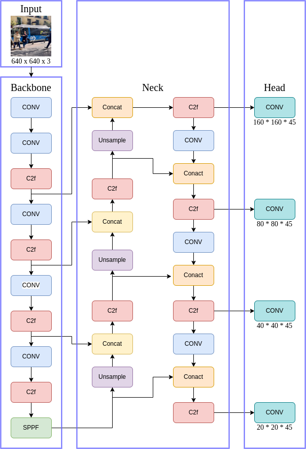

# GAM注意力

引言： 在深度学习的世界中，目标检测是一个绕不开的话题。近年来，由于其高效的性能和卓越的实时性，YOLO系列算法已经得到了广泛的应用。最新的YOLOv8是该系列中的一个重要里程碑，但这并不意味着我们无法再对其进行改进。最近，我尝试在YOLOv8中引入了Gated Attention Mechanism (GAM)注意力机制，希望通过它提高模型的性能。然而，这个改变并未带来预期的结果，mAP反而有所下降。下面，我将详细阐述我为什么要进行这样的尝试，以及可能的原因导致了mAP的降低。

## 为什么选择GAM注意力机制？

注意力机制近年来在深度学习领域大放异彩，它能让模型更好地集中于输入的关键部分。Gated Attention Mechanism (GAM)是一个有效的注意力机制，其通过门控机制筛选重要的信息，以提升模型性能。我认为，这种机制有可能进一步提高YOLOv8在目标检测任务上的精度，特别是在存在大量干扰背景和复杂情况的场景中。

## 添加GAM后mAP为何下降？

尽管GAM在许多任务中已经展现出了强大的性能，但在我尝试将其添加到YOLOv8后，mAP却出现了下降。我认为可能有以下几个原因：

首先，GAM可能增加了模型的复杂性，导致过拟合。虽然我们期望注意力机制能够帮助模型更好地处理复杂的场景，但是它也可能使模型变得过于复杂，对训练数据过度拟合，从而导致在测试集上的性能下降。

其次，GAM可能与YOLOv8的其他部分存在兼容性问题。YOLO系列的算法设计得非常精巧，每个部分都经过了精心设计和优化。尝试添加新的机制时，可能会破坏这种精细的平衡，导致性能下降。

最后，可能是实现的问题。在实现GAM时，可能存在一些错误或者不足，导致其无法在YOLOv8中发挥预期的作用。

## 结论

虽然此次尝试并未达到预期的结果，但这并不意味着将注意力机制添加到YOLO系列算法中是一个错误的尝试。我相信，只要我们继续探索和实验，总会找到一种方式，让注意力机制能够在YOLO中发挥出它的优势。接下来，我将继续调整GAM的实现方式，以及研究如何更好地将其与YOLOv8的其他部分结合起来。深度学习是一个不断探索和实验的过程，我们需要勇于尝试新的方法，才能不断推动这个领域的发展。我期待在不久的将来，能够带来更好的结果。


实现代码：

```
class GAM_Attention(nn.Module):
    def __init__(self, in_channels,c2, rate=4):
        super(GAM_Attention, self).__init__()

        self.channel_attention = nn.Sequential(
            nn.Linear(in_channels, int(in_channels / rate)),
            nn.ReLU(inplace=True),
            nn.Linear(int(in_channels / rate), in_channels)
        )

        self.spatial_attention = nn.Sequential(
            nn.Conv2d(in_channels, int(in_channels / rate), kernel_size=7, padding=3),
            nn.BatchNorm2d(int(in_channels / rate)),
            nn.ReLU(inplace=True),
            nn.Conv2d(int(in_channels / rate), in_channels, kernel_size=7, padding=3),
            nn.BatchNorm2d(in_channels)
        )

    def forward(self, x):
        b, c, h, w = x.shape
        x_permute = x.permute(0, 2, 3, 1).view(b, -1, c)
        x_att_permute = self.channel_attention(x_permute).view(b, h, w, c)
        x_channel_att = x_att_permute.permute(0, 3, 1, 2).sigmoid()
        x = x * x_channel_att
        x_spatial_att = self.spatial_attention(x).sigmoid()
        out = x * x_spatial_att

        return out
```


改进网络结构


